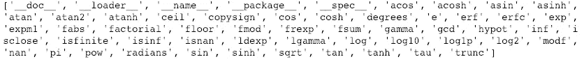
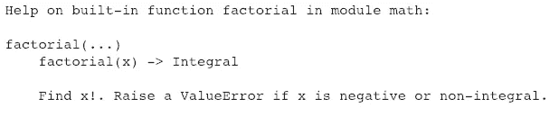
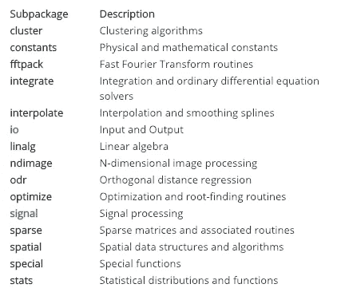
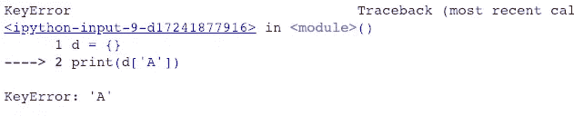

# Python 的集合模块——高性能容器数据类型。

> 原文：<https://towardsdatascience.com/pythons-collections-module-high-performance-container-data-types-cb4187afb5fc?source=collection_archive---------7----------------------->

## Python 超级有用的集合模块的快速概述。


Photo by [rawpixel](https://unsplash.com/@rawpixel?utm_source=medium&utm_medium=referral) on [Unsplash](https://unsplash.com?utm_source=medium&utm_medium=referral)

> 如果实现很难解释，这是个坏主意:[Python 的禅](https://www.python.org/dev/peps/pep-0020/#id3)

Python 是一种非常强大的语言，这种强大的力量很大一部分来自于它支持 [**模块化编程**](https://realpython.com/python-modules-packages/) 。模块化编程本质上是将一个大而复杂的编程任务分解成更小且更易管理的子任务/ **模块**的过程。模块就像**乐高积木**可以捆绑在一起创建一个更大的任务。

模块化在编写代码时有很多优势，比如:

*   **可重用性**
*   **可维护性**
*   **简单性**

**函数**、**模块**和**包**都是 Python 中促进代码模块化的构造。

# 目标

通过这篇文章，我们将探索 Python 的**集合**模块。该模块旨在改进功能，并为 Python 的通用内置容器(如 dict、list、set 和 tuple)提供替代方案。

# 介绍

让我们从快速浏览模块和包的概念开始这篇文章。

## 组件

模块只不过是一个可以在另一个模块中调用的. py 脚本。py 脚本。模块是包含 Python 定义和语句的文件，有助于实现一组函数。文件名是模块名加上后缀`.py`。使用`import`命令从其他模块导入模块。让我们导入数学模块。

```
*# import the library*
import math#Using it for taking the log
math.log(10)
2.302585092994046
```

## Python 的内置模块

Python 有无数的内置模块，并且已经为你能想到的几乎所有用例创建了包。点击查看完整列表[。](https://docs.python.org/3/py-modindex.html)

在探索 Python 中的模块时，两个非常重要的函数派上了用场——`dir`和`help`函数。

*   内置函数`[dir()](https://docs.python.org/3/library/functions.html#dir)`用于找出每个模块中实现了哪些功能。它返回字符串的排序列表:

```
print(dir(math))
```



*   在模块中找到我们想要的函数后，我们可以在 Python 解释器中使用`help`函数来了解更多信息:

```
help(math.factorial)
```



## 包装

包是堆叠在一起的相关模块的集合。核心机器学习包 Numpy 和 Scipy 由数百个模块组成。这里是在 [SciPy](http://scipy.org/) 中可用的部分子包列表。



[source](https://docs.scipy.org/doc/scipy/reference/tutorial/general.html)

现在让我们跳到本文的实际目标，了解 Python 的集合模块。这只是一个概述，详细的解释和例子请参考官方 Python 文档。

# 集合模块

[集合](http://Container datatypes)是一个内置的 Python 模块，它实现了专门的容器数据类型，为 Python 的通用内置容器(如`[dict](https://docs.python.org/3.6/library/stdtypes.html#dict)`、`[list](https://docs.python.org/3.6/library/stdtypes.html#list)`、`[set](https://docs.python.org/3.6/library/stdtypes.html#set)`和`[tuple](https://docs.python.org/3.6/library/stdtypes.html#tuple)`)提供了替代方案。

本模块中一些有用的数据结构包括:

## `1\. [namedtuple()](https://docs.python.org/3.6/library/collections.html#collections.namedtuple)`

存储在普通元组中的数据只能通过索引来访问，如下例所示:

```
plain_tuple = (10,11,12,13)plain_tuple[0]
10plain_tuple[3]
13
```

我们不能给存储在元组中的单个元素命名。现在，在简单的情况下可能不需要这个。然而，如果一个元组有许多字段，这可能是必要的，也会影响代码的可读性。

在这里， **namedtuple 的**功能开始发挥作用。它是一个用于具有名为字段的**的元组的函数，可以看作是内置元组数据类型的扩展。命名元组为元组中的每个位置赋予意义，并允许更具可读性、自文档化的代码。存储在其中的每个对象都可以通过一个唯一的(人类可读的)标识符来访问，这使我们不必记住整数索引。我们来看看它的实现。**

```
from collections import namedtuple
fruit = namedtuple('fruit','number variety color')guava = fruit(number=2,variety='HoneyCrisp',color='green')apple = fruit(number=5,variety='Granny Smith',color='red')
```

我们构造 namedtuple 的方法是，首先传递对象类型名称(fruit ),然后传递一个包含各种字段的字符串，作为字段名之间有空格的字符串。然后，我们可以调用各种属性:

```
guava.color
'green'apple.variety
'Granny Smith'
```

***在 Python 中定义不可变类时，命名元组也是一个节省内存的选项。***

## 2.计数器

*Counter* 是一个 *dict* 子类，帮助计算可散列对象。元素存储为字典键，而对象计数存储为值。让我们看几个关于计数器的例子。

```
#Importing Counter from collections
**from** **collections** **import** Counter
```

*   用绳子

```
c = Counter('abcacdabcacd')
print(c)Counter({'a': 4, 'c': 4, 'b': 2, 'd': 2})
```

*   使用列表

```
lst = [5,6,7,1,3,9,9,1,2,5,5,7,7]
c = Counter(lst)
print(c)Counter({'a': 4, 'c': 4, 'b': 2, 'd': 2})
```

*   带句子

```
s = 'the lazy dog jumped over another lazy dog'
words = s.split()
Counter(words)Counter({'another': 1, 'dog': 2, 'jumped': 1, 'lazy': 2, 'over': 1, 'the': 1})
```

**计数器对象除了支持所有字典可用的方法之外，还支持三种方法:**

*   **元素()**

返回每个元素的计数，如果元素的计数小于 1，则忽略它。

```
c = Counter(a=3, b=2, c=1, d=-2)
sorted(c.elements())['a', 'a', 'a', 'b', 'b', 'c']
```

*   **最常见([*n*)**

返回最常见元素及其计数的列表。元素的数量必须指定为 n。如果没有指定，它将返回所有元素的计数。

```
s = 'the lazy dog jumped over another lazy dog'
words = s.split()
Counter(words).most_common(3)[('lazy', 2), ('dog', 2), ('the', 1)]
```

## 使用 Counter()对象时的常见模式

```
sum(c.values())                 # total of all counts 
c.clear()                       # reset all counts 
list(c)                         # list unique elements 
set(c)                          # convert to a set 
dict(c)                         # convert to a regular dictionary c.items()                       # convert to a list like (elem, cnt) 
Counter(dict(list_of_pairs))    # convert from a list of(elem, cnt) 
c.most_common()[:-n-1:-1]       # n least common elements 
c += Counter()                  # remove zero and negative counts
```

## 3.默认字典

字典是一种有效的方式来存储数据，以便以后检索，它有一组无序的*键:值*对。键必须是唯一且不可变的对象。

```
fruits = {'apple':300, 'guava': 200}
fruits['guava']200
```

如果值是整数或字符串，事情就简单了。[然而](https://stackoverflow.com/questions/5900578/how-does-collections-defaultdict-work)，如果值是列表或字典等集合的形式，则值(空列表或字典)必须在第一次使用给定键时初始化。defaultdict 自动化并简化了这些东西。下面的例子将使它更加明显:

```
d = {}
print(d['A'])
```



这里，Python 字典抛出一个错误，因为‘A’当前不在字典中。现在让我们用 defaultdict 运行相同的示例。

```
from collections import defaultdict
d = defaultdict(object)
print(d['A'])<object object at 0x7fc9bed4cb00>
```

相反，`defaultdict`将简单地创建您试图访问的任何项目(当然前提是它们还不存在)。defaultdict 也是一个类似字典的对象，它提供了字典提供的所有方法。然而，不同之处在于它将第一个参数(default_factory)作为字典的默认数据类型。

## 4.有序直接

一个 *OrderedDict* 是一个字典子类，它记住键第一次被插入的顺序。当遍历一个有序字典时，条目按照它们的键第一次被添加的顺序返回。因为有序字典会记住它的插入顺序，所以它可以与排序结合使用来创建一个有序字典:

*   **正规字典**

```
d = {'banana': 3, 'apple': 4, 'pear': 1, 'orange': 2}
```

*   **按关键字排序的字典**

```
OrderedDict(sorted(d.items(), key=**lambda** t: t[0]))OrderedDict([('apple', 4), ('banana', 3), ('orange', 2), ('pear', 1)])
```

*   **按值排序的字典**

```
OrderedDict(sorted(d.items(), key=lambda t: t[1]))OrderedDict([('pear', 1), ('orange', 2), ('banana', 3), ('apple', 4)])
```

*   **字典按关键字串的长度排序**

```
OrderedDict(sorted(d.items(), key=lambda t: len(t[0])))OrderedDict([('pear', 1), ('apple', 4), ('banana', 3), ('orange', 2)])
```

*这里需要注意的一点是，在 Python 3.6 中，常规的字典都是* ***插入有序即*** *字典记住插入条目的顺序。在这里阅读讨论*[](https://stackoverflow.com/questions/39980323/are-dictionaries-ordered-in-python-3-6)**。**

# *结论*

*集合模块还包含一些其他有用的数据类型，如 **deque、Chainmap、UserString** 等等。然而，我已经分享了我在日常编程中使用的一些方法来使事情变得简单。关于详细的解释和用法，请访问官方 Python [文档页面](https://docs.python.org/3.7/library/collections.html#collections.UserString)。*