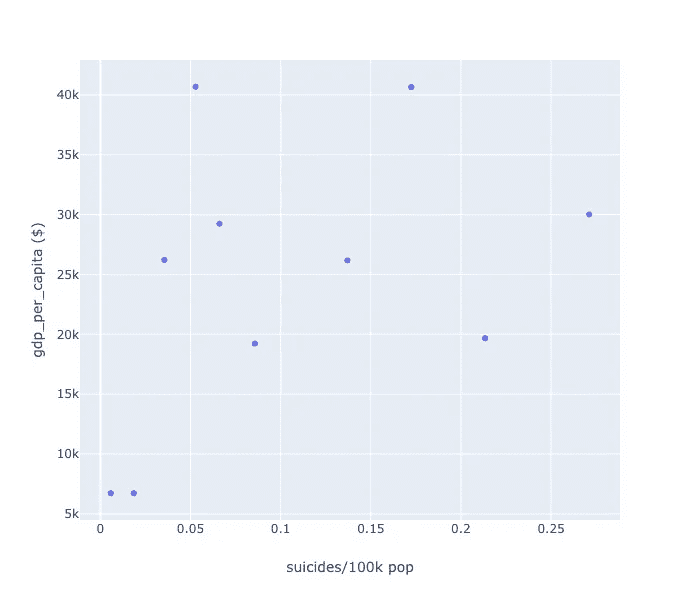

# Python 的一个线性图形创建库，带有汉斯·罗斯林风格的动画

> 原文：<https://towardsdatascience.com/pythons-one-liner-graph-creation-library-with-animations-hans-rosling-style-f2cb50490396?source=collection_archive---------8----------------------->

## 形象化

## 动画，单线图。它拥有一切


我清楚的记得[海风](/3-awesome-visualization-techniques-for-every-dataset-9737eecacbe8)来的时候。我真的受够了 Matplotlib。为了创建甚至简单的图形，我不得不运行这么多的 StackOverflow 线程。

我本可以花在思考如何呈现数据的好主意上的时间却被用来处理 Matplotlib。这很令人沮丧。

Seaborn 比 Matplotlib 好得多，但它也需要大量代码才能得到一个简单的“好看”的图形。

当 Plotly 出现时，它试图解决这个问题。当加上熊猫时，plotly 是一个很好的工具。

仅仅使用`iplot`函数，你就可以用 Plotly 做这么多事情。

***但还是，不是很直观。至少对我来说不是。***

我仍然没有切换到 Plotly，只是因为我已经花了足够多的时间与 Seaborn 一起“快速”地做事情，我不想再花更多的时间去学习一个新的可视化库。我在 Seaborn 中创建了自己的函数来创建我最需要的可视化效果。然而这仍然是一种变通办法。我已经放弃了拥有更好的东西的希望。

***绘声绘色地表达*图中的**。是不是很棒？

根据 Plotly Express 的创作者(显然也创作了 Plotly)， ***Plotly Express 之于 Plotly，犹如 Seaborn 之于 Matplotlib。***

> 围绕 Plotly.py 的简洁、一致的高级包装器，用于快速数据浏览和图形生成。

我只是想尝试一下。

创造者们让人们开始尝试它变得容易了吗？

***为所欲为的俏皮话？*** ✅

***标准化功能？学会创建散点图，你就差不多学会了这个工具——✅***

**互动图表？✅**

**动画？**赛车条形图、时间散点图、—✅地图

**免费开源？** ✅

只是先睹为快，看看在这篇文章结束时我们将能够创造什么(以及更多)。 ***使用单行代码。***


好了，谈够了，让我们开始吧。

# 首先是数据集——有趣、令人沮丧又令人振奋


我们将使用我从 Kaggle 获得的[自杀数据集](https://www.kaggle.com/russellyates88/suicide-rates-overview-1985-to-2016)。这个数据集是根据来自联合国、世界银行和世界卫生组织的数据汇编而成的。 ***数据集积累了预防自杀的灵感。我总是支持对数据的这种良好利用。***

你可以找到这篇文章的所有代码，并在这个 [Kaggle 内核](https://www.kaggle.com/mlwhiz/plotly-express/)中运行它

首先，我将进行一些数据清理，以添加大陆信息和国家 ISO 代码，因为它们在以后会有所帮助:

```
import pandas as pd
import numpy as np
import plotly_express as px# Suicide Data
suicides = pd.read_csv("../input/suicide-rates-overview-1985-to-2016/master.csv")
del suicides['HDI for year']
del suicides['country-year']# Country ISO Codes
iso_country_map = pd.read_csv("../input/countries-iso-codes/wikipedia-iso-country-codes.csv")
iso_country_map = iso_country_map.rename(columns = {'English short name lower case':"country"})# Load Country Continents file
concap =pd.read_csv("../input/country-to-continent/countryContinent.csv", encoding='iso-8859-1')[['code_3', 'continent', 'sub_region']]
concap = concap.rename(columns = {'code_3':"Alpha-3 code"})correct_names = {'Cabo Verde': 'Cape Verde', 'Macau': 'Macao', 'Republic of Korea': "Korea, Democratic People's Republic of" , 
 'Russian Federation': 'Russia',
 'Saint Vincent and Grenadines':'Saint Vincent and the Grenadines' 
 , 'United States': 'United States Of America'}def correct_country(x):
    if x in correct_names:
        return correct_names[x]
    else:
        return xsuicides['country'] = suicides['country'].apply(lambda x : correct_country(x))suicides = pd.merge(suicides,iso_country_map,on='country',how='left')
suicides = pd.merge(suicides,concap,on='Alpha-3 code',how='left')suicides['gdp'] = suicides['gdp_per_capita ($)']*suicides['population']
```

让我们看看自杀数据:


我还会按大洲对数据进行分组。老实说，我这样做只是为了展示这个库的威力，因为这篇文章的主要目标仍然是创建令人敬畏的可视化效果。

```
suicides_gby_Continent = suicides.groupby(['continent','sex','year']).aggregate(np.sum).reset_index()suicides_gby_Continent['gdp_per_capita ($)'] = suicides_gby_Continent['gdp']/suicides_gby_Continent['population']suicides_gby_Continent['suicides/100k pop'] = suicides_gby_Continent['suicides_no']*1000/suicides_gby_Continent['population']# 2016 data is not full
suicides_gby_Continent=suicides_gby_Continent[suicides_gby_Continent['year']!=2016]

suicides_gby_Continent.head()
```

我们创建的最终数据:


# 简单易用

我们准备好可视化我们的数据。**来时*隐晦地表达*到**的时间。我可以通过一个简单的:

```
pip install **plotly_express**
```

并将其导入为:

```
import plotly_express as px
```

现在让我们用它创建一个简单的散点图。

```
suicides_gby_Continent_2007 = suicides_gby_Continent[suicides_gby_Continent['year']==2007]px.scatter(suicides_gby_Continent_2007,x = 'suicides/100k pop', y = 'gdp_per_capita ($)')
```



不太鼓舞人心。没错。让我们一步一步地做得更好。让我们按洲给点上色。

```
px.scatter(suicides_gby_Continent_2007,x = 'suicides/100k pop', y = 'gdp_per_capita ($)',color='continent')
```


**好但不励志。还没有。**

**点看起来好小**。没错。让我们增加点的大小。怎么会？参数可能是什么…

```
px.scatter(suicides_gby_Continent_2007,x = 'suicides/100k pop', y = 'gdp_per_capita ($)',color='ContinentName',size ='suicides/100k pop')
```


你能看出每个洲都有两个点吗？它们代表男性和女性。让我在图表中展示一下。我们可以用几种方法来说明这种区别。 ***我们可以用不同的*** `***symbol***` ***或者用不同的*** `***facets***` ***来表示男女***

让我给他们两个看看。

```
px.scatter(suicides_gby_Continent_2007,x = 'suicides/100k pop', y = 'gdp_per_capita ($)', size = 'suicides/100k pop', color='ContinentName',symbol='sex')Orpx.scatter(suicides_gby_Continent_2007,x = 'suicides/100k pop', y = 'gdp_per_capita ($)', size = 'suicides/100k pop', color='continent',facet_col='sex')
```


Fig1: Symbol, Fig2: Facets

在符号图中，三角形代表男性，圆形代表女性。我们已经开始从图表中看到一些好的信息。以为例:

*   至少在 2007 年的数据中，男性和女性的自杀率存在显著差异。
*   ***2007 年欧洲男性极易自杀？***
*   收入差距似乎对自杀率没有太大影响。亚洲的人均 GDP 比欧洲低，自杀率也比欧洲低。
*   男性和女性之间似乎没有收入差距。

还不励志？嗯。 ***让我们添加一些动画*** 。这应该不难。我会添加更多的参数，

*   它指定了我们的动画维度。
*   使用`range_y`和`range_x`的 x 和 y 值范围
*   `text`用大洲标注所有点。有助于更好地可视化数据

```
px.scatter(suicides_gby_Continent,x = 'suicides/100k pop', y = 'gdp_per_capita ($)',color='continent',
           size='suicides/100k pop',symbol='sex',animation_frame='year', animation_group='continent',range_x = [0,0.6],
          range_y = [0,70000],text='continent')
```


**等待 gif 图显示。**

在 Jupyter 笔记本中，你将能够停止可视化，悬停在点上，只需查看特定的大陆，并通过交互做更多的事情。

一个命令就能提供如此多的信息。我们可以看到:

*   从 1991 年到 2001 年，欧洲男性的自杀率非常低。
*   大洋洲即使有相当高的人均国内生产总值，它仍然容易发生自杀事件。
*   与其他国家相比，非洲的自杀率较低。
*   就美洲而言，自杀率一直在逐渐上升。

我以上所有的观察都需要更多的分析。但这就是在一张图上有这么多信息的意义所在。它会帮助你提出很多假设。

以上剧情风格被称为**汉斯·罗斯林剧情**以其创始人命名。

在这里，我想让你们看看这个来自汉斯·罗斯林的演示，他使用 Gapminder 数据来解释收入和寿命是如何随着时间的推移而出现的。看到了。太棒了。

Hans Rosling Gapminder Visualization….

# 功能标准化

到目前为止，我们已经了解了散点图。花了这么多时间去学一门图表课。在我的帖子的开始，我告诉你这个库有一种标准化的功能。

让我们具体看看欧洲的数据，因为我们看到欧洲男性的自杀率很高。

```
european_suicide_data = suicides[suicides['continent'] =='Europe']
european_suicide_data_gby = european_suicide_data.groupby(['age','sex','year']).aggregate(np.sum).reset_index()
european_suicide_data_gby['suicides/100k pop'] = european_suicide_data_gby['suicides_no']*1000/european_suicide_data_gby['population'] # A single line to create an animated Bar chart too.
px.bar(european_suicide_data_gby,x='age',y='suicides/100k pop',facet_col='sex',animation_frame='year', 
       animation_group='age', 
       category_orders={'age':['5-14 years', '15-24 years', '25-34 years', '35-54 years', 
       '55-74 years', '75+ years']},range_y=[0,1])
```


就这样，我们也学会了如何制作条形图的动画。在上面的函数中，我为轴提供了一个`category_order`来强制分类的顺序，因为它们是有序的。其余的一切还是老样子。

*我们可以看到，从 1991 年到 2001 年，75 岁以上男性的自杀率非常高。这可能会增加男性的整体自杀率。*

***想使用地图查看一个国家的自杀率是如何降低的？这就是我们在数据中获得国家 ISO 代码的原因。***

这需要多少行？你猜对了。一个。

```
suicides_map = suicides.groupby(['year','country','Alpha-3 code']).aggregate(np.sum).reset_index()[['country','Alpha-3 code','suicides_no','population','year']]suicides_map["suicides/100k pop"]=suicides_map["suicides_no"]*1000/suicides_map["population"]px.choropleth(suicides_map, locations="Alpha-3 code", color="suicides/100k pop", hover_name="country", animation_frame="year",
             color_continuous_scale=px.colors.sequential.Plasma)
```


上图显示了不同国家的自杀率随时间的变化，根据我们从图中得到的信息，所需的编码工作是最小的。我们可以看到:

*   很多国家都不见了
*   非洲国家的数据很少
*   几乎整个亚洲都不见了。

只要看到上面的图表，我们就能很好地理解我们的数据。

***时间轴上的动画也增加了很多价值，因为我们能够使用一个图表来查看所有数据。***

这可以帮助我们发现数据中隐藏的模式。你不得不承认，它看起来也很酷。

# 结论

这只是 Plotly Express 的一个预览。您可以使用这个库做许多其他事情。

我喜欢这个库的主要原因是它试图简化图形创建的方式。以及这些图表开箱后看起来有多酷。

想想在 Seaborn 或 Matplotlib 甚至 Plotly 中创建相同的图形需要多长时间。你将会更加感激图书馆所提供的力量。

Plotly 的这个项目缺少一些文档，但是我发现这些函数都有很好的文档记录。在 Jupyter 中，您可以看到使用`Shift+Tab`的函数定义。

同样根据它的公告文章:“Plotly Express 是*完全免费的*:凭借其许可的开源 MIT 许可证，你可以按照你喜欢的方式使用它(是的，甚至在商业产品中！)."

因此，现在没有借口推迟这一设想。开始吧…

你可以找到这篇文章的所有代码，并在这个 [Kaggle 内核](https://www.kaggle.com/mlwhiz/plotly-express/)中运行它

如果你想了解创建可视化的最佳策略，我想从密歇根大学调用一门关于 [**数据可视化和应用绘图**](https://coursera.pxf.io/e45JOX) 的优秀课程，它是一个很好的 [**数据科学专业的一部分，Python**](https://coursera.pxf.io/e45JOX) 本身就是其中之一。一定要去看看

将来我也会写更多初学者友好的帖子。关注我在 [**媒体**](https://medium.com/@rahul_agarwal) 或者订阅我的 [**博客**](https://mlwhiz.com/) 了解他们。一如既往，我欢迎反馈和建设性的批评，可以通过 Twitter [@mlwhiz](https://twitter.com/MLWhiz) 联系到我