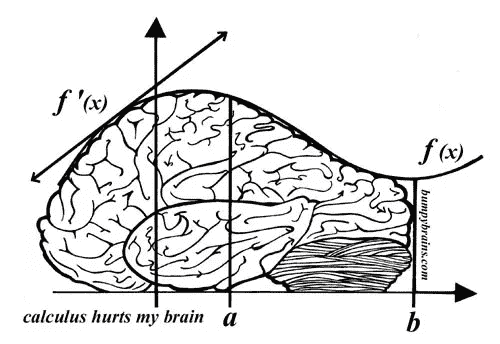
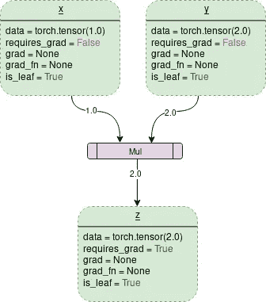
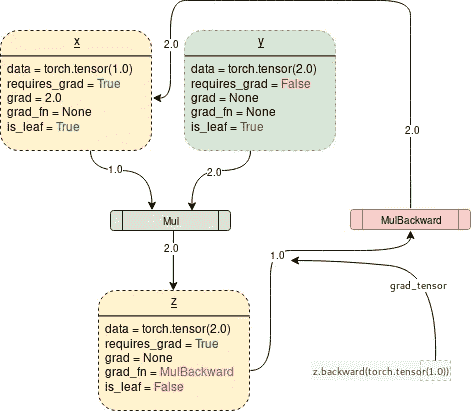
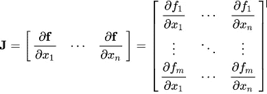
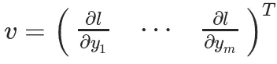
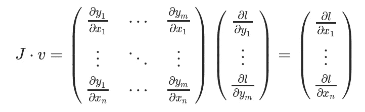

# PyTorch 亲笔签名

> 原文：<https://towardsdatascience.com/pytorch-autograd-understanding-the-heart-of-pytorchs-magic-2686cd94ec95?source=collection_archive---------1----------------------->

## 理解 PyTorch 魔法的核心

[In the process it never explicitly constructs the whole Jacobian. It’s usually simpler and more efficient to compute the JVP directly.](https://medium.com/@timetraveller1998/that-is-true-b02561bf9c1c?source=responses---------0---------------------)

[来源:https://www . cs . Toronto . edu/~ rgrosse/courses/CSC 321 _ 2018/slides/LEC 10 . pdf](https://medium.com/@timetraveller1998/that-is-true-b02561bf9c1c?source=responses---------0---------------------)

[资料来源:http://bumpybrains.com/comics.php?comic=34](http://bumpybrains.com/comics.php?comic=34)

让我们只是同意，当涉及到大型神经网络时，我们都不擅长微积分。通过显式求解数学方程来计算如此大的复合函数的梯度是不切实际的，尤其是因为这些曲线存在于大量的维度中并且是不可能理解的。

> 为了处理 14 维空间中的超平面，想象一个 3 维空间并大声对自己说“14”。每个人都这样做——杰弗里·辛顿

这就是 PyTorch 的亲笔签名的来源。它抽象了复杂的数学，帮助我们“神奇地”用几行代码计算高维曲线的梯度。这篇文章试图描述亲笔签名的魔力。

# PyTorch 基础

在继续之前，我们需要了解一些基本的 PyTorch 概念。

**Tensors** :简单来说就是 PyTorch 中的一个 n 维数组。Tensors 支持一些额外的增强功能，这使它们独一无二:除了 CPU，它们还可以加载到 GPU 上进行更快的计算。在设置`.requires_grad = True`时，它们开始形成一个反向图，跟踪应用于它们的每一个操作，以使用一种叫做动态计算图(DCG)的东西来计算梯度(在帖子中进一步解释)。

*在 PyTorch 的早期版本中，* `*torch.autograd.Variable*` *类用于创建支持梯度计算和操作跟踪的张量，但从 PyTorch v0.4.0 变量类开始，* [*已被弃用。*](https://pytorch.org/blog/pytorch-0_4_0-migration-guide/) `torch.Tensor`和`torch.autograd.Variable`现在是一个档次。更准确地说，`torch.Tensor`能够追踪历史，并且表现得像旧的`Variable`

Code to show various ways to create gradient enabled tensors

****亲笔签名:**这个类是一个计算导数的引擎(更准确地说是雅可比向量积)。它记录了在梯度张量上执行的所有操作的图形，并创建了一个称为动态计算图的非循环图形。这个图的叶子是输入张量，根是输出张量。梯度的计算方法是从根到叶追踪图形，并使用链式法则将每个梯度相乘。**

# **神经网络和反向传播**

**神经网络只不过是经过微妙调整(训练)以输出所需结果的复合数学函数。调整或训练是通过一种叫做反向传播的非凡算法来完成的。反向传播用于计算损失相对于输入权重的梯度，以便稍后更新权重并最终减少损失。**

> **在某种程度上，反向传播只是链式法则——杰瑞米·霍华德的别称**

**创建和训练神经网络包括以下基本步骤:**

1.  **定义架构**
2.  **使用输入数据在架构上向前传播**
3.  **计算损失**
4.  ****反向传播以计算每个权重的梯度****
5.  **使用学习率更新权重**

**输入权重的微小变化引起的损失变化称为该权重的梯度，使用反向传播进行计算。然后，使用学习率将梯度用于更新权重，以总体减少损失并训练神经网络。**

**这是以迭代的方式完成的。对于每次迭代，都要计算几个梯度，并建立一个称为计算图的东西来存储这些梯度函数。PyTorch 通过构建一个动态计算图(DCG)来做到这一点。该图是在每次迭代中从头开始构建的，为梯度计算提供了最大的灵活性。例如，对于前向操作(函数)`Mul`来说，称为`MulBackward`的后向操作(函数)被动态集成到后向图中，用于计算梯度。**

# **动态计算图**

**启用梯度的张量(变量)与函数(运算)结合起来创建动态计算图。数据流和应用于数据的操作是在运行时定义的，因此可以动态地构建计算图。此图由引擎盖下的亲笔签名类动态制作。[在开始训练之前，你不必对所有可能的路径进行编码——你跑的就是你与众不同的。](https://github.com/pytorch/pytorch/blob/master/docs/source/notes/autograd.rst)**

**两个张量相乘的简单 DCG 如下所示:**

****

**DCG with requires_grad = False (Diagram created using draw.io)**

**图中的每个虚线框是一个变量，紫色矩形框是一个操作。**

**每个变量对象都有几个成员，其中包括:**

****数据**:变量保存的数据。 ***x*** 保存一个值等于 1.0 的 1x1 张量，而 ***y*** 保存 2.0。 **z** 表示两者的乘积，即 2.0**

****requires_grad** :该成员，如果为 true，则开始跟踪所有的操作历史，并形成一个用于梯度计算的反向图。对于任意张量 ***a*** 它可以被就地操作如下:`a.requires_grad_(True).`**

****grad:** grad 保存渐变的值。如果`requires_grad`为假，它将保持一个 None 值。即使`requires_grad`为真，它也将保持一个 None 值，除非从其他节点调用`.backward()`函数。例如，如果您为某个变量 ***out*** 调用`out.backward()`，该变量在其计算中涉及*，那么`x.grad`将持有 **∂out/∂x** 。***

*****grad_fn:** 这是用于计算梯度的反向函数。***

*****is_leaf** :如果:***

1.  ***它是由类似于`x = torch.tensor(1.0)`或`x = torch.randn(1, 1)`的函数显式初始化的(基本上是本文开头讨论的所有张量初始化方法)。***
2.  ***它是在对所有具有`requires_grad = False.`的张量进行运算后创建的***
3.  ***它是通过在某个张量上调用`.detach()`方法创建的。***

***在调用`backward()`时，只为`requires_grad`和`is_leaf`都为真的节点填充渐变。渐变是从调用`.backward()`的输出节点开始的，相对于其他叶节点。***

***打开`requires_grad = True`时，PyTorch 将开始跟踪操作，并存储每个步骤的梯度函数，如下所示:***

******

***DCG with requires_grad = True (Diagram created using draw.io)***

***PyTorch 引擎下生成上图的代码是:***

***[In the process it never explicitly constructs the whole Jacobian. It’s usually simpler and more efficient to compute the JVP directly.](https://medium.com/@timetraveller1998/that-is-true-b02561bf9c1c?source=responses---------0---------------------)***

***[来源:https://www . cs . Toronto . edu/~ rgrosse/courses/CSC 321 _ 2018/slides/LEC 10 . pdf](https://medium.com/@timetraveller1998/that-is-true-b02561bf9c1c?source=responses---------0---------------------)***

***为了阻止 PyTorch 跟踪历史和形成后向图，可以将代码包装在`with torch.no_grad():`中，这将使代码在不需要梯度跟踪时运行得更快。***

# ***Backward()函数***

***Backward 是这样一个函数，它实际上是通过将其参数(默认情况下是 1x1 单位张量)通过后向图一直传递到可从调用根张量追踪到的每个叶节点来计算梯度的。然后将计算出的梯度存储在每个叶节点的`.grad`中。*记住，反向图形已经在正向传递过程中动态生成。Backward function 仅使用已经制作的图形计算梯度，并将它们存储在叶节点中。****

***让我们分析下面的代码***

***需要注意的一件重要事情是，当调用`z.backward()`时，一个张量被自动作为`z.backward(torch.tensor(1.0))`传递。`torch.tensor(1.0)`是为终止链式法则梯度乘法而提供的外部梯度。该外部梯度作为输入传递给`MulBackward`函数，以进一步计算 ***x*** 的梯度。传入`.backward()`的张量的维数必须与正在计算梯度的张量的维数相同。例如，如果梯度使能张量 x 和 y 如下:***

***`x = torch.tensor([0.0, 2.0, 8.0], requires_grad = True)`***

***`y = torch.tensor([5.0 , 1.0 , 7.0], requires_grad = True)`***

***和`z = x * y`***

***然后，为了计算`z`(1×3 张量)相对于`x`或`y`的梯度，需要将外部梯度传递给 `z.backward()`函数，如下所示:`z.backward(torch.FloatTensor([1.0, 1.0, 1.0])`***

> ***`*z.backward()*` *会给一个* `*RuntimeError: grad can be implicitly created only for scalar outputs*`***

***传递给后向函数的张量的作用类似于梯度加权输出的权重。从数学上来说，这是向量乘以非标量张量的雅可比矩阵(在本文中进一步讨论)，因此它几乎总是与张量`backward` 维数相同的单位张量，除非需要计算加权输出。***

> ***tldr:反向图是由自动签名的类在正向传递过程中自动动态创建的。`Backward()`简单地通过将参数传递给已经制作好的反向图来计算梯度。***

# ***数学——雅可比和向量***

***从数学上来说，亲笔签名的类只是一个雅可比矢量积计算引擎。一个[雅可比矩阵](https://en.wikipedia.org/wiki/Jacobian_matrix_and_determinant)用非常简单的话来说就是一个表示两个向量所有可能偏导数的矩阵。它是一个向量相对于另一个向量的梯度。***

> ***注意:在这个过程中 PyTorch 从不显式地构造整个 Jacobian。直接计算 JVP(雅可比向量积)通常更简单、更有效。***

***如果一个向量**X =【x1，x2，…。xn]** 用于计算其他一些向量 **f(X) = [f1，f2，…。fn]** 通过函数 **f** 然后雅可比矩阵( **J** )简单地包含所有偏导数组合如下:***

******

***Jacobian matrix (Source: Wikipedia)***

***以上矩阵表示 **f(X)** 相对于 **X** 的梯度***

***假设 PyTorch 梯度启用张量 **X** 为:***

*****X = [x1，x2，…..xn]** (假设这是某个机器学习模型的权重)***

*****X** 经过一些运算形成一个矢量 **Y*****

*****Y = f(X) = [y1，y2，…。ym]*****

*****Y** 然后用于计算标量损失 ***l.*** 假设向量 ***v*** 恰好是标量损失 ***l*** 的梯度，关于向量 **Y** 如下***

******

****向量 v 被称为* `*grad_tensor*` *并作为自变量传递给* `*backward()*` *函数****

***为了得到损失 ***l*** 相对于权重 **X** 的梯度，雅可比矩阵 **J** 被向量乘以向量 ***v******

******

***这种计算雅可比矩阵并将其与矢量 ***v*** 相乘的方法使得 PyTorch 能够轻松提供外部梯度，即使是非标量输出。***

# ***进一步阅读***

***[反向传播:快速修改](https://ml-cheatsheet.readthedocs.io/en/latest/backpropagation.html)***

***[PyTorch:自动分化包—torch . autogradated](https://pytorch.org/docs/stable/autograd.html)***

***[亲笔签名的源代码](https://github.com/pytorch/pytorch/tree/master/torch/autograd)***

***[视频:PyTorch 亲笔签名讲解——深度教程](https://www.youtube.com/watch?v=MswxJw-8PvE)作者[埃利奥特·韦特](https://www.youtube.com/channel/UCBCWYxhwuebyRTf4v3GkBlQ)***

> ***感谢您的阅读！欢迎在回复中表达任何疑问。***