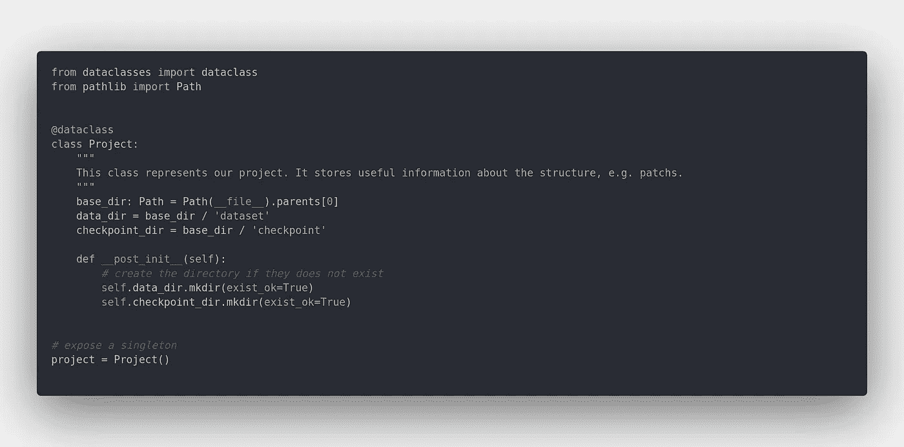
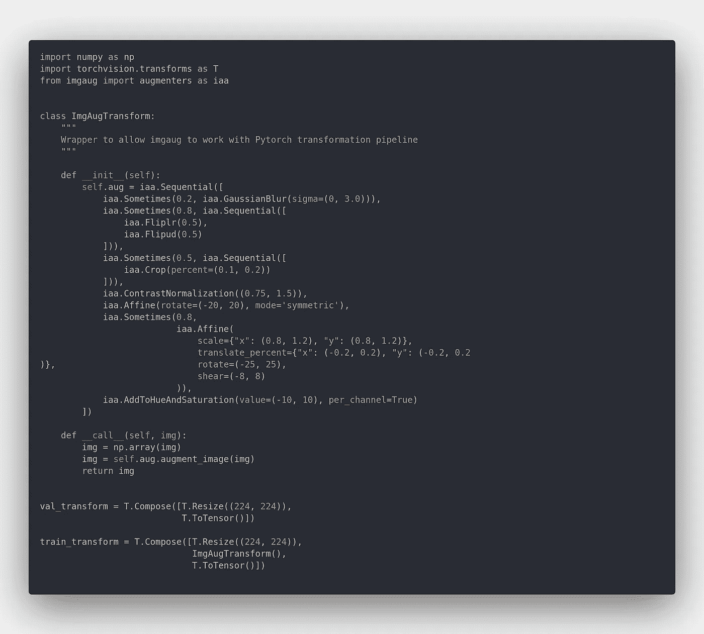
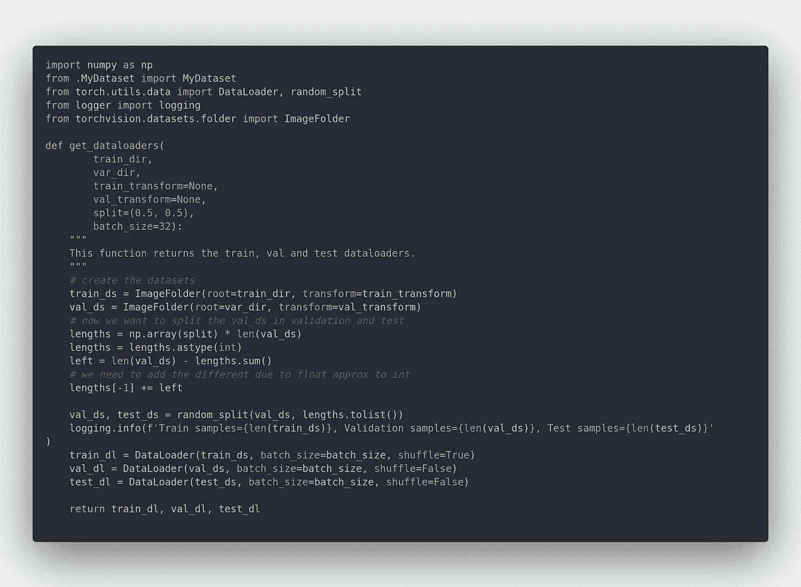
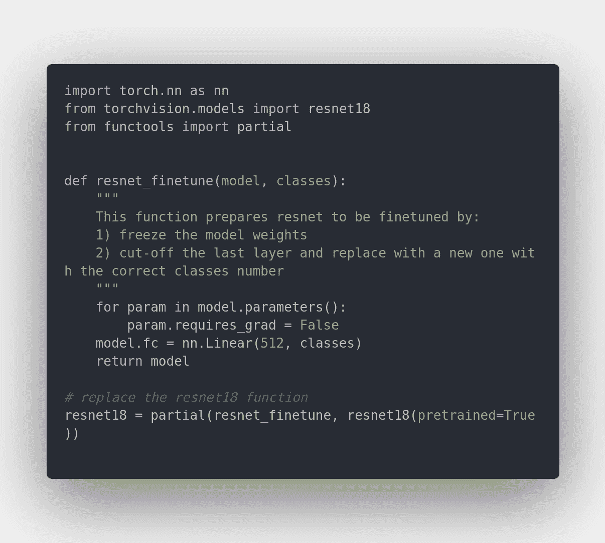
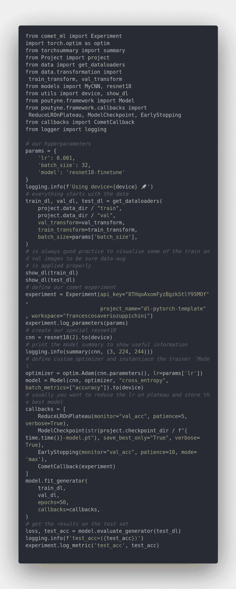
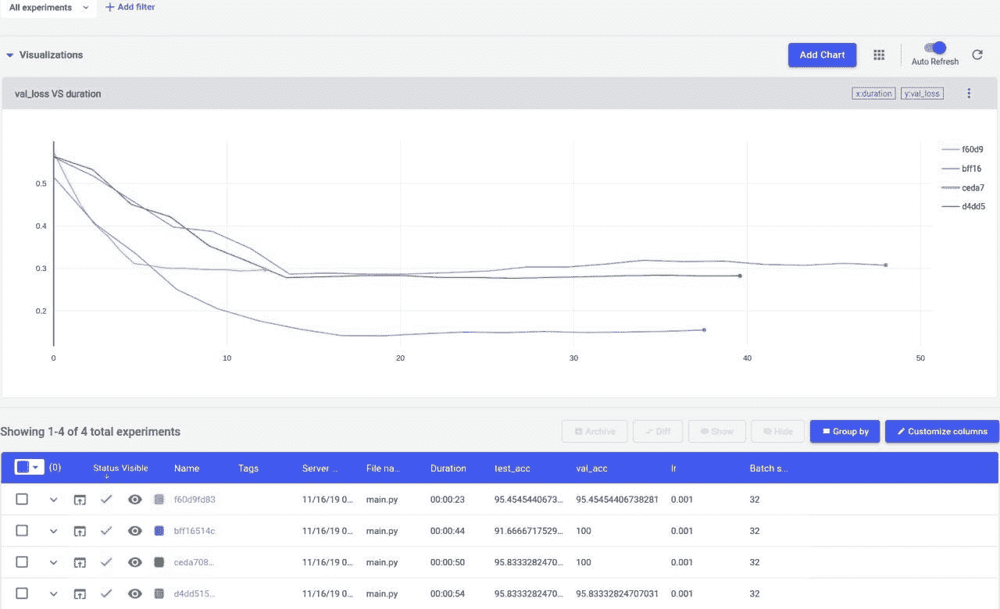
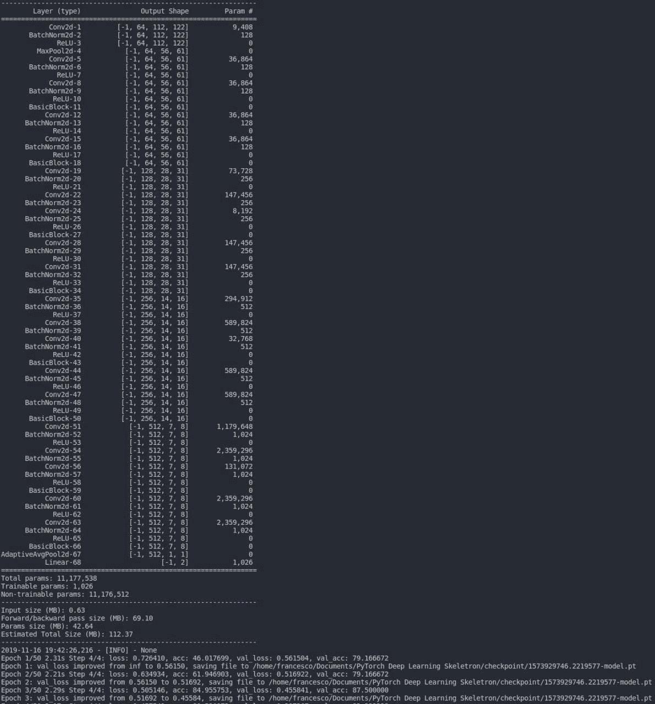
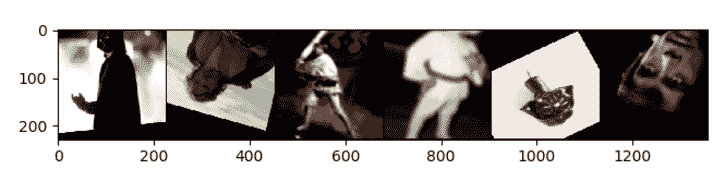
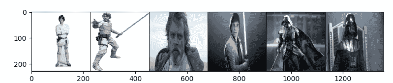

# PyTorch 深度学习模板

> 原文：<https://towardsdatascience.com/pytorch-deep-learning-template-6e638fc2fe64?source=collection_archive---------21----------------------->

# 一个干净简单的模板来启动你的下一个 dl 项目🚀🚀

这里的模板是[这里的](https://github.com/FrancescoSaverioZuppichini/PyTorch-Deep-Learning-Template/tree/master)

在本文中，我们将向您展示一个基于 Pytorch 的深度学习模板。这个模板旨在让你更容易用 PyTorch 开始一个新的深度学习计算机视觉项目。主要特点是:

*   模块化:我们将每个逻辑块分成不同的 python 子模块
*   数据扩充:我们包括了[伊姆高格](https://imgaug.readthedocs.io/en/latest/)
*   蓄势待发:通过使用类似 Keras 的框架 [poutyne](https://pypi.org/project/Poutyne/) ，你不必编写任何 train 循环。
*   [火炬摘要](https://github.com/sksq96/pytorch-summary)展示您的模型摘要
*   在稳定期降低学习率
*   自动保存最佳模型
*   用[彗星](https://www.comet.ml/)进行实验跟踪

# 动机

让我们面对它，通常，数据科学家不是软件工程师，他们通常以意大利面条代码结束，大部分时间在一个大的不可用的木星笔记本上。有了这个 repo，你已经提出了一个清晰的例子，说明你的代码应该如何拆分和模块化，以使可伸缩性和可共享性成为可能。在这个例子中，我们将尝试对达斯·维德和卢克·天行者进行分类。我们用谷歌图片收集了每个班级 100 张图片。数据集在这里是[这里是](https://drive.google.com/open?id=1LyHJxUVjOgDIgGJL4MnDhA10xjejWuw7)。你只需要在这个文件夹中精确它并运行 main.py。我们正在微调 resnet18，它应该能够在 5/10 个周期内达到 90%的准确性。

模板在`./template`里面。

**我们强烈建议使用模板**

# 保持你的结构干净简洁

每个深度学习项目至少有三个主要步骤:

*   数据收集/处理
*   建模
*   培训/评估

一个好主意是将所有路径存储在一个感兴趣的位置，例如数据集文件夹，存储在一个共享类中，该文件夹中的任何人都可以访问它。你不应该硬编码任何路径，总是定义一次并导入它们。所以，如果你以后改变你的结构，你只需要修改一个文件。如果我们看一下`Project.py`，我们可以看到我们是如何一劳永逸地定义了`data_dir`和`checkpoint_dir`。我们正在使用“新的”[路径](https://docs.python.org/3/library/pathlib.html)API，它支持开箱即用的不同操作系统，并且还使加入和连接路径变得更加容易。



例如，如果我们想知道数据位置，我们可以:

```
from Project import project
print(projct.data_dir) # /foo/baa/…/dataset
```

在`data`包中，您可以定义自己的数据集，一如既往地通过子类化`torch.data.utils.Dataset`，公开转换和实用程序来处理您的数据。在我们的例子中，我们直接使用了来自`torchvision`的`ImageDataset`，但是我们在`/data/MyDataset`中包含了一个定制`Dataset`的框架

# 转换

您通常需要对数据进行一些预处理，例如调整图像大小和应用数据扩充。你所有的转变都应该在`.data.trasformation`里面。在我们的模板中，我们包含了一个 [imgaug](https://imgaug.readthedocs.io/en/latest/) 的包装器



# 数据加载器

如您所知，您必须创建一个`Dataloader`来将您的数据输入到模型中。在`data.__init__.py`文件中，我们公开了一个非常简单的函数`get_dataloaders`，使用几个参数自动配置*训练、val 和测试*数据加载器



你所有的模型都在`models`里面，在我们的例子中，我们有一个非常基本的 cnn，我们覆盖`resnet18`函数来提供一个冻结的模型来微调。



在我们的例子中，我们保持事情简单，所有的训练和评估逻辑都在`.main.py`中，我们使用 [poutyne](https://pypi.org/project/Poutyne/) 作为主库。我们已经定义了一个有用的回调列表:

*   学习率调度程序
*   最佳模型的自动保存
*   通常提前停止，这就是你所需要的！



# 追踪你的实验

我们使用[彗星](https://www.comet.ml/)来自动跟踪我们模型的结果。这是慧星的板子运行了几个模型后的样子。



运行`main.py`产生以下输出:



我们还创建了不同的工具函数来绘制展位数据集和数据加载器。他们在`utils.py`。例如，在我们的 train 和 val 数据集上调用`show_dl`会产生以下输出。



正如你所看到的，数据扩充被正确地应用在训练集上。

这里的代码是[这里是](https://github.com/FrancescoSaverioZuppichini/PyTorch-Deep-Learning-Template/tree/master)

# 结论

我希望你能找到一些有用的信息，希望这个模板能对你下一个令人惊叹的项目有所帮助:)

如果你有什么改进的想法/建议，请告诉我。

您可能也会发现这些文章很有趣:

[](/a-journey-into-convolutional-neural-network-visualization-1abc71605209) [## 卷积神经网络可视化之旅

### 弗朗西斯科·萨维里奥·祖皮奇尼

towardsdatascience.com](/a-journey-into-convolutional-neural-network-visualization-1abc71605209) 

[https://towardsdatascience . com/py torch-how-and-when-use-module-sequential-modulelist-and-module prediction-7a 54597 b5 f17](/pytorch-how-and-when-to-use-module-sequential-modulelist-and-moduledict-7a54597b5f17)

感谢您的阅读。