# 深度学习 PyTorch:初学者快速指南

> 原文：<https://towardsdatascience.com/pytorch-for-deep-learning-a-quick-guide-for-starters-5b60d2dbb564?source=collection_archive---------2----------------------->

2019 年，ML 框架的战争有两个主要竞争者: [PyTorch](https://pytorch.org/) 和 [TensorFlow](https://www.tensorflow.org/) 。由于 PyTorch 易于使用，越来越多的研究人员和学生[采用 py torch，而在工业界，Tensorflow 目前仍是首选平台。](https://thegradient.pub/state-of-ml-frameworks-2019-pytorch-dominates-research-tensorflow-dominates-industry/)

PyTorch 的一些主要优势包括:

*   简单性:它非常 Python 化，可以很容易地与 Python 生态系统的其他部分集成。它易于学习、使用、扩展和调试。
*   PyTorch 在可用性方面大放异彩，因为它设计了更好的面向对象的类，这些类封装了所有重要的数据选择以及模型架构的选择。PyTorch 的文档也很出彩，对初学者很有帮助。
*   **动态图:** PyTorch 实现了动态计算图。这意味着网络可以在运行时改变行为，只需很少或不需要开销。这对于调试和以最小的努力构建复杂的模型非常有帮助。允许 PyTorch 表达式自动区分。


[Unsplash](https://unsplash.com/photos/CbgXKSd3qkQ)

PyTorch 在研究中越来越受欢迎。下图显示了在其他深度学习框架中，单词“PyTorch”每月被提及的次数占所有被提及次数的百分比。我们可以看到，2019 年 arXiv 中 PyTorch 的上升趋势非常明显，几乎达到了 50%。

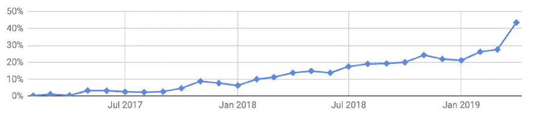

[arXiv papers mentioning PyTorch is growing](https://arxiv.org/abs/1912.01703)

**动态图形生成**，紧密的 **Python 语言集成**，以及相对简单的 API**使得 PyTorch 成为一个优秀的研究和实验平台。**

# 装置

PyTorch 提供了一个非常简洁的界面来获得要安装的工具的正确组合。下面是快照选择和相应的命令。Stable 代表 PyTorch 的最新测试和支持版本。这个应该适合很多用户。预览是可用的，如果你想要最新的版本，没有完全测试和支持。您可以从 Anaconda(推荐)和 Pip 安装包中进行选择，并支持各种 CUDA 版本。

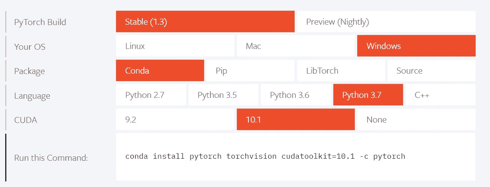

# PyTorch 模块

现在我们将讨论 PyTorch 库的关键模块，如**张量**、**亲笔签名**、**优化器**和**神经网络(NN )** ，它们对于创建和训练神经网络是必不可少的。

# 张量

张量是 PyTorch 的主力。我们可以把*张量*想象成多维数组。PyTorch 有一个由 *torch* 模块提供的大量操作库。PyTorch 张量非常接近非常流行的 NumPy 阵列。事实上，PyTorch 具有与 NumPy 无缝互操作的特性。与 NumPy 数组相比，PyTorch 张量增加了一个优势，即张量和相关操作都可以在 CPU 或 GPU 上运行。PyTorch 提供的第二个重要功能是允许张量跟踪对它们执行的操作，这有助于计算输出相对于任何输入的梯度或导数。

## 基本张量运算

张量是指将向量和矩阵推广到任意维数。张量的维数与用于引用张量内标量值的索引的数量一致。零阶张量(0D 张量)只是一个数字或者一个*标量*。一阶张量(1D 张量)是一组数字或一个矢量。类似地，二阶张量(2D)是一组向量或一个矩阵。

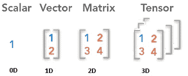

现在让我们在 PyTorch 中创建一个张量。

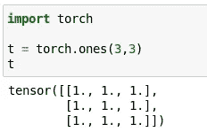

导入 torch 模块后，我们调用了一个函数 *torch.ones* ，它创建了一个大小为 9 的(2D)张量，其中填充了值 1.0。

其他方式包括使用`**t*orch.zeros***`*；*零填充张量，`***torch.randn***`，*；*来自随机均匀分布。

## 类型和尺寸

每个张量都有相关的类型和大小。使用`**torch.Tensor**`构造函数时，默认的张量类型是`**torch.FloatTensor**`。但是，您可以将张量转换为不同的类型(`**float**` **、**、`**long**`、**、**、`**double**`等)。)通过在初始化时或稍后使用类型转换方法之一指定它。指定初始化类型有两种方法:要么直接调用特定张量类型的构造函数，如`**FloatTensor**` 或`**LongTensor**`，要么使用特殊的方法 `**torch.tensor()**`，并提供`**dtype**.`

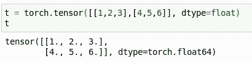

## 一些有用的张量运算:

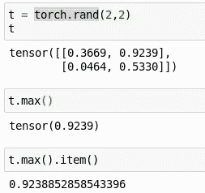

找出张量中的最大值项以及包含最大值的索引。这些可以通过`***max()***`和`***argmax()***`功能完成。我们还可以使用`**item()**`从 1D 张量中提取标准的 Python 值。

> 大多数对张量进行操作并返回张量的函数都会创建一个新的张量来存储结果。如果你需要一个 ***就地*** 函数，寻找一个附加了下划线(`*_*`)的函数，例如`***torch.transpose_***`将对一个张量进行就地转置。

使用`***torch.from_numpy***` *&* `***torch.numpy()***` *，张量和 Numpy 之间的转换非常简单。*

另一个常见的操作是 ***重塑*** 一个张量。这是经常使用的操作之一，也非常有用。我们可以用`***view()***`或`***reshape()***`来做这件事:

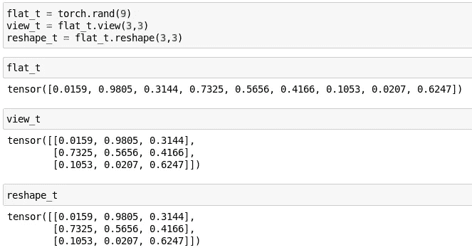

`***Tensor.reshape()***`和`***Tensor.view()***`虽然不一样。

*   `***Tensor.view()***`只作用于连续的张量，并且**永远不会**复制内存。这将在非连续张量上引起误差。但是你可以通过调用`***contiguous()***`使张量连续，然后你可以调用`***view()***`。
*   `***Tensor.reshape()***`将对任何张量起作用，如果需要的话**可以克隆**。

## 张量广播

PyTorch 支持类似 NumPy 的广播。*广播*可以让你在两个张量之间进行运算。广播语义参见[这里的](https://pytorch.org/docs/stable/notes/broadcasting.html)。

# 张量简而言之:什么，如何在哪里

唯一定义张量的三个[属性](https://pytorch.org/docs/stable/tensor_attributes.html)是:

**dtype:** **张量的每个元素中实际存储的是什么**？这可以是浮点数或整数等。PyTorch 有九种不同的数据类型。

**布局:我们如何从逻辑上解释这个物理内存。最常见的布局是步进张量。跨距是一个整数列表:第 k 个跨距表示从张量的第 k 维中的一个元素到下一个元素所必需的内存跳跃。**

**设备:张量的物理内存实际存储在哪里，例如在 CPU 或 GPU 上。`**torch.device**`包含设备类型(`'**cpu**'`或`'**cuda**'`)和设备类型的可选设备序号。**

# 亲笔签名

亲笔签名是自动区分系统。自动微分是干什么的？给定一个网络，它会自动计算梯度。当计算向前传球时，自动签名同时执行请求的计算并建立一个表示计算梯度的函数的图形。

## 这是如何实现的？

PyTorch 张量可以根据产生它们的操作和父张量来记住它们来自哪里，并且它们可以自动提供这种操作相对于它们的输入的导数链。这是通过`**requires_grad**` **实现的，如果**设置为真。

`**t= torch.tensor([1.0, 0.0], requires_grad=True)**`

计算完梯度后，导数的值被自动填充为张量的`**grad**` 属性。对于具有任意数量张量的函数的任意组合用`**requires_grad= True**`；PyTorch 将计算整个函数链的导数，并在这些张量的`**grad**` 属性中累加它们的值。

# 优化者

优化器用于更新权重和偏差，即模型的内部参数，以减少误差。更多细节请参考我的另一篇[文章](/estimators-loss-functions-optimizers-core-of-ml-algorithms-d603f6b0161a)。

PyTorch 有一个`**torch.optim**`包，里面有各种优化算法，比如 SGD(随机梯度下降)、Adam、RMSprop 等。

让我们看看如何创建一个提供的优化器 SGD 或 Adam。

```
**import torch.optim as optim
params = torch.tensor([1.0, 0.0], requires_grad=True)****learning_rate = 1e-3****## SGD
optimizer = optim.SGD([params], lr=learning_rate)****## Adam
optimizer = optim.Adam([params], lr=learning_rate)**
```

如果不使用优化器，我们将需要手动更新模型参数，如下所示:

```
 **for params in model.parameters(): 
       params -= params.grad * learning_rate**
```

我们可以使用优化器中的`**step()**`方法向前迈进一步，而不是手动更新每个参数。

```
**optimizer.step()**
```

调用 step 时，params 的值会更新。优化器查看`**params.grad**`，并通过从中减去`**learning_rate**` 乘以`**grad**` 来更新`**params**` ，就像我们在没有使用优化器的情况下所做的一样。

`**torch.optim**` 模块通过传递一个参数列表，帮助我们抽象出具体的优化方案。由于有多种优化方案可供选择，我们只需要为我们的问题选择一种，然后让底层 PyTorch 库为我们施展魔法。

# 神经网络

在 PyTorch 中,`**torch.nn**`包定义了一组类似于神经网络层的模块。模块接收输入张量并计算输出张量。`**torch.nn**`包还定义了一组训练神经网络时常用的有用损失函数。

构建神经网络的步骤是:

*   **神经网络构建:**创建神经网络层。设置参数(权重、偏差)
*   **正向传播:**计算预测输出。测量误差。
*   **反向传播:**找到误差后，我们反向传播我们的误差梯度以更新我们的权重参数。我们通过对误差函数相对于我们的神经网络的参数进行求导来做到这一点。
*   **迭代优化:**我们要尽可能的把误差降到最低。我们通过梯度下降不断迭代更新参数。

# 建立一个神经网络

让我们按照上面的步骤，在 PyTorch 中创建一个简单的神经网络。

## 第一步:**神经网络构建**

我们这里把我们的 NN `**Net**` 叫做**。**我们继承了`**nn.Module**`。与`super().__init__()`结合，这创建了一个跟踪架构的类，并提供了许多有用的方法和属性。

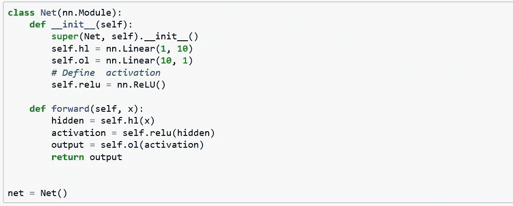

我们的神经网络`**Net**`有一个隐含层`**self.hl**`和一个输出层 `**self.ol**`。

```
**self.hl = nn.Linear(1, 10)**
```

这一行创建了一个具有 1 个输入和 10 个输出的线性变换模块。它还会自动创建权重和偏差张量。一旦用`**net.hl.weight**`和`**net.hl.bias**`创建了网络`**net**`，就可以访问权重和偏差张量。

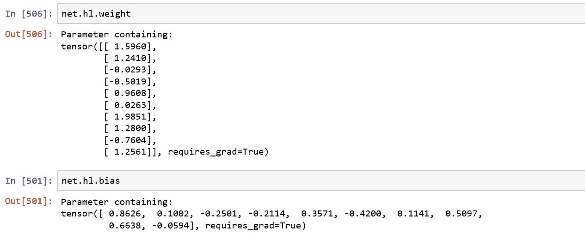

我们已经使用`**self.relu = nn.ReLU()**`定义了激活。

## **第二步:正向传播**

用`**nn.Module**`创建的 PyTorch 网络必须定义一个`**forward()**`方法。它接受一个张量`**x**`并通过您在`**__init__**`方法中定义的操作传递它。

```
**def** forward(self, x):
   hidden = self.hl(x)
   activation = self.relu(hidden)
   output = self.ol(activation)
```

我们可以看到，输入张量经过隐层，然后是激活函数(relu)，最后是输出层。

## 步骤 3:反向传播

这里，我们必须计算误差或损失，并反向传播我们的误差梯度，以更新我们的权重参数。

损失函数获取(输出，目标)并计算一个估计`**output**` 离`**target**`有多远的值。在`**torch.nn**`包下有几个不同的[损失函数](https://pytorch.org/docs/nn.html#loss-functions)。一个简单的损失是`**nn.MSELoss**`，它计算输入和目标之间的均方误差。

```
**output = net(input)
loss_fn = nn.MSELoss()
loss = loss_fn(output, target)**
```

## 反向投影

一个简单的函数调用`**loss.backward()**` 传播错误。不要忘记清除现有的梯度，否则梯度将积累到现有的梯度。调用`**loss.backward()**`后，查看反向调用前后的隐藏层偏差梯度。

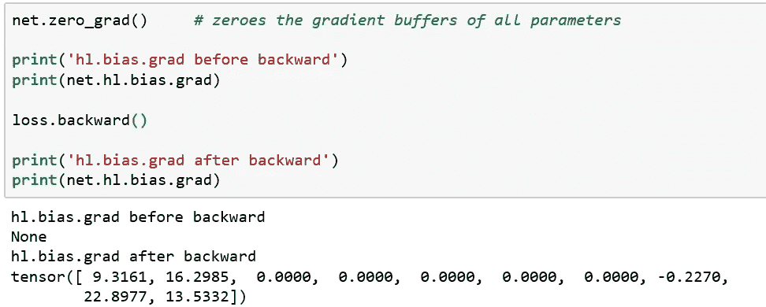

所以在调用 backward()之后，我们看到渐变是为隐藏层计算的。

## 步骤 4:迭代优化

我们已经看到 optimizer 如何帮助我们更新模型的参数。

```
***# create your optimizer*
optimizer = optim.Adam(net.parameters(), lr=1e-2)****optimizer.zero_grad()   *# zero the gradient buffers*****output = net(input)     # calculate output
loss = loss_fn(output, target) #calculate loss
loss.backward()      # calculate gradient****optimizer.step()     *# update parameters***
```

请注意不要错过`**zero_grad()**` 来电。如果你错过调用它，梯度会在每次调用 backward 时累积，你的梯度下降不会收敛。下面是 Andrej 最近的一条推文，展示了修复这些漏洞的沮丧和时间。

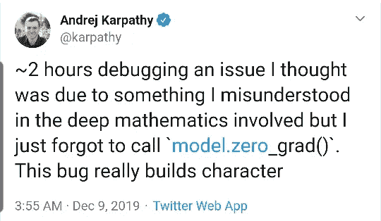

现在，我们的基本步骤(1，2，3)已经完成，我们只需要迭代训练我们的神经网络，以找到最小的损失。所以我们运行`**training_loop**` 多次，直到损失最小。

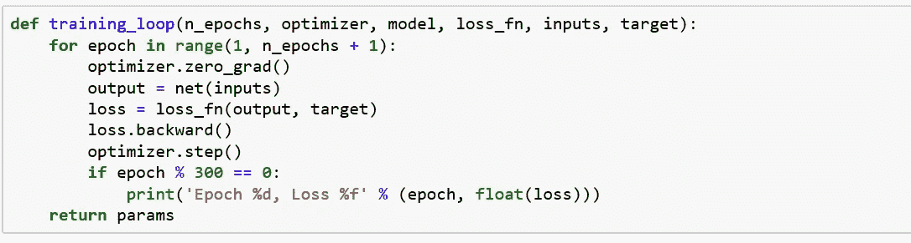

让我们运行我们的神经网络来训练输入`**x_t**`和目标`**y_t**`。

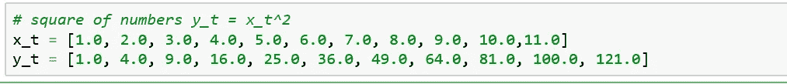

我们称`**training_loop**` 为 1500 个时代，可以通过所有其他的论点，如`**optimizer**`、`**model**`、`**loss_fn**`、、`**inputs**`、**、**和`**target**`。每 300 个周期后，我们打印损失，我们可以看到每次迭代后损失都在减少。看起来我们最基本的神经网络正在学习。

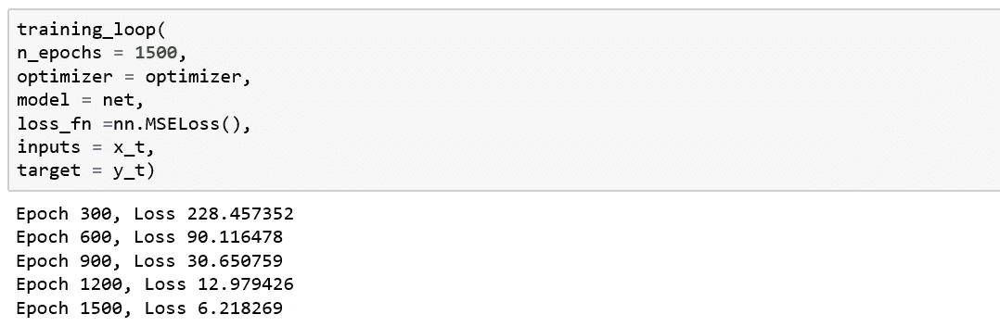

我们绘制了模型输出(黑叉)和目标数据(红圈)，模型似乎学得很快。

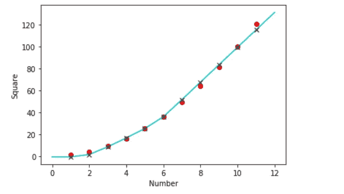

到目前为止，我们已经讨论了 PyTorch 的基本或必要元素，以帮助您入门。我们可以看到我们构建的代码是如何模块化的，每个组件都提供了基本块，可以根据我们的要求进一步扩展以创建机器学习解决方案。

为实际问题创建基于机器学习的解决方案涉及到大量的数据准备工作。然而，PyTorch 库提供了许多工具来使数据加载变得容易和更具可读性，如分别处理图像、文本和音频数据的`**torchvision**`、`**torchtext**` 和`**torchaudio**`、**、**。

训练机器学习模型通常非常困难。当我们遇到一些问题时，总是需要一个工具来帮助可视化我们的模型和理解训练进度。[**tensor board**](https://www.tensorflow.org/tensorboard)**就是这样一个工具，帮助我们记录来自模型训练的事件，包括各种标量(如精度、损失)、图像、直方图等。自从 PyTorch 1.2.0 发布以来，TensorBoard 现在是 PyTorch 的内置特性。请按照[本](https://pytorch.org/tutorials/intermediate/tensorboard_tutorial.html)和[本](/https-medium-com-dinber19-take-a-deeper-look-at-your-pytorch-model-with-the-new-tensorboard-built-in-513969cf6a72)教程安装和使用 Pytorch 中的张量板。**

**谢谢你的阅读。下一篇文章再见:)**

# **参考资料:**

**[1][https://the gradient . pub/state-of-ml-frameworks-2019-py torch-domains-research-tensor flow-domains-industry/](https://thegradient.pub/state-of-ml-frameworks-2019-pytorch-dominates-research-tensorflow-dominates-industry/)**

**[2]https://pytorch.org/**

**[https://www.kdnuggets.com/2018/05/wtf-tensor.html](https://www.kdnuggets.com/2018/05/wtf-tensor.html)**