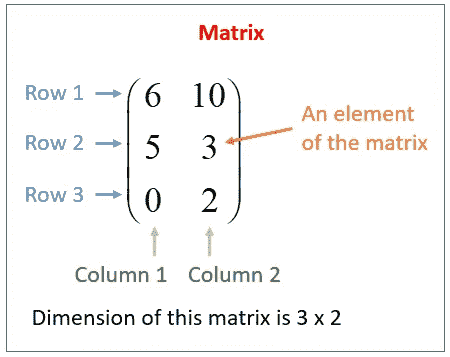

# PyTorch 基础

> 原文：<https://towardsdatascience.com/pytorch-fundamentals-50af6121d4a3?source=collection_archive---------22----------------------->

PyTorch 是最著名的深度学习框架之一。我个人更喜欢 PyTorch，因为它的 pythonic 性质。很容易将每一行代码都视为一个函数，有清晰的输入和输出。

在这篇文章中，我将讨论在使用 PyTorch 进行深度学习时起关键作用的以下基本结构和操作。

1.  矩阵或张量
2.  张量运算
3.  变量和梯度

# 矩阵或张量

矩阵被正式定义为“数字的矩形阵列”。在 numpy 图书馆，他们被称为“ndarrays ”,而在 PyTorch，他们被称为“男高音”。



Taken from [https://www.onlinemathlearning.com/matrices-rows-columns.html](https://www.onlinemathlearning.com/matrices-rows-columns.html)

上图所示的张量是一个 3 行 2 列的 2D 张量。让我们看看如何在 PyTorch 中创建张量。

```
**import** numpy **as** np
**import** torch

*# 1) Create a PyTorch Tensor an array* arr = [[3, 4], [8, 5]] *# python array* pyt_tensor = torch.Tensor(arr) *# PyTorch tensor

# 2) Create a tensor* ones_tensor = torch.ones((2, 2)) *# tensor containing all ones* torch.manual_seed(0)             *# to have same values for random generation* rand_tensor = torch.rand((2, 2)) *# tensor containing random values

# if running on GPU, set random seed value as follows* **if** torch.cuda.is_available():
    torch.cuda.manual_seed_all(0)

*# 3) Create a tensor from numpy array (dtype must be either double, float, int64, int32, or uint8)* np_arr = np.ones((2, 2))
pyt_tensor = torch.from_numpy(np_arr)
np_arr_from_tensor = pyt_tensor.numpy() *# convert tensor to numpy array*
```

# 张量运算

所有适用于数组的运算也适用于张量。下面是 PyTorch 中的做法。

```
**import** numpy **as** np
**import** torch

*# 1) Resizing a tensor* pyt_tensor = torch.ones((2, 2))
print(pyt_tensor.size())        *# shows the size of this tensor* pyt_tensor = pyt_tensor.view(4) *# resizing 2x2 tensor to 4x1

# 2) Mathematical Operations* pyt_tensor_a = torch.ones((2, 2))
pyt_tensor_b = torch.ones((2, 2))
res_tensor = pyt_tensor_a + pyt_tensor_b               *# simple element wise addidtion* res_tensor = torch.add(pyt_tensor_a, pyt_tensor_b)     *# another way of addidtion* pyt_tensor_a.add_(pyt_tensor_b)                         *# In-place addition

# Operation     operator    function_name
#  => Addition        +           add
#  => Subtraction     -           sub
#  => Multiplication  *           mul
#  => Divide          /           div

# 3) Mean and Standart deviation* pyt_tensor = torch.Tensor([1, 2, 3, 4, 5])
mean = pyt_tensor.mean(dim=0)                        *# if multiple rows then dim = 1* std_dev = pyt_tensor.std(dim=0)                        *# if multiple rows then dim = 1*
```

# 变量和梯度

梯度计算是****深度学习中的关键事情之一。在 PyTorch 中，变量用于计算梯度。本质上，变量只是张量的包装，具有梯度计算的功能。****

****以下是用于管理变量的 python 代码****

```
****import** numpy **as** np
**import** torch
**from** torch.autograd **import** Variable

pyt_var = Variable(torch.ones((2, 2)), requires_grad = **True**)

*# behaves exactly the same as tensors, so we can apply all operations in the same way***
```

****现在，我们来看看如何在 PyTorch 中使用变量来计算梯度。****

```
****import** numpy **as** np
**import** torch
**from** torch.autograd **import** Variable

*# let's consider the following equation
# y = 5(x + 1)^2* x = Variable(torch.ones(1), requires_grad = **True**)
y = 5 * (x + 1) ** 2        *# implementing the equation.* y.backward()                *# calculate gradient* print(x.grad)               *# get the gradient of variable x
# differentiating the above mentioned equation
# => 5(x + 1)^2 = 10(x + 1) = 10(2) = 20***
```

****这篇文章中提到的事情非常简单直接，但也非常重要。如果基础知识以正确的方式学习，框架的知识会增长得很快。我自己发现偶尔回顾一下这些基础知识是很有用的，可以避免在实际编写代码时不必要的时间延迟。****