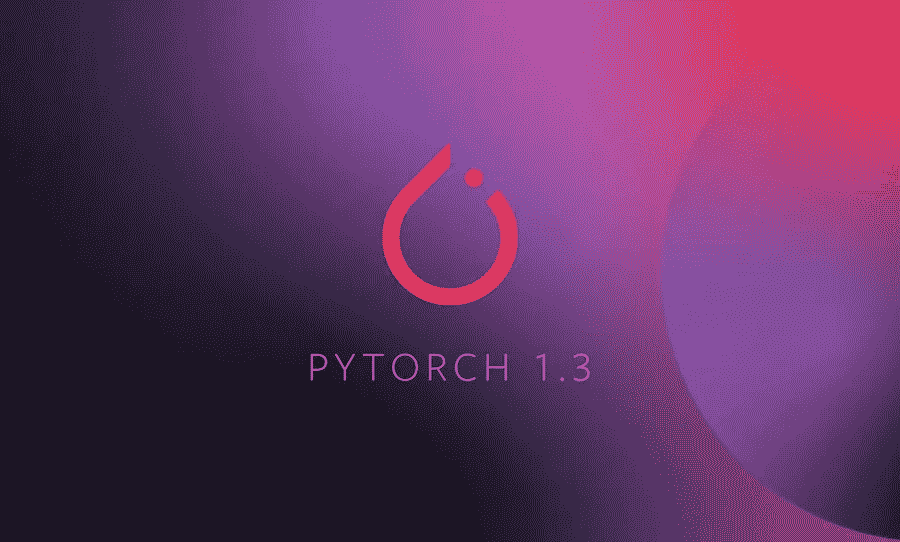
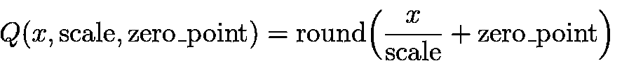

# PyTorch 1.3 —有什么新功能？

> 原文：<https://towardsdatascience.com/pytorch-v1-3-whats-new-79595c14971e?source=collection_archive---------14----------------------->

## 支持 Android 和 iOS，命名张量，TPU 支持，量化和更多。

脸书刚刚发布了 PyTorch v1.3，它包含了一些最令人期待的特性。最吸引人的三个是:

1.  **名为张量**——这将使机器学习实践者的生活变得更加容易。
2.  **量化** —针对物联网设备和嵌入式系统等性能关键型系统。
3.  **移动支持** —适用于 Android 和 iOS 设备。

我将简要介绍所有这些功能，并将链接到其他一些重要功能。

# 名为张量

PyTorch v1.3 最终增加了对命名张量的支持，允许用户使用显式关联的名称访问张量维度，而不是记住维度编号。例如，到目前为止，在与计算机视觉相关的任务中，我们必须记住批处理的一般结构，如下所示— [N，C，H，W]。其中 N 是批量大小，C 是通道数量，H 和 W 分别是图像的高度和宽度。在对这个批处理执行操作时，我们必须跟踪这样一个结构，但是现在我们可以只使用维度名称，而不是跟踪它的索引。此外，这些命名表示可以提供增强的运行时错误检查。我将在本文中进一步讨论它们。

Creating Named Tensors.

`batch.names`按顺序打印张量`batch`上每个维度的名称。

## 按名称对齐

使用`[align_as()](https://pytorch.org/docs/master/named_tensor.html#torch.Tensor.align_as)`或`[align_to()](https://pytorch.org/docs/master/named_tensor.html#torch.Tensor.align_to)`将张量维度按名称排列成指定的顺序。

在计算机视觉模型中，批次的表示通常需要在[N，C，H，W](用于向前和向后传递模型)和[N，H，W，C](用于绘制和保存图像)之间变化。到目前为止，这必须像`batch.permute([0, 2, 3, 1])`一样反直觉地完成，但是现在可以通过使用`[align_as()](https://pytorch.org/docs/master/named_tensor.html#torch.Tensor.align_as)`或`[align_to()](https://pytorch.org/docs/master/named_tensor.html#torch.Tensor.align_to)`操作符以更简单的方式完成。

对于大量的维度，普通的置换操作符需要所有维度的显式列表，即使只是交换两个维度的位置。然而，在命名张量的情况下，维度的排列或重新排序可以以更容易和更简单的方式完成，如下所示:

## 复选姓名

除了使张量更加直观，命名张量还提供了额外的错误检查。操作符应用于命名张量时(对于二元操作符，任何一个或两个命名张量)，将在运行时隐式检查某些维度名称是否匹配。这为防止错误提供了额外的安全性。如下例所示:

在上面的例子中，如果不是对于命名张量，`batch1`和`batch2`可以无误差地相加，因为 height = width = 100。然而，`batch2`的高度和宽度尺寸互换，将其添加到`batch1`可能不是预期的操作。由于命名张量，这个逻辑错误将被名称检查捕获，因为(' N '，' C '，' H '，' W ')和(' N '，' C '，' W '，' H ')是不同的。

**名字什么时候匹配？**

这些规则非常类似于 numpy 或 PyTorch 中的维度广播规则。引用 PyTorch 官方文件:

> *如果两个名字相等(字符串相等)或者至少有一个是* `*None*` *，则两个名字匹配。Nones 本质上是一个特殊的“通配符”名称。*

下面的例子展示了这一点:

## 名称传播

在张量上执行操作后，您不需要再次输入尺寸名称，它们将被自动传播。PyTorch 使用两个操作符— `match`和`unify` 进行名称传播。

*   `match`与上面定义的操作符相同，它检查两个指定的张量是否匹配。
*   `unify`是一个算子，用于确定两个输入张量中的哪一个的名字应当被传播到结果张量中。引用 PyTorch 官方文件:

> `*unify(A, B)*` *决定将* `*A*` *和* `*B*` *中的哪一个名称传播到输出。如果匹配，它将返回两个名称中更具体的一个。如果名称不匹配，就会出错。*

下面的示例展示了名称传播:

*   一元运算符:

*   二元运算符:

## *限制*

在写这篇文章的时候，命名的张量功能还处于实验阶段，可能会有很多变化。然而，命名张量目前最大的一个限制是，它们不完全支持[亲笔签名的](/pytorch-autograd-understanding-the-heart-of-pytorchs-magic-2686cd94ec95)引擎。虽然命名张量的梯度计算是完全相同的，但自动签名引擎完全忽略了名称及其提供的额外安全性。

# **量子化**

PyTorch 1.3 现在支持张量的量子化。这是 Tensorflow 已经支持并在 PyTorch 中期待已久的东西。量子化是一个相当简单却复杂的概念。在这里，我将通过回答三个问题——什么、为什么和如何——来尝试用高度抽象的方式简要地描述它们。

**什么是量子化？**

量化是以低精度格式执行操作或将高精度数据格式转换为低精度数据格式的技术。例如，这是通过将 32 位浮点格式视为 8 位定点格式来实现的。如果感兴趣，你可以阅读一下[定点](https://en.wikipedia.org/wiki/Fixed-point_arithmetic)和[浮点运算](https://en.wikipedia.org/wiki/Floating-point_arithmetic)及其相关的复杂性，以便更好地理解量化的需要。

**为什么要** **量子化？**

从事研究和创建神经网络模型的全部目的是部署它们并使它们为公众利益服务。虽然模型训练需求只与研究人员和机器学习实践者的数量成比例增长，但模式推理的需求与消费者的数量成比例增长。为了允许更多更好地访问最终用户，为推理而部署的模型的表示需要比它们在训练时的表示更紧凑。另一件要记住的事情是，反向传播需要模型权重和偏差的高精度表示。然而，在推理过程中，模型更加稳健，并且不需要高精度的表示。因此，[以 32 位浮点表示的大小为 113.9MB 的模型可以被量化为 int8，大小为 76.8 MB。](https://pytorch.org/tutorials/advanced/dynamic_quantization_tutorial.html#test-dynamic-quantization)

**py torch v 1.3 中如何使用量化？**

引用 PyTorch 官方文档:

> 与典型的 FP32 型号相比，PyTorch 支持 INT8 量化，允许型号大小减少 4 倍，内存带宽需求减少 4 倍。对 INT8 计算的硬件支持通常比 FP32 计算快 2 到 4 倍。

对于量化，PyTorch 引入了如下三种新的数据类型:

*   `torch.quint8` — 8 位无符号整数。
*   `torch.qint8` — 8 位有符号整数。
*   `torch.qint32` — 32 位有符号整数。

PyTorch 现在为模型提供了三种量化方法:

1.  **训练后动态量化** —提前量化权重，但在运行时动态量化网络激活。操作如下:`torch.quantization.quantize_dynamic(model, dtype=torch.qint8)`
2.  **训练后静态量化** —提前量化权重和激活偏差以及比例因子。这是通过调用校准函数来完成的。有关更多详细信息，请参考原始[文档。](https://pytorch.org/docs/master/quantization.html#torch.quantization.quantize_dynamic)
3.  **量化感知训练** —在该模型中，对 FP32 表示进行训练，但随后量化为较低精度的精度表示，如 INT8。这用于正常量化不能提供精确结果的罕见情况。因此，我们开始用量化值训练模型。

另一件需要注意的事情是 PyTorch 完全支持量化。这意味着，我们也可以用下面的等式(非常直观)和代码来量化张量:

This equation is used for the int representation of the quantized tensor that can be accessed using `t.int_repr()`

[这里的](https://pytorch.org/docs/master/quantization.html#quantized-torch-tensor-operations)是对量子化张量的所有支持操作的列表。

# 移动支持

允许量化的自然目的是在性能关键的移动电话(和其他设备)上运输 PyTorch 模型。他们已经为 Android 和 iOS 实现了端到端的 PyTorch API。这对降低推理延迟和用户隐私会有很大的影响。然而，PyTorch mobile 目前仍处于早期试验阶段，存在一些局限性。例如，当前版本只支持向前传播(推断)，不支持向后操作。

你可以在 PyTorch 官方网站上访问 iOS 和 Android 的 hello world 教程。

# 更多更新

除了这三个主要更新，PyTorch v1.3 还实现了其他一些更改和错误修复。你可以在官方 PyTorch [Github 库](https://github.com/pytorch/pytorch/releases)上查看所有变更的列表。这些功能包括:

*   TPU 支持谷歌云 PyTorch。这里有一个 [Github repo](https://github.com/pytorch/xla/tree/master/contrib/colab) 展示了如何在 PyTorch 中使用 TPU。
*   对 TensorBoard 的扩展支持:3D 网格和超参数
*   torchscript 的主要更新(主要针对手机)
*   在`torch.nn`、`torch.nn.functional`、自动签名引擎等方面的性能提升。

此外，如果您想将您的代码从 PyTorch 以前的版本移植到 PyTorch v1.3，您需要注意可能导致错误或意外行为的特性。其中一些特性是(我直接引用了前面提到的发行说明中的这些变化):

1.  数据类型提升:例如，`torch.tensor(5) + 1.5`输出一个值为 6.5 的张量。在早期版本中，输出应该是 6。
2.  就地操作符的数据类型提升:例如，考虑下面的代码:`a = torch.tensor(0); a.add_(0.5)`在早期版本中，这会给出一个值为 1 的张量作为输出。但是到目前为止，PyTorch 不再支持较低数据类型的就地操作，因此上面这段代码输出了一个错误。
3.  torch . flatten:`torch.flatten(torch.tensor(0))`的输出与之前的`tensor(0)`相比为`tensor([0])`。它现在返回的不是 0D 张量，而是 1D 张量。
4.  `nn.functional.affine_grid`:当 align_corners = True 时，更改了 1D 数据上的 2D 仿射变换和 2D 数据上的 3D 仿射变换的行为(即，当空间维度之一具有单位大小时)。以前，沿着一个单位维度的所有网格点被任意认为是在-1，现在它们被认为是在 0(输入图像的中心)。
5.  torch.gels:删除了不推荐使用的运算符，使用`torch.lstsq`代替。
6.  使一些迭代器属性私有(例如 num_workers，pin_memory)。
7.  [py torch for c++的其他变化](https://github.com/pytorch/pytorch/releases)..

> 感谢阅读！