# PyViz:简化 Python 中的数据可视化过程。

> 原文：<https://towardsdatascience.com/pyviz-simplifying-the-data-visualisation-process-in-python-1b6d2cb728f1?source=collection_archive---------0----------------------->

## PyViz 生态系统概述，使 Python 中的数据可视化更容易使用、学习和更强大。

[](https://www.kdnuggets.com/2019/07/top-stories-2019-jun.html)

Photo by [Isaac Smith](https://unsplash.com/@isaacmsmith?utm_source=medium&utm_medium=referral) on [Unsplash](https://unsplash.com?utm_source=medium&utm_medium=referral)

> 可视化的目的是洞察力，而不是图片。本·施奈德曼

如果你和数据打交道，那么数据可视化就是你日常工作的一个重要部分。如果您使用 Python 进行分析，您应该会被数据可视化库形式的大量选择所淹没。一些像 Matplotlib 这样的库用于最初的基本探索，但对于显示数据中的复杂关系并不那么有用。有一些可以很好地处理大型数据集，而还有一些主要关注 3D 渲染。事实上，没有一个可视化库可以称得上是最好的。一个比另一个有某些特征，反之亦然。简而言之，有很多选择，不可能学会并尝试所有的选择，或者让它们一起工作。那么我们如何完成我们的工作呢？PyViz 可能有答案

# Python 当前的可视化前景

现有的 Python 数据可视化系统似乎是一个混乱的网格。

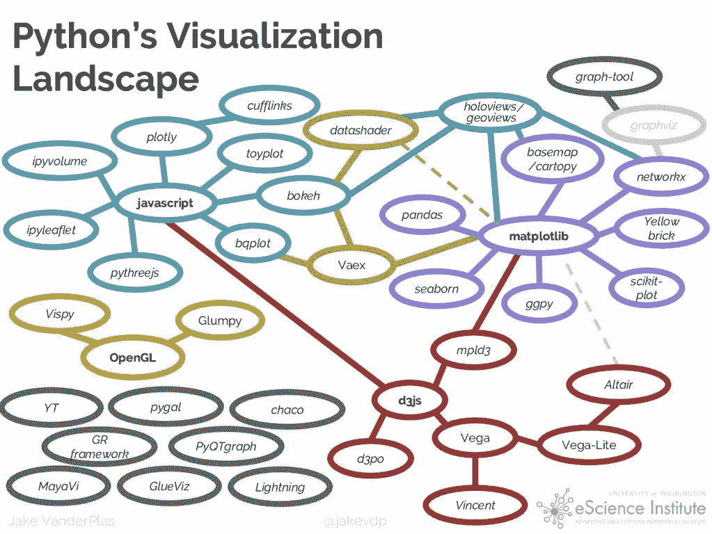

[Source](http://pyviz.org/tutorial/01_Workflow_Introduction.html)

现在，从所有这些工具中选择最适合我们工作的工具有点棘手和令人困惑。PyViz 试图堵住这种情况。它有助于简化在 web 浏览器中处理小型和大型数据集(从几个点到几十亿)的过程，无论是进行探索性分析、制作简单的基于小部件的工具还是构建功能全面的仪表板

# PyViz 生态系统

PyViz 是一个协调的努力，使 Python 中的数据可视化更容易使用、学习和更强大。PyViz 由一组开源 Python 包组成，可以在 web 浏览器中轻松处理大小数据集。PyViz 只是像 EDA 这样简单的东西或者像创建一个支持小部件的仪表板这样复杂的东西的选择。

> **这是 Python 使用 PyViz 的可视化景观。**

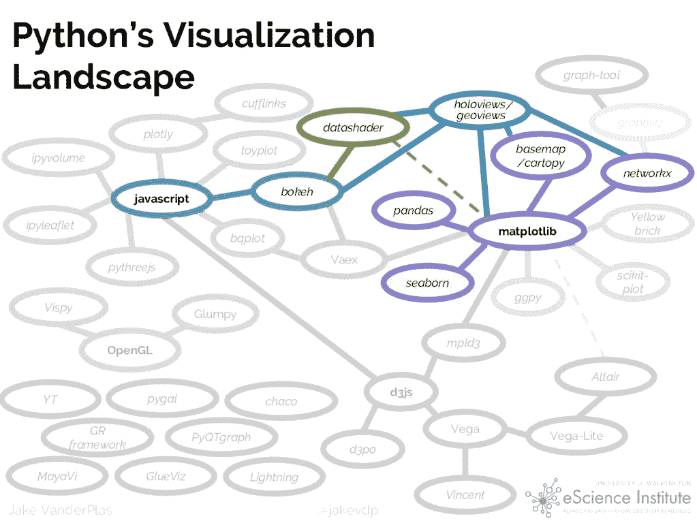

[source](http://pyviz.org/tutorial/01_Workflow_Introduction.html)

# PyViz 目标

Pyviz 的一些重要目标是:

*   重点应该放在没有编码的任何大小的数据上
*   完整的功能和交互性应该可以在浏览器(而不是桌面)中获得
*   重点应该更多地放在 Python 用户而不是 web 程序员身上。
*   再次强调，我们应该更多地关注 2D，而不是 3D。
*   利用 Python 用户已经熟悉的通用 SciPy/PyData 工具。

# 图书馆

构成 PyViz 的开源[库](http://pyviz.org/background.html)有:


*   [](http://holoviews.org/)**:用于即时可视化数据的声明性对象，从方便的高级规范构建散景图**
*   **[**【geo views】**](http://geo.holoviews.org/):可与 HoloViews 对象混合匹配的可视化地理数据**
*   **[**散景**](http://bokeh.pydata.org/):web 浏览器中的交互式绘图，运行 JavaScript 但受 Python 控制**
*   **[**面板**](http://panel.pyviz.org/) :将许多不同库中的对象组装到一个布局或应用程序中，无论是在 Jupyter 笔记本中还是在独立的可服务仪表板中**
*   **[**Datashader**](http://datashader.org/) :将庞大的数据集快速栅格化为固定大小的图像**
*   **[**hvPlot**](http://hvplot.pyviz.org/) :从你的熊猫、Xarray 或其他数据结构中快速返回交互式全息视图或地理视图对象**
*   **[**Param**](http://param.pyviz.org/) :声明与用户相关的参数，使得在笔记本上下文内外使用小部件变得简单**

**除此之外，PyViz 核心工具可以与以下库无缝协作。**

************

**此外，几乎所有其他绘图库中的对象都可以与 [**面板**](https://panel.pyviz.org/) 一起使用，包括对这里列出的所有对象的特定支持，以及任何可以生成 HTML、PNG 或 SVG 的对象。 **HoloViews** 也支持 [**Plotly**](https://plot.ly/) 进行 3D 可视化。**

# **资源**

**PyViz 提供了示例、演示和培训材料，记录了如何解决可视化问题。本教程为解决您自己的可视化问题提供了起点。整个教程材料也存放在他们的 [Github 仓库](https://github.com/pyviz/pyviz)中。**

**[](http://pyviz.org/tutorial/index.html#) [## PyViz 教程— PyViz 0.9.13a3 文档

### 如何用 Python 工具解决可视化问题？

pyviz.org](http://pyviz.org/tutorial/index.html#)** 

# **装置**

**请咨询[pyviz.org](https://pyviz.org)获取这些教程中使用的软件安装的完整说明。假设你已经下载并安装了 [Anaconda](https://www.anaconda.com/download) 或 [Miniconda](https://conda.io/miniconda.html) ，以下是这些指令的精简版:**

```
**conda create -n pyviz-tutorial python=3.6
conda activate pyviz-tutorial
conda install -c pyviz/label/dev pyviz
pyviz examples
cd pyviz-examples
jupyter notebook**
```

**一旦安装完毕，下面的单元格应该会显示“1.11.0a4”或更高版本:**

```
**import** **holoviews** **as** **hv**
hv.__version__'1.11.0a11'hv.extension('bokeh', 'matplotlib')
#should see the HoloViews, Bokeh, and Matplotlib logos**#Import necessary libraries
import** **pandas**
**import** **datashader**
**import** **dask**
**import** **geoviews**
**import** **bokeh**
```

**如果它没有错误地完成，您的环境应该准备好了。**

# **使用 PyViz 探索数据**

**在这一节中，我们将看到不同的库如何有效地从数据中获得不同的见解，它们的结合确实有助于以更好的方式分析数据。**

## **资料组**

**正在使用的数据集与美国各州每 10 万人中记录的[麻疹和百日咳病例数](http://graphics.wsj.com/infectious-diseases-and-vaccines/#b02g20t20w15)有关。数据集预装在 PyViz 教程中。**

## **熊猫的数据探索**

**在任何数据科学项目中，从熊猫开始探索是很自然的。让我们导入并显示数据集的前几行。**

```
**import** **pandas** **as** **pd**diseases_data = pd.read_csv('../data/diseases.csv.gz')
diseases_data.head()
```

****

**数字是好的，但图表会让我们对数据中的模式有更好的了解。**

## **使用 Matplotlib 进行数据探索**

```
**%matplotlib inline****diseases_data.plot();**
```

**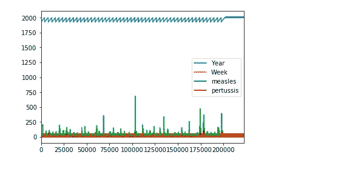**

**这个传达的不多。让我们对熊猫进行一些操作，以获得有意义的结果。**

```
**import numpy as np****diseases_by_year = diseases_data[["Year","measles"]].groupby("Year").aggregate(np.sum)****diseases_by_year.plot();**
```

**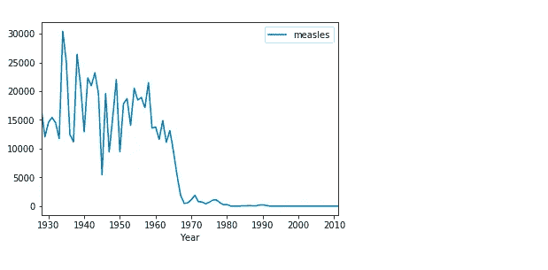**

**这更有意义。在这里，我们可以清楚地推断出，在 1970 年左右，发生了一些事情，使麻疹发病率下降到几乎为零。这是事实，因为麻疹疫苗在 1963 年左右被引入美国**

## **使用 HVPlot 和散景进行数据探索**

**上面的图传达了正确的信息，但没有提供交互性。这是因为它们是静态图，没有 web 浏览器中的平移、悬停或缩放功能。然而，我们可以通过简单地导入 `**hvplot**`包来实现这种交互功能。**

```
**import hvplot.pandas****diseases_by_year.hvplot()**
```

**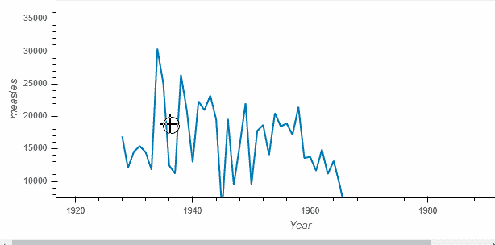**

**该调用返回的内容被称为一个 [**全息视图**](http://holoviews.org/) 对象(此处为全息视图[曲线](http://holoviews.org/reference/elements/bokeh/Curve.html)),其中*将*显示为散景图。Holoviews 图丰富得多，在探索数据时很容易捕捉到您的理解。**

**让我们看看 HoloViews 还能做些什么:**

## **捕捉情节本身的要点**

**1963 年对麻疹来说很重要，我们把这一点记录在图表上怎么样。这也将有助于我们比较接种疫苗前后的麻疹病例数。**

```
**import holoviews as hv
vline = hv.VLine(1963).options(color='red')****vaccination_introduced = diseases_by_year.hvplot() * vline * \
    hv.Text(1963, 27000, "Measles Vaccine Introduced", halign='left')****vaccination_introduced**
```

**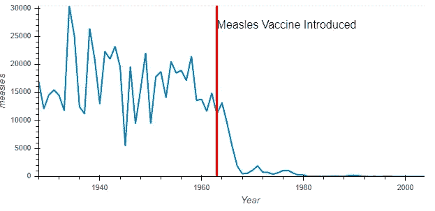**

**与其他绘图库不同，Holoviews 对象保留原始数据。例如，可以访问表格格式的原始数据。**

```
**print(vaccination_introduced)
vaccination_introduced.Curve.I.data.head()**
```

**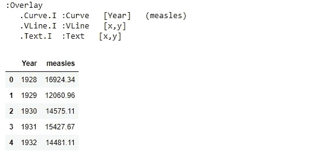**

**在这里，我们能够使用用于绘制图表的数据。此外，现在很容易以多种不同的方式分解数据。**

```
**measles_agg = diseases_data.groupby(['Year', 'State'])['measles'].sum()
by_state = measles_agg.hvplot('Year', groupby='State', width=500, dynamic=False)****by_state * vline**
```

**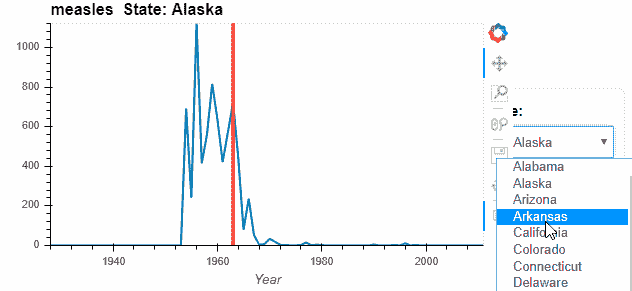**

**为了更好地比较，我们可以将图表并排放置，而不是下拉列表。**

```
**by_state["Alabama"].relabel('Alabama') + by_state["Florida"].relabel('Florida')**
```

**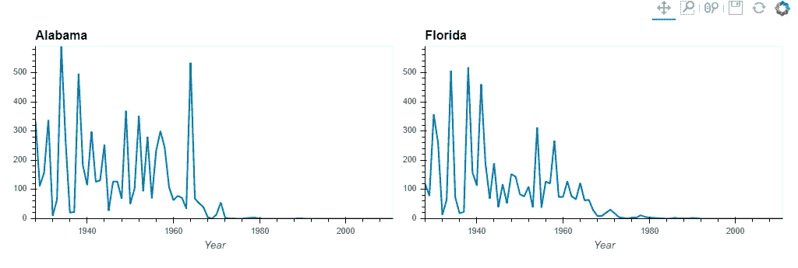**

**我们也可以改变图的类型，比如说条形图。让我们比较四个州从 1980 年到 1985 年的麻疹模式。**

```
**states = ['New York', 'Alabama', 'California', 'Florida']
measles_agg.loc[1980:1990, states].hvplot.bar('Year', by='State', rot=90)**
```

**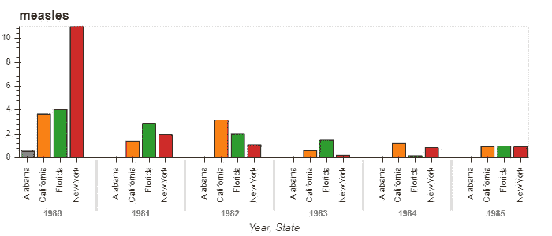**

**从上面的例子中可以明显看出，通过选择**全息视图+散景**图，我们能够在浏览器中探索数据，具有完全的交互性和最少的代码。**

## **用 PyViz 可视化大型数据集**

**PyViz 还支持轻松处理非常大的数据集。对于这样的数据集，PyViz 套件的其他成员也参与进来。**

*   **[**地景**](http://geoviews.org/)**
*   **[**数据着色器**](http://datashader.org/)**
*   **[**面板**](https://panel.pyviz.org/)**
*   **[**参数**](https://param.pyviz.org/)**
*   **[**色彩**](https://colorcet.pyviz.org/) **用于**感知上统一的大数据色彩映射表**

**为了向您展示这些库在处理大量数据时的能力，让我们使用 NYC taxi 数据集，该数据集包含与多达 1000 万次出租车出行相关的数据。这个数据已经在教程中提供了。**

```
**#Importing the necessary libraries**import dask.dataframe as dd, geoviews as gv, cartopy.crs as crs
from colorcet import fire
from holoviews.operation.datashader import datashade
from geoviews.tile_sources import EsriImagery
```

**[**Dask**](http://docs.dask.org/en/latest/) 是 Python 中一个灵活的并行计算库。Dask 数据帧是一个大型并行数据帧，由许多较小的 Pandas 数据帧组成，沿索引拆分。这些 Pandas 数据帧可能存在于磁盘上，用于单台机器或集群中许多不同机器上的大内存计算。一个 Dask 数据帧操作触发对组成 Pandas 数据帧的许多操作。**

**[**Cartopy**](https://scitools.org.uk/cartopy/docs/latest/) 是一个 Python 包，设计用于地理空间数据处理，以生成地图和其他地理空间数据分析。**

```
**topts = dict(width=700, height=600, bgcolor='black', xaxis=None, yaxis=None, show_grid=False)
tiles = EsriImagery.clone(crs=crs.GOOGLE_MERCATOR).options(**topts)****dopts = dict(width=1000, height=600, x_sampling=0.5, y_sampling=0.5)**
```

**读入并绘制数据:**

```
**taxi  = dd.read_parquet('../data/nyc_taxi_wide.parq').persist()
pts   = hv.Points(taxi, ['pickup_x', 'pickup_y'])
trips = datashade(pts, cmap=fire, **dopts)****tiles * trips**
```

**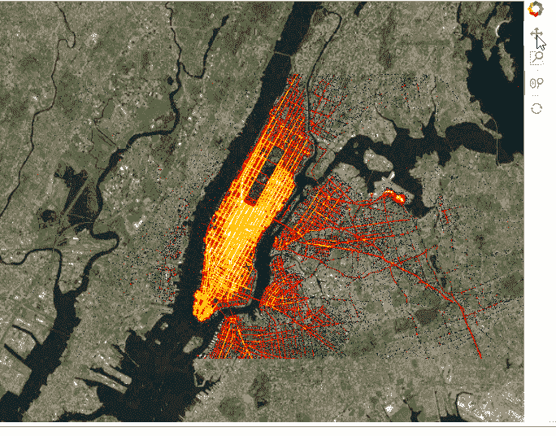**

**我们还可以添加[小部件](http://pyviz.org/tutorial/01_Workflow_Introduction.html)来控制选择。这既可以在笔记本中完成，也可以在独立的服务器中完成，方法是用`.servable()`标记可服务对象，然后运行。ipynb 文件或通过散景服务器提取代码到一个单独的。py 文件并做同样的事情:**

```
**import param, panel as pn
from colorcet import palette****class NYCTaxi(param.Parameterized):
    alpha = param.Magnitude(default=0.75, doc="Map tile opacity")
    cmap = param.ObjectSelector('fire', objects=['fire','bgy','bgyw','bmy','gray','kbc'])
    location = param.ObjectSelector(default='dropoff', objects=['dropoff', 'pickup'])** **def make_view(self, **kwargs):
        pts   = hv.Points(taxi, [self.location+'_x', self.location+'_y'])
        trips = datashade(pts, cmap=palette[self.cmap], **dopts)
        return tiles.options(alpha=self.alpha) * trips****explorer = NYCTaxi(name="Taxi explorer")
pn.Row(explorer.param, explorer.make_view).servable()**
```

****出租车探险家****

**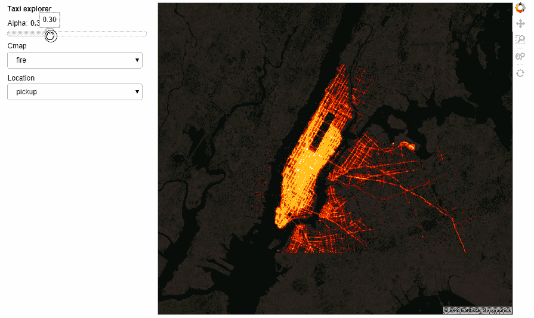**

**所有运行代码的笔记本可以从[这里](https://github.com/parulnith/Data-Visualisation-libraries/tree/master/Data%20Visualisation%20with%20PyViz)访问。然而，交互性并没有在 GitHub 上表现出来，但是你仍然可以访问笔记本并在本地运行。**

# **结论**

**PyViz 工具可以帮助我们用少量的代码创建漂亮的可视化效果。PyViz 工具捆绑在一起构建高性能、可伸缩、灵活和可部署的可视化、应用程序和仪表板，而无需显式使用 JavaScript 或其他 web 技术。本文只是对多用途 PyViz 生态系统的简单介绍。浏览整个教程，了解不同类型数据的复杂性及其用法。**