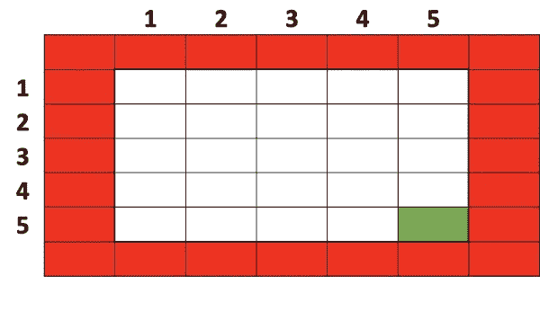
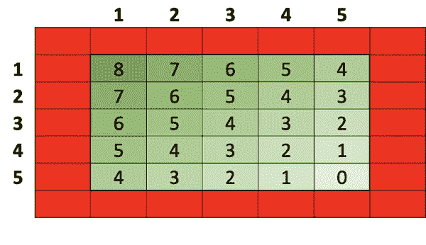
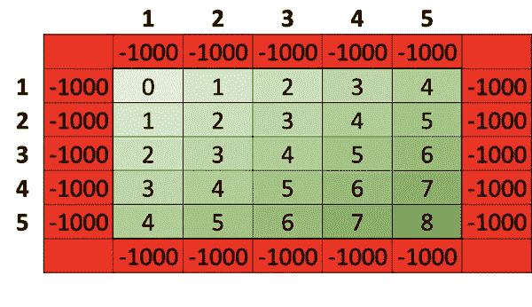
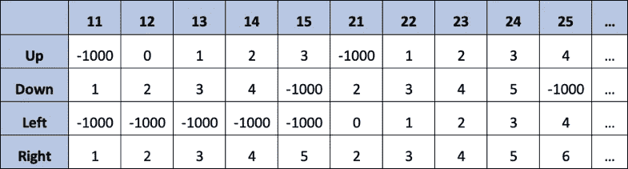
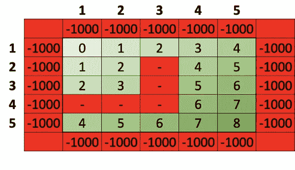
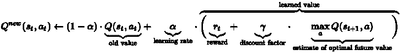
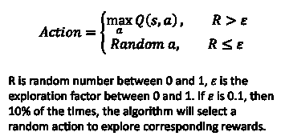
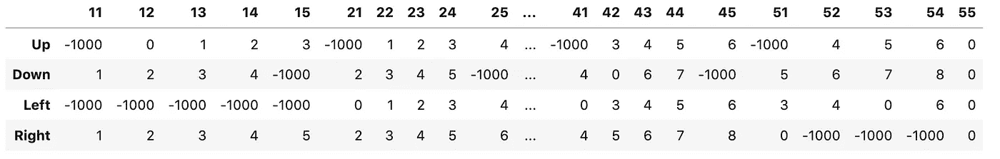
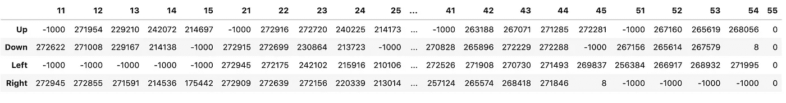
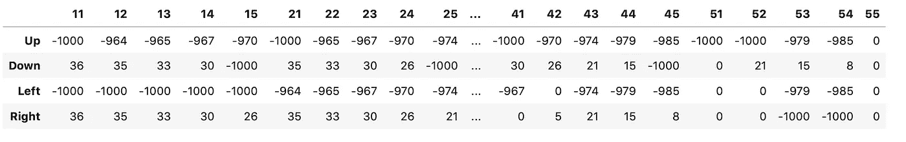

# q 学习

> 原文：<https://towardsdatascience.com/q-learning-54b841f3f9e4?source=collection_archive---------4----------------------->

## 通过一个简单的基于表的实施介绍学习率、折扣系数和探索

Q-learning 是最流行的强化学习算法之一，与搜索大量论文和文章相比，它更容易通过实现玩具问题来学习。

这是一个使用 Q-learning 表实现的概念的简单介绍。我将设置我们正在做的事情的背景，建立一个玩具游戏来进行实验，定义 Q-learning 算法，提供 101 实现并探索概念——所有这些都在一个任何人都可以跟随的希望很短的帖子中。

## 问题是

我们需要一种算法来学习(1)一种政策(2)，它将告诉我们如何在不同的情况下(5)与环境(4)进行交互(3)，以最大化回报(6)。

(1)学习——这意味着我们不应该手工编码任何特定的策略，而是算法应该自己学习。

(2)政策——这是学习的结果。给定一个*环境的*状态*，*政策会告诉我们如何最好地*与之互动*，从而最大化*回报*。

(3)互动——这只不过是算法应该建议我们在不同情况下采取的“行动”。

(4)环境——这是算法与之交互的黑盒。这是一场它理应获胜的比赛。这就是我们生活的世界。是宇宙，所有的太阳、星星和其他一切可以影响环境的东西，以及它对所采取的行动的反应。

(5)环境——这些是环境可能处于的不同“状态”。

(6)奖励——这是目标。与环境互动的目的。玩游戏的目的。

如果无人驾驶汽车是问题所在，那么行动就是我们驾驶的方式，比如转向、刹车等等。奖励就是安全到达目的地。道路、车道、其他车辆和人、光线条件、交通规则、路标和其他一切都是环境。在某个时间点拍摄所有这些的快照，这就是环境的状态。

但这不是我们在这个例子中要用的例子。我们要一个简单得多的。

## 游戏

想象一个有 5 行 5 列的棋盘——图 1 中所有的白色单元。我们可以从任何一个白细胞开始。目标是尽可能少的走几步，到达右下角的绿色单元格(5，5)。我们可以向上、向下、向左或向右走。我们一次只能走一步。我们不能从棋盘上掉下来，也就是说，进入红细胞，如果我们这样做，我们就会死，我们就会输掉比赛。

**Fig 1:** The Game

## 让我们手动制定策略

在潜入可以学习一个有效玩这个游戏的算法之前，我们先来运筹帷幄如何手动玩。给定一个起始位置，我们如何决定向哪个方向移动？嗯，我们将朝着我们的目标前进，而不是远离它。

那么我们如何量化这个“走向”和“远离”的概念呢？我们可以从给所有单元分配一个“距离”值开始。离我们的最终状态目标单元格(5，5)最远的单元格是(1，1) —对角线上的单元格。使用我们可以执行的四个动作(即向上、向下、向左或向右移动)，从(1，1)到(5，5)至少需要 8 个步骤。我们把它的值定为 8。图 2 为每隔一个单元提供了与目标单元的距离的类似注释。

**Fig 2:** The Game, annotated with distance

但是 Q-learning 和强化学习一般是关于选择一个给我们最大回报的行动。在这里，奖励是距离的倒数——代表我们离目标有多近，而不是我们离目标有多远。此外，在这里发车意味着我们输了，因此应该受到处罚。图 3 进行了这些调整，并提供了与每个单元格相关的奖励(和惩罚)的修订视图。

**Fig 3:** The Game with rewards and penalties

让我们将图 3 中的内容展开成一个“动作与状态”的表格。这个扩展的“动作对状态”表示就是 Q 学习表。这个表和表中的值是我们的算法应该得到的。

**Fig 4:** Q-Learning table of Actions vs States

## 一些细微差别

现在我们已经有了一些奖励的概念，让我们更仔细地看看几个要点。

首先，总报酬的期望值，即 Q 值，实际上是从当前状态开始，在所有可能的连续步骤中总报酬的期望值。而我们上面贴的，其实就是基于那个特定小区距离的奖励，也就是“即时奖励”。我们将在稍后的实现过程中注意到，只有当我们要求算法显式忽略未来奖励时，才会导出图 4 中描绘的值。

碰巧的是，在这个玩具的例子中，迈出回报最大的一步也能获得最大的回报。在其他不那么好玩的例子中，短期回报较低的行动可能会产生长期的最大回报。

为了证明这一点，在我们的玩具示例中，假设我们在(2，2)中，并想象在板的中间有一个障碍物，如图 5 所示。

**Fig 5:** Actions with lower immediate rewards could still yield max overall rewards

所以实际上，从当前动作将导致的给定的下一个状态，我们必须遍历后续动作和状态的所有可能轨迹，以获得当前动作的真实 Q 值。

第二，我们在图 3 和图 4 中看到的并不是一个完美的奖励系统。以“奖励最大化”为目标，该算法可能会学习在通往目标单元的路上无限或长时间地遍历绿色单元，以积累许多奖励点，而不是最短路径。

但是考虑到这里的目的是使用一个玩具问题来学习概念，我暂时不会太在意这种细微差别，但是理想情况下远离目标应该受到负奖励的惩罚(例如，从 42 移动到 41 不应该得到“3”，这是一个较低的奖励，而是一个更大的惩罚，如-1000)。

## 该算法

让我们回到我们的目标，定义一个算法来学习“最优策略”，即告诉我们在游戏的当前状态下应该采取什么行动的东西。

图 4 中看到的 Q 学习表将首先被初始化为 0 或某个其它值，并且 Q 学习算法的目标将是学习将被填充到该表中的最佳值，使得在学习结束时，人们可以简单地查看给定状态的表，并且选择具有最大值的动作，这将最大化赢得游戏的机会。

Q-learning 算法通过多次玩游戏来做到这一点，在每场游戏的每一步结束时，我们研究我们获得的奖励，并使用上面的算法来不断更新表格。最终我们会得出一组最优值。下面粘贴的是维基百科来源的 Q-learning 算法的图像，详细说明了我们如何进行这些更新。

**Fig 6:** Q-Learning algorithm from [Wikipedia](https://en.wikipedia.org/wiki/Q-learning)

在学习期间进行移动之后，给定状态和动作的 Q 值被新值取代。

新值是两部分的和。第一部分是(1-学习率)*旧值。这就是我们保留的旧价值。学习率为 0 意味着不会学到任何新东西。学习率为 1 意味着旧值将被完全丢弃。

第二部分是学习率*(行动的即时回报+最优未来值的贴现估计)。如上所述的学习率决定了将使用多少新的学习值。学习价值是即时回报和最优未来价值的贴现估计值之和。折扣系数决定了未来奖励的重要性。当设置为 0 时，我们将只考虑即时奖励，1 将使算法完全接受。

图 6 中还没有提到探索的概念。也许在最初的几次尝试中，算法会发现给定状态的特定行为是有回报的。如果它一直选择最大回报动作，那么它将继续执行相同的动作，不会尝试任何其他动作，也许其他未尝试的动作会有比这更好的回报。

我们通过引入一个探索因子来处理这个问题，该因子将使算法以预定的%的次数选择一个随机动作，如下图 7 所示。

**Fig 7:** Exploration

## 实施

这是上面提到的 Q 学习算法的一个非常简单的实现。导入相关包后，“Game”类代表我们的玩具游戏。它有一个简单的“移动”功能，将“方向”作为输入，并根据上述奖励和规则，返回移动的奖励和游戏结束指示符。

接下来，我们定义并初始化 Q 表、学习率、折扣因子和探索因子。我们有一个循环来玩这个游戏很多次。每局游戏进行到结束，每一步都是最大 Q 值动作(1-探索系数)次，否则是随机动作。在每次移动之后，除了终端状态之外，我们按照算法中的描述更新旧的 Q 值。

## 结果和观察

我特意将学习率设为 1，折扣因子设为 0。这将确保每次移动后初始值的完全替换，并且只考虑即时奖励。如果您还记得前面讨论的第一个细微差别，这个设置应该会产生一个类似于图 4 所示的 Q 表。

**Fig 8**: The results

另一方面，将贴现因子设置为 1，即当我们考虑所有的最优未来值时，我们开始面临第二个细微差别中描述的问题。也就是说，假设我们没有真正惩罚远离目标单元格的移动，算法倾向于在棋盘中停留更长的时间，以积累更多的奖励，从而产生真正大的 Q 值，如图 9 所示。

**Fig 9**: Results with discount factor of 1

这里有一个实现可以解决这个问题，如果我们离开目标单元格，它会提供-1000 的奖励。

我还将探索系数更新为 30%，并增加了 10K 训练游戏的数量，以更好地收敛，结果如图 10 所示。

**Fig 10**: Results with Game penalizing moving away from target

虽然实际值不同，但我们可以看到，早期状态的最大奖励行为与我们在图 8 中看到的相同。后来的国家似乎仍然不完全符合建议(见 51)，但这只是一个时间问题(或更多的试验)之前，他们这样做。毕竟，*Q*-在给定无限时间和部分随机策略的情况下，学习可以为任何有限马尔可夫决策过程识别出最优策略！

希望这不仅为 Q 学习和相关概念提供了一个良好的起点，而且随着这些概念的转移，也为深度 Q 学习和其他一般的强化学习算法提供了一个良好的起点。