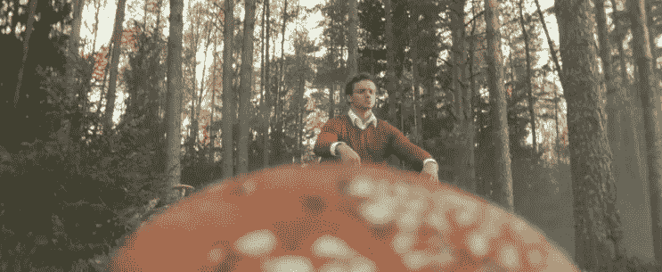

# 问答:机器学习和数据科学黑客马拉松

> 原文：<https://towardsdatascience.com/qa-machine-learning-data-science-hackathons-921985c9e87d?source=collection_archive---------21----------------------->

这是黑客马拉松三部曲的最后一部。[第一部分](/4-reasons-to-start-participating-in-data-science-hackathons-5d95d01a662d)是关于参与此类活动的动机。[第二部](/dark-side-of-data-science-hackathons-1879b201d40c)讲述了组织者的错误及其后果。最后一部分提供了所有剩余问题的答案，这在前两部分中是不合适的。

## 说说你的第一次黑客马拉松。

我是芬兰 Lappeenranta 技术大学的一名硕士学生，同时还参加了数据分析竞赛。我典型的一天是这样的:早上 8 点起床，在大学里呆上几个小时，参加各种比赛直到午夜。经过 3 个月如此紧张的日程安排，我成功赢得了 MERC-2017 数据分析比赛。因此，我的自信心增强了，所以我偶然发现了即将在莫斯科举行的 SkinHack 2 黑客马拉松。所以，我决定在一天内完成两件事——拜访我的父母，参加我的第一次黑客马拉松。

黑客马拉松有点搞笑。提供了两个数据分析跟踪，具有定义的指标和数据集。两条赛道的奖励金额约为 1.5 万€。第三轨道致力于应用程序的开发，奖励金额为 850€，但它没有任何参与者。因此，组织者说，带有按钮的无功能窗口的创造者可以获得 850€，因为提供的奖励金额应该支付。我没有学会如何创建应用程序(因为我不参加比赛，在这方面我很容易被打败)。但这是一个非常明显的迹象，表明黑客马拉松有很多机会。

> 组织者说，一个带有按钮的无功能窗口的创造者可以赢得 850€，因为提供的奖励金额应该支付。

然后，我通过单独分析数据来解决这两个问题。我发现了一个数据泄漏，这使我获得了一个理想的分数，但是有泄漏的列在测试数据中不存在，我在事件截止日期前两个小时获得了这些数据(顺便说一下，当时我确实知道训练数据集中的目标列不被认为是泄漏)。我的自由泄漏提交在五个团队中排名第三。为了避免浪费时间，我决定退出比赛，因为与第一场比赛的分数差距很大。

然后，当我用新的思维分析所有发生的事情时，我发现了很多错误(我用笔记本在脑海中滚动发生的事情，并分析错误、它们的原因和可以改变的事情。由于经常玩扑克，我养成了这样的习惯。但是我设法明确地认识到以下事实——黑客马拉松提供了多种价值，我必须实现它。然后我开始监控事件和团体，并继续参与黑客马拉松。

> 我习惯用笔记本在脑海中滚动发生的事情，并分析错误、它们的原因和可以改变的事情。由于经常玩扑克，我养成了这样的习惯。

## 为什么你会参与黑客马拉松而不是 Kaggle？

我不喜欢卡格尔。Kaggle 在没有特定参与理由的情况下获得了一定的技能等级后变得不那么有用。我早先参加了它，但是后来我发现了更有趣的活动。

## 你为什么选择黑客马拉松而不是宠物项目？

我有一个宠物项目的几个想法，我将稍后实现它。

## 有可能单独在黑客马拉松中获胜吗？如果我没有团队呢？

数据科学黑客马拉松提供了这样一个机会(我设法独自获胜)。至于产品，我不确定，但我认为也有可能。不幸的是，有时组织者会设定最低参赛人数。我猜原因是孤独者未能进入决赛(即他们一旦遇到第一个困难就离开比赛)，而团队参与则表现出更好的结果。此外，这样的事件意味着更进一步的项目开发，这在团队中更容易执行。

总的来说，我基于经验的建议是始终参与一个团队。活动组织者将帮助寻找或创建一个团队，如果你失败了。

## 你觉得这些活动怎么样？

我使用的主要来源是 hackathon.com(世界)和俄罗斯黑客(俄罗斯联邦)。对了，不是真正黑客的聊天。此外，活动公告也可以在社交网络(脸书、VK、LinkedIn)的广告中看到。关于即将举行的活动的信息也可以在这里找到:mlh.io，devpost.com，hackevents.co，hackalist.org，HackathonsNear.me，hackathon.io

## 参与前是否准备了一定的计划？例如，你会在黑客马拉松前一周考虑找一些专家吗？

我为产品黑客马拉松做准备。几周前，我想出了我的后续行动的想法，并找到了所需的专家，如果有的话，并组成我的朋友或过去的黑客马拉松成员团队一起参与。

## 你如何应对黑客马拉松中的疲劳？

通常提供 2 天工作时间，即 48 小时(30–48 小时，为简化计算，我们取 48 小时)。规定的睡眠时间是 16-20 小时，所以只有 30 小时可以工作。实际工作(即深度工作)的最大时间约为 8 小时。如果能够合理地组织自己的工作过程，你可以将这个数字增加到 12-14(适当的睡眠和食物，呼吸新鲜空气，进行体育锻炼，与团队进行正确的交流，转换活动，正念)。在 hackathon 完成这样的工作后，你会感到筋疲力尽，但这是一种愉快的疲劳。不睡觉和充满干扰的编码[肯定会导致失败](/why-you-should-not-code-30-hours-in-a-row-a3a471301826)，不满足和之后的坏心情。

> 在 hackathon 完成这样的工作后，你会感到筋疲力尽，但这是一种愉快的疲劳。

## 你有现成的黑客马拉松管道吗？你是如何设法创造它们的，它们是如何组织的(你有吗？将文件复制到单独的文件夹中，每个文件夹用于特定的任务，等等。)以及如何开始他们的创作？

我不使用完全现成的解决方案，这些方案可以从过去的黑客马拉松中获得。相反，我从过去的比赛中获得了自己的模型和管道列表。因此，我不必从头开始重新开发标准部分(例如，正确的目标编码或简单的神经网络来从文本中提取意图)，这将节省大量时间。

现在它看起来是这样的:我在 [GitHub](https://github.com/DenisVorotyntsev) 上有一个单独的私人回购，用于存储关于正在发生的事情的笔记本、脚本和小文档。此外，我已经为所有装箱的特性准备了一个单独的 repo(比如带有交叉验证的正确目标编码)。我不认为这是最好的解决方案，但目前为止它适合我。

我的建议是从将所有自己的代码保存在文件夹中以及创建简短的文档开始(为什么、什么、操作方式和结果)。

## 有可能在这么短的时间内从零开始建立 MVP 或者所有参与者都有现成的解决方案吗？

至于数据科学相关的项目——是的，有可能。至于 MVP，我觉得取决于两个因素:

●定位为产品的可行想法(即提供商业画布)。需要提供产品开发的原因和目标受众。有时，没有原型但基础良好的项目会获奖。不幸的是，许多参与者未能应对失败，并指责活动组织者自己的失败，同时在接下来的黑客马拉松中继续毫无意义的产品创作。

●提供某些指标，确认您是否可以创建产品(演示应用程序、代码、详细的渠道描述)。

所以，如果你能合理安排时间，这也是有可能的。有时团队带着现成的解决方案来参加黑客马拉松，试图让它适应组织者的任务。这样的团队在技术筛选中失败了，或者只是在黑客马拉松中实现的解决方案的一部分被考虑在内。我还没有看到这样的团队成功获胜的案例，但我想他们为了获得未来的价值([某些联系、数据集等)而参观这样的活动仍然是有益的。](/4-reasons-to-start-participating-in-data-science-hackathons-5d95d01a662d))。

> 不幸的是，许多参与者未能应对失败，并指责活动组织者自己的失败，同时在接下来的黑客马拉松中继续毫无意义的产品创作。

## 是否有一些将黑客马拉松项目投入生产或启动的例子？

是的。我参与了三个这样的案例。一次是我自己完成的，两次是别人完成的，基于想法和代码，都是在黑客马拉松中创建的。此外，我知道有几个团队作为顾问继续与该公司合作。我不知道最终的结果，但最有可能的是一些事情已经完全完成。我自己没有组织过创业公司，尽管我肯定有很多这样的例子。

## 如果你能回到过去并改变一些事情，你会给曾经参加过黑客马拉松的人提供什么建议？

●战术最重要。确保将每个解决方案作为完整的产品提供。如果有支付能力的目标受众不在场，创意、Jupyter 笔记本或算法都没有用。

●回答为什么？而不是什么？以及“怎么做？”在开始做某事之前。

●与团队一起参与。

## 黑客马拉松中最常见的食物是什么？

通常，黑客马拉松提供糟糕的一餐，即披萨、能量饮料、苏打水。几乎所有的食物都是以自助餐的形式提供的，所以总是要排很长的队。通常，晚上不提供这顿饭。虽然有一次在巴黎举行的比赛期间，晚上给我们提供了一顿饭，即薯条、甜甜圈和一杯可乐。所以，我来介绍一下组织者的心路历程:那么，程序员以前都是吃什么的？哦，对了！薯条、油炸圈饼——就这些。让我们给他们那些垃圾食物。第二天我问活动组织者是否可以提供其他东西，比如粥。但是他们没有回答，只是看着我，好像我很傻，问了这么愚蠢的问题。

> 那么，程序员以前都吃什么？哦，对了！薯条、油炸圈饼——就这些。让我们给他们那些垃圾食物

组织良好的黑客马拉松提供树食盒类型，即常规，素食和犹太餐。此外，他们还在冰箱里放了酸奶和麦片，供那些想在一天中吃一点的人使用。茶、咖啡和水是标准配置。对我来说，最好的例子之一是 Hack Moscow 2，它在 1C office 的餐厅为参与者提供罗宋汤和肉丸(俄罗斯灵魂食物)。

## 黑客马拉松的组织水平是否取决于组织者的专业领域(例如，最好的黑客马拉松是否真的是由顾问提供的)？

最好的黑客马拉松是由那些以前组织过或参加过的人组织的。也许，这是事件质量所依赖的唯一因素。

## 如何意识到是时候开始参加黑客马拉松了？

参观黑客马拉松的最佳时间是一年前。第二好的时间就是现在。所以，现在就开始参与吧。不要害怕:犯错并不断学习。即使是人类继轮子和爬树后最伟大的发明——神经网络，也无法在训练的第一阶段区分猫和狗。

> 参观黑客马拉松的最佳时间是一年前。第二好的时间就是现在。

## 哪些指标证实该事件不值得参与？

● **更清晰的任务描述**(与产品黑客马拉松相关)。如果在注册期间会给你一个明确的任务，你最好呆在家里。对我来说，我想不出任何一个好的黑客马拉松能在开始前提供规范。例如，好的黑客马拉松要求做一些与音频对话分析相关的事情，而坏的黑客马拉松要求开发一个应用程序，能够为每个人将对话分成两个独立的音频轨道。

● **小奖池**。如果被要求用人工智能为在线商店创建一个火绒，并且提供的第一名奖励仅为 500 欧元，而最小团队成员数量为 5 人，请确保避免浪费时间(是的，这是去年在慕尼黑举行的一次真实的黑客马拉松)。

● **缺少数据**(与数据科学黑客马拉松相关)。组织者通常提供基本的活动数据，有时也提供数据集样本。如果他们没有提供，在活动开始前询问。

● **新活动主办方**。一定要在活动开始前谷歌一下黑客马拉松的组织者。如果他们第一次组织这种类型的活动，很可能会出问题。但如果组织者和评审团成员已经举办过黑客马拉松，或者过去积极参与过，这是一个好迹象。

## 在一次黑客马拉松中，有人告诉我:你提供了最好的分数解决方案，但对我们来说，团队合作很重要。不幸的是，你独自工作。例如，如果你和某个学生或女孩一起参加，你可能会赢。你遇到过这样的不公吗？你是如何应对的？

是的，我见过不止一次。我以坚忍的态度对待发生的一切:我做了力所能及的一切。如果没有成功，那就随它去吧。

## 你为什么从事黑客马拉松？

一切都只是出于无聊。