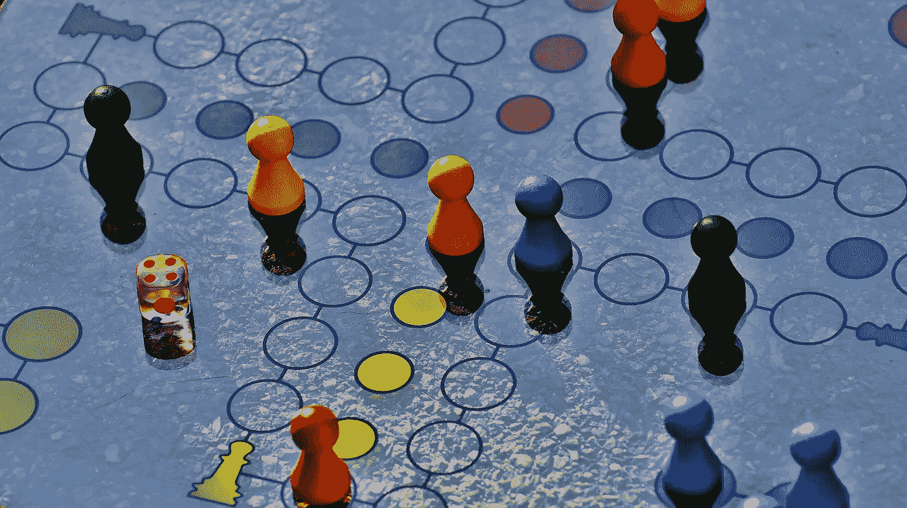
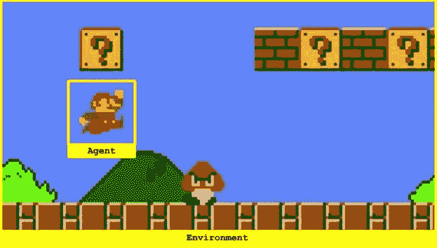
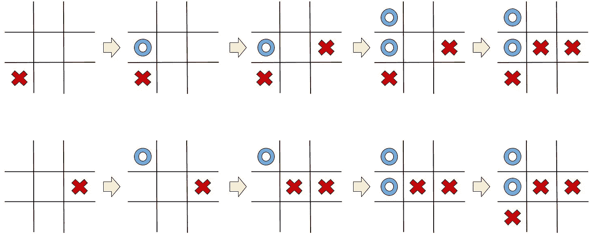
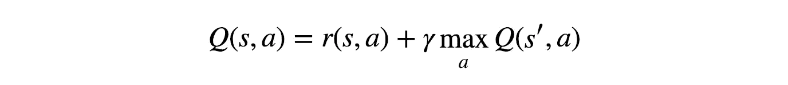
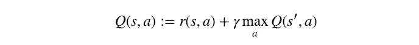
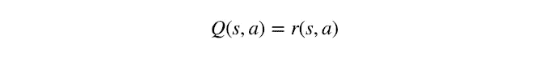
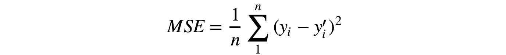
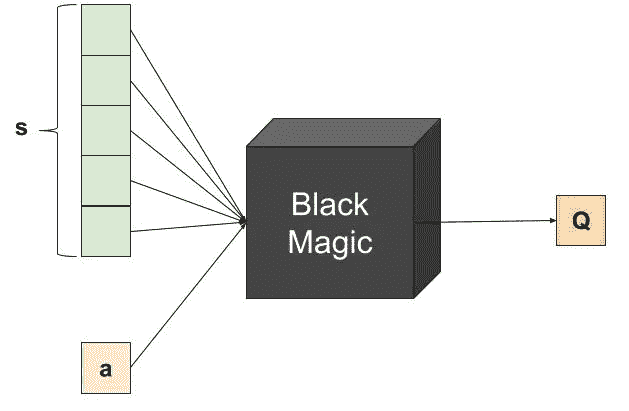
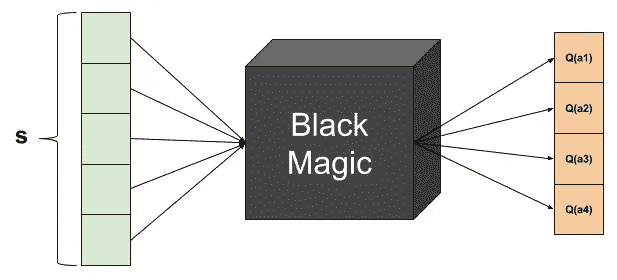
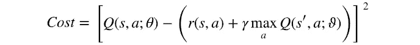

# Qrash 课程:10 分钟强化学习 101 和深度 Q 网络

> 原文：<https://towardsdatascience.com/qrash-course-deep-q-networks-from-the-ground-up-1bbda41d3677?source=collection_archive---------2----------------------->

## 从头开始学习强化学习和深度 Q 网络的基础知识

*这篇博文现在也有韩语版本，请在 jeinalog.tistory.com**上阅读*

****Qrash 课程系列:****

1.  **第 1 部分:强化学习和 Q 学习简介**
2.  **第二部分:* [*政策梯度和优评*](https://medium.com/@shakedzy/qrash-course-ii-from-q-learning-to-gradient-policy-actor-critic-in-12-minutes-8e8b47129c8c)*

**本文假设没有强化学习的先验知识，但是假设对神经网络有一些基本的了解。**

*在所有不同类型的机器学习领域中，最让我着迷的是强化学习。对于那些不太熟悉它的人来说，监督学习处理基于标记数据的预测值或类，而非监督学习处理聚类和在未标记数据中寻找关系，强化学习处理一些任意存在(正式称为“代理”)在给定环境中应该如何行动和表现。其方式是根据代理在不同场景下的表现给予奖励或惩罚。*

*我学到的第一个实用的强化学习方法是深度 Q 网络，我相信这是这个旅程的一个很好的开端。所以请允许我带你走一遍我尝试学习 RL 时走过的路——包括一个“Hello World”练习，它对我的帮助比我能解释的还要多。*

# *定义世界*

*强化学习任务是关于训练一个*代理*与其*环境*互动。通过执行*动作*，代理在环境的不同场景之间转换，称为*状态*。反过来，行动会产生*回报*，回报可能是正的、负的或零。代理的唯一目的是最大化它在*集*中收集的总奖励，这是在初始状态和结束状态之间发生的所有事情。因此，我们*通过提供正奖励来加强*代理执行某些行为，并通过提供负奖励来远离他人。这就是一个代理如何学习制定一个策略，或者一个*政策*。*

*以超级马里奥为例:马里奥是与世界(环境)交互的智能体。状态就是我们在屏幕上看到的，一集就是一个关卡:初始状态是关卡如何开始的，终结状态是关卡如何结束的，是我们完成了还是在尝试中灭亡了。动作有*前进、后退、跳跃*等。奖励取决于行动的结果:当马里奥收集硬币或奖金时，它会收到正奖励，当它倒下或被敌人击中时，它会收到负奖励。当马里奥只是四处好奇时，它得到的奖励是零，仿佛在说“你没做什么特别的事”。*

**

*In a Super Mario game, Mario is the Agent interacting with the world — the Environment*

*但这里有一个问题:为了能够收集奖励，需要采取一些“非特殊”的行动——你必须走向硬币，然后才能收集它们。因此，代理人必须学会如何处理*延迟奖励*，学会将这些与真正导致它们的行为联系起来。在我看来，这是强化学习最迷人的地方。*

# *马尔可夫决策过程*

*代理所处的每个状态都是前一个状态和所选动作的直接结果。前一个状态也是前一个状态的直接结果，如此类推，直到我们到达初始状态。这些步骤中的每一步，以及它们的顺序，都保存着关于当前状态的信息——因此对代理下一步应该选择哪个动作有直接的影响。但是这里有一个明显的问题:我们走得越远，代理在每一步需要保存和处理的信息就越多。这很容易达到执行计算根本不可行的程度。*

*为了解决这个问题，我们假设所有状态都是[马尔可夫状态](https://en.wikipedia.org/wiki/Markov_model)；也就是说——我们假设任何状态都只依赖于它之前的状态，以及从那个状态到当前状态的转换(执行的动作和给予的奖励)。让我们来看一个例子，看看这两个井字游戏:*

**

*两个游戏都达到了同样的境界，只是方式不同。尽管如此，在这两种情况下，蓝色玩家必须捕获右上角的单元格，否则他将失败。为了确定这是最后一个状态，我们只需要这个，不需要别的。*

*重要的是要记住，当使用马尔可夫假设时，数据*就是*丢失——在复杂的游戏中，如国际象棋或围棋，走法的顺序可能会有一些关于对手策略或思维方式的隐含信息。尽管如此，当试图计算长期战略时，马尔可夫状态假设是基本的。*

# *贝尔曼方程*

*让我们继续发展我们的第一个策略。考虑最简单的情况:假设我们已经知道每一步的每一个行动的预期回报是什么。在这种情况下，我们将如何选择行动？很简单——我们将选择最终会产生最高回报的行动顺序。我们将获得的这种累积奖励通常被称为 *Q 值*(质量值的缩写)，我们可以用数学方法将我们的策略形式化为:*

**

*The Bellman Equation*

*上面的等式表明，从处于状态 *s* 并选择动作 *a* 产生的 Q 值是收到的*即时奖励*、 *r(s，a)* ，加上状态*s’*可能的最高 Q 值(这是我们在从状态 *s* 采取动作 *a* 之后的状态)。通过选择最大化 Q 值的动作，我们将从*s’*获得最高的 Q 值。我们还引入了 *γ，*通常被称为*贴现因子*，它控制着长期回报相对于眼前回报的重要性。*

*这个方程被称为贝尔曼方程，它的[维基百科页面](https://en.wikipedia.org/wiki/Bellman_equation)提供了对其数学推导的全面解释。这个优雅的等式非常强大，对我们非常有用，因为它有两个重要的特征:*

1.  *虽然我们仍然保留马尔可夫状态假设，但是贝尔曼方程的递归性质允许来自未来状态的回报传播到遥远的过去状态。*
2.  *当我们开始的时候，没有必要知道什么是真正的 Q 值；由于它是递归的，我们可以猜测一些东西，它最终会收敛到真实值。*

# *q 学习*

*我们现在有了一个基本策略——在任何给定的状态下，执行最终会产生最高累积回报的行动。像这样的算法被称为*贪婪*，原因很明显。*

*我们如何实现这一点来解决现实生活中的挑战？一种方法是画一个表来存储所有可能的状态-动作组合，并用它来保存 Q 值。然后，我们可以使用贝尔曼方程作为更新规则来更新它:*

**

*Q Learning update rule. The “:=” notation is used here to explicitly mark *assignment* rather than *equality.**

*让我们看一个例子:*

**

*Q Learning table update demonstration*

*现在记住有些状态是终态。当代理达到 1 时，没有动作或状态转换是可能的。所以，如果未来状态*s’*是一个终态，我们就剩下:*

**

*Q Learning update rule for terminal state s’*

*还没有完成——我们的贪婪算法有一个严重的问题:如果你一直选择同样的最佳行动，你将永远不会尝试任何新的东西，并且你可能会错过一个更有回报的方法，仅仅因为你从来没有尝试过它。*

*为了解决这个问题，我们使用一种*ε-贪婪*方法:对于一些 *0 < ε < 1* ，*我们选择概率为 *p = 1-ε* 的*贪婪动作*，或者概率为 *p = ε的*随机动作*。因此，我们给代理一个机会去探索新的机会。***

这种算法被称为 *Q 学习*(或 *Q 表*)。恭喜你！你刚刚学会了你的第一个强化学习算法！

# 深度 Q 网络

你可能会问自己 Q 学习是如何扩展的——如果你没有，让我们一起来问:当状态和动作的数量变得非常大时会发生什么？这实际上并不罕见——即使是像井字游戏这样的简单游戏也有数百种不同的状态(尝试计算这一点),不要忘记我们将这个数字乘以 9，这是可能的操作数。那么我们将如何解决*真正*复杂的问题呢？

进入深度学习！我们把 Q 学习和深度学习结合起来，产生了*深度 Q 网络*。这个想法很简单:我们将用一个试图逼近 Q 值的神经网络来代替 Q 学习表。通常称为*逼近器*或*逼近函数*，记为 *Q(s，a；θ* ，其中 *θ* 表示网络的可训练权值。

现在只有使用贝尔曼方程作为成本函数才有意义——但是我们到底要最小化什么呢？让我们再来看一看:

“=”符号表示*赋值*，但是有没有条件也满足一个*等式*？是的，当 Q 值达到收敛的最终值时。这正是*我们的目标——因此我们可以最小化左侧和右侧之间的差异——还有，viola！我们的成本函数:*

DQN cost function

这看起来眼熟吗？大概——是均方误差函数，其中当前 Q 值是预测( *y* )，当下和未来的回报是目标(*y’*):

Mean square error function

这就是为什么 *Q(s)，a；θ* 通常被称为 *Q 目标*。

继续:训练。在强化学习中，训练集是在我们进行的过程中创建的；我们要求代理使用当前网络尝试并选择最佳行动——我们记录下*状态*、*行动*、*奖励*以及它结束时的*下一个状态*。我们决定一个批量大小 *b* ，每次 *b* 记录新记录后，我们随机选择 *b* 记录**(!！)*从记忆中，训练网络。使用的内存缓冲区通常被称为*体验回放。这种内存有几种类型——一种非常常见的是[循环内存缓冲区](https://en.wikipedia.org/wiki/Circular_buffer)。这确保代理保持对其新行为的训练，而不是可能不再相关的事情。**

*事情越来越真实，所以让我们谈谈架构:如果模仿一张桌子，网络应该接收状态和动作作为输入，并应该输出 Q 值:*

**

*虽然这是正确的，但从技术角度来看，这种架构是非常低效的。请注意，成本函数需要*最大*未来 Q 值，因此我们需要多次网络预测来进行单次成本计算。因此，我们可以使用以下架构:*

**

*这里，我们仅向网络提供状态 *s* 作为输入，并同时接收所有可能动作的 Q 值。好多了。*

*嗯，你知道吗——差不多就是这样。再次恭喜！你刚刚学会了如何设计一个深度 Q 网络！*

**

# *奖励—双重深度 Q 学习*

*在我们结束之前，这里有一些额外的东西:几段前我们比较了深度 Q 网络成本函数和均方误差。但是 MSE 将预测 *y* 与真实标签*y’—*进行比较，并且真实标签在整个训练过程中保持不变。显然，在深度 Q 网络中不是这种情况:网络本身预测了 *y* 和*y’*，因此可能在每次迭代中变化。影响显而易见。*

*介绍:[双深 Q 网络](https://arxiv.org/abs/1509.06461)，训练时使用半常数标签。怎么会？我们保留了 Q 网络的两个副本，但是只有一个被更新——另一个保持不变。不过，每隔一段时间，我们会用经过训练的 Q 网络的副本来替换常数网络，因此我们称之为“半常数”。所以:*

**

*DDQN cost function*

*这里， *ϑ* 表示半常数权重，所以*q(s’，a；ϑ)* 表示由半常数网络预测的 q 值。就这样，你做到了。*

# *你好世界！*

*我个人认为掌握新概念的最好方法是自己尝试去实现它们。为了尝试 Q 学习和深度 Q 网络，我编了一个简单的游戏:一个有 4 个槽的棋盘，要由代理来填充。当代理选择一个空位置时，它将获得+1 的奖励，并且该位置将被填满。如果它选择了一个非空的位置，它将获得-1 的奖励。当整个棋盘填满时，游戏结束。*

*试一试，尝试使用这两种方法实现一个学习掌握这个游戏的代理。你可以在这里找到我的尝试。*

*祝你好运，今天是第三次——祝贺你！*

**准备好自己尝试一些强化学习了吗？下面是我写的另一篇博文***，里面有一些实用的技巧。***