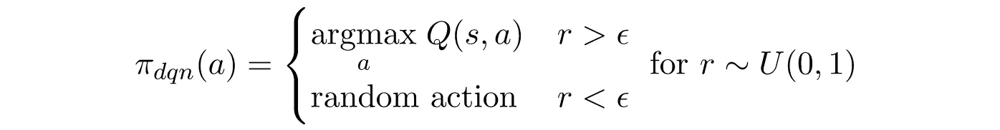

# Qrash 课程 II:12 分钟内从 Q-学习到梯度政策&行动者-批评家

> 原文：<https://towardsdatascience.com/qrash-course-ii-from-q-learning-to-gradient-policy-actor-critic-in-12-minutes-8e8b47129c8c?source=collection_archive---------3----------------------->

## 朝着真正理解强化学习的基础又迈进了一步

*本帖讨论的所有算法的实现都可以在* [*我的 GitHub 页面*](https://github.com/shakedzy/notebooks/tree/master/gradient_policy_and_actor_critic) *找到。*

**使用此** [**好友链接**](/qrash-course-ii-from-q-learning-to-gradient-policy-actor-critic-in-12-minutes-8e8b47129c8c?sk=77e4a62c7dd982d32d1034c151552271) 即使不是普通会员也可以阅读这篇博文

***Qrash 课程系列:***

1.  *第一部分:* [*强化学习和 Q-Learning 简介*](https://medium.com/@shakedzy/qrash-course-deep-q-networks-from-the-ground-up-1bbda41d3677)
2.  *第二部分:政策梯度和行动者-批评家*

之前——也是第一个——[Qrash 课程帖子](https://medium.com/@shakedzy/qrash-course-deep-q-networks-from-the-ground-up-1bbda41d3677)带我们从对强化学习一无所知一路走到完全理解 RL 最基础的算法之一: *Q 学习*，以及它的深度学习版本 *Deep Q-Network* 。继续我们的旅程，再介绍两个算法:*渐变策略*和*演员-评论家*。这两个人，加上 DQN，可能是现代深度强化学习最基本的组成部分。

# 为什么 Q-Learning 不够用？

我们可能应该问自己的第一个问题是*为什么*我们应该从 Q-Learning *前进？它在哪里失败或表现不佳？这个算法确实有一些缺陷，理解它们很重要:*

1.  **在大量操作中表现不佳:**让我们假设一个操作数量很大的环境。非常大，比如几千，甚至更多。使用*ε*-贪婪策略探索所有可能的动作可能会花费太长时间，并且该算法很容易收敛到局部最大值，而不是真正的最佳可能解决方案。不太好。
2.  **动作集合必须是有限的:**让我们把可能动作的数量拉伸到它的绝对极限:无限。这实际上很常见——想象一下一辆自动驾驶汽车，它的动作是转动方向盘的程度。这是一个连续的数字范围，因此是无限的。很明显为什么 Q 学习算法不能处理这种情况。
3.  **糟糕的探索策略:**我们来举个例子——假设一个环境中有 10 种不同的行动是可能的，一个 Q-学习代理使用一个*ε*-贪婪策略，其中 *ε* = 0.1。现在让我们假设行动#1 是在这个给定时刻具有最高 Q 值的行动。这意味着代理人有 91%的机会选择行动#1 (90%的机会选择贪婪行动+ 1%的机会随机选择这个行动)，而所有其他行动只有 1%的机会被选中。现在考虑这些 q 值: ***Q(s，a ) = 3.01，Q(s，a ) = 3.00，…，Q(s，a ⁰) = 0.03。*** 尽管行动#1 和#2 的 Q 值非常接近，但选择#1 而不是#2 的机会要大得多，正如刚才解释的那样。更糟糕的是，选择行动#2 和#10 的几率是完全一样的，尽管行动#2 实际上是百倍(！！)更好。现在结合第 1 节中的问题，您可以看到为什么在这种情况下这可能不是最好的算法。

我们应该如何处理这些情况？让我们来认识一下我们的救世主吧！

# 政策梯度

Q 学习算法通过试图找到每个状态的*动作值函数—*Q 值函数来学习。它的整个学习过程是基于计算出每个可能动作的*质量*的思想，并根据这些知识进行选择。因此，Q-Learning 试图对所有可能的动作有完整和公正的了解——这也是它最大的缺点，因为这需要对每个可能的状态和动作进行足够次数的尝试。策略梯度算法以更稳健的方式学习，通过*而不是*尝试评估每个动作的*值*——而是简单地评估它应该偏好哪个动作。

让我更好地说明一下:每个模型最终都有一些它试图优化的学习参数(这些通常是神经网络的权重)。让我们将这些参数表示为 **θ** 。在 DQN，学习周期是:

这意味着训练过程优化了网络的学习参数，然后用于计算 Q 值。然后，我们使用这些 Q 值来决定我们的策略π(其中*策略*就是每个行动被选择的概率)，DQN 的*ε-贪婪*策略取决于预测的 Q 值，因为它给具有最高 Q 值的行动最高的概率:

Policy of a Deep Q-Learning algorithm

策略梯度算法的学习周期更短，跳过了 Q 值部分:

这意味着网络将直接输出选择每个动作的概率，跳过额外的计算。这将允许该算法更加鲁棒。

我们现在剩下一个非常重要的问题— *我们如何优化网络的权重？*在 DQN，事情很简单:我们知道如何计算 Q 值，因此我们可以根据它们优化算法。但是我们现在做什么？我们的主要目标是确保模型在每个学习阶段后变得更好。让我们试着把这写成在每个时间步 *t* 的权重的一个非常通用的更新规则:

在这里，我们将 *J* 定义为一些*性能度量*，我们稍后会讲到，而 *α* 是学习率。我想花一点时间来澄清时间步长 *t* 和 *s* 之间的区别，时间步长 t 表示一集的*步*和*s*步*状态*。*状态*由环境定义，例如——所有可能的棋盘。*步骤*由代理定义，并标记它所经历的状态序列。这意味着步骤 *t=3* 和 *t=7* 可能是相同的状态 *s* ，因为一些环境允许代理多次返回完全相同的状态。另一方面，每集每一步只出现一次。步骤是按时间顺序排列的*时间顺序*。

让我们回到我们的更新规则，我们将它定义为依赖于新的 *J* 参数的*梯度*。虽然它可能对神经网络训练的反向传播阶段很熟悉，但这里有一个非常重要的区别:在梯度策略中，我们希望*提高*的性能，因此我们希望*最大化*对 *J* 的导数，而不是最小化它。这被称为梯度*上升—* 与反向传播中执行的梯度*下降*相反。其实也是差不多的逻辑，只是反过来而已。

## 设计我们的第一个梯度策略算法

在这一点上，很明显我们如何定义 *J* 将会有所不同，但是这也完全取决于 *us* 来决定什么是正确的定义。让我们尝试找到一些简单的东西——一些取决于 Q 值的东西(即使算法从来不会计算它)。回想一下，Q 值 *Q(s，a)* 是从状态 *s* 开始并在执行动作*a*之后，代理人应获得的所有奖励的度量，所有奖励的总和似乎是一个相当好的表现度量——毕竟，代理人的唯一目的是增加其收集的总奖励。因此，我们可以使用整个剧集的总累积奖励作为我们的绩效衡量标准:

这是初始状态 s⁰的所有 q 值的总和，乘以选择每个动作的概率。这正是我们期待的一整集的总体回报。现在，某一状态的所有 Q 值乘以它们的概率的总和有了一个名字:它被称为状态的值函数，并被表示为 *V(s)* 。一个状态的价值函数是从状态 *s* 到这一集结束的预期回报的度量，而不知道将选择哪个行动。所以我们基本上将初始状态的价值函数定义为我们的性能度量: *J = V(s⁰)* 。

现在我们有了 *J* ，我们需要计算它的梯度。这涉及到一些复杂的数学问题，因为 *J* 依赖于行动选择的概率*p(a)*哪个是从策略 *π —* 中派生出来的，但是π依赖于 *J* ，因为这是我们如何定义它的。你可以在萨顿·巴尔托的《强化学习导论》中找到完整的数学推导。)，第 325–327 页(这里有一个[免费网络版](http://www.andrew.cmu.edu/course/10-703/textbook/BartoSutton.pdf))。我在这里跳过它，写下解决方案:

其中 *G_t* 是从步骤 *t* 到该集结束的总累积奖励。这意味着我们的 **θ** 的更新规则是:

对一项政策进行对数运算可能看起来令人生畏或者很奇怪——但这只是我们需要应用的另一个数学函数，仅此而已。

## 勘探和开发

我想再次强调策略梯度算法的一个重要特性——它直接学习策略*。这意味着网络的输入是当前状态 *s* ，输出是选择每个动作的概率:*

**

*那么我们实际上如何选择一个动作呢？我们简单地对动作进行加权采样。这也解决了我们探索的需要——每个行动都有被选中的机会，但不是均等的，因为最好的行动最有可能被选中。*

## *培养*

*与 Q-Learning 不同，Policy Gradient 算法是一种 *on-policy* 算法，这意味着它只使用当前活动策略进行的状态-动作转换进行学习。从技术上来说，这意味着没有像 DQN 那样的经验回放记忆。一旦模型被训练，它的 **θ** 参数会改变，因此它的策略也会改变。这意味着在这次训练之前收集的所有经验必须被丢弃，并且不能再用于训练。所以我们为训练收集的每一条数据都被使用一次，而且只有一次。*

## *梯度政策在起作用*

*虽然在这一点上一般的想法有望被理解，但是举例总是更好。使用强化学习解决的一个非常受欢迎的任务是车杆问题:一辆可以向左或向右移动的车，需要确保站在它上面的杆不会倒下。这是我对这个挑战的解决方案。你也试着去实现它。*

**

*Cart-Pole*

# *演员兼评论家*

*让我们花一分钟的时间来认识到目前为止我们已经开发了什么:我们现在有一个代理，它学习一个策略，而不需要学习每个动作的实际值。它真正需要的唯一东西是一些*性能*指标，它将试图最大化——在我们的例子中，我们选择了一整集的总预期回报。*

*这种方法的好处很简单——不需要访问和尝试每一个可能的状态-动作对，因为代理对它应该做什么产生了某种“直觉”。但是由于代理对其性能度量的绝对依赖性，这带来了一个缺点。让我们考虑一下我们的例子，我们选择了一集的总体回报作为表现:考虑一集采取了一百步。每一步产生+10 的奖励，但是第 47 步产生-100 的奖励。我们选择的绩效衡量标准无法区分这个陷阱，因为它只知道总体回报。这意味着当我们的代理到达第 47 步时，它可能永远不会尝试另一个动作，因为它不会学习任何特定于状态和动作的知识。*

*我们如何解决这个问题？我们希望有一个智能体，一方面，以类似于梯度策略方法的方式学习策略，尽管另一方面，我们理解特定于状态和特定于动作的知识的重要性，就像 Q 学习方法一样。解决办法？将两者结合在一起。*

*这种组合方法被称为行动者-批评家，由两个*子代理*一起学习组成:一个学习应该采取行动的政策(因此被称为行动者)，另一个学习每个状态和行动的 Q 值(因此被称为批评家)。然后，我们将 **θ** 的更新规则改为:*

**

*请注意，我们只是用 Q 值替换了总报酬 *G* ，但是 Q 值现在也是一个学习参数——由第二个子代理学习。这产生了稍微复杂一点的架构:*

**

*A schematic view of an Actor-Critic architecture. Dashed lines represent flows only relevant during training, so during inference (prediction) phase, only the Actor is being used*

*请注意，就像策略梯度一样，行动者-批评者也是基于策略的模型——这再次意味着在每次训练之后，所有以前的训练数据都将被丢弃。*

*仅此而已。你猜对了！你现在可以尝试自己实现一个演员评论家，或者看看我的实现解决 [Acrobot](https://gym.openai.com/envs/Acrobot-v1/) 挑战。*

# *A2C、A3C 和 DDPG*

*这里我们已经做得差不多了，但是让我们再往前走一步，了解一些对我们的演员评论家代理非常有用的优化。*

## *A2C*

*回想一下，我们现在在更新规则中使用 Q 值，以便允许代理拥有一些特定于状态-动作的知识。现在让我问你一个问题: *Q(s，a)=100* 是不是一个好的 Q 值？答案是— *我们不知道。*我们不知道，因为我们没有关于*其他*可能行动的 Q 值的信息。如果所有其他动作产生的 Q 值为 1，那么 100 真的非常好。但是如果所有其他的都产生 10，000，那么 100 实际上是相当糟糕的。这不仅让你困惑，也让模型困惑。如果知道某个动作*与休息*相比有多好，或者换句话说，采取某个特定动作的*优势*是什么，将会很有帮助。因此，我们可以用一个动作的优势替换演员-评论家更新规则中的 Q 值，其定义为:*

**

*其中 *V(s)* 是状态的价值函数，我们之前已经讨论过了。学习一个动作的优点要容易得多——积极的 *A(s，a)* 是好的，消极的是不好的。这种演员-评论家模型的变体被称为优势演员-评论家，缩写为 AAC，或者更常见的是:A2C(这只是一种有趣的写法，有两个 a 和一个 C)。*

*你可能会注意到 A2C 版本似乎让学习变得更复杂了，因为现在代理需要学习 *Q(s，a)* 和 *V(s)* 。但事实并非如此。如果 Q 值是从状态 *s* 和动作 *a* 收到的奖励，然后一直持续到该集结束，我们可以这样写:*

**

*意思是——一个 Q 值实际上是直接回报 *r* 和下一个状态的值*s’*。这意味着我们可以将优势写成:*

**

*所以我们实际上只需要学习值函数，并使用它两次——对于状态 *s* 和下一个状态*s’*。这个小小的调整实际上使得 A2C 比原来的演员兼评论家更容易实现。你可以在 GitHub 上查看我对 A2C 的实现。*

## *A3C*

*既然我们可以拥有多个代理，为什么只拥有一个代理？这是 A3C 模型背后的核心思想，它代表异步优势 Actor-criterion。想法很简单:有许多不同的代理，每个代理都在自己的环境副本中玩，但它们都共享相同的策略和参数。每个代理都在自己的时间上更新共享策略(与其他代理异步)，这使得学习过程更快、更健壮。*

## *DDPG*

*DDPG(深度确定性策略梯度)算法的设计考虑了连续动作空间的问题。Actor-criterion 模型的训练阶段非常嘈杂，因为它基于自己的预测进行学习。为了解决这个问题，DDPG 借用了我们钟爱的 DQN 的一些元素:首先，它使用了 Experience Replay 内存，这让它成为了一个脱离政策的模型。其次，它使用了与 Double DQN 模型相同的降噪方法——它使用了 Actor 和 criterion 的两个副本，一个副本经过训练，另一个副本以如下方式缓慢更新:*

**

*在这里，*线上的*网络是训练有素的那一个，而<的< 1 个。详见[我对 DDPG](https://github.com/shakedzy/notebooks/blob/master/gradient_policy_and_actor_critic/Continuous%20Mountain%20Car%20with%20DDPG.ipynb) 的实现。*

# *结束语*

*在本教程中，我们扩展了增强学习的基本构造块的知识，在算法库中添加了梯度策略和 Actor-criterion。现代强化学习的规模要大得多，但最终它都依赖于一些类似的理念——现在你已经理解了。好样的。*