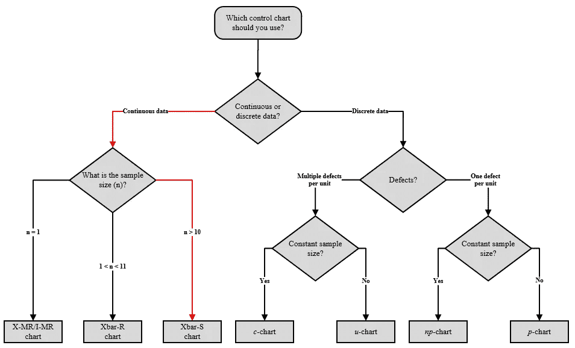
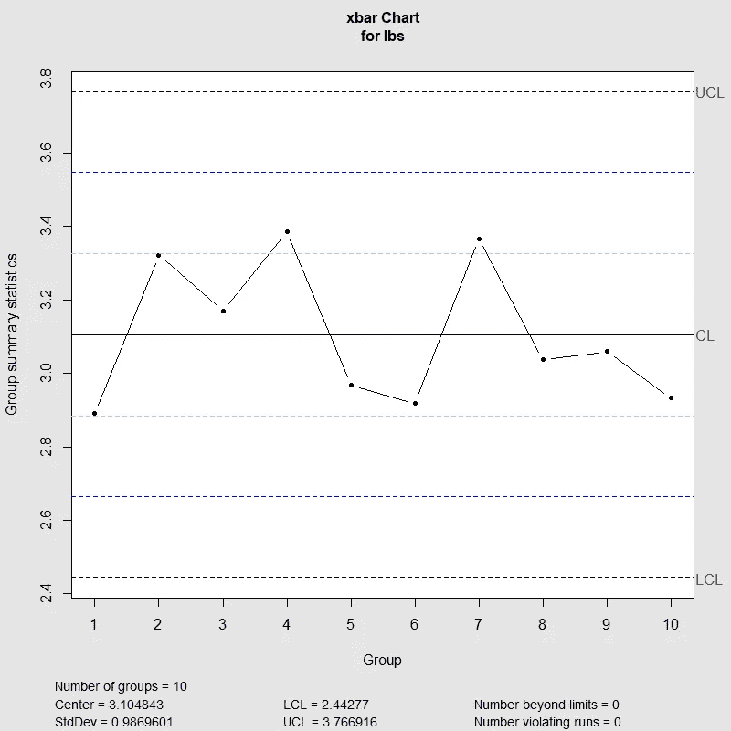
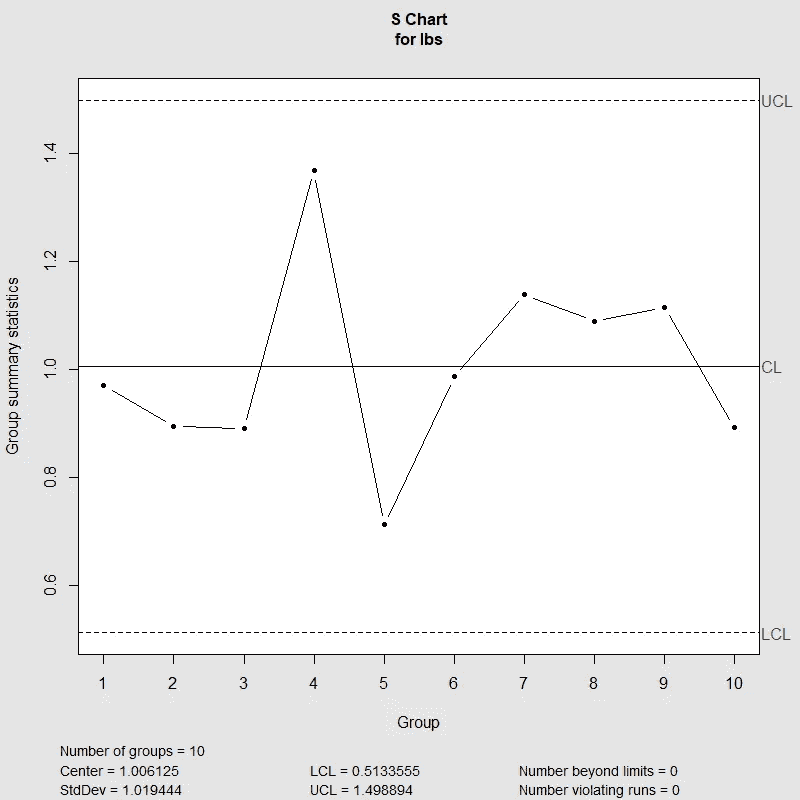
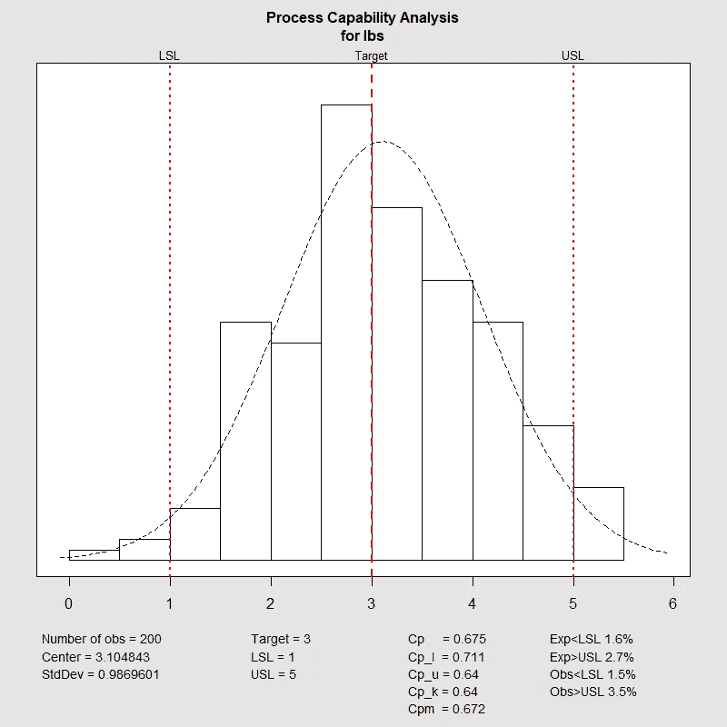

# 质量控制图:x-条形图、s-图和过程能力分析

> 原文：<https://towardsdatascience.com/quality-control-charts-x-bar-chart-s-chart-and-process-capability-analysis-b7dcc30278ae?source=collection_archive---------6----------------------->

## r 代表工业工程师

## 使用“qcc”R 包创建质量控制图

Image by Analytics Association of the Philippines on [LinkedIn](https://www.linkedin.com/company/analytics-association-of-the-philippines/)

# 质量控制图

质量控制图是工程师监控一个过程是否在统计控制下的重要工具。它们有助于可视化变化，发现并纠正出现的问题，预测预期的结果范围，并分析特殊或常见原因导致的流程变化模式。质量控制图常用于精益六适马项目和 DMAIC 项目的控制阶段，被认为是过程改进的七个基本质量工具之一。

然而，我们如何确定用于监控过程的正确的质量控制图？以下决策树可用于根据给定数据确定哪一个是要使用的正确质量控制图:

Quality Control Charts Decision Tree

在下面的例子中，当样本量大于 10 时，我们将关注连续数据的质量控制图。

# x 条形图

x-bar 和 s-chart 是质量控制图，用于根据给定时间内采集的样本监控过程的**均值和变异**。两个 chats 上的控制限制用于监控流程的平均值和变化。如果一个点超出了控制极限，则表明过程的平均值或变化超出了控制范围；在这一点上，可能怀疑有可分配的原因。在 x 条形图上，y 轴显示的是总体平均值和控制限，而 x 轴显示的是样品组。让我们来看看使用 *qcc* 包生成 x-bar 图的 *R* 代码。

x-bar chart R code

x-bar chart example using qcc R package

由 *R* 生成的 x 条形图为其解释提供了重要信息，包括样本(组数)、控制限、总体平均值(中间值)标准差(标准偏差)，最重要的是，超出控制限的点和违规运行。工程师必须特别注意这些点，以便识别和确定导致过程失控的系统变化的原因。

# s 形图

为了将 s 图与 x 条形图一起使用，样本大小 *n* 必须大于 10。在 s 图中，y 轴显示样本标准差、标准差总体均值和控制限，而 x 轴显示样本组。一旦创建了 x-bar 图，您只需要添加以下代码行来生成 s-chart。

s-chart R code

s-chart example using qcc R package

*R* 生成的 s 图也为其解读提供了重要信息，就像上面生成的 x 条形图一样。同样，工程师必须特别注意超出控制极限的点和违反运行，以便识别和确定导致过程失控的系统变化的原因。

# 过程能力分析

过程能力是给定特性的固有过程可变性的统计度量。换句话说，过程满足给定规范(如客户要求、工程公差或其他规范)的能力。

使用 *R* 生成 x-bar 和 R-charts 后，您只需添加以下代码行，指定控制下限、控制上限和目标。完成后，添加下面的最后一行代码来生成流程能力总结图表。

Process capability analysis R code

Process Capability Analysis using qcc R package

# 总结想法

我们已经完成了 *R* 和 *qcc* 封装必须提供的众多工业工程应用之一。您可能已经注意到，只需几行代码，我们就能构建质量控制图，并获得重要信息，用于精益六适马和 DMAIC 项目的流程改进。我再一次邀请你继续发现作为一名工业工程师，你可以使用 *R* 完成的令人惊奇的事情。

*— —*

*如果你觉得这篇文章有用，欢迎在*[*GitHub*](https://github.com/rsalaza4/R-for-industrial-engineering/blob/master/Quality%20Control%20Charts/x-bar%20and%20s-chart.R)*上下载我的个人代码。你也可以直接在 rsalaza4@binghamton.edu 给我发邮件，在*[*LinkedIn*](https://www.linkedin.com/in/roberto-salazar-reyna/)*上找到我。有兴趣了解工程领域的数据分析、数据科学和机器学习应用的更多信息吗？通过访问我的介质* [*简介*](https://robertosalazarr.medium.com/) *来探索我以前的文章。感谢阅读。*

*-罗伯特*