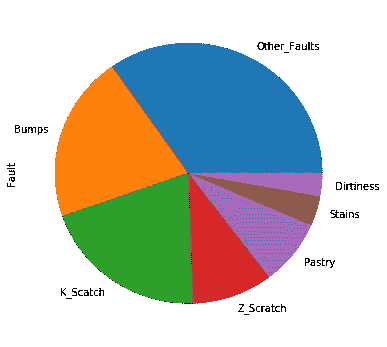
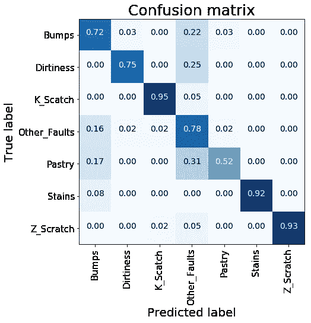
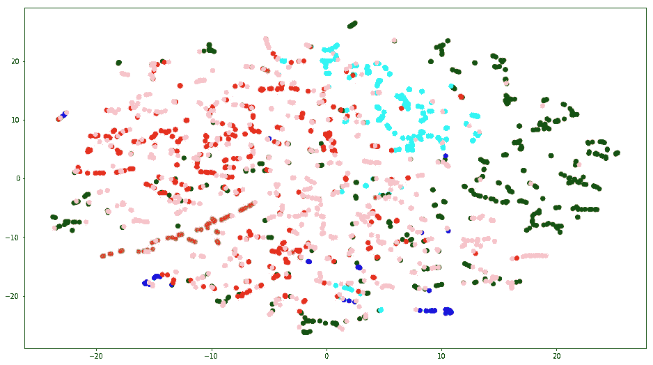
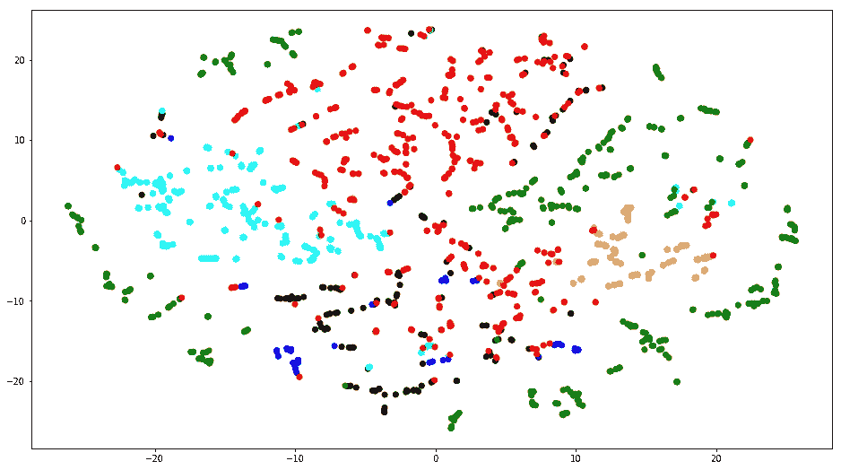
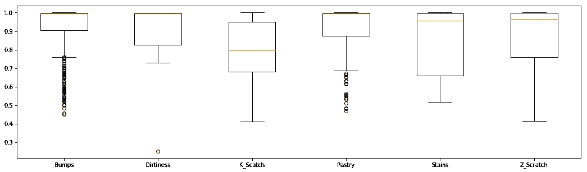
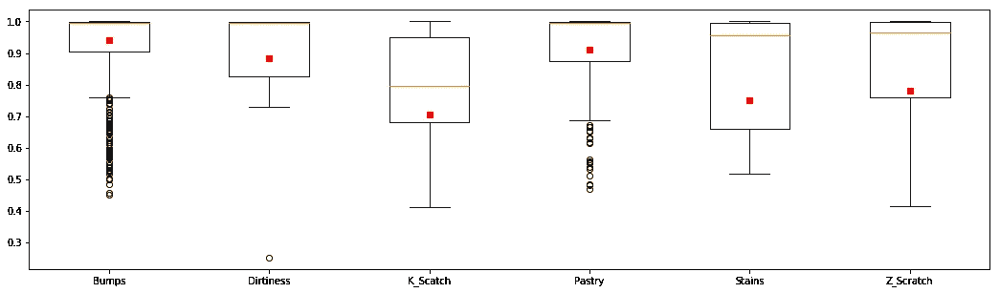
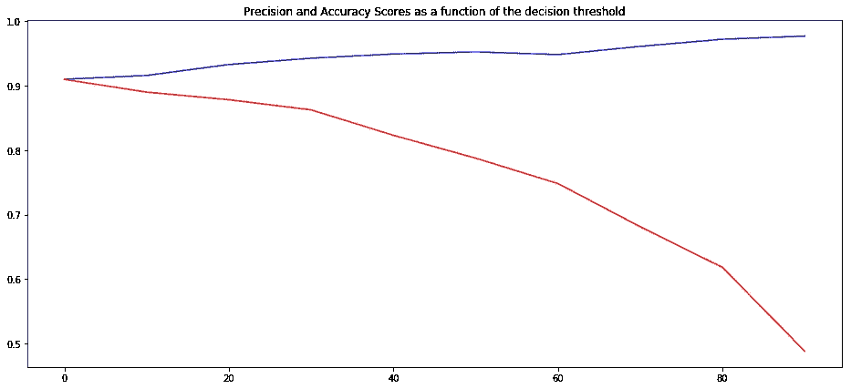
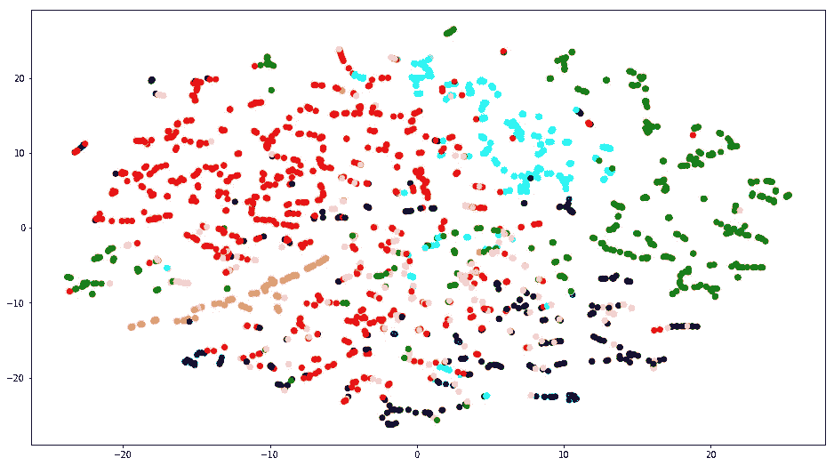

# 利用机器学习进行质量控制

> 原文：<https://towardsdatascience.com/quality-control-with-machine-learning-d7aab7382c1e?source=collection_archive---------14----------------------->

## Python 中的工作流、图形表示和有用的人类见解


Photo by [Glenn Hansen](https://unsplash.com/@hansenhouse?utm_source=medium&utm_medium=referral) on [Unsplash](https://unsplash.com?utm_source=medium&utm_medium=referral)

质量控制是每个生产系统中的一个重要步骤。许多商业投资旨在加强这一过程，以授予更高性能的产品。在过去的几年里，机器学习解决方案在这项投资计划中发挥了关键作用，因为它们能够轻松适应每一场比赛，并取得了巨大的成绩。

在本文中，我以分类问题的形式提出了一个标准生产单位质量控制的人工智能解决方案。遵循一种非常有趣的方法，我试图实现最佳的性能，给出结果的直观解释，并考虑到**有用的人类洞察力**。

我想强调这个最新的话题，因为**人类的洞察力**在机器学习中经常被低估！这并不奇怪，他们允许我们达到最好的表现，并采用最聪明的解决方案。

# 数据集

我从忠实的 UCI 存储库([钢板缺陷数据集](http://archive.ics.uci.edu/ml/datasets/Steel+Plates+Faults))获取了用于分析的数据集。数据描述很差但没关系，因为很容易理解…我们有一个数据集，包含钢板的元信息，如光度、周长、边缘、厚度、面积、钢的类型等(共 27 个自变量)。

我们可以想象管理一个工厂，在生产系统的最后一步加工钢铁，生产钢板，在批发市场销售。我们的目标是最大化生产系统的效率，仅考虑产品的元数据，尝试识别钢板故障的可能类型(总共 7 种)。这样，我们将能够识别生产系统的谬误，并做出相应的反应。

在我们处理的 1941 个样本中，总故障的分布是不平衡的，有利于'*其他故障*'类:

```
df = pd.read_csv('./Steel_Plates_Faults.csv')
label = df.Fault
df = df.drop('Fault',axis=1)
label.value_counts().plot.pie(figsize=(6,6))
```



label distribution

# 第一个模型

我们很着急，想马上得到一些结果。所以我们收集了所有的数据并进行梯度推进。

```
X_train, X_test, y_train, y_test = train_test_split(df, label, random_state=42, test_size=0.2)gbc = GradientBoostingClassifier(n_estimators=500)
gbc.fit(X_train, y_train)
```

我们能够实现 0.807%的整体精度。

```
cnf_matrix = confusion_matrix(y_test, gbc.predict(X_test))
plot_confusion_matrix(cnf_matrix, classes=np.unique(label), title=”Confusion matrix”)
plt.show()
```

如果我们画出混淆矩阵，可以看出我们的算法不能很好地分类 Other_faults 类。第一个结果迫使我们放慢脚步，稍微思考一下。



From [sklearn documentation](https://scikit-learn.org/stable/auto_examples/model_selection/plot_confusion_matrix.html)

个人认为，调查一个现象最好的方法是制作一个情节。出于这个原因，我把我们用来拟合梯度推进的所有变量都画了出来。为此，我将初始维度(27 个变量)减少到仅 2 个维度来拟合 TSNE。

```
scaler = StandardScaler()
scaler.fit(X_train.astype('float64'))tsne = TSNE(n_components=2, random_state=42, n_iter=300, perplexity=5)
T = tsne.fit_transform(scaler.transform(df.astype('float64')))plt.figure(figsize=(16,9))
colors = {0:'red', 1:'blue', 2:'green', 3:'pink', 4:'black', 5:'orange', 6:'cyan'}
plt.scatter(T.T[0], T.T[1], c=[colors[i] for i in LabelEncoder().fit_transform(label)])
```



TSNE on ALL the data at our disposal

这是对我们结果的清晰而漂亮的解释！我们(以及算法)无法将其他错误(粉色点)与剩余的类明确区分开来。这样，来自混淆矩阵的 Other_Faults 的召回值是有意义的。Other_Faults 是一个**噪声类**，我们必须在分析中考虑这一方面。

# 要点

Other_Faults 是一个吵闹的班级是什么意思？为了回答这个问题，我们利用臭名昭著且被低估的**人类洞察力。**

假设人类在今天的生产系统中进行质量检查。如果这些人检查一块表面有明显凸起或污点的钢板，这块钢板很容易贴上标签。但是，如果这些人检查一个表面有凸起和污点的盘子，同时贴上标签，那就不那么容易了！(*如有疑问，放在其他 _ 故障*)。

这只是一个例子，但就个人而言，它澄清了我们的情况:Other_Faults 类需要小心处理，因为它包含了许多质量检查的未定义情况。

有了这个宝贵的考虑，我们就可以安全前进了！如上所述，我尝试绘制数据集中的所有钢板，考虑所有变量，但不包括属于其他断层的钢板(粉色点)。

```
tsne = TSNE(n_components=2, random_state=42, n_iter=300, perplexity=5)
T = tsne.fit_transform(scaler.transform(df[label != 'Other_Faults'].astype('float64')))plt.figure(figsize=(16,9))
colors = {0:'red', 1:'blue', 2:'green', 3:'black', 4:'orange', 5:'cyan'}
plt.scatter(T.T[0], T.T[1], c=[colors[i] for i in LabelEncoder().fit_transform(label[label != 'Other_Faults'])])
```



TSNE on ALL the data without Other_Faults

相当不错！我们已经去除了由其他故障引起的噪声，现在类别被很好地分开了。

# 第二个模型

在这一点上，我们试图建立一个不考虑 Other_Faults 类的模型。我们如上所述进行梯度增强。

```
X_train2, y_train2 = X_train[y_train != 'Other_Faults'].copy(), y_train[y_train != 'Other_Faults'].copy()
X_test2, y_test2 = X_test[y_test != 'Other_Faults'].copy(), y_test[y_test != 'Other_Faults'].copy()gbc2 = GradientBoostingClassifier(n_estimators=500)
gbc2.fit(X_train2, y_train2)
```

现在准确率 0.909%，提高了 10 个百分点。

当然，这是一个好结果，证实了我们推理的正确性，但是第二个模型再现了一个不现实的场景。这样，我们假设 Other_Faults 类不存在，并且所有的错误都很容易区分和标记。通过我们的第一个模型，我们已经证明这不是我们的情况。因此，我们需要一种方法来翻译机器学习语言中的不确定性，这种不确定性出现在人们试图对模糊的钢板进行分类时。

# 强加一个门槛

我已经对这种不确定性进行了编码，在我们的最终预测中为每一类设定了一个阈值。为了建立这个阈值，我用我们的第二个模型对 Other_Faults 样本进行了预测，并保存了它，保持了每个预测类的分离度(如下所示)。

```
def predict(feature, model, threshold_map=None): confidence = model.predict_proba(feature).max()
    label = model.predict(feature)[0] if threshold_map and label in threshold_map:
        if confidence >= threshold_map[label]:
            return {"label": label, "confidence": confidence}     

        else:
            return {"label": "OTHERS", "confidence": confidence}

    elif threshold_map == None:
        return {"label": label, "confidence": confidence}

    else:
        print(label, 'not in threshold map') pred_lab = []
pred_conf = []
for row in tqdm.tqdm(X_train[y_train == 'Other_Faults'].values):
    pred = predict([row], gbc2)
    pred_lab.append(pred['label'])
    pred_conf.append(pred['confidence'])other_pred = pd.DataFrame({'label':pred_lab, 'pred':pred_conf})
diz_score = other_pred.groupby('label')['pred'].apply(list).to_dict()plt.figure(figsize=(18,5))
plt.boxplot(diz_score.values(), labels=diz_score.keys())
plt.grid(False); plt.show()
```



probability scores and associated predicted labels in Other_Faults

接下来，我计算了每个预测类别的移动阈值:我在每个类别(红色方块)中采用了根据分数分布计算的 0.30 个百分点。

```
threshold_p = {}
for lab in diz_score.keys():
    threshold_p[lab] = np.percentile(diz_score[lab],30)plt.boxplot(list(diz_score.values()), labels=list(diz_score.keys()))
plt.plot(range(1,len(threshold_p.keys())+1), list(threshold_p.values()), 'rs')
plt.show()
```



thresholds for every probability scores distributions

实际上，我们利用这个阈值来判断钢板是否确实属于给定的失效类别。如果我们的预测低于阈值，我们就没有足够的信心将其分类，因此我们将其标记为 Other_Faults。

采用这种技术，我们能够达到 0.861%的准确度(在没有其它故障的测试数据中)。如果我们将提高阈值，我们将失去精度点，但我们将获得更高的精度，等等。



Red: Accuracy, Blue: Precision

关于 Other_Faults 类，我们假设它是以‘优柔寡断类’的形式存在的，它包含了被模型分类为低置信度的所有样本。同时，如果置信度高于阈值(我们相信这一点)，我们假设原始 Other_Faults 类的所有样本都属于模型所指向的类。

最后，如果我们采用调整 Other_Faults 类的大小再次绘制原始数据，我们可以看到噪声减少(粉红色点集中)。

```
final_pred = []
for row in tqdm.tqdm(X_test2.values):
    final_pred.append(
        predict([row], gbc2,  threshold_map=threshold_p)["label"]
    )tsne = TSNE(n_components=2, random_state=42, n_iter=300, perplexity=5)
T = tsne.fit_transform(scaler.transform(pd.concat([X_train,X_test]).astype('float64')))plt.figure(figsize=(16,9))
colors = {0:'red', 1:'blue', 2:'green', 3:'pink', 4:'black', 5:'orange', 6:'cyan'}
plt.scatter(T.T[0], T.T[1], c=[colors[i] for i in LabelEncoder().fit_transform(other_final_pred)])
```



TSNE on ALL the data with the threshold

# 摘要

在这篇文章中，我提出了质量控制中故障分类的工作流程。我收到了一些钢板样本，并开始对它们进行分析，以便对故障进行正确分类。在第一步之后，我注意到数据结构中的一些模糊行为，于是我开始调查… **基于我的人类洞察力，我提出了一个新的问题愿景，我试图解决它，并提出了我个人的解决方案**。

[查看我的 GITHUB 回购 ](https://github.com/cerlymarco/MEDIUM_NoteBook)

保持联系: [Linkedin](https://www.linkedin.com/in/marco-cerliani-b0bba714b/)