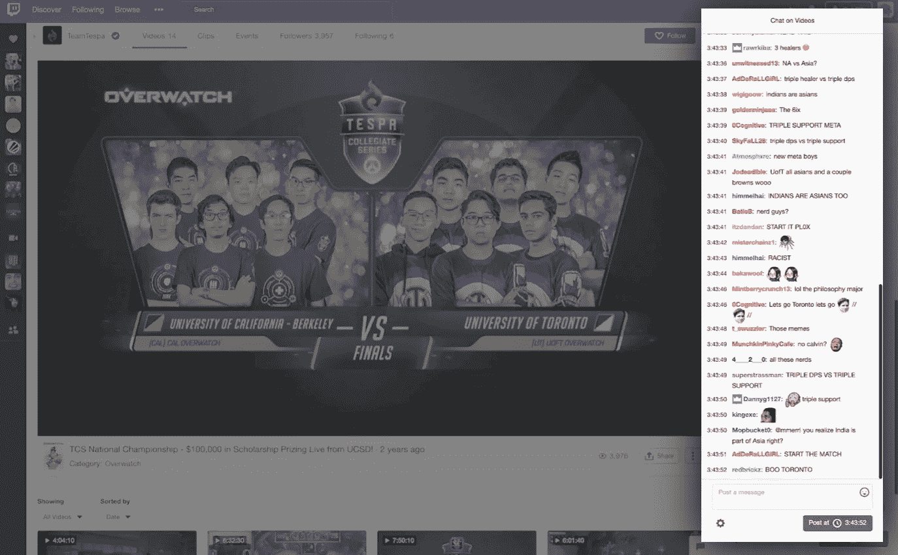
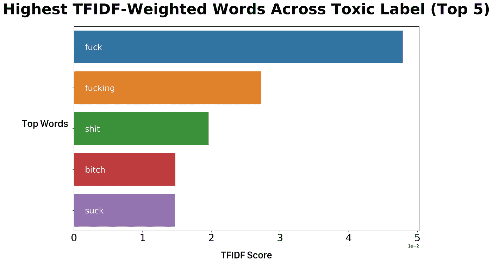
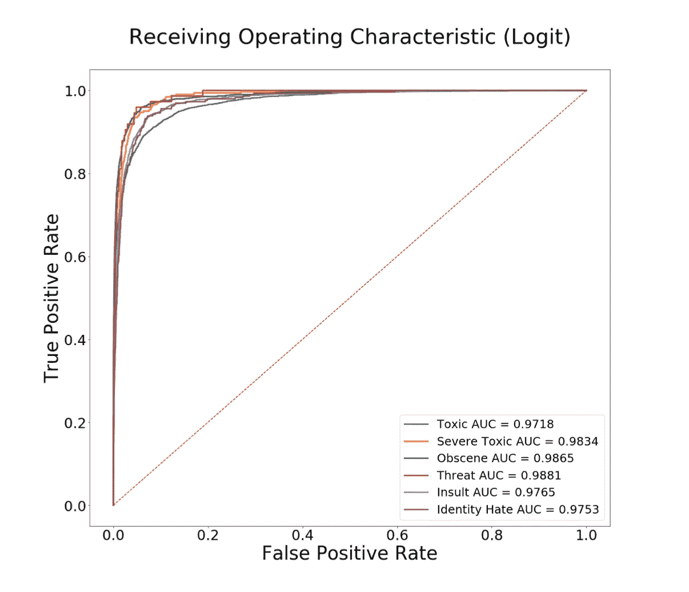

# 量化聊天室毒性

> 原文：<https://towardsdatascience.com/quantifying-chatroom-toxicity-e755dd2f9ccf?source=collection_archive---------22----------------------->

Courtesy of Caspar Camille Rubin on [Unsplash](https://unsplash.com/photos/XA0v5hbb7HY)

## 使用机器学习来识别在线聊天室中的仇恨

**注意:**下面是粗俗语言的例子

在这个项目中使用的代码可以在这里找到[。](https://github.com/jeremyrchow/harassment-classifier)

前几天晚上，我参加了由 [Twitch](https://www.twitch.tv) (漂亮的办公室和美味的食物！)我和那里的一些软件工程师聊了起来。原来他们是一个“安全”团队，完全致力于保持聊天清洁，保护聊天室中的流媒体和观众，这是有道理的，因为聊天互动可以说是 Twitch 的核心驾驶体验。考虑到这一点，我开始尝试构建自己版本的聊天毒性分类器(在我的好朋友 Randy Macaraeg 的帮助下)。今天，我将带您经历这一过程！

Twitch chat is a core driver of its user experience

第一步是找到一个数据集。幸运的是，我们在 Kaggle 的朋友举办了一场在维基百科上识别有毒评论的[比赛，该比赛提供了一个超过 30 万条评论的数据集，人工标记了六个类别的二进制标签，包括有毒、严重有毒、淫秽、威胁、侮辱和身份仇恨。](https://www.kaggle.com/c/jigsaw-toxic-comment-classification-challenge/data)

# 简而言之，自然语言预处理

一旦我们有了数据，我们需要通过清洗过程。对于一般的文本数据集，这通常包括:

*   删除标点符号
*   删除停用词(如“the”、“this”、“what”)
*   词干化/词尾化(通过删除后缀如“-ed”、“-ing”，将单词简化为基本形式)。

此外，处理在线文本和评论需要进一步删除超链接、用户名和自动消息(该数据集中最常见的评论是维基百科对新用户的欢迎消息)。

您所做的预处理因项目而异，对于这一点，除了词干化和词元化，我们有最好的准确性指标来做上述所有工作，这将 ROC AUC 指标降低了 10%。我们还考虑了 n 元语法，其中除了单个单词之外，您还可以查看成对或三个(或更多)单词，但这也使我们的 ROC AUC 指标下降了 5%，因此我们最终没有使用它。

# …向量化…

为了将单词转化为机器学习算法可以理解和处理的东西，我们需要做一些称为矢量化的事情。简而言之，这是将单词转化为多维向量的过程，其方式是将单词的含义或上下文与向量指向的位置相关联。**从某种意义上来说，矢量化就是让计算机通过将相似的词义映射到相似的向量空间来量化词义。**

# 词频—逆文档频率矢量化

对于这个应用程序，我们希望**快速、基于上下文的**矢量化。一些方法，如 Word2Vec 和 [spaCy](https://spacy.io/models) 涉及预先训练的数千兆字节的模型，这些模型在数十万甚至数百万个文档上训练，然后将单词的含义简化为一组数百个数字。一般来说，这些模型在保持单词的上下文和含义方面非常出色，但是它们速度慢且庞大。这就是术语频率逆文档频率矢量化的用武之地(TF-IDF)。这种矢量化方法查看一个单词在注释中出现的次数相对于它在其他注释中出现的次数。**两件事导致更高的 TF-IDF 分数:**

1.  **该词在被评分的特定评论中出现的频率更高。**
2.  **该词在所有其他评论中出现频率较低。**

A glance at the highest TF-IDF scores in comments with the toxic label. We can see cursing is highly correlated with the toxicity labels!

# 建模！

一旦我们将所有的评论转换成 TF-IDF 单词向量集，下一步就是建模。最终目标是在聊天室中实现一种自动调节算法，需要一种快速算法来处理成千上万的同时浏览者相互聊天。为此，我们使用基本的逻辑回归进行分类。实质上，逻辑回归使用你的中学斜率公式:

其中 *y* 是某事发生的几率(使用 sigmoid 函数在 0 和 1 之间压缩)， *m* 是由于独立变量 *x* 的变化引起的 *y* 的单位变化， *b* 是偏差，或 y 截距。[这篇文章](/understanding-logistic-regression-using-a-simple-example-163de52ea900)对逻辑回归进行了更深入的解释。

所以现在我们有了构建模型的所有要素。此时，我们通过将每个评论输入到 TF-IDF 矢量器来训练我们的模型，该矢量器将该评论转换为 20，000 个特征的矢量(我们希望作为词汇表跟踪的最大字数)。然后，我们将这 20，000 个 TF-IDF 得分特征传递到我们的模型中。为简单起见，我们独立训练六个单独的模型，每个标签一个。这给了我们以下 ROC 评分！

# 曲线下的受试者工作特征(ROC)面积

Receiver Operating Characteristic (ROC) curves for logistic regression models.

ROC 曲线下的面积告诉我们，如果我们改变概率阈值以获得更多的真阳性，我们会获得多少更多的假阳性。在这个项目的上下文中，假阳性是说一个评论是有毒的，而它实际上不是，真阳性是正确地识别一个有毒的评论。基本上，**ROC 曲线下的面积越大，意味着对于额外的真阳性**，我们得到的额外假阳性越少，这是我们想要最大化的。

如你所见，我们得到的 AUC 值约为 0.97 到 0.98，非常接近最大值 1。这意味着我们可以庆祝，因为我们的模型在识别真正的阳性方面非常棒！

# 结论和实施

因此，我们创建了一个模型，该模型接收一条互联网评论，然后给出该评论是否属于六种有毒类别的六种可能性。在一台 2019 款 Macbook Pro 上，分类速度大概是每秒 1150 条消息！还不错。虽然还有一些需要改进的地方，但这是一个很好的审核工具，如果有不怀好意的人在他们的频道上发帖，可以用来提醒版主。

请关注我的下一篇文章，了解我们如何在网上和 twitch 聊天机器人中部署这个模型！