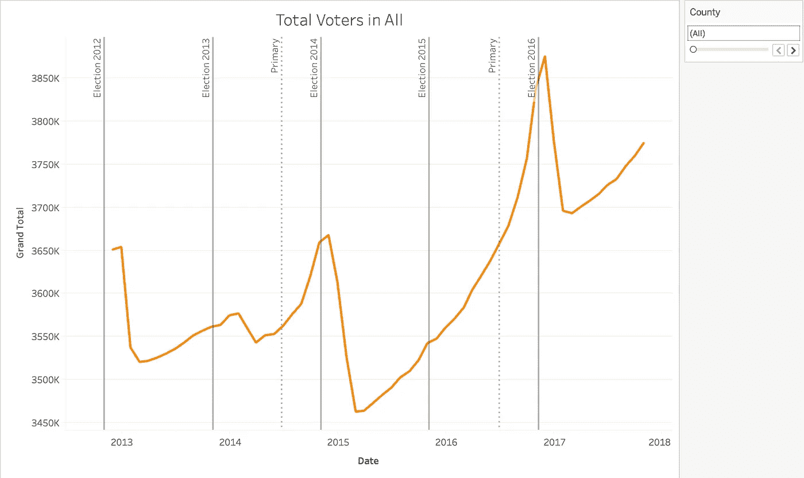
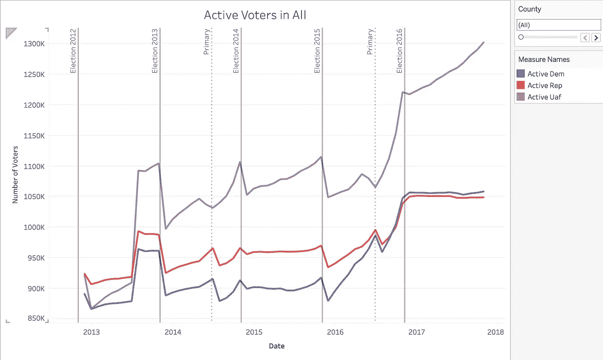
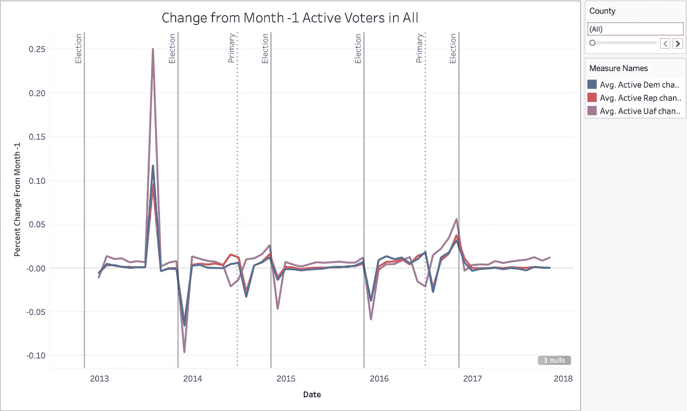
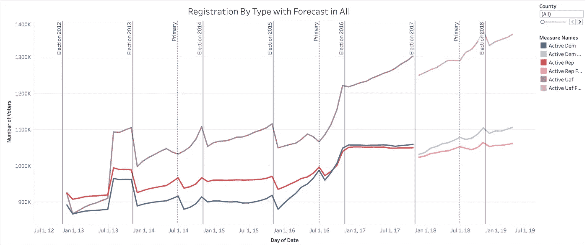

# 用数据量化政治势头

> 原文：<https://towardsdatascience.com/quantifying-political-momentum-with-data-ef181df072a6?source=collection_archive---------25----------------------->

政治评论员每天都在谈论当前的政治形势，当我在电视上看着这些会说话的人做他们的事情时，我总是一遍又一遍地听到“政治势头”这个词。2016 年大选后尤其如此，2018 年大选后也是如此。但是什么是政治动力呢？共和党人和民主党人都声称在 2016 年大选后拥有它。怎么会有人赢有人输呢？我开始思考量化政治势头的方法；过去的法案、民意调查的支持率以及其他民意调查信息都浮现在脑海中，但所有这些信息的问题是，它们都可能被人们扭曲，而且大多数时候它们只考虑了过去投票的人。在浏览科罗拉多州州务卿的网站时，我偶然发现了选民登记，并认为这是衡量政治势头的一个很好的方式。如果人们喜欢一个政党的信息，他们会改变他们的党派，当新的人登记投票时，他们也可以选择一个党派。这将允许我看到是否有人正在改变他们的党派或注册一个党派。顺便说一句，我收集了我的数据，我不知道是哪一个，但它会让我知道一个政党是否正在通过计算他们的政党规模来获得动力。这将是我量化“政治动力”的方式此外，为了能够尝试更多的数据科学技术，我还试图预测 2018 年的选民登记人数。

旁注——我在几个月前完成了这个项目，但从未写过。原因是，我认为我过去/现在害怕过去三四年中产生的有害政治环境，以及如果我的数据不支持你当时的政治观点，我可能/将要受到的强烈反对。但是你知道吗，我在这里谈论的是数据，而且仅仅是数据。是的，这可能是政治数据，我会提到政党是如何受到影响的，但如果你想写一个回应，因为我的结果不会助长你的政党信仰，或者他们不同意你最喜欢的政治谈话主持人在电视上说的话，去写一篇关于它的长脸书帖子或什么的。我不想听。数据是我的安全空间。但是，如果你真的想谈论或评论数据分析以及如何将数据用于政治目的，第一杯酒我请。抱歉，咆哮了，但是，现在回到定期安排的博客。

我所有的数据都是从科罗拉多州政府的网站上下载的。使用政治数据的一个好处是，大部分政治数据被视为公共信息，可以免费下载。一个你必须支付“行政费用”来获取公共数据的例子是选民登记文件。这显示了该州每个注册选民的信息，由于其规模，对于普通公民来说有点昂贵。非常有趣的文件，如果你曾经得到它。但是，我很幸运，我能够免费下载我的信息。我下载的是选民登记统计 excel 文件。这份档案包含了公布当月登记选民人数的信息。该文件中的一些示例工作表如下:党派和地位、性别、党派和年龄，以及按国会选区、州参议院选区、州众议院选区和选区的细分。我想要的信息是从党和状态表。下面是聚会和状态表的大致样子。

From the All Reports excel file from [http://www.sos.state.co.us/pubs/elections/VoterRegNumbers/2016VoterRegNumbers.html#April](http://www.sos.state.co.us/pubs/elections/VoterRegNumbers/2016VoterRegNumbers.html#April)

我最终下载了 60 个这样的文件。从 2012 年 11 月到 2017 年 10 月，每月一次。听起来很简单，只需编写一个脚本将所有这些文件加载到 python 中可用的格式，但是文件本身存在一些问题。首先，并不是所有的年份都有相同的格式。在 2015 年(2012-2014 年)之前的几年中，没有“Prereg”选民，如上图所示，“UNI”(团结)党被 AEL(美国人选举)党取代，并且在如上图所示的不同位置，它也是 excel 的旧版本。我不知道的是熊猫会读书。xls 和。xlsx 文件不同，而升级文件格式并不难，这是一项繁琐的任务。上面所有的问题都通过使用 excel 解决了，但是我真的希望科罗拉多州的州务卿的网站能对数据更加友好。

为了简化我的分析，我对数据做了一些更改，将所有“Prereg”投票者添加到活跃投票者中。“预登记”选民是那些登记投票但实际年龄还不够大的人。一个例子是，一个 17 岁的人在 18 岁生日之前登记投票，但在下一次选举中可以投票，因为那时他们已经 18 岁了。我无法找到 2015 年之前这些“预登记”选民的统计数据，所以我将他们加入了活跃选民，因为我觉得这有助于了解新的和年轻的选民。我还把除了民主党和共和党之外的所有政党都加入了无党派的行列。这是为了简化我的分析，只需要关注三个变量而不是七个。

首先，我想让自己熟悉这些数据，而最简单的方法就是绘制数据图表。我首先开始查看所有县的注册选民总数，以及所有县的政党的活跃选民。这两个图表都给了我一个我正在处理的所有数据的概览。

[https://public.tableau.com/profile/cbjohnson30#!/vizhome/Colorado_Voter_Registration/Total](https://public.tableau.com/profile/cbjohnson30#!/vizhome/Colorado_Voter_Registration/Total)

左边是所有县和政党的登记选民总数。该图中的一些关键兴趣点表明，科罗拉多州在偶数年选举后清理了选民名单。这意味着去除那些已经去世或搬走并且多年没有投票的人。另一个有趣的现象是，偶数年选举前选民登记数量增加，但奇数年选举前不会出现同样的增长。关于这个图表，我想指出的最后一点是，因为它有规律的增加和减少，所以可以肯定地说，这个图表有 2 年或 24 个月的季节性。这对于预测未来的注册人数非常重要。

[https://public.tableau.com/profile/cbjohnson30#!/vizhome/Colorado_Voter_Registration/Active](https://public.tableau.com/profile/cbjohnson30#!/vizhome/Colorado_Voter_Registration/Active)

左边是所有县的政党的所有活跃选民的图表。这张图表信息量很大，确实为了解整个科罗拉多州的选民登记率提供了一些很好的见解。我注意到的第一件事是 2013 年所有活跃选民中出现的巨大峰值，但在总选民图表中没有看到。这是因为科罗拉多州众议院法案-1303，创造了选民准入和现代化选举法案，于 7 月生效。这改变了不活跃选民的定义。在这项法案之前，如果你在前两次选举中没有投票，你就成了不活跃的选民。法案通过后，只有 USPS 退回你的选票，你才成为一个不活跃的投票者。如果你收到了你的选票，但由于某种原因没有投票，你仍然被贴上积极选民的标签。活跃选民定义的变化并不影响我的分析，但在预测未来的选民登记人数时却发挥了作用。另一个有趣的地方是初选前后登记人数的变化。在初选之前，大约 6000 名选民将他们的登记状态从无党派改为民主党或共和党，以便他们可以在党内初选中投票。初选结束后，他们又变回原来的样子。幸运的是，这不需要再发生了，因为 2016 年通过了 108 号提案，允许无党派人士在初选中投票。

现在我对我的数据有了更多的了解，是时候做一些深入的分析了。时间序列分析的两种常见形式是移动平均数和与上月的百分比变化。移动平均线在金融预测中很常见，因为它通过平滑图表来帮助减少数据的波动。虽然这在其他时间序列问题中很有用，但我不认为它会帮助我分析这些数据，因为我正在寻找数据中不同的波动点。

与前一个月相比的百分比变化是一个我知道会很有趣的图表，因为这些计算做了两件有趣的事情。第一，它会告诉我某个政党的人数是增加了还是减少了。第二，它会自动将数据标准化，这样我就可以轻松地将不同的政党进行比较。以上是按党派划分的活跃选民的整个数据集与上月相比的百分比变化图。在这个图表中，我最感兴趣的是这些线相互分开的时间。这意味着一个政党以不同于其他两个政党的速度增加或减少其活跃选民数量。我注意到的前两个部分是 2013 年的大幅飙升和初选前后的几个月。这两者在本博客前面都有解释。这个图表加上一个小的补充，可以让我回答我上面提到的关于政治动力的问题。

为了回答我最初的问题，即政治势头是否可以用一个政党的注册选民数量来量化，我使用了上图中与上月相比的百分比变化，以及一些其他特征。这些功能包括将图表限制在奇数年，并给图表添加一个标签，允许我只查看民主党或共和党获胜的县。例如，在 2017 年，我可以查看投票支持唐纳德·特朗普或希拉里·克林顿的县。下面是这两张并排的图表。

首先，看左边的图表，投票给唐纳德·特朗普的县，你可以看到共和党(红色)和民主党(蓝色)的界限明显分开。红线在正数范围内徘徊，从 0.0 到 0.002，这意味着共和党注册选民的数量在这段时间内一直在增长。而注册民主党人的数量几乎总是为负数，这意味着注册民主党人的数量在这段时间内几乎总是在减少。现在，把这个和左边的图表比较一下，那些投票给希拉里·克林顿的县，红色和蓝色的线在 9 月份之前几乎是一起移动的。接下来，看看无关联(紫色)线。对于投票给特朗普的县来说，这条线的斜率比投票给克林顿的县更陡。它也有一个更高的顶点。这意味着，在投票给特朗普的县，登记为无党派的选民比投票给克林顿的县增长得更快。

在 2016 年的选举中，总统竞选被公然认为是选票上最热门的竞选，而在 2014 年，州长竞选被认为是选票上最热门的竞选。在 2014 年鲍勃·博普雷兹(共和党)和约翰·希肯卢珀(民主党)之间的州长竞选中，你也可以看到上面提到的相同趋势。这个图表可以在这里看到。这种模式没有那么极端，但仍然存在。由于科罗拉多州众议院法案-1303，我无法完成 2012 年总统选举的分析。

但话虽如此，我想从全州选举的角度来看这个问题，克林顿赢得了科罗拉多州，希肯卢珀也赢得了他的竞选。因此，如果科罗拉多州的一个县支持在全州竞选中失利的候选人，你会看到失败政党的注册选民增加。但是，投票给获胜候选人的县没有看到获胜政党注册选民的同样激增。例如，正如我们在上文中看到的，在投票给输掉科罗拉多州的特朗普的县中，共和党注册选民有所增加，但在投票给克林顿的县中，我们没有看到注册民主党选民的激增。

如果我是一个政党的成员，利用这些信息，在新的一年的头几个月里，在人们对以前的选举记忆犹新的时候，有针对性地进行选民登记，可能是值得的。比如，在科罗拉多州，共和党可以在投票给沃克·斯特普尔顿(州长竞选中的败选候选人)的县开展选民登记运动。或者，民主党可以在德克萨斯州投票给贝托·奥罗克(在德克萨斯州参议院竞选中失败的候选人)的县开展选民登记运动。我知道这与我之前所说的州长竞选比参议员竞选有更大的影响是相反的，但是考虑到谁参加了竞选以及选举期间全国瞩目的焦点，我认为可以肯定地说这是上届德克萨斯州选举期间最大的一次竞选。我也在关注另一个州的比赛，所以不要全信。

该项目的最后一部分是预测 2018 年的选民登记情况。由于上面提到的季节性，我认为季节性 ARIMA 模型会很适合我的数据集。ARIMA 代表“自回归综合移动平均线”这个模型的公式如下。

该模型不仅会查看预测时间之前的时段，还会查看一个或多个季节之前的时段，以帮助进行预测。在这种情况下，每个周期是一个月，每个季节是两年或 24 个周期。

从表面上看，这些预测可能看起来合理，但我并不像我希望的那样信任这些预测。出现这种情况有几个原因，但归根结底是因为我没有足够的数据来证明我的预测是正确的。有了数据，我就有了，这也是我解决不了的问题。如上所述，2013 年不活跃选民和活跃选民的定义发生了变化，这使得我无法再往前追溯。

如果我包括任何自回归和移动平均成分，我的模型只能回顾一个季节。这是一个问题，因为 2016 年由于有争议的总统选举，选民大量涌入。看看偶数年的 11 月，登记选民总数将达到:2012 年 365 万，2014 年 366 万，2016 年 387 万。我的预测预测 2018 年 11 月将有 402 万选民。我的预测是，非总统年将是一个非常大的年份。这是我在模型中看到的一个缺陷。如果我能够回顾三个甚至四个赛季，这将有助于缓解 2016 年的大幅增长，并且能够更好地区分总统年和非总统年之间的差异，以产生更好的结果。

从 2018 年 11 月的实际注册选民总数来看，我的预测没有我想象的那么远。这个数字是 399 万。虽然我能够说服自己，由于逻辑原因，我的模型不会那么准确，但有时在得出结论之前，最好等待现实生活中的数据。公平地说，我仍然认为如果我有几年的可靠数据，这个数字会更准确。

要查看其余的图表，请访问我的 Tableau 公开简介:[https://public.tableau.com/profile/cbjohnson30#!/](https://public.tableau.com/profile/cbjohnson30#!/)
要查看用于此的代码，请访问我的 GitHub:[https://github.com/CBJohnson30](https://github.com/CBJohnson30)