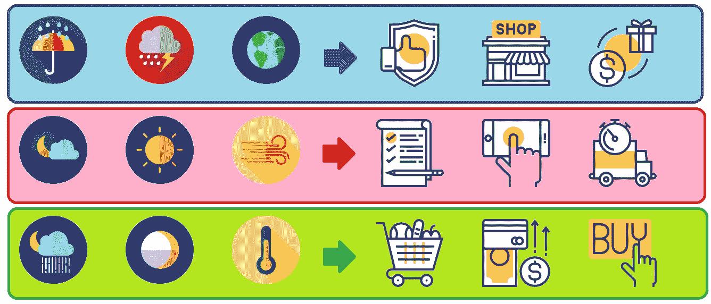

# 量化天气对零售销售的影响

> 原文：<https://towardsdatascience.com/quantifying-the-effect-of-weather-on-sales-a3975aaaed43?source=collection_archive---------23----------------------->

Converting weather data into sales indicators | Photo by the author

> **读者注意**:本文假设读者对数据科学和分析概念有所了解。

澳大利亚一家大型零售商的财务团队想知道“天气对每周销售额有多大影响？”这个问题的答案—这是一个普遍存在的问题，许多财务分析师和经理都在努力解决这个问题。然而，这个行业中没有人有科学的方法来解决这个问题。

## 准确量化天气对销售的影响的应用有很多，例如:

> 1.)通过优化定价和在特定天气条件下对合适的产品打折来改善客户服务。
> 2。)估算对特定天气敏感产品的需求，如雨伞或冰淇淋。
> 3。)通过降低营运资本来改善供应链&通过确定恶劣天气来降低物流成本。

如上所述，解决这个问题的商业价值是巨大的，因为这可以帮助更好地理解某些天气事件对收入和利润的影响。不仅如此，企业还可以更好地监控和报告受天气影响的客户每周交易习惯。这个项目的最终目标是预测未来一周依赖天气的销售情况。

在本文中，我不想深入数学模型选择和实现的本质。然而，下面概述了用于执行项目的项目管理框架的高级理解。我将描述用于解决问题的跨行业数据挖掘标准流程(CRISP)数据科学框架，并阐述我是如何着手解决这个问题的。

## CRISP 数据科学框架包括:

> 1.)商务理解
> 2。)数据理解
> 3。)数据准备
> 4。)造型
> 5。)测评
> 6。)部署&演示

从业务理解开始，我描述了问题的当前状态和未来期望的状态。定义问题的下一步是把它分解成更小的子问题，这些子问题是互斥的，并且是完全的。一旦问题被分解成更小的组成部分，例如，在我们的天气分析中，不同州的温度、风速和降水对每周销售有什么影响？此外，洪水或飓风等重大天气事件的影响是什么？我们如何使用现有的测量指标来定义洪水和飓风？我开始意识到不同的解决方案必须结合起来才能回答这个主要问题。

由于该项目的业务理解阶段的一个重要部分是研究，我利用现有的基于天气的销售预测研究来快速缩小方法范围。所确定的方法得到横向阅读和研究的支持，以确保该方法符合手头具体问题的需要。对方法进行一些必要的修改，以针对给定的问题定制解决方案。因此，使用现有的研究确保了利益相关者更快的周转。

根据 CRISP 框架，第二步是数据理解。在我的分析中有两个主要的数据来源。一个是从 IBM Cognos TM1 接收的州级销售数据，另一个是从气象局(BOM)网站收集的天气数据。与所需的利益相关方召开研讨会，以了解分析所需的所有数据字段。对于 BOM 数据，使用元表和数据表中提供的信息收集数据理解。

第三步是数据准备，这一步非常关键，因为最终模型的准确性在很大程度上取决于数据准备阶段。这一步可以进一步分解为特征选择和特征工程。在这一步中，我探索了可用特性的不同组合和排列，以便特性集可以与输出变量(即每周销售额)具有更高的相关性或适合性。我还去除了季节性的影响，如圣诞节和复活节期间，因为销售趋势在这些时期变化很大。

在建模步骤中，我试验了多元自适应回归样条(MARS)算法、自回归综合移动平均(ARIMA)和各种非线性机器学习算法，如随机森林(RF)和 XGBoost，以选择最适合我们给定数据分布的算法。使用高级机器学习算法的缺点之一是结果的可解释性。因此，为了更好地解释结果；我将温度、风速和降雨量的连续值转换成不同范围的桶，这样我就可以回答这样的问题，如维多利亚州气温上升 10 度会导致多少 X%的收入增加或减少？解释这些问题对于利益相关者展示分析项目的价值非常重要。

使用 K-fold 交叉验证技术对模型进行评估，其中在模型在训练期间未见过的各种测试数据集上验证训练的统计模型。K 倍交叉验证创建了稳健的模型，比其他方法具有更低的偏差。我得到的维多利亚州和新南威尔士州的模型的拟合优度(R 平方)约为 80%。在全国范围内，拟合优度大于 75%。所得模型的平均绝对百分比误差(MAPE)小于 12%，完全在应用所需的不确定性范围内。

最后，使用 R 代码与 Microsoft excel 的集成来部署模型。我在 excel 上创建了一个用户友好且高度直观的仪表板，用于分析结果的消费。我的商业智能仪表盘每周都会显示天气对销售的影响，以及其他销售驱动因素的定性和定量描述。这份报告完全是使用 VBA 自动生成的，每周只需点击一下就可以用新数据刷新。

总之，对准确预测和更好规划的需求在零售业中是至关重要的。尤其是因为重大天气事件，如洪水或干旱，如果处理不当，会给企业带来巨大的财务损失。我所做的是设计一种方法来验证和衡量一个不可控的销售驱动因素对业务的影响。有了这方面的知识，商场运营、交易和规划以及供应链团队将能够更好地预见重大天气事件对市场的潜在货币影响，并采取正确的策略将损失降至最低。

作为分析的下一步，我想看看天气事件对商店的影响，以及不同的天气条件如何影响不同类别的产品。拥有更精细的视图最终将有助于优化业务绩效。此外，我相信这才是分析的真正力量所在。