# 量子信息与人工智能

> 原文：<https://towardsdatascience.com/quantum-computing-and-ai-789fc9c28c5b?source=collection_archive---------8----------------------->

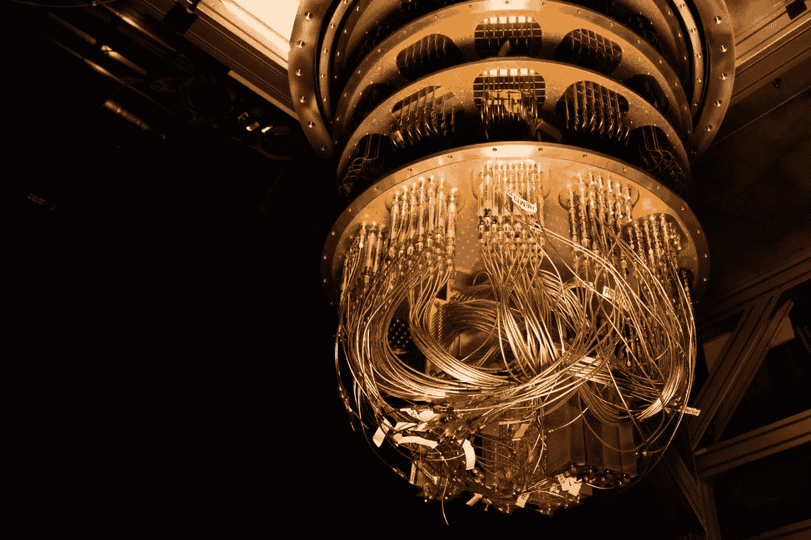

*Google’s qubit circuits are built out of superconducting materials, which are then kept at very low temperatures.* Photo from Google through The Verge retrieved [Sunday the 13th of October 2019](https://www.theverge.com/2019/9/23/20879485/google-quantum-supremacy-qubits-nasa)

## 在人工智能新发展的背景下探索术语和历史

既然有这么多关于量子计算的讨论，我认为探索我遇到的一个术语是合适的，即量子神经网络。然而，要做到这一点，我必须与术语*‘量子信息’*作斗争。因为我两者都不精通，所以你必须把这篇文章看作是一个很难理解的问题，而不是最终的答案。你可以看到第一部分是 NIST 关于量子计算历史的文章摘要。

*在物理学和计算机科学中，* ***量子信息*** *是* ***信息*** *状态的一个* ***量子*** *系统。它是研究* ***量子信息*** *理论的基本实体，可以使用* ***量子信息*** *处理技术进行操控*

****量子神经网络****(****QNNs****)是基于量子力学原理的神经网络模型。QNN 研究有两种不同的方法，一种是利用量子信息处理来改善现有的神经网络模型(有时反之亦然)，另一种是寻找大脑中潜在的量子效应。”**

# *量子信息史*

*我当时在看美国国家标准与技术研究院的一个帖子，作者是 [**Ben P. Stein**](https://www.nist.gov/people/ben-p-stein) 关于量子信息的历史与未来。他将量子信息描述为量子物理学和计算理论的结合。*

> *“谷歌、英特尔、微软、IBM 等等都有量子团队，他们实际上在努力打造硬件，”*

*JQI 研究员、马里兰大学物理学教授、量子信息公司 IONQ 的联合创始人克里斯·门罗说。*

*这个领域似乎正在从学术实验室向工业领域过渡。*

> *“量子力学彻底改变了 20 世纪。它解释了原子等非常小的物体的工作原理，以及光子或单个光包等能量非常小的东西。它带来了激光、微型计算机芯片和节能发光二极管。根据半导体行业协会的数据，它催生了半导体行业等新的经济领域，2016 年全球销售额达到 3390 亿美元，与 2016 年同期相比，2017 年第二季度增长了 21%。”*

*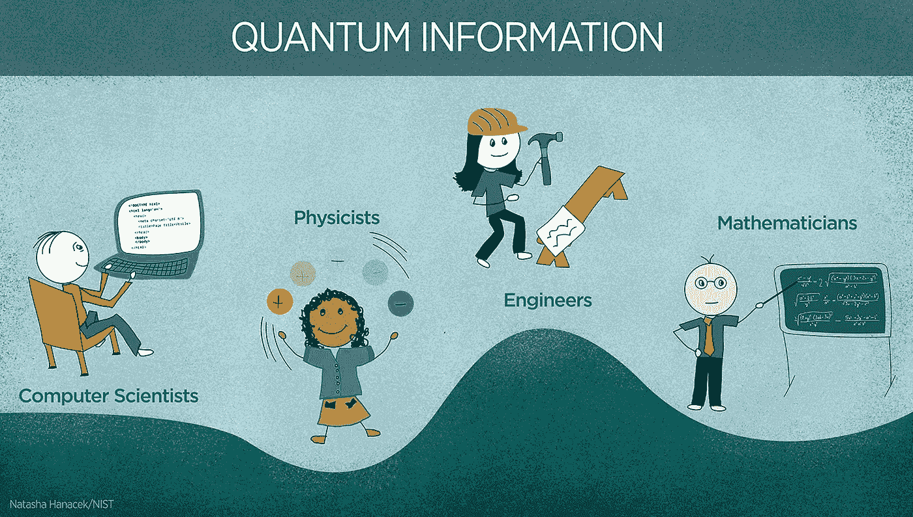*

> *“计算是一个物理过程，如果你从这个角度来考虑，它会在计算和物理科学中打开各种新的视野，”NIST 的数学家罗恩·布瓦韦特说*

*1994 年，时任美国电话电报公司·贝尔实验室数学家的彼得·肖尔创造了一种算法，用于在未来的量子计算机上运行，可以快速破解用于银行和其他敏感交易的加密方案。根据 NIST 的说法，这一发现引发了一场竞赛，并发展成一个新的领域。*

## *量子优势*

*研究人员不再仅仅专注于建造一台可以执行 Shor 算法和破解加密代码的量子计算机。对许多人来说，中间目标是实现“量子优势”，这是加州理工学院的约翰·普雷斯基尔创造的术语。因此，当量子计算机能够执行普通计算机不可能或不切实际的任务时，这一目标就能实现，这在优化问题中通常被认为是有趣的。*

> *“有充分的理由相信量子计算机将擅长解决优化问题。首先，大自然似乎对它们没什么意见。当植物利用光合作用将阳光转化为能量时，它们一直在解决这些问题。”*

*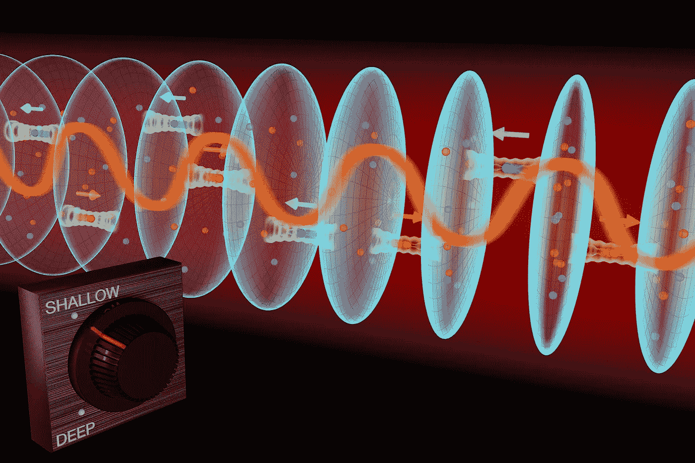*

*JILA physicists used the quantum properties of a strontium lattice atomic clock to simulate magnetic properties long sought in solid materials. The atoms are confined in an optical lattice, shown as an array of disk-shaped traps set at shallow depths. A laser (yellow wave) probes the atoms to couple the atoms’ spins and motions. The two atomic spin states (red and blue), which are also the clock “ticks,” are locked to the atoms’ right and left motions. *Credit: Steven Burrows and Ye Group/JILA**

## *量子化、叠加、消隐和纠缠*

> *“量子计算机将通过利用非常小的……的奇怪规则来获得它们的特殊能力”*“**

*这些规则之一是**量子化**。一名消防员在滑下一根柱子时，经历了一个平稳连续的重力势能范围。像电子这样的微小粒子可以在原子的能级之间进行突然的“量子”跳跃。*

*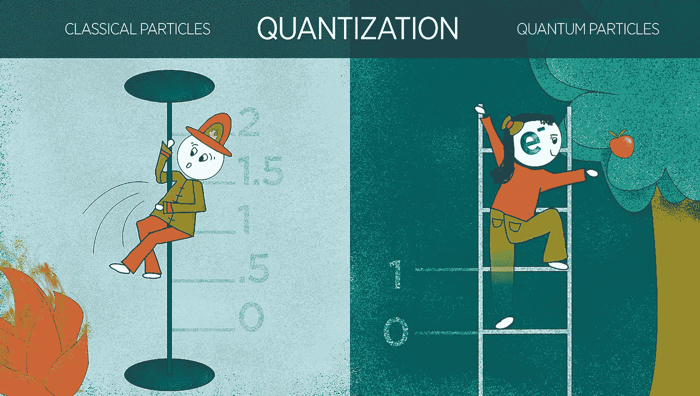*

**Credit: N. Hanacek/NIST**

***叠加。**在普通的经典世界中，滑板运动员一次只能在一个地点或位置，例如坡道的左侧(可以表示数据值 0)或右侧(表示 1)。但是，如果一个滑板运动员能够像一个量子物体(如原子)一样行事，他或她就可以处于 0 和 1 的“叠加”状态，有效地同时存在于两个地方。*

*有人认为这对信息技术非常有用。*

*普通的数据位只能是 0 或 1。*

*如果离子在碗的左右两边处于叠加状态，可以同时充当 0 和 1。*

*根据 NIST 的说法，量子比特，或称量子位，可以用来处理大量的信息，比传统的要快得多。*

*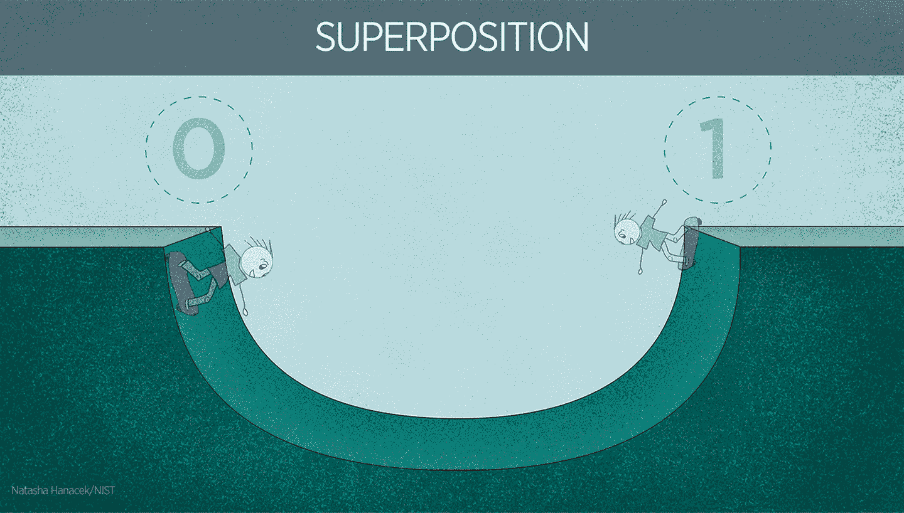*

*破坏叠加态被称为 ***退相干*** ，这是一个主要问题。因此，研究人员必须保护量子位，并隔离它们。*

*当一个量子叠加态(比如一个原子同时处于 0 和 1 态)被某种外界扰动破坏时，比如一个实验者测量原子，就会发生退相干。*

**

**Credit: N. Hanacek/NIST**

*量子计算机的另一个要素是 ***纠缠*** ，这可能是所有量子特性中最奇怪的。这是一种量子比特之间的量子联姻。*

*在被称为纠缠的量子现象中，即使两个粒子相距很远，它们的属性也是纠缠在一起的。*

> *阿尔伯特·爱因斯坦指出了这种“幽灵般的超距作用”，这让他非常不安，但这种行为已经被一次又一次地证实，包括在最近具有里程碑意义的 NIST 实验中。测量一个量子位的值，它就决定了第二个纠缠量子位的值。”*

*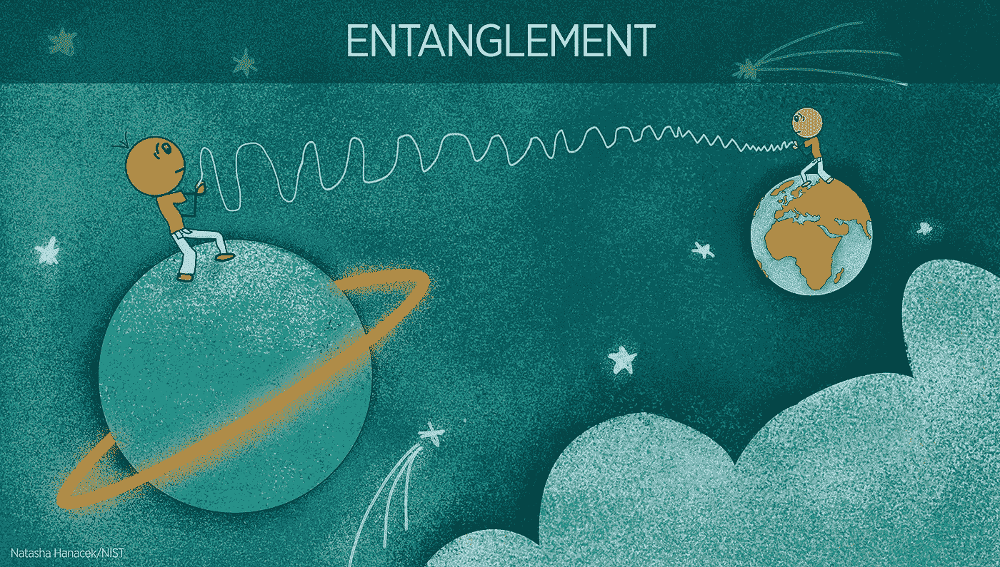*

*The NIST process for”purifying” an unusual property of quantum physics calledentanglement involves illuminating two pairs of beryllium ions (charged atoms)with a series of ultraviolet laser pulses. Credit: Bill Pietsch, Astronaut 3Media Group Inc.*

*然而，量子位越多，它们的解密速度就越快。NIST 声称这就是为什么仍然没有量子计算机能够执行真正有用的任务。在做任何有价值的事情之前，系统可能会崩溃。*

## *原子钟和纠缠理论*

*在 20 世纪 90 年代，NIST 的研究人员已经有了量子位，但称之为原子钟。*

> *“原子钟报时的精确度惊人。NIST-F2 是美国用于计时的最精确的原子钟，保持时间的精确度不到十亿分之一秒的百万分之一。这看起来似乎有些过火，但 GPS 卫星包含原子钟，并依靠这种精度来发送时间戳信号，帮助我们在地球上的任何地方精确定位，误差在一米以内。”*

*1994 年春末，人们通过电子邮件讨论 Shor 的结果，NIST 物理学家 Charles Clark 组织了 NIST 量子计算和通信研讨会。*

*阿图尔·埃克特，当时是牛津大学的物理学家。埃克特正在社区里四处传播这些令人兴奋的新想法。1991 年，埃克特提出了基于纠缠的量子密钥分配理论，这是量子密码术的一个重要组成部分，并在十年后的实际设备中得以实现。*

*他们设想在实验系统中使用捕获的离子。*

**[*在提出的方案*](http://journals.aps.org/prl/abstract/10.1103/PhysRevLett.74.4091) *中，研究人员将一组单个离子困在一条线上，就像电线上的鸟一样。激光将操纵离子的能量状态，使它们分别代表 0 和 1 或者两者的叠加。每一个离子都可以通过来回摇动来相互交流。摇动可以让每个离子与其邻居交换信息。这样，研究人员就能够用量子位进行计算。”***

**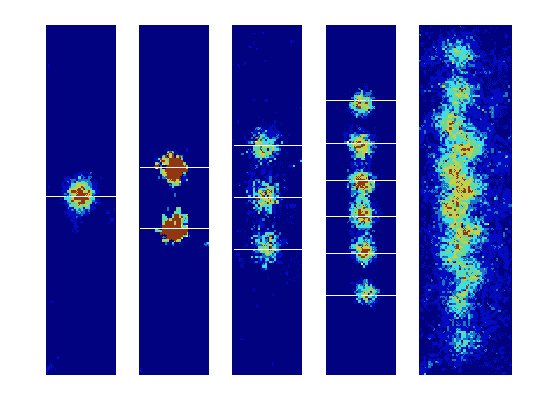**

**False-color images of 1, 2, 3, 6, and 12 magnesium ions loaded into a NIST planar ion trap. Red indicates areas of highest fluorescence, or the centers of the ions. As more ions are loaded in the trap, they squeeze closer together, until the 12-ion string falls into a zig-zag formation. *Credit: Signe Seidelin and John Chiaverini/NIST***

**因此，他和小组成员克里斯·门罗用激光控制离子的能量状态，以影响它们的运动。1995 年 12 月，他们宣布了量子计算机的第一个组件。**

## **量子逻辑门**

> **"逻辑门是处理信息的构件."**

**通过在电路中安排门，工程师可以创建类似于流程图的东西，使计算机能够执行多种逻辑运算，如数学计算，并执行计算机可以完成的各种任务。**

**使用激光，研究人员还可以使离子的内部能量状态进入 0 和 1 的叠加状态，使离子的运动进入 0 和 1 的叠加状态。这使得门可以同时处理多种可能性，不像普通的逻辑门，所以门可以同时考虑商业交易的“是”和“否”两种可能性。**

**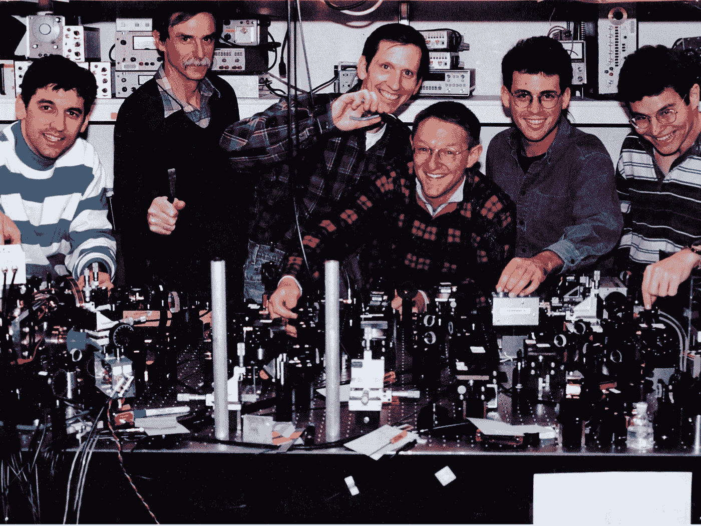**

**David Wineland and other members of NIST’s Ion Storage Group in 1996, shortly after they began to do experiments in the field of quantum information. *Credit: Courtesy Chris Monroe***

**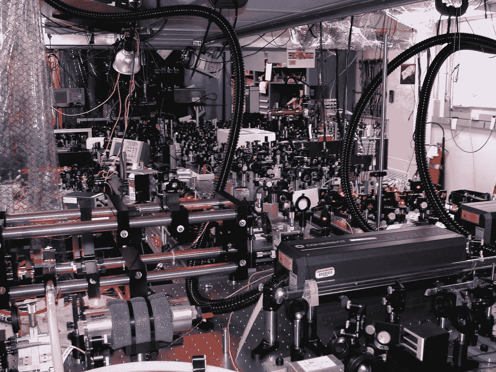**

**Elaborate laser-table setups such as this one in a NIST-Boulder lab are where many important quantum-information experiments get done. *Credit: J. Jost/NIST***

****相互纠缠的多个量子位**可以用来同时进行大量的计算。**

****两个量子位的门可以同时处理四种可能的 0 和 1 的组合。****

****三量子位门可以处理八种可能的组合。****

> **“每增加一个量子位，门可以同时处理的组合数量就会增加一倍，所以每增加一个新的量子位，组合数量就会呈指数增长。”**

**然而，测量只能提取关于计算结果的少量信息。部分理解为什么 NIST 提到另一个概念。**

*****波粒二象性*** *:* 一切物体既可以充当粒子，也可以充当波。作为波，离子在空间中有波峰和波谷；峰值代表测量时更可能发现离子的位置。波峰和波谷叠加在一起就形成了新的波形。这些波将组合或“干涉”形成新的波型。通过干扰波，科学家创造出可以转换回量子位值的模式，并产生有用的信息。**

**根据 Ronald F. Boisvert 的说法，量子计算需要创建所有可能答案的均匀叠加，然后操纵该叠加。因此，当一个人进行测量时，他很有可能得到正确的答案。**

## **建造量子计算机的竞赛**

**如前所述，最微小的扰动都会破坏量子位中的叠加态，当你给纠缠量子系统添加越来越多的量子位时，它会变得越来越脆弱。**

**NIST-博尔德小组创造了一个“跑道”阱来捕获和存储多种离子，并用于处理量子信息。他们建造了一个[量子处理器](https://www.nist.gov/news-events/news/2009/11/nist-demonstrates-universal-programmable-quantum-processor-quantum)，可以运行任何只需要两个量子位的计算机程序。**

> **“一台实用的量子计算机将需要更多的量子位，所以一个想法是将许多这些双量子位处理器连接起来，让它们作为一台成熟的计算机一起工作。”**

**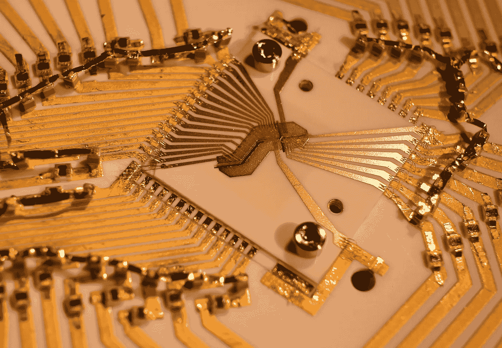**

**A gold-on-alumina trap inside a case that protects against electrical interference. *Credit: Blakestad/NIST***

**还有人试图建造微小的微观“量子”鼓，通过释放被称为声子的微小能量包来振动。**

**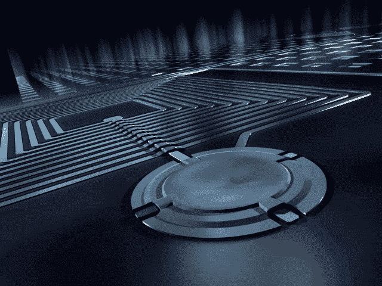**

**NIST’s microscopic aluminum drum, embedded in a superconducting circuit, has both classical and quantum properties. Like a percussion instrument it oscillates at a steady rate with a well-defined amplitude (drum height). It could be used for storing quantum information.**

> **[公司](https://en.wikipedia.org/wiki/List_of_Companies_involved_in_Quantum_Computing_or_Communication)——从谷歌、IBM、英特尔和微软这样的大公司到量子电路公司和 JQI 门罗创办的创业公司 IonQ 这样的小公司——也在致力于制造量子计算机**

**根据 NIST 的说法，实现量子优势的竞争是激烈的。**

*   **谷歌的 John Martinis(前 NIST 研究员)[宣布](https://www.aps.org/publications/apsnews/201705/quantum.cfm)该公司的目标是很快展示一台使用超导元件的 49 量子位量子计算机。**
*   **IBM [报道了一个基于超导元件的 50 量子位系统](http://www-03.ibm.com/press/us/en/pressrelease/53374.wss)的建造和测试。**
*   **在 2018 年拉斯维加斯 CES 展上，英特尔公布了一款 [49 量子位量子测试芯片](https://newsroom.intel.com/news/intel-advances-quantum-neuromorphic-computing-research/)。**
*   **在日本，研究人员已经建立了一个系统，使用光纤中的光子来创建他们所谓的[量子神经网络](https://qnncloud.com/)，旨在作为一台擅长处理旅行推销员问题等任务的专用量子计算机。**

**人们认为第一台量子计算机会像 20 世纪的第一台传统计算机一样庞大。**

**就用途而言，通讯似乎有潜力，可以远距离传送信息。**

> **“研究人员似乎同意一件事:光子或光的粒子将被用来从一台量子计算机向另一台传输信息。在最近一次引人注目的演示中，[中国将纠缠光子](http://www.sciencemag.org/news/2017/06/china-s-quantum-satellite-achieves-spooky-action-record-distance)从一颗卫星发送到 1200 公里(约 750 英里)外的地面。**

## **加密随着量子计算死去了吗？**

**当我听到谈论量子计算时，最常见的是与安全联系在一起。然而，根据 NIST 的说法，由于两项发展，所有的希望都没有失去:量子密码术和后量子加密。**

****量子密码术**:测不准原理表示测量任何物体都会干扰它。量子加密依赖于这样一个事实，即窃听(试图获取信息)是一种测量形式，会以一种可以被检测到的方式干扰系统。量子密码术在安全通信中也有应用。中国[的研究人员最近使用技术](http://physicsworld.com/cws/article/news/2017/sep/29/beijing-and-vienna-have-a-quantum-conversation)与远在 2500 公里(约 1600 英里)之外的澳大利亚同事进行了一次安全视频通话。**

**另一方面，它可能不可行，原因有三:**

1.  **它非常昂贵**
2.  **它旨在防止窃听者而不是攻击者**

**然而，量子密码系统非常昂贵，而且可能被黑客攻击:**

> **“……已经证明，即使是基于量子特性的密码系统[在现实世界条件下也可能被黑客攻击](https://www.technologyreview.com/s/418968/commercial-quantum-cryptography-system-hacked/)；例如，当静电或噪声——受经典物理规则支配——不可避免地被引入系统时。”**

**量子密码术被设计来保护两个可信任方之间的通信不被窃听者截获。**

**但是如果另一边的人是网络攻击者呢？窃听者目前并不是网络安全中最大的担忧。**

****后量子加密**:加密数据的方式，使用不涉及因式分解的数学函数。后量子算法是基于量子信息之前的经典数学技术。研究人员已经在开发后量子算法，以防量子计算机成为现实。**

## **没有计算机的量子信息应用**

****量子传感器**:原子钟有可能被用作量子传感器。这些量子逻辑时钟是新一代超精密计时设备的一部分。这些新装置非常精确，它们不仅仅可以报时；它们可以作为重力和其他属性的传感器。**

**另一种是 [**原子陀螺仪**](https://www.nist.gov/news-events/news/2016/08/nists-compact-gyroscope-may-turn-heads) ，“一种旋转传感器，利用波粒二象性。**

> **“我们通常认为原子是微小的球——换句话说，是粒子。但是在适当的情况下，原子可以表现为波。一个原子的波长——连续波峰和波谷之间的距离——太小而无法察觉，但如果你让原子变得更冷，它们的波长就足够大，可以在当今的实验中被探测到。”**

****

**Artist’s depiction of quantum simulation. Lasers manipulate an array of over 50 atomic qubits in order to study the dynamics of quantum magnetism. *Credit: E. Edwards/JQI***

****量子隐形传态**:NIST 国家标准与技术研究所的研究人员已经将光粒子中携带的量子信息“隐形传态”或转移超过 100 公里(km)的光纤，比之前的记录远了 4 倍。**

## **第二次量子革命**

**根据 NIST 的说法，我们似乎正在取得很大进展，已经到了“第二次量子革命”的地步。**

****第一次革命**:当科学家们知道量子力学的规则并按照这些规则建造设备时，使得激光和晶体管等发明成为可能，这些发明是计算机的基本组成部分。**

****第二次量子革命**:在比以前更大的程度上控制单个量子系统，如带电分子，使量子信息的应用更加强大。这种方法借用了实验 NIST 原子钟的量子逻辑方法。**

**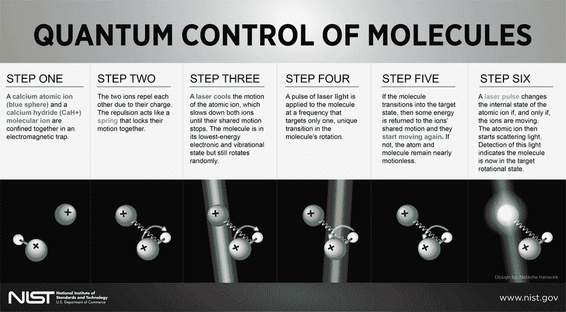**

***Credit: N. Hanacek/NIST***

**实验室天体物理联合研究所(JILA)的三维(3-D)量子气体原子钟是第二量子分辨率的早期例子，它将锶原子之间的相互作用控制到一个精致的程度，使原子钟比以往任何时候都更加精确。**

**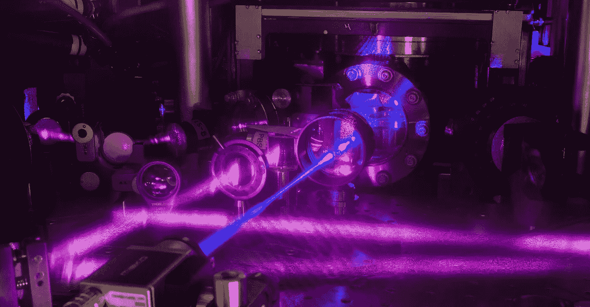**

***Credit: G.E. Marti/JILA***

> **“……赌注很高，从国家到企业，每个人都在参与这场游戏。”**

## **与量子相关的人工智能的新发展**

**因此，我们也许可以看到一些与人工智能领域的联系。处理信息对许多公司来说都很重要，量子力学导致了半导体的出现，这就是我们今天所知道的计算的出现。提到了对量子发展感兴趣的大公司，但是我将提到一个:谷歌。**

> ****谷歌的企业使命是“组织世界上的信息，并使其普遍可用和有用。”****

***在物理学中，一个* ***量子*** *(复数:quanta)是参与一个相互作用的任何物理实体(物理性质)的最小量。***

***在物理学和计算机科学中，* ***量子信息*** *是量子系统状态的信息。它是量子信息理论研究的基本实体，并且可以使用量子信息处理技术来操纵。***

**因此，世界上最大的技术公司之一对最小的信息部分都感兴趣，而 Google.com 是世界上访问量最大的网站。**

**谷歌有一个名为 **Quantum 的团队:谷歌人工智能**的一项研究成果:*“…旨在构建量子处理器和开发新的量子算法，以大幅加速机器学习的计算任务。”***

****量子计算**正如谷歌人工智能所描述的:*“是一种新的范式，将在加速人工智能的任务方面发挥重要作用。我们希望为研究人员和开发人员提供开源框架和超越传统能力的计算能力。”***

**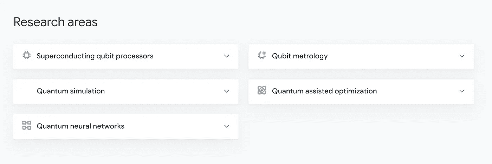**

**As of Sunday the 13th of October 2019 these are the areas in Quantum at Google AI**

**他们有开源框架，专门用于开发新的量子算法，以帮助解决实际问题的近期应用。一个工具是 Cirq，另一个是 OpenFermion。**

**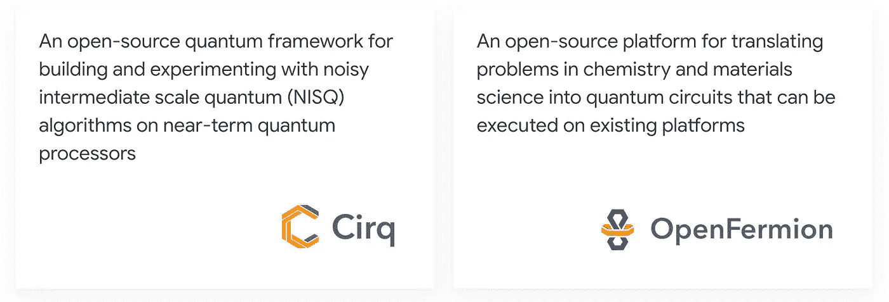**

**Two tools used by Google AI in Quantum retrieved Sunday the 13th of October 2019**

**他们将近期应用描述为:**

*   **量子模拟:通过化学和凝聚态模型的精确模拟来设计新材料和阐明复杂物理是量子计算最有前途的应用之一。**
*   **错误缓解技术:他们致力于开发全量子纠错的方法，这种方法能够显著降低当前设备中的噪声。**
*   ****量子机器学习**:他们正在近期量子器件上开发混合量子-经典机器学习技术。**
*   ****量子优化**:航空航天、汽车和其他行业的离散优化可能会受益于混合量子经典优化，例如模拟退火、量子辅助优化算法(QAOA)和量子增强群体转移可能会与当今的处理器一起使用。**

## **谷歌的量子机器学习**

**他们正在研究通用量子电路学习，用于量子和经典数据的分类和聚类。他们还对生成性和鉴别性量子神经网络感兴趣，这些网络可以用作量子通信网络中的量子中继器和状态净化单元，或者用于验证其他量子电路。**

**谷歌人工智能的团队正在探索量子神经网络:**

** [## 探索量子神经网络

### 自成立以来，谷歌人工智能量子团队一直致力于理解量子计算在机器中的作用…

ai.googleblog.com](https://ai.googleblog.com/2018/12/exploring-quantum-neural-networks.html) 

> “从一开始，[谷歌人工智能量子团队](https://ai.google/research/teams/applied-science/quantum-ai/)就致力于理解量子计算在[机器学习](https://en.wikipedia.org/wiki/Machine_learning)中的作用。”

它们通常仍在取得进展，研究正处于开始应用的实验阶段。

2019 年 9 月 20 日，据英国《金融时报》报道，谷歌声称已经建造了第一台量子计算机，可以进行超过当今最强大的超级计算机能力的计算，这是研究人员热切期待的里程碑时刻。代号为 Sycamore 的 53-qubit design it 似乎做到了这一点，但谷歌并未在文章中置评。

后来的 [*新科学家*](https://www.newscientist.com/article/2217835-google-has-reached-quantum-supremacy-heres-what-it-should-do-next/) 在 9 月 26 日宣称谷歌已经达到*‘量子霸权’*。

> “谷歌的量子计算机解决了一个叫做随机电路采样问题的任务。在这样的问题中，经过一系列的计算后，每个量子位输出 1 或 0。目的是计算每种可能结果发生的概率。谷歌表示，Sycamore 只需几分钟就能找到答案——它估计在最强大的超级计算机上完成这项任务需要 10，000 年。虽然这令人印象深刻，但它没有实际用途。”

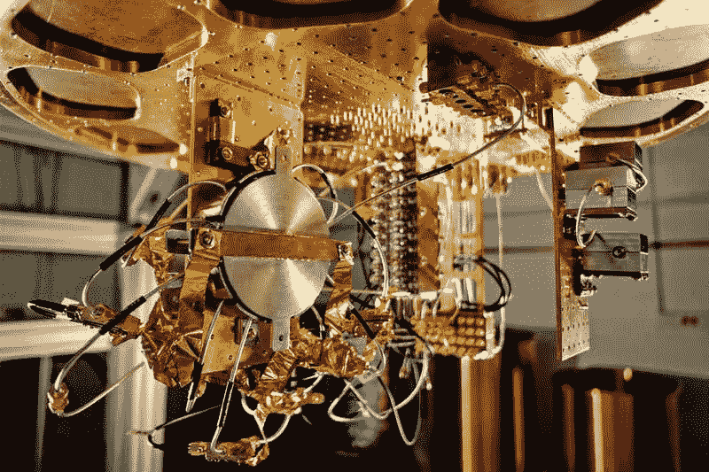

Eric Lukero/Google through [NewScientist](https://www.newscientist.com/article/2217835-google-has-reached-quantum-supremacy-heres-what-it-should-do-next/) retrieved the 13th of October 2019

*Google’s qubit circuits are built out of superconducting materials, which are then kept at very low temperatures.* Google developed a 53-qubit design called Sycamore, which was used to achieve the recent breakthrough.

据报道，他们最近利用可编程超导处理器取得的名为*量子优势的突破性进展的完整论文已经公布，并且可以在网上[阅读](https://www.docdroid.net/h9oBikj/quantum-supremacy-using-a-programmable-superconducting-processor.pdf?referrer=https%3A%2F%2Fwww.inverse.com%2Farticle%2F59507-full-quantum-supremacy-paper)。然而，等待谷歌确认本文中的任何信息可能是明智的。下面是总结:*

量子计算机诱人的前景是，某些计算任务在量子处理器上的执行速度可能比在经典处理器上快得多。一个根本的挑战是建立一个高保真处理器，能够在指数级大计算空间中运行量子算法。在这里，我们报告了使用具有可编程超导量子位的处理器来在 53 个量子位上创建量子态，占据状态空间 253 \u 1016。来自重复实验的测量采样相应的概率分布，我们使用经典模拟来验证。虽然我们的处理器需要大约 200 秒来对量子电路的一个实例进行 100 万次采样，但最先进的超级计算机将需要大约 10，000 年来执行相同的任务。相对于所有已知的经典算法，这种显著的加速提供了计算任务上量子优势的实验实现，并预示着备受期待的计算范式的到来。”

考虑量子信息和人工智能的交叉领域接下来会发生什么是很有趣的。也很难说它将走向何方，也许是一种新的计算范式？** 

***这是第 500 天的第 132 天。500 天来，我每天都写一篇关于人工智能或与之相关的新文章。***