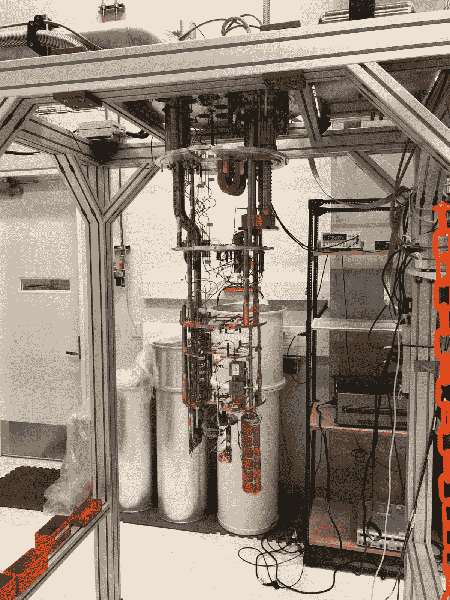

# 商业量子计算

> 原文：<https://towardsdatascience.com/quantum-computing-for-business-347b95d400f9?source=collection_archive---------13----------------------->

## 在过去的一年里，我们见证了量子计算领域的惊人进步，以及来自全球企业的全新兴趣。

**本文呈现了** [**量子计算**](/quantum-books-you-should-read-in-2020-e58c34befbf) **现在的商业前景和现实应用。**

a quantum computer

# 什么是量子计算？

经典计算机有一定的局限性。摩尔定律，大致说的是计算能力每两年翻一番，正慢慢走向终结，因为与进一步小型化相关的根本性技术壁垒。另一方面，计算机是线性运行的，处理一个又一个任务，计算的并行化受到阿姆达尔定律的限制。将这两个因素结合在一起意味着处理真正困难的现实生活问题或简单的真正大数据将需要计算范式的转变。

量子计算机是潜在的解决方案之一。他们正在对量子位进行操作，量子位本身会受到纠缠或叠加等量子效应的影响。这意味着它们可以同时一起工作，因此省略了阿姆达尔定律。此外，与经典电脑的线性性质相反，它们的能力会随量子位元的数目成指数增长。总之，这引起了工业界和学术界应有的关注。你可能已经看到一些文章描述了一个量子的未来，在破解任何安全代码或密码方面，因为量子计算机的计算能力将不可避免地远远超过经典计算机。

# 量子计算机有多强大？

我们还没有到那一步。尽管最近大肆宣传，我们仍然在[量子优势](https://medium.com/@pchojecki/quantum-advantage-b3458646bd9)之前，这是一个实际的证明，量子计算机可以比经典计算机更好地解决现实世界的问题。这意味着，你不应该指望量子计算机会让你的业务得到全面优化。至少现在没有。那么量子计算是假的吗？肯定不是！这只是过程的早期，像往常一样，有你必须付出的代价，投资失败的潜在风险，但一旦技术更加成熟，也会有回报。

在理论层面上，不同的研究小组证明了某些量子算法将提供超越经典算法的指数级加速。然而，他们都假设量子计算机具有足够良好的量子位，这不是当前的硬件水平。我们目前正处于嘈杂的中等规模量子器件时代，简称 NISQ。[谷歌](https://ai.google/research/teams/applied-science/quantum-ai/)、 [IBM](https://www.research.ibm.com/ibm-q/) 、[微软](https://www.microsoft.com/en-us/quantum/)、 [D-Wave](https://www.dwavesys.com/home) 、 [Rigetti](https://www.rigetti.com/) 、 [IonQ](https://ionq.co/) 等公司都在尝试打造自己的 NISQ 设备。最近几年有很多进展，导致了具有几十个量子位的硬件的产生，并解决了现实世界的问题，如[优化城市中的出租车路线](https://www.volkswagenag.com/en/news/2018/11/Volkswagen_intelligent_traffic_management.html)或[模拟分子](https://www.technologyreview.com/the-download/608866/ibm-has-used-its-quantum-computer-to-simulate-a-molecule-heres-why-thats-big/)。这些解决方案并不完美，也不如在超级计算机上获得的解决方案最优，但它们显示了一个良好的趋势——量子计算机真的正在达到商业水平，这是迟早的事情。

寻找次优解决方案是量子空间中所有服务提供商在现阶段提供混合解决方案的原因之一，这些混合解决方案将经典机器学习与量子计算相结合，例如 1QBit、Zapata 或 QxBranch。一些公司只提供在模拟器上工作的服务(在经典计算机上模拟的量子计算，目前比较 [Atos](https://atos.net/en/insights-and-innovation/quantum-computing/atos-quantum) 、 [Xanadu](https://www.xanadu.ai/) 或[微软](https://www.microsoft.com/en-us/quantum/))或在量子启发的硬件上工作的服务([富士通数字退火机](http://www.fujitsu.com/global/about/resources/news/press-releases/2018/1221-01.html))。混合方法会在快速扩展的问题中产生有趣的结果，例如在物流中，或者在只有稀疏数据的情况下，例如预测涡轮机何时会发生故障。这些类型的问题不可能在经典计算机上很好地解决，因此它们为量子计算机提供了一个很好的切入点，量子计算机提供了不同的计算方法和替代的、有趣的解决方案。

我们仍然需要几年的时间才能在不同的行业达到量子优势，但现在是开始实验量子的最佳时机。量子计算机与经典计算机完全不同，因此习惯它们需要一个过程。现在就启动它将让你的公司为量子计算比经典计算更强大的时刻做好准备。

# 量子计算机的商业应用

我写这篇文章的主要原因是总结量子计算在当今商业世界中的潜在应用。你会发现下面是一些行业的列表，在这些行业中，量子计算机已经和我们现在拥有的技术一起使用。我举了一些已经在尝试的公司的例子，只要有关于它的公开信息和可用的链接。我只展示了最大的企业，但是已经有一些中型公司为了他们的利益而试验量子。

*   **金融**:银行业呈现出过多的问题，如投资组合优化、资产定价、风险分析、欺诈检测、市场预测，这些都在量子计算机的能力范围之内。首先，银行已经开始尝试，例如[巴克莱和摩根大通](https://www.americanbanker.com/news/why-banks-like-barclays-are-testing-quantum-computing)与 IBM 合作，或者 [NatWest 与富士通](http://www.fujitsu.com/fts/about/resources/news/press-releases/2018/emeai-20181002-fujitsu-drives-quantum-inspired-project-to.html)合作。
*   **保险**:量子计算的潜在应用始于金融工具(债券、衍生品)的估值；保险产品的期权和担保的估价；量化运营风险。[安联保险公司](https://www.finextra.com/newsarticle/31395/rbs-and-allianz-join-c45m-funding-round-for-quantum-computing-startup-1qbit)通过与 1QBit 合作开始试验。
*   **能源板块**:优化现有网络结构和预测使用量是两大关联问题，都很适合在量子计算机上测试。[埃克森美孚](https://www.businesswire.com/news/home/20190107006017/en/ExxonMobil-IBM-Advance-Energy-Sector-Application-Quantum)已经开始尝试将 IBM 作为量子合作伙伴。
*   **交通**:量子计算机使用的最好例子是交通优化，就像[大众](https://www.volkswagenag.com/en/news/2018/11/Volkswagen_intelligent_traffic_management.html)和 D-Wave 一起做的那样。旅行推销员问题及其各种变体构成了在 NISQ 设备上尝试的一类很好的问题。
*   **物流**:与运营相关的供应链问题通常很复杂，无法通过经典计算机进行优化，这为 quantum 进入市场创造了良好的潜力。阿里巴巴开始在自己的硬件上进行实验。
*   **汽车和航空**:自动驾驶或飞行，或者管理一个庞大的车队都会带来优化问题，这些问题会随着车辆数量的增加而迅速扩大。这就是为什么像[大众](https://www.volkswagenag.com/en/news/stories/2018/06/avoiding-traffic-jams-and-surviving-tsunamis.html)、[戴姆勒](https://www.daimler.com/innovation/google-cooperation.html)或[福特](https://spectrum.ieee.org/cars-that-think/transportation/self-driving/ford-signs-up-to-use-nasas-quantum-computers)这样的汽车行业玩家都在进入这个领域。航天工业也非常活跃，NASA、空客、洛克希德·马丁和合作伙伴都在进行试验，从科技巨头到初创企业。
*   **化学品和制药**:药物发现是一个非常昂贵的过程，模拟分子需要大量的计算。量子计算机自然适合制药研发，因为它们更适合模拟量子物体，因为它们本身具有量子特性。 [Biogen](https://www.accenture.com/us-en/success-biogen-quantum-computing-advance-drug-discovery) 在量子计算的药物发现应用方面与埃森哲合作。再比如[罗氏](https://www.roche.com/quantum-computing.htm)和[陶氏化学](https://corporate.dow.com/en-us/news/press-releases/dow-and-1qbit-announce-collaboration-agreement-on-quantum-computing)。
*   **材料**:指望更好的电池、芯片或网络架构的行业可以探索量子计算，模拟新的可能性或优化现有结构。这个商业垂直领域的实验是由[博世](https://www.bosch.com/research/fields-of-innovation/quantum-technologies/)和[霍尼韦尔](https://www.honeywell.com/newsroom/news/2018/09/leap-into-quantum-computing)开始的。
*   **区块链和网络安全**:区块链是关于安全交易和合同的。它主要依赖于加密方法，因此容易受到涉及最新技术的网络攻击。这就是为什么探索后量子密码术或量子区块链是对未来的良好准备。到目前为止，只有[埃森哲](https://www.accenture.com/us-en/insights/technology/quantum-cryptography)将区块链与量子一起提及。然而，网络安全公司有一个整体趋势，那就是关注后量子密码术，即在拥有强大量子计算机的世界中安全运行的算法，参见[微软](https://www.microsoft.com/en-us/research/project/post-quantum-cryptography/)或[谷歌](https://security.googleblog.com/2016/07/experimenting-with-post-quantum.html)。

这只是冰山一角。我只描述了最大的企业和他们的风险投资，还没有提到活跃的创业社区或已经在这个领域工作的中型公司。毫无疑问，量子计算是下一件大事！

# 量子计算如何入手？

如果你已经决定要在你的组织内试验量子计算，你能做的最好的事情就是找到一个可以向你介绍这个领域的合作伙伴。目前有几十家初创公司和公司提供量子计算服务，要么是在利基业务分支，要么是在一般情况下。如果你在寻求帮助，只需通过社交媒体给我写一条信息。

如果你想了解更多关于量子空间的内容，这里有一些很棒的概述文章:

*   BCG 关于量子计算商业生态系统的广泛[报告，](https://www.bcg.com/publications/2018/next-decade-quantum-computing-how-play.aspx)
*   [量子计算有线指南](https://www.wired.com/story/wired-guide-to-quantum-computing/)解释其工作原理，
*   [麻省理工技术评论](https://www.technologyreview.com/s/610250/serious-quantum-computers-are-finally-here-what-are-we-going-to-do-with-them/)更多技术视角的概述。

祝你的量子之旅好运！

[**如果你想了解更多，可以看看这个关于量子计算的书单。**](/quantum-books-you-should-read-in-2020-e58c34befbf)