# 量子计算速成班使用非常丰富多彩的图表

> 原文：<https://towardsdatascience.com/quantum-computing-with-colorful-diagrams-8f7861cfb6da?source=collection_archive---------3----------------------->

## 几乎所有你需要知道的关于量子计算的东西都用非常直观的图画来解释…

Have a quantum cat

量子计算是一个相对较新的、崭露头角的领域，它打破了量子物理学、研究或非常小的事物以及计算机科学的概念。

在这篇文章中，我将用直观的类比和一如既往的丰富多彩的草图和绘图向您介绍驱动这个年轻的、不断增长的领域的概念。

***注意:*** *为了简单起见，我不会在本文中涉及数学和向量符号。如果有兴趣阅读这样的文章，请在下面留言或通过* [*Twitter*](https://twitter.com/rishabh16_) *联系我！*

## 经典计算机科学中的信息表示

经典计算机科学涉及比特的流动和操作，比特是计算机中信息的基本单位。它可以保存 1 或 0 的值，但不能同时保存两者。

1 或 0 通常对应于硬件上一个原子的电荷，代表计算机中的真/假或开/关状态。

这些电荷的变化导致位从 1 到 0 的翻转，反之亦然，从而允许信息从存储器的一个位置流向另一个位置。

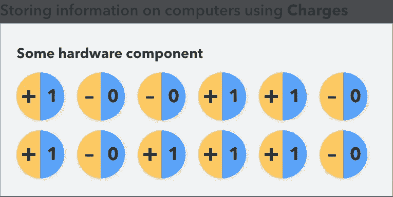

Traditional bits are just charges on computer hardware that store information depending on their charge.

## 在量子计算中表示信息

在传统的计算机中，信息是用传统的位来表示的，这些位只能拥有 1 或 0 的值，而不能同时拥有这两个值。在量子计算机中，我们用量子比特(量子比特)来表示信息。

我们可以用 ***bra-ket*** 符号来表示量子位:|0⟩或|1⟩，分别读作‘ket 0’和‘ket 1’。

嗯，在量子计算中，量子位可以同时具有 1 和 0 的值，因为有一个叫做 ***叠加*** 的过程。

## 叠加的奇怪例子

叠加是指一个粒子或实体可以同时以两种状态存在的现象。它可以作为两个东西存在，也可以存在于两个不同的位置。例如，让我们看看薛定谔的猫悖论。

如果你把一只猫锁在一个隔音的、不可避免的掩体内，掩体内有一些可能爆炸的爆炸材料，这只猫处于死亡的*和活着的*的叠加状态，因为你不知道材料是否真的爆炸了(可能是因为掩体是隔音的)。**

**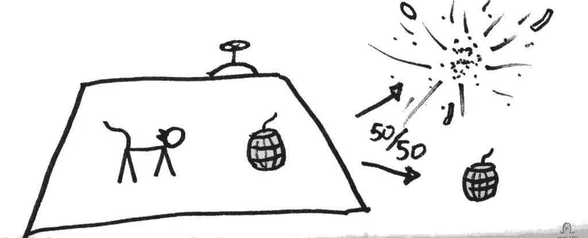**

**There is a 50–50 chance of the explosive material either blowing up and killing the cat or staying as is. This is taken from the Minute Physics video on Quantum Superposition**

**只要你不打开地堡检查，猫在技术上是死的和活的。**

**然而，当观察者实际检查叠加态物体的状态时，一个奇怪的情况出现了。在这种情况下，现实崩溃为一个单一的结果，它不能再同时存在于多个状态中。同样，如果你再也憋不住了，打开地堡，你可能会看到猫死了。**

> **你猜怎么着？你的好奇害死了猫…**

**或者，你检查的时候猫可能还活着。当一个观察者(在这种情况下是你)观察一个最初处于叠加状态的物体时，他们只会看到 n 个结果中的一个展现在眼前。如前所述，现实崩溃的结果之一。**

## **这和量子计算有什么关系？**

**一个量子位可以以叠加态存在，同时携带 1 和 0 的值。这为解决需要大量计算能力的复杂问题打开了一个全新的可能性世界。**

**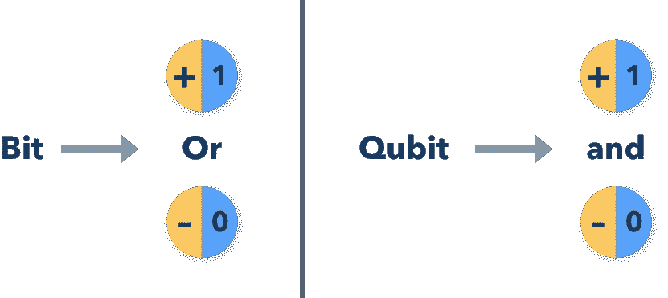**

**Qubits can exist in 2 possible states until observed (which causes reality to collapse to one of the states)**

## **传统逻辑门**

**为了操纵基本位，它们必须由逻辑门转换，逻辑门要么将位翻转到另一个值，要么让它们保持原样。逻辑门的一些著名例子包括与、或、非、异或和与非。**

**它们接受成对的位值，并根据门的功能将它们转换为 1 或 0。**

**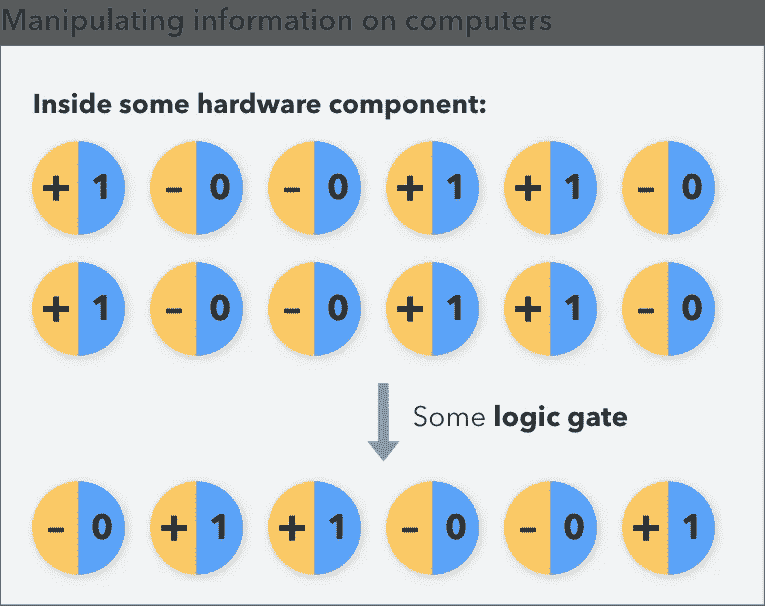**

**An example of a NAND gate that takes in pairs of similar bits and returns the flipped bit**

## **量子逻辑门**

**为了转换量子位，我们让它们通过量子逻辑门(或量子门)，量子逻辑门根据门的功能将量子位的现有状态映射到另一个状态。**

**这听起来可能很模糊，但量子门实际上是经典的逻辑门，作用于量子位而不是传统的位。量子门可以无一例外地执行标准经典逻辑门所能执行的所有动作。**

**让我们看几个量子门的例子:**

## **哈达马德门**

**或许最常见的是，阿达玛门接受一个量子位作为输入，输出一个量子位，这个量子位有 50%的几率是 1 或 0。**

**用简单的数学术语来说，量子位坍缩为 1 或 0 的概率是相等的。这本身就是一种叠加，输出量子位有两种可能的状态，直到我们*观察到*它或者在进一步的计算中使用它。**

**Hadamard 门由方框中的“H”表示，可以多次添加到电路中，以输出一个具有相同机会为 1 或 0 的位。**

**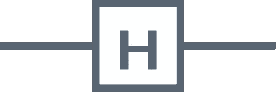**

**The Hadamard Gate**

**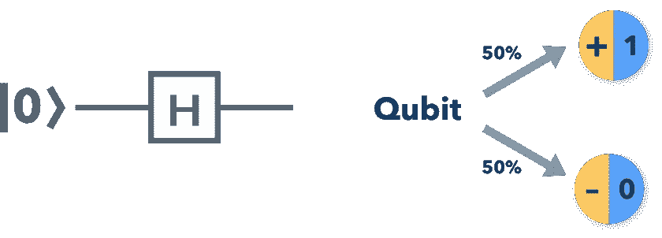**

**There’s a 50–50 chance of the Qubit collapsing to either a 1 or 0**

## **泡利-X 门**

**Pauli-X 门以 Wolfgang Pauli(顺便说一句，这个名字很棒)命名，它接受一个量子位。它本质上相当于**而非**门，它否定这些位并翻转它们。它在量子位上执行比特翻转。它将|0⟩映射/更改为|1⟩，将|1⟩映射/更改为|0⟩.**

****

**The Quantum equivalent of the NOT Gate — The Pauli Gate**

**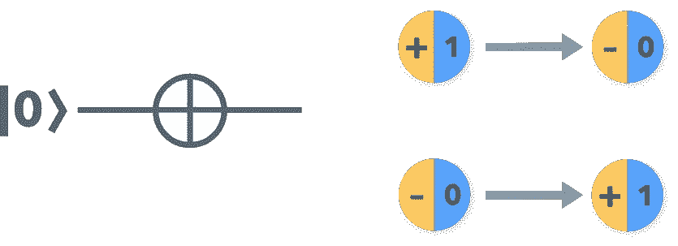**

**The Pauli-X Gate performs a bit flip and negates the Qubits**

## **受控非门**

**受控非门也被称为 CNOT 门。这接收 2 个量子位，并且如果第一个量子位是|1⟩.，只将第二个量子位从|0⟩翻转到|1⟩和|1⟩到|0⟩否则，它保持不变。**

**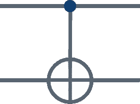**

**The CNOT or Controlled-NOT Gate**

**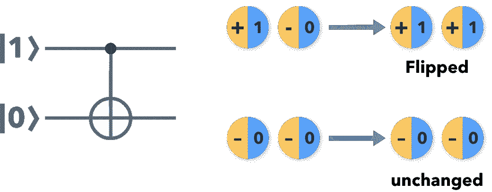**

**The CNOT gate only flips the second Qubit if the first Qubit is |1⟩**

## **尺寸**

**测量是在电路末端对量子位进行的一种特殊类型的操作，以在操作完成后获得量子位的最终值。**

**与上面的门相比，测量是不可逆的，因此不是量子门。我之前提到过，当一个观察者看到最初处于叠加状态的东西时，现实会坍缩成其中一个结果。**

**类似地，测量函数是观测器，它获取折叠量子位的值，并将它们放在一起，作为严格为 1 或 0 的最终输出位。**

****

**The Measurement function is represented as this symbol in a Quantum Circuit**

**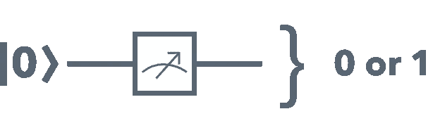**

**The Measurement function takes in a Qubit and observes it to collapse its state to either 1 or 0.**

## **代表量子模型**

**模型是物理学家用来模拟和观察当你以某种方式戳宇宙时会发生什么的东西。当涉及到可视化时，它们帮助很大。**

**同样地，量子模型代表处理许多量子现象的情况(例如叠加)。**

> **我们如何在计算机上表示一个数学量子模型？**

**我们通过使用量子电路来做到这一点。电路代表计算过程，其中量子位通过量子逻辑门，根据其类型/功能将量子位从一种状态转换为另一种状态。**

**为了建立一个量子电路，我们需要量子逻辑门和量子位的组合，通过时间来获得想要的结果。为了形象化量子电路的样子，请看下图。**

**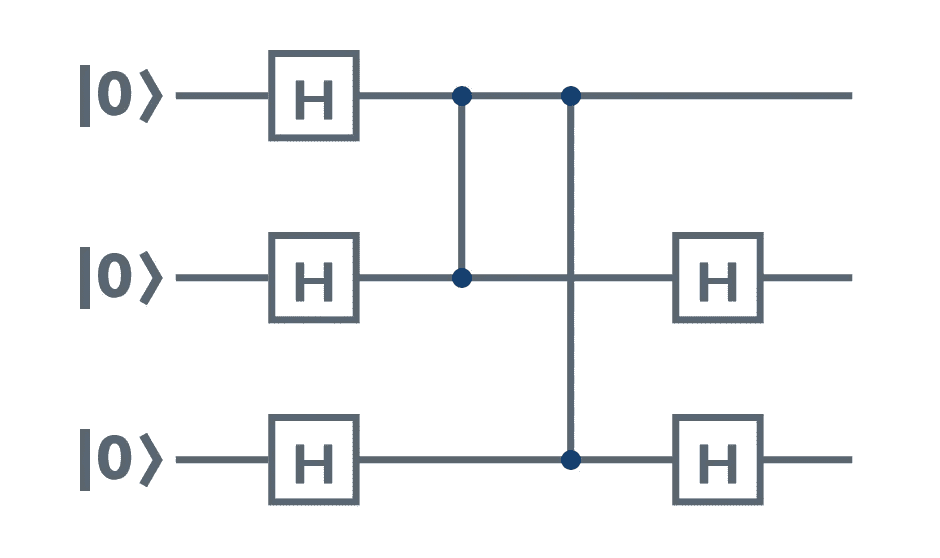**

**该图显示了三个量子位，都具有状态|0⟩或 ***ket 0*** 。盒子里的 **H** 代表量子逻辑门(H 是哈达玛门)。**

**在这个图中，我们可以看到每个量子位通过一个哈达玛门。第二和第三个量子位各自通过另一个哈达玛门。**

**通过将这些量子门和量子位放在一个电路中，你可以想象信息在电路中的流动。**

## **简单地**

**在这篇文章中，我试图总结量子计算背后看似困难的理论。量子计算是一个崭露头角的领域，有一个非常小的社区。在即将发表的关于量子计算的文章中，我将涉及数学和向量符号。**

**如果你想让我报道其他事情，请在下面发表评论，或者在 [Twitter](http://twitter.com/rishabh16_) 或 [LinkedIn](https://www.linkedin.com/in/rishabhanand16/) 联系我。很快，我将带你用简单的 Python 制作你自己的量子电路(是的。我说 Python)。**

**如果我犯了什么错误，请让我知道(我也在学习！).**

**在那之前，下期再见！**

## **相关文章**

**一定要看看我关于技术和机器学习的其他文章，以及对未来软件创新的评论。**

** [## 遗传算法综合指南(以及如何编码)

### 遗传算法的起源

medium.com](https://medium.com/sigmoid/https-medium-com-rishabh-anand-on-the-origin-of-genetic-algorithms-fc927d2e11e0)  [## CatGAN:使用 GANs 生成猫脸

### GANs 的详细回顾以及如何跟他们浪费时间…

hackernoon.com](https://hackernoon.com/catgan-cat-face-generation-using-gans-f44663586d6b)  [## TensorFlow.js 简介🎉

### 在浏览器上运行 ML 模型变得更加容易！

hackernoon.com](https://hackernoon.com/introducing-tensorflow-js-3f31d70f5904)  [## 马尔可夫链简介

### 马尔可夫决策过程的一般指南

medium.com](https://medium.com/sigmoid/rl-markov-chains-dbf2f37e8b69) 

里沙卜·阿南德的原创文章**