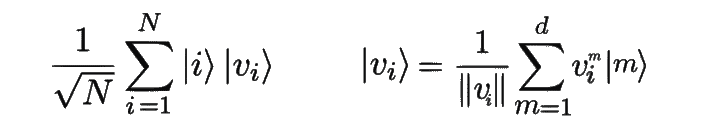

# 量子机器学习:量子计算机上的一种快速聚类算法

> 原文：<https://towardsdatascience.com/quantum-machine-learning-a-faster-clustering-algorithm-on-a-quantum-computer-9a5bf5a3061c?source=collection_archive---------11----------------------->

## *本作品发表在《论文集》****neur IPS 2019****，可以查看相关* [*论文*](http://papers.nips.cc/paper/8667-q-means-a-quantum-algorithm-for-unsupervised-machine-learning.pdf) *了解更多详情，以及* [*会议海报*](https://drive.google.com/open?id=1bi-K4-rbiwt_Nvv7PcxasW2iJxHCoPUr) *。*

量子机器学习是一个非常热门的话题。正如约尔达尼什·克里尼迪斯*(我的博士生导师)*所说:这是量子计算中**【最被夸大和低估】** 的话题。这个相当年轻的研究领域旨在开发执行机器学习任务的**量子算法**，例如对猫和狗进行分类的十亿美元市场。你什么都不需要知道，我会解释的。

I guess this is a superconducting qubit quantum chip, but to be honest I don’t know. It’s just pretty.

# 量子计算*1 分钟*

现在你可能会问:*什么是量子算法？与任何常规算法一样，它只是一系列命令，但这次它是由**量子门**组成的电路。*什么是量子门？*这就像一个经典的门，作为 OR，AND，NOT，作用于**量子比特**而不是比特。*什么是量子位？* 嗯，这是一个量子位:它可以是和**两者的一个位，而不是 **1 或 0** 。比如通俗地说，可以是叠加态 25%|0 > + 75%|1 >。我们用符号 **|0 >** 和 **|1 >** 来记住这些就是现在的量子态。更一般地说，一个量子位的状态是 **⍺|0 > + β|1 >** ，其中⍺和β是复数，称为**振幅**。**2 个量子位可以同时拥有|00 >、|01 >、|10 >和|11 >四种组合。8 个具有 3 个量子位的组合，等等，总是并行存在。那是量子物理！接受它，即使它在我们对现实的感知中并不常见。例如，一个量子位可以是一个原子、一个光子、一个离子或任何可以有两种状态的量子系统。就像一只小小的[薛定谔的猫](https://www.youtube.com/watch?v=IOYyCHGWJq4)。*****

**所以量子算法的输入是由量子位组成的。如果你有 ***n*** 个量子位，你同时有 ***个 2^n*** 个组态。你不喜欢吗？有了 300 个量子比特，你就有了 2^300 态，这是宇宙中原子的数量！**

**另一个重要的事实:如果你**测量**一组量子比特，你不会看到整个叠加(你不是量子)，而只是其中一个配置，随机的，概率与这个配置的振幅相关。**

****

**Most probably what a quantum computer will NOT look like.**

# **量子机器学习**

**有几种基本的量子算法被用作**长期**量子机器学习(QML)的构建模块。这些算法用于寻找矩阵的特征向量，执行矩阵乘法或矩阵求逆，估计两个向量之间的内积或距离。请记住这些重要的量子概念:我们可以通过多次测量来恢复量子态的经典描述，最重要的是，我们需要能够在单个量子态中加载一个矢量或一组矢量。所有这些子例程都允许**执行线性代数任务，并证明了加速**，通常在矩阵或向量的大小上指数级地更快，并有量化的误差保证。**

***注:有很多关于不同方法的研究，称为“量子机器学习”，这些方法基于参数化的量子电路。我们希望它们在短期内可能非常有用和强大，但是它们不能复制分析性的机器学习算法，也不能保证加速或准确性。我们的方法更多的是一种计算机科学和长期的方法。***

# **矢量的量子编码**

**这是关键部分！给定一个 d 维的向量 ***v*** ，我们可以通过使用它的每个分量作为表示标准基的状态的量子振幅来对它进行编码。这可以仅使用**对数(d)** 来完成。**

**我们现在可以为我们的数据集定义一组 **N** 向量 ***v_1*** ，…***v _ N****的量子编码。我们要开始叠加 N 个*向量，每个向量在维度*上。每个向量由其索引 ***i*** 给出，因此我们使用 **log(N)** 量子位创建所有索引的叠加。*****

********

****Left : Superpostion of N quantumly encoded vectors using log(N)log(d) qubits. Right : detailed expression of one vector quantumly encoded using log(d) qubits. Vector notation : ***v*** = (*v¹*,*v²*,…)****

# ****经典的 k 均值算法****

****先简单说一下经典机器学习。有监督和无监督算法之间有一个根本的区别:第一种算法从输入和它们的标签中学习*(我告诉你这些是猫，这些是狗，现在学习)*，而第二种算法在没有指示的情况下学习*(我只是告诉你找到两组不同的动物)*。****

********

****kmeans loop : The dots are vectors of the dataset. The black stars are centroids. Source : [https://blog.floydhub.com/introduction-to-k-means-clustering-in-python-with-scikit-learn/](https://blog.floydhub.com/introduction-to-k-means-clustering-in-python-with-scikit-learn/)****

****k-means 算法是最基本的无监督学习算法之一。它的目的是**在数据集中找到聚类**，通过找到 ***k*** 理想质心。然后，每个点都有一个标签，对应它的集群！****

****在每次迭代中，对于**每个**向量*(点)*，我们计算它们到**每个**质心*(黑星)*的距离。所以有***k*x*N***的距离来计算。如果你有几百万个数据点，那就太多了。****

****该算法的一次迭代做了两件简单的事情:
1)我们通过查看每个向量的当前最近质心，将标签更新到每个**向量。2)我们通过平均每个集群中的向量来更新每个**质心的**。******

# ****量子 k-均值****

****在[我们的论文](https://arxiv.org/abs/1812.03584)中，我们开发了一个 *k* -means 算法的量子模拟，称为***-q-means***。步骤真的一样，但是一切都是在量子叠加中完成的。****

> ****1 -我们从数据集中所有矢量的**的量子叠加开始，我们同时计算到 k 个质心中每一个质心的所有距离**。
> 2 -然后我们可以**通过选择最近的质心来同时标记所有向量**。所有的标签都是以量子态书写的，也是叠加态。
> 3 -然后**测量标签量子位**。量子物理学告诉我们，我们会随机只看到一个标签:它意味着剩余的量子态是**所有带有那个标签**的矢量的叠加！那是纯粹的量子把戏。
> 4 -利用量子矩阵乘法，我们可以得到一个描述**新质心**的量子态。
> 5 -我们执行断层扫描来**检索**新质心的经典版本
> 6 -我们重复最后的步骤，直到我们有了 **k** 新质心。****

****分析:因为 ***N*** 向量总是被叠加使用，所以运行这个算法**的时间与 N** 成对数关系！对 *k* 和 d 的依赖性几乎类似于经典的*k*-均值，其在 n 中是线性的。****

****请记住，这纯粹是一个理论算法，尚未在实际的量子计算机或经典模拟器上进行测试！如果你感兴趣的话，请继续，并尝试实现它！****

# ****我们能运行这个算法吗？****

****一个重要的问题出现了:我们如何测试我们的量子算法的质量和收敛性？有 3 个选择:
-在**实际量子计算机**上运行电路，但这目前还不可行。
-在量子电路的**经典仿真器** **上运行电路，可行但受限于量子位的数量。
-因为 *q* -means 与 *k* -means 遵循完全相同的步骤，我们可以**经典地实现它的一个版本** *(在 python 中)*，通过将 *k* -means 与额外的“量子”误差(比如质心估计中的随机性和噪声)相结合来模仿 *q* -means。******

********

****Training curve, on the MNIST dataset, of the k-means (plain red) compared to a classical simulation of q-means (dashed) for several error values. Despite quantum noise and randomness, q-means converges as well.****

# ****后续步骤****

****有了上面描述的线性代数的量子子程序，特别是内积估计，我们现在能够想象其他几种 ML 情况的量子算法:[量子神经网络](https://arxiv.org/abs/1812.03089)，[量子卷积神经网络](https://arxiv.org/abs/1911.01117)，[量子高斯混合模型](https://arxiv.org/abs/1908.06657)，也许是量子谱聚类。这是令人兴奋的，一切都将被重写。****

# ****🎄我能在圣诞节得到一台量子计算机吗？****

*****号*号
面对现实吧，这些算法远远领先于我们。它们需要大量具有纠错功能的良好量子位，但它们也需要量子 RAM (QRAM)，需要创建初始量子矢量编码，这可能也很难构建。****

*****那又何必呢？首先，如果有一天这些算法可能会被使用，我们应该看看它们，看看它会把我们引向何方。我们不应该等待学习算法，我们必须从基础开始，赶上更复杂的技术。经典 ML 是一个发展非常迅速的领域，一些先进的理念可以帮助 QML。这就是为什么在 *NeurIPS 2019* 上发表 QML 论文是一个很好的机会！*****

***此外，描绘出我们未来的可能性已经非常重要了。从长远来看，我们现在应该探索量子计算机能做什么或不能做什么。对于建造量子计算机的人来说，了解 QML 算法中需要什么样的基本要求，我们需要什么样的状态初始化来确保加速，我们将如何处理线性代数，需要什么样的精度等等也很重要。***

***时间会证明一切！***

******

***Or more? Source : myself ©***

# ***参考***

***[1] S. Lloyd，M. Mohseni，p . Rebentrost[2013]
  【2】n . wie be，A. Kapoor，K. Svore [2014]
[【最近邻方法的量子算法用于监督和非监督学习】](http://arxiv.org/abs/1401.2142)
【3】s . Chakraborty，A. Gilyén，S. Jeery [2018]***