# 量子机器学习:k 均值聚类的距离估计

> 原文：<https://towardsdatascience.com/quantum-machine-learning-distance-estimation-for-k-means-clustering-26bccfbfcc76?source=collection_archive---------13----------------------->

几周前，我被邀请在我们学校的年度科技节上演示量子计算的一些应用。

我选择专注于量子机器学习，在我的研究过程中，我发现了一些我认为超级酷的东西:一种完全不同的思考方式，即我们估计点之间距离的方式，这可以使量子 k-means 聚类算法比经典算法快得多。

然而，在我们深入研究之前，让我们先快速回顾一下经典的 k-means 聚类算法。

## **(经典)k 均值聚类到底是什么意思？**

K-means 聚类是一种分类算法，这意味着当我们向它提供数据时，它会尝试将每个数据点与其他一些具有类似属性的点放入一个组或类中。它也是一种无监督的学习算法，所以我们不需要使用我们的一些数据集来训练模型，或者帮助它学习数据的特征。

如果我们有一个包含汽车型号、发动机尺寸和离地间隙列表的小型数据集，并将其输入到 k-means 算法中，输入将是这样的:

我们的输出可能如下所示:

但是算法是如何做到这一点的呢？

## 那么它是如何工作的呢？

虽然这听起来非常复杂，但是 k-means 聚类背后的思想实际上非常简单。它只是把你要求它分类的每一个新数据点放入它最接近的组中。

将这一点形象化会更容易理解——红点会进入哪个星团？

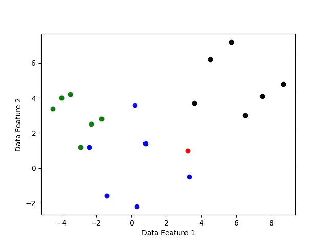

看起来红点最接近蓝点，所以 k-means 聚类算法会将其放入蓝色聚类中。

不过，这又引出了另一个问题:判断图上两点之间的距离对我们来说很容易，但我们如何让计算机做同样的事情呢？

## 比较距离

由于每个点都被表示为一组数字——每个数字都指定了该点在一个平面中的位置——计算机可以使用点之间的坐标差来找到点之间的距离。

我们可以把每一个聚类表示为一个位于该组“平均”位置的点。

我们如何找到平均值？我们可以在一个维度上将属于一个簇的所有点的坐标相加，然后除以该组中的点数。如果我们对每个维度都这样做，那么这些坐标所代表的点就可以用作聚类的平均值或质心。如果我们用上面的例子来做这件事:

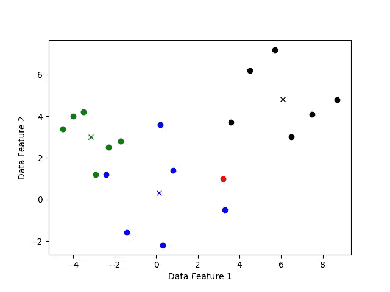

彩色的 x 标记了每个簇的质心。

现在，如果我们取代表红点的坐标和群质心之间的差，我们可以证实我们最初的猜测，红点属于蓝色星团:

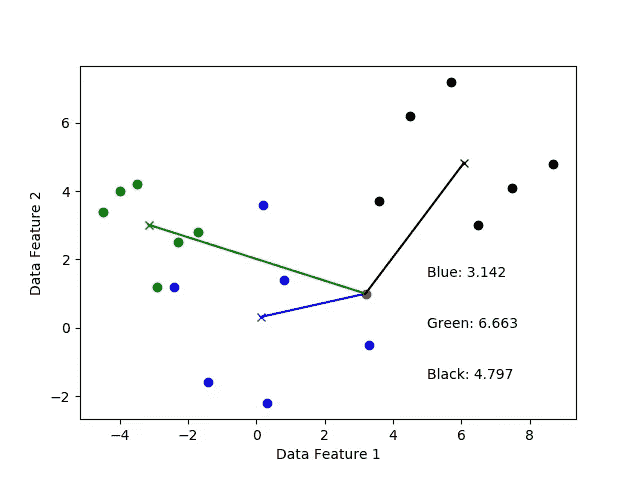

右下角的文本给出了从红点到每个簇的质心的欧几里德距离。正如我们所看到的，到蓝色质心的距离是最小的，这意味着红点确实会被归类到蓝色星团中。

我们如何找到距离？我们用质心和红点的坐标作为向量。

例如，如果我们想计算到蓝色质心的距离，我们可以从蓝色质心的位置向量中减去红点的位置向量:

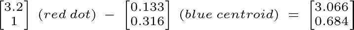

要计算距离，我们需要计算矢量的大小:

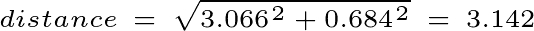

k-means 聚类算法会找到新点与每个质心之间的距离，然后将新点放入质心最近的聚类中。

超级简单吧？

要点是，找到从一个新数据点到每个质心的距离是关键——之后的所有事情，如比较距离，并将新点分配给一个组，都容易得多。

既然我们已经得到了经典的版本，让我们把事情推进到量子宇宙。

## 距离估计

我们知道，我们的算法需要测量到不同质心的距离:但我们如何将使用向量减法测量距离的想法转化为我们可以在量子计算机上轻松有效地执行的事情？

有了经典的量子计算机，我们可以很容易地计算出欧几里得距离，但是试图在量子计算机上这样做要困难得多——而且需要的量子比特比我们能提供的还要多。其原因是，由于量子位的概率性质，相位差和概率振幅很容易测量，但像两个向量之间的距离这样的事情却不容易测量。

我们只需要距离，这样我们就可以将数据点分配到不同的组，我们需要知道哪个聚类离数据点最近。如果我们有另一个更容易测量的参数，可以让我们计算出哪个质心最接近呢？

这个参数不一定要和距离成正比，只要和它正相关就行。这是可行的，因为我们只需要最近的质心，而不需要到每个质心的精确距离，我们可以将新的数据点放在与我们的参数取的最小值相关联的群集中。

幸运的是，当我们处理量子位时，有许多类似距离的参数可用，如两个(归一化)向量之间的内积，以及测量处于`|0>`或`|1>`状态的量子位的概率。

但是我们如何使用两个向量之间的内积来帮助我们估计距离呢？

我们需要做一点数学计算。如果你不喜欢，可以直接跳到下一节的结尾——你真正需要知道的是我们最终得出的可测量变量之间的关系。

## 关联内积和距离

让我们从一个零初始化的辅助量子位和一个量子态ψ开始，它存储了我们想要估计的归一化向量:

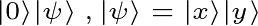

现在我们可以假设`|x>`是我们想要分类的新数据点的位置向量，而`|y>`是我们数据中一个聚类的质心。

首先，我们对辅助量子位应用一个阿达玛门，把它推到叠加态:

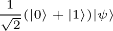

为了使状态ψ与我们的辅助量子位纠缠在一起，我们对辅助量子位上控制的ψ应用一个交换门:

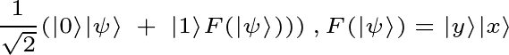

这里的`*F*(|Ψ>)` 只是一种更简单的方式来展示`|Ψ>`的交换版本，这是交换门应用于`|Ψ>`的结果。

接下来，我们将另一个哈达玛门应用于辅助量子位:

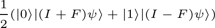

这里`*I*`代表恒等运算符— `*I*(|Ψ>)`简单来说就是给出`|Ψ>`。

接下来的几个步骤可能看起来有点随机，但我们真正要做的是将我们现在拥有的等式转化为一种形式，它包含两个向量`|x>`和`|y>`的内积。

如果我们替换`(*I — F*)`和`(*I*+*F*)`，我们得到这个:

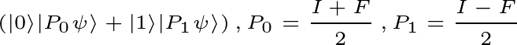

我们可以用一个叫做期望值的超级有用的概念来进一步简化这个问题(你可以在这里阅读这个概念)。这个想法是，我们可以将辅助量子位在`|0>`状态下被测量的概率表示为内积:

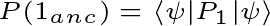

如果我们把`*I*` 和`*F*` 重新代入:

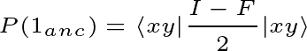

如果我们展开内积，我们得到这个:

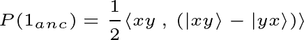

自`<xy , xy> = 1`和`<xy , yx> = (<x , y>)^2`开始:

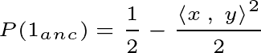

太棒了——所以现在我们有了在`|1>`状态下测量辅助量子位的概率，这是我们很容易测量的，和我们想要找到两个向量之间距离的内积之间的关系。

我们现在需要做的就是证明等式的右边与两个向量`|x>`和`|y>`之间的欧几里德距离正相关。

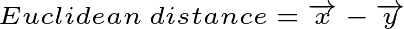

如果我们扩展矢量减法:

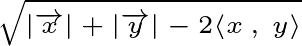

因为两个向量都是归一化的，所以它们的幅度是 1:

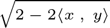

如果我们看看我们之前推导出的等式，它们看起来非常相似:

酷！看起来我们有了一个容易测量的参数，可以用来代替测量距离。现在让我们使用 qiskit 实现我们的距离估计算法。

## 从盒子到球体

我们如何将我们想要估计的点之间距离的矢量坐标编码成量子位？

让我们首先绘制几个类，它们的质心，以及我们想要分类的一个新点:

红点是我们要分类的新数据点，彩色的 x 标记每个类的质心。

我们需要找到一种方法，将我们目前用来描述质心的直角坐标转换成球面坐标，这样我们就可以将图上的每个数据点表示为布洛赫球面上的另一个点(查看[这篇](http://akyrillidis.github.io/notes/quant_post_7)文章，了解量子位表示的超级平滑介绍):

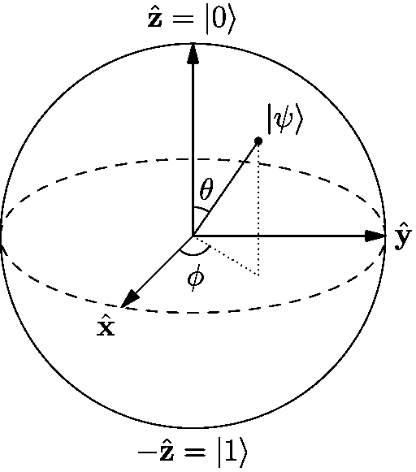

要转换数据点，我们需要执行以下步骤:

*   取一个零初始化的量子位，对其应用哈达玛门，移动代表量子位的向量，使其沿着 x 轴。
*   根据对应于特征 1 的数据点的值设置φ。
*   根据对应于特征 2 的数据点的值设置θ。

θ的范围可以从`0`到`π`弧度，φ的范围可以从`0`到`π`弧度。

为什么我们需要限制φ可以取值的范围？

假设我们有两个数据点，当用一个量子位表示时，它们取相同的θ值和φ值`0`和`2π`。量子位将占据布洛赫球上的同一个点，即使它们代表的点具有不同的特征值，这将搞乱我们的算法——它只在布洛赫球上量子位之间的相位差与两个数据点之间的实际欧几里得距离大致成比例时才起作用。

使用以下等式，我们可以轻松地将数据特征值映射到θ和φ值:

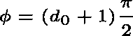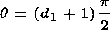

这里`d_0`和`d_1`代表数据特征 1 和 2 的值。如果这些没有意义，回到我们数据的散点图，看看每个特征的范围(-1 到 1)，以及θ和φ。

太好了！

我们找到了一种方法，从将我们的数据绘制为图上的点，到使用量子位来表示它们——现在让我们把手弄脏，看看我们的算法是否真的有效。

## 构建距离估计器

你可以在这里得到我使用的数据。

我们已经看到了上面的数据图，以及我们需要分类的红点。为了方便起见，让我们再次绘制我们的数据，但是这里只显示了每个类的质心:

我们得到了一个简洁、超级简单的图表:

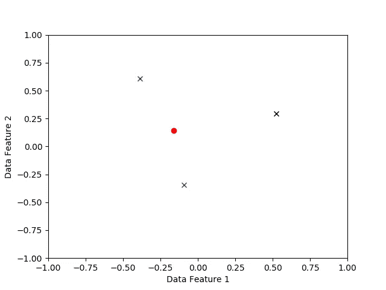

我们需要比较从红点到每个质心的距离，所以我们必须将质心和红点的坐标编码到我们的量子位中。为此，我们使用上一节中提出的规则:

现在我们从 qiskit 导入我们需要的所有模块，并创建寄存器来保存我们的量子位和结果:

我们可以使用 qiskit 提供的 ***U3*** 门来实现我们需要执行的旋转，以对我们的数据点进行编码。 ***U3*** 门可以这样应用:

这条指令将导致量子位从正 z 轴向外移动θ弧度，从正 x 轴向外移动φ弧度，就像我们之前看到的布洛赫球一样。

让我们实现我们在连接辅助量子位的概率和两个向量之间的距离的部分中走过的过程:

现在我们可以检查新数据点属于哪个类。让我们也打印欧几里得距离，以了解到每个质心的距离之间的差异:

我运行了这个程序很多次，得到了这些结果:

它看起来很有效——超级酷！

## 包扎

厉害！

我们构建了一个量子距离估计器，与 k-means 聚类算法一起使用，我认为这很棒。你可以在这里获得整个程序—**随意在其他数据集上运行它，感受一下它是如何工作的。**

**这篇文章只是我将发布的一个新系列的开始，涵盖了量子机器学习的不同方面——敬请关注！**