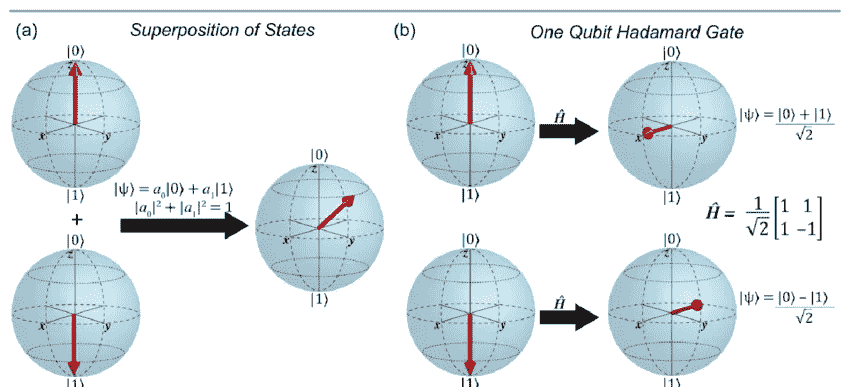
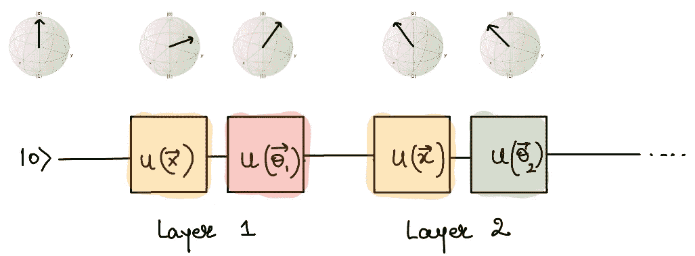
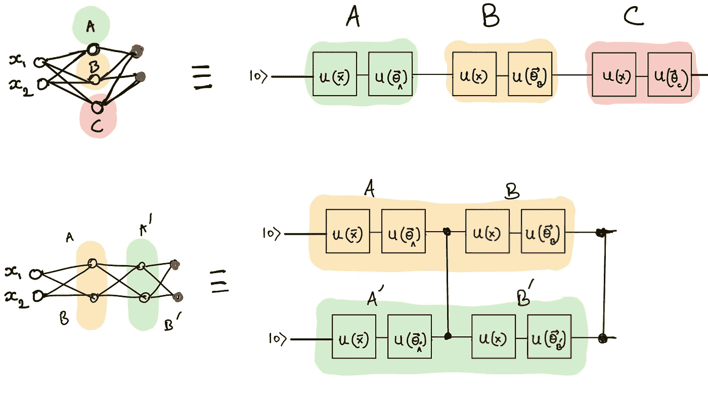
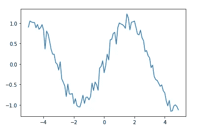
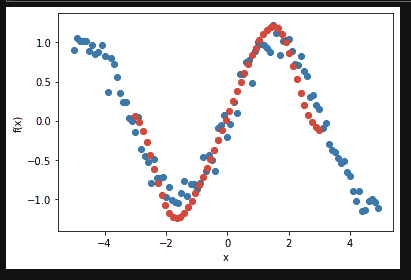
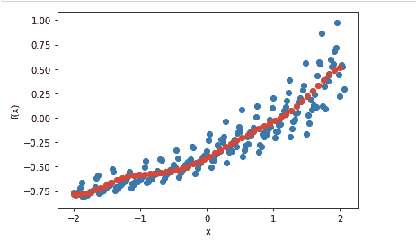

# 面向金融科技的量子神经网络

> 原文：<https://towardsdatascience.com/quantum-neural-networks-for-fintech-dddc6ac68dbf?source=collection_archive---------16----------------------->

## [奇点研究](https://towardsdatascience.com/tagged/the-singularity-research)

## 时间序列函数拟合

在本文中，我们将解释量子神经网络的一般概念，并且我们将解释可以在一维时间序列数据上训练以拟合数据的函数的模型。我们还将提供 Github 上培训药品销售数据模型的教程的链接。

## 量子位和量子电路

什么是[量子神经网络](https://pennylane.ai/qml/app/tutorial_data_reuploading_classifier.html)？要回答这个问题，我们需要理解量子位和量子电路的概念，量子电路是量子计算中用来描述量子位操作的基本图表。[量子电路](https://medium.com/@thesingularity.research/what-is-a-quantum-circuit-transpiler-ba9a7853e6f9)非常类似于描述逻辑门操作的电路图，这些逻辑门在经典计算中使用，例如在你的电话或笔记本电脑上。量子位是位的量子计算版本，其行为与位不同。许多人谈到量子位时，仿佛它们是神秘的，并且“同时是零和一”尽管这实际上是不正确的，而且是对他们行为的过度简化，掩盖了数学的精确性。这样做要么是出于作者的误解，要么是因为作者认为读者缺乏知识或注意力。思考量子位元状态的适当方式，是将其视为球体上的一个位置，例如地球表面，北极为“1”，南极为“0”。量子门在这个位置上运行，在全球范围内移动。

Qubits being operated on by the Hadamard gate

如果我们有几个量子位，我们可以用几个门分别操作它们，或者同时用一个多量子位门操作它们。我们画一个电路图来表示哪些量子位在特定的时间通过特定的门。对于量子比特的基本介绍和来自量子力学的基本概念，李奥纳特·苏士侃的书“[量子力学:理论最小值](https://www.amazon.com/gp/product/0465062903/ref=as_li_tl?ie=UTF8&tag=singularity07-20&camp=1789&creative=9325&linkCode=as2&creativeASIN=0465062903&linkId=de994c8ec19e23e16981a4713d350854)”对于只有一点线性代数作为先决条件的新人来说相当不错。

## 变分量子电路

某些量子电路的行为非常像我们从机器学习中了解并喜爱的神经网络。我们可以开发“变分量子电路”，模仿在深度学习中变得如此流行和有效的深度神经网络的行为。这些电路中的门的行为就像一层神经网络，我们可以以各种方式训练它们，以执行所有与 TensorFlow 或 Pytorch 中使用的神经网络相同的任务。

事实上，在许多情况下，量子方法在计算能力和准确性方面提供了极大的改进。即使经典地模拟这种方法，也显示出高达 100 倍的性能提升，正如在 [TensorNetwork](https://ai.googleblog.com/2019/06/introducing-tensornetwork-open-source.html?m=1) 的应用中所看到的那样，这是一个由谷歌建立的库，它使用 TensorFlow 作为后端，允许用户用张量网络取代神经网络的层。如果你不熟悉张量网络是什么，看看[我的另一篇文章](https://link.medium.com/vTl3p7myL2)，关于它们如何被用来模拟量子电路，以及它们如何被谷歌和其他人用于[机器学习](https://medium.com/analytics-vidhya/black-hole-machine-learning-d7387a4bd30e?)。

好的，所以量子电路可以像神经网络一样被训练，可以执行神经网络可以执行的任务。然后呢？那么你可以在一台真正的量子计算机上运行它！我知道，你读过的大部分新闻都说量子计算还需要几年时间，实际应用还不清楚。这些信息已经过时，而且非常不准确。不相信我？试试 [IBMQ 量子体验](https://quantum-computing.ibm.com/)自己看吧。IBM 目前允许用户注册一个免费账户，在 Qiskit 中开发代码，然后可以在 IBM 的量子计算机上运行。其实我有一个 [Github 教程 repo](https://github.com/The-Singularity-Research) 给大家展示如何使用开源软件 PennyLane 来执行各种量子机器学习任务！让我们来看一个例子。

## 金融科技和时间序列

正如我们在下面看到的，量子神经网络，基于[草莓地](https://strawberryfields.readthedocs.io/en/stable/index.html)的光子量子计算，学习平滑有噪声的数据(红色部分)。

Noisy Sine Function

Trained Model on Noisy Sine Function

如果你不太了解金融科技(FinTech)或金融科技，它只是一个应用于金融和投资的科技术语。它可以是任何东西，从一个跟踪你的支出的应用程序到最新最棒的用于股票交易的[机器学习模型](https://www.analyticsvidhya.com/blog/2018/10/predicting-stock-price-machine-learningnd-deep-learning-techniques-python/)。[我们的例子](https://github.com/The-Singularity-Research/FinTech-Time-Series)是用一维函数拟合时间序列数据的模型。特别是，这是一个来自 PennyLane 的经过修改的[示例，它是根据一些合成数据以及一家澳大利亚制药公司大约 17 年来的一些药品销售数据进行训练的。数据已被重新调整，但在其他方面未被处理和更改。该模型花费了 12-24 小时来训练。训练模拟版本所花费的时间不应该令人惊讶，因为模拟量子电路对于经典(基于比特的)计算机来说通常是相当困难的。模型学习的函数的结果可以用红色显示。](https://pennylane.ai/qml/app/quantum_neural_net.html)

Pharmaceutical Sales Data 1991–2008

Trained Model Prediction (in red)

量子机器学习的应用不再是对未来的预测，*它们是现实*，而且非常有趣！这里应该提到几件事。首先，执行这些计算所需的量子位数量完全在当前量子计算硬件的能力范围之内。其次，这不仅是我们可以在当前的量子计算机上执行的任务，而且我们在当前的硬件上实际上有足够的量子位来使用一种叫做“[量子纠错](https://www.amazon.com/gp/product/1107002176/ref=as_li_tl?ie=UTF8&tag=singularity07-20&camp=1789&creative=9325&linkCode=as2&creativeASIN=1107002176&linkId=1cd57bbe7efbf4c4a00f1e6a254872e3)”的东西这是一种将冗余信息编码成多个量子位的方式，从而减轻计算中的误差(感兴趣的读者也可以参考“[拓扑码的量子计算](https://www.amazon.com/gp/product/9812879951/ref=as_li_tl?ie=UTF8&tag=singularity07-20&camp=1789&creative=9325&linkCode=as2&creativeASIN=9812879951&linkId=24247f18877991629b2fc463d7b32669)”了解量子纠错的介绍)。使用量子纠错所需的量子位数量取决于问题。因此，在某些情况下，我们能够在当前的硬件上实现纠错。当我们考虑到许多量子机器学习算法，如我在 Github 上的[二进制分类器教程](https://github.com/The-Singularity-Research/universal-classifier)，只需要一个量子位，而即使是 IBM 最基本的公开可用硬件也有五倍于此的量子位时，不难看出我们很容易看到量子计算机在时间序列函数拟合和分类问题等方面的实际应用。看到企业开始投资将量子机器学习集成到他们的商业模式中，纯粹是为了帮助他们理解这项技术在这一点上如何以及为什么有用。

如果你有想法要分享，有问题，或者你需要量子机器学习的咨询服务，请通过 [LinkedIn](http://linkedin.com/in/amelie-schreiber-694481181) 联系作者，访问奇点[网站](https://thesingularityrese.wixsite.com/singularity/hacking-the-universe)，或者查看 Github [教程](https://github.com/The-Singularity-Research)。