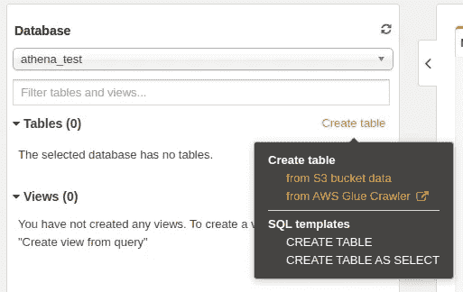
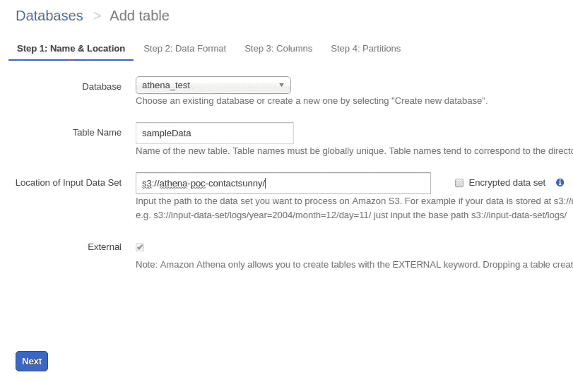
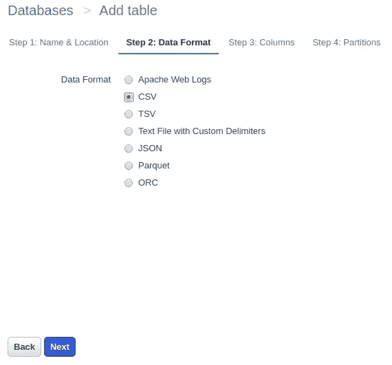
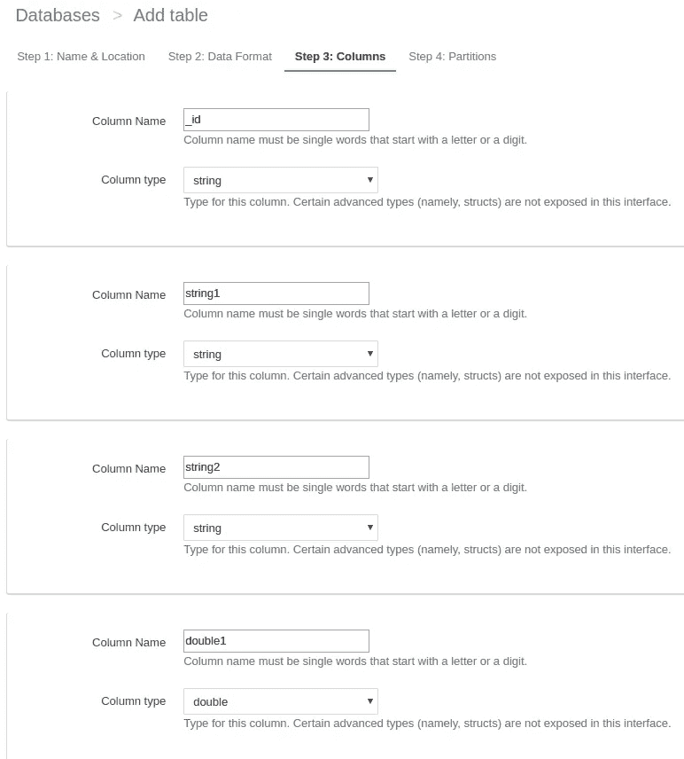
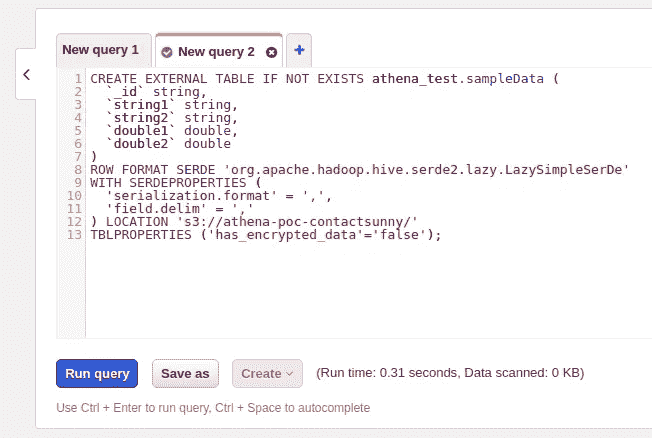
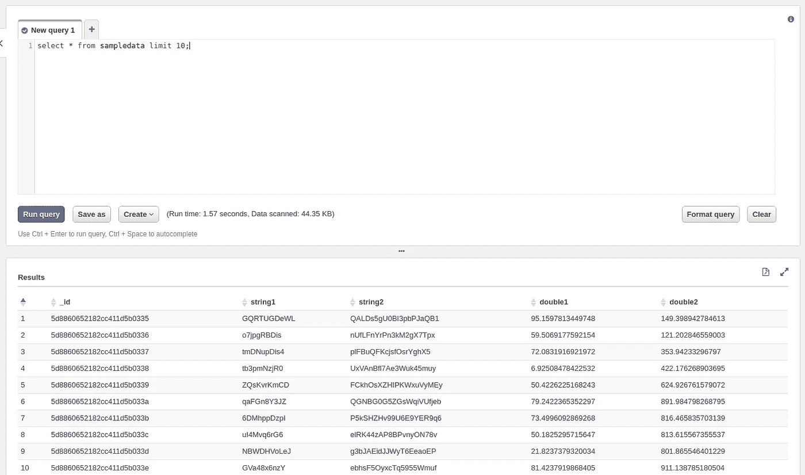
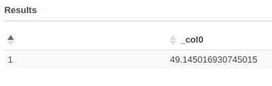
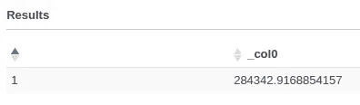

# 使用 Amazon Athena 从 S3 文件中查询数据

> 原文：<https://towardsdatascience.com/query-data-from-s3-files-using-aws-athena-686a5b28e943?source=collection_archive---------3----------------------->

亚马逊雅典娜被定义为“一种交互式查询服务，它使得使用标准 SQL 直接在亚马逊简单存储服务(亚马逊 S3)中分析数据变得容易。”因此，这是另一个用于存储在 S3 的大型数据集的 SQL 查询引擎。这与其他 SQL 查询引擎非常相似，比如 Apache Drill。但与 Apache Drill 不同，Athena 只能从亚马逊自己的 S3 存储服务中获取数据。然而，Athena 能够查询各种文件格式，包括但不限于 CSV、Parquet、JSON 等。


在本帖中，我们将看到如何使用存储在 S3 的样本数据集作为*在 Athena 中设置一个表。csv* 文件。但是为此，我们首先需要示例 CSV 文件。你可以在这里下载[。](https://blog.contactsunny.com/wp-content/uploads/2020/03/sampleData.csv)

下载完文件后，在 AWS S3 中创建一个新的 bucket。我建议创建一个新的桶，这样你就可以专门使用这个桶来尝试雅典娜。但是您也可以使用任何现有的存储桶。

下载完文件后，在 AWS S3 中创建一个新的 bucket。我建议创建一个新的桶，这样你就可以专门使用这个桶来尝试雅典娜。但是您也可以使用任何现有的存储桶。

所以，现在你已经有了 S3 的文件，打开 Amazon Athena。您可以选择在 Athena 主页上创建一个表。我的看起来有点像下面的截图，因为我已经有几个表了。从截图中可以看出，创建表格有多种选择。在这篇文章中，我们将坚持基本原则，选择“从 S3 桶数据创建表”选项。所以，现在你已经有了 S3 的文件，打开 Amazon Athena。您可以选择在 Athena 主页上创建一个表。我的看起来有点像下面的截图，因为我已经有几个表了。从截图中可以看出，创建表格有多种选择。在这篇文章中，我们将坚持基本原则，选择“从 S3 桶数据创建表”选项。



选择该选项后，您将被重定向到创建表的四步过程。让我们简单地看一下这些步骤。

# 第一步:姓名和地点



正如您在上面的屏幕中看到的，在这一步中，我们定义了数据库、表名和 S3 文件夹，该表的数据将来源于该文件夹。如果您已经有一个数据库，您可以从下拉列表中选择它，就像我所做的那样。如果没有，您可以选择从这个屏幕创建一个数据库。

接下来，为表提供一个名称。对于这个例子，我将表格命名为 *sampleData* ，只是为了保持它与我使用的 CSV 文件相同。

接下来，您必须提供存储文件的 S3 文件夹的路径。注意不能提供文件路径，只能提供文件夹路径。因此，该文件夹中具有匹配文件格式的所有文件都将被用作数据源。由于我们只有一个文件，我们的数据将仅限于此。在这篇文章中，我们将忽略加密选项。

我们还要注意，Athena 不会将这些源文件中的任何数据复制到另一个位置、内存或存储中。每个查询都是针对原始数据集运行的。

# 第二步:数据格式



这是非常直接的一步。您只需选择数据源的文件格式。因为我们使用的是 CSV 文件，所以我们将选择 CSV 作为数据格式。

# 第三步:列



在第三步中，我们定义数据集中每个文档/记录的“列”或字段。这是必需的，以便 Athena 知道我们正在处理的数据的模式。此处未定义的任何字段或列，或者名称中有拼写错误(即配置错误)的字段或列，将被忽略并替换为空值。因此，请确保正确配置列。

如果您的数据集有太多的列，并且单独配置它们变得很繁琐，您也可以批量添加列。你会在页面底部找到选项。例如，我们示例中的批量配置如下所示:

```
_id string, string1 string, string2 string, double1 double, double2 double
```

如您所见，格式非常简单。您可以指定列名，后跟一个空格，再后跟该列中的数据类型。列定义用逗号分隔。

# 第四步:分区

这一步有点高级，处理分区。因为我们的数据很小，也因为这超出了这篇文章的范围，我们现在跳过这一步。所以忽略这一步，确认剩下的配置。

您的 Athena 查询设置现在已经完成。您将被带到查询页面。这里，您将获得 *CREATE TABLE* 查询，该查询用于创建我们刚刚配置的表。您不必运行这个查询，因为表已经创建并在左窗格中列出。此处显示的查询仅供您参考。也许下次您可以手动创建这个查询，而不是在控制台中经历三到四个步骤。



现在剩下的就是查询表，看看我们的配置是否合适。为了测试这一点，我们将运行这个简单的 SQL 查询:

```
select * from sampledata limit 10;
```

运行该查询后，您的输出应该类似于下面的屏幕截图。



我们甚至可以在这个数据集上运行聚合查询。这里有几个例子:

```
select avg(double1) from sampledata;
```



```
select sum(double2) from sampledata limit 20;
```



差不多就是这样。现在，您可以在 Athena 的 S3 中对基于文件的数据源运行 SQL 查询。当你必须分析在 S3 以多个文件形式存储的大量数据集时，这非常方便。根据数据在文件中的分布方式和文件格式，您的查询将非常高效。你可以在 S3 查询数百 GB 的数据，并在几秒钟内返回结果。甚至包含多个连接的复杂查询也能很快返回。或许我们改天会更详细地讨论这个问题。

> 3 在 [Twitter](https://twitter.com/contactsunny) 上关注我，了解更多[数据科学](https://blog.contactsunny.com/tag/data-science)、[机器学习](https://blog.contactsunny.com/tag/machine-learning)，以及通用[技术更新](https://blog.contactsunny.com/category/tech)。此外，你可以[关注我的个人博客](https://blog.contactsunny.com/)，因为我在 Medium 之前发布了许多我的教程、操作方法帖子和机器学习的优点。

如果你喜欢我在 Medium 或我的个人博客上的帖子，并希望我继续做这项工作，请考虑在 Patreon 上支持我。