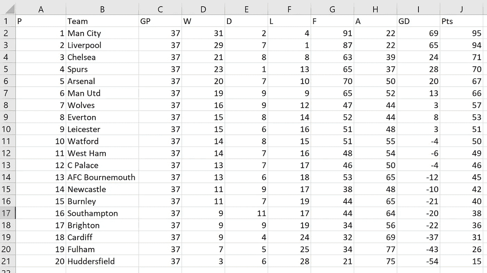
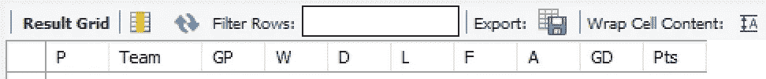
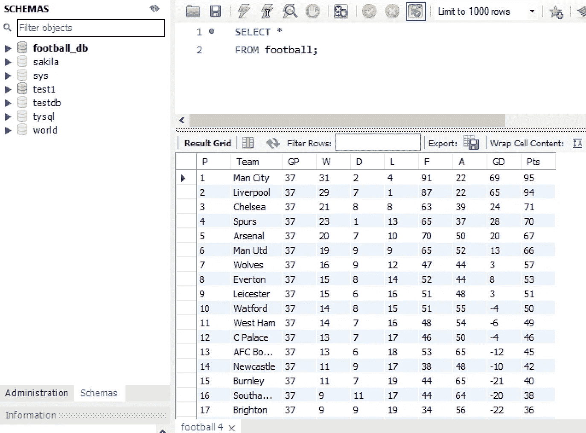
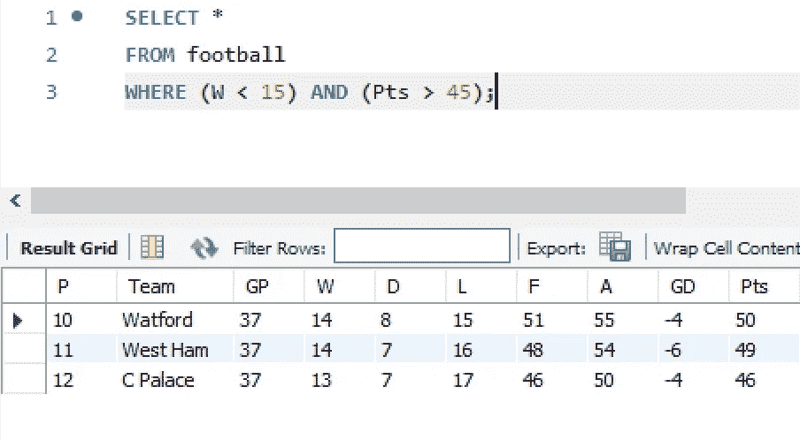
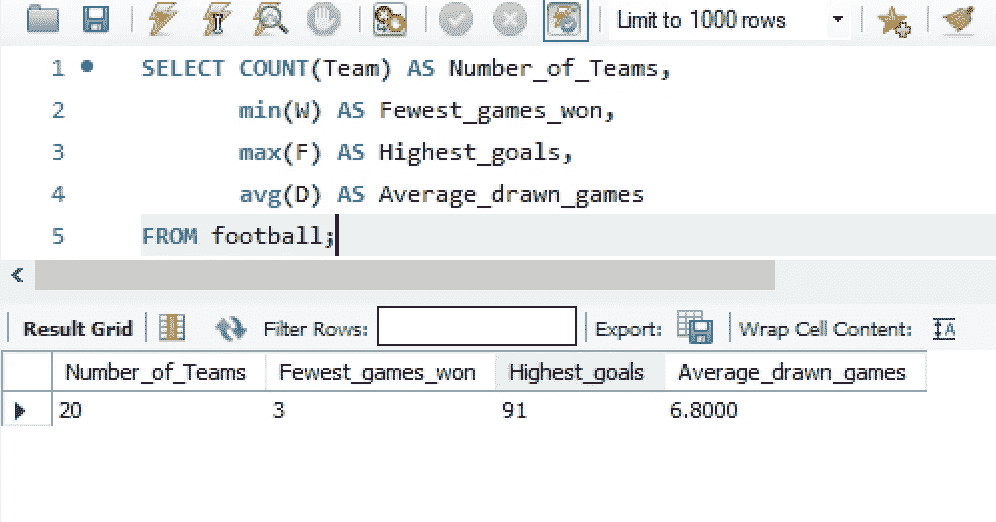
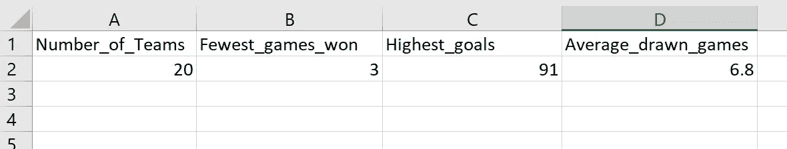

# 结合使用 Python 和 SQL 查询英超联赛

> 原文：<https://towardsdatascience.com/querying-the-premier-league-using-python-and-sql-combined-501cb9d9319a?source=collection_archive---------14----------------------->

## 通过 Python 从 Excel 到 MySQL，然后再回到 Excel

Image Courtesy of Chaos Soccer Gear via [Unsplash](https://unsplash.com/photos/Cjfl8r_eYxY)

有时将 Excel 表格转换成 MySQL 数据库可能很有用。这种转换将允许使用简单的 SQL 查询来执行查询操作。使用 Python，我们可以简单地将有限的 Excel 电子表格转换成 MySQL 数据库。

为了证明这是可能的，我将使用一个体育的例子。目睹了利物浦在欧洲冠军联赛(07/05/19)中击败巴塞罗那的胜利表现，我将选择一个离家近的例子，英超积分榜。

# 通过 Python 从 Excel 到 MySQL

我首先下载英超联赛表，并将其填充到一个 Excel 文件中，如下所示。重要的是，我将这个 Excel 文件保存为一个“*逗号分隔值文件* *(csv)* ”。

首先，我使用 ***打开*** 函数和 ***read()方法*** 读取这个' *Premier_league.csv* '文件作为字符串， ***fString*** 。然后，我创建一个空列表，并在每个新行字符处分割这个字符串。然后，我在字符串中每个指定的逗号处进一步拆分该行，并添加到我的 fList。为了验证，我打印了我的列表。在这里，我可以看到我有一个嵌套列表，fList 的第一个元素代表列，第二个元素代表占据第一名的团队，以此类推。

接下来，我需要连接到我的数据库管理系统(DBMS)。为了实现这一点，我使用 pip 命令安装 mysql-connector，并将这个模块导入到我正在处理的脚本中。为了确认到 MySQL 的连接，我打印出 MySQLConnection 对象，该对象返回一个我的连接内存中的对象，确认连接已经建立。

我现在创建一个游标，用游标的***execute method()***创建我的数据库，‘football _ db’。当我切换到我的 MySQL 工作台，并刷新模式图标时，我可以看到我的数据库现在出现了！

确认了数据库配置后，我现在可以开始创建我的表了。首先，我需要为表创建列。我可以使用子字符串符号来分配我的每个列名。这也有助于提高可读性。例如,“Played”列对应于前面提到的嵌套 fList 中的元素号 0，在这个子列表中，它又对应于第一个元素[0]。

然后，我使用“创建表格”命令创建一个表格，并将其命名为 Football，因为这似乎是合适的。因为这个表列条目语句分布在几行中，所以我用三个字符串将它们括起来。对于每一列，我使用了使用 ***的替换字段语法。format()*** 方法，并为我的每一列分配一个合适的数据类型。例如,“已踢比赛”列的数据类型为“int ”,字符数限制为 2，这是基于每支球队在整个赛季中最多踢 38 场比赛。最后，我执行表生成，并切换到 MySQL Workbench 进行确认。

足球表中的列建立后，下一个目标是将每个队的行插入到表中。然而，这里必须小心。有必要删除第一行 fList[0]，因为再次向表中插入列是没有意义的。

为了插入包含所有团队数据的行，我创建了一个名为“rows”的空字符串。然后，我使用 for 循环遍历 fList，并用括号替换方括号。这里使用另一个 if 语句在字符串中的所有行条目之间添加一个逗号。

接下来，我使用带有“VALUES”的“INSERT INTO”命令，将我的行连接到该语句，然后将该语句传递给游标的 execute 函数，然后将该函数提交给数据库。接下来，我需要通过再次切换到我的工作台并查看我的表来确认一切正常。

完美！现在我们可以开始在足球桌上执行查询了。首先，让我们看看谁在这个赛季赢了不到 15 场比赛，但累积了超过 45 分。我们只需在 WHERE 子句中定义条件语句，结果就会出现。

我们还可以使用一些 SQL 聚合函数来挖掘数据。例如，让我们通过检查联盟中的球队数量来确认事情正在进行。此外，让我们确定英超联赛中每支球队赢得的最少比赛，最高进球以及平均平局数。

# **将输出导出回 Excel**

最后，如果我们能以上面显示的格式将这些数据导出到 Excel，那就太好了。虽然使用上面显示的导出选项卡很容易做到这一点，但作为奖励，我将演示如何用 Python 简单地编写这一点。

我首先决定我的文件名' *my_football_stats* ，并将其保存为一个 CSV 文件。然后，我在“写”模式下打开这个 CSV 文件，并创建一些标题，写入我的文件。接下来，我执行我的 SQL 查询，并在 cursor.fetchall()中捕获输出，我将它分配给变量 result。结果*的**类型**是一个*列表。这意味着我可以通过索引结果列表从列表中提取元素。行[0]对应于队的数量，行[1]，赢得的最少游戏等等。

当我运行这个脚本时，我可以检查我的目录中的文件，'*my _ football _ stats【T1]'并读取 Excel 文件，如下所示。*

# 结论

本教程已经展示了我们如何完成一个完整的循环。首先，从一个 Excel 文件开始，我们可以将它转换成一个数据库表，以便在数据库管理系统中进行查询。然后，我们可以输出我们希望运行回 Excel 的任何查询，以完成我们的转换。虽然使用 Python 的 Pandas 库可以做到这一点，但是通过创建关系表可以很容易地构建这个例子。例如，我们可以使用团队的名称作为惟一的 ID，并开始连接到特定于该团队的其他表。这样，我们就可以创建强大的关系数据库。