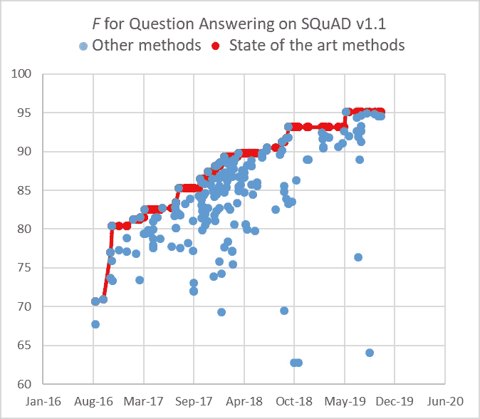
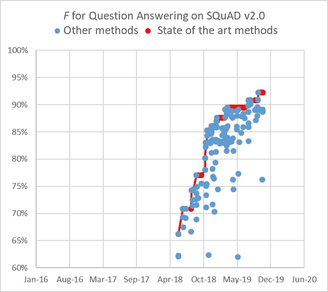
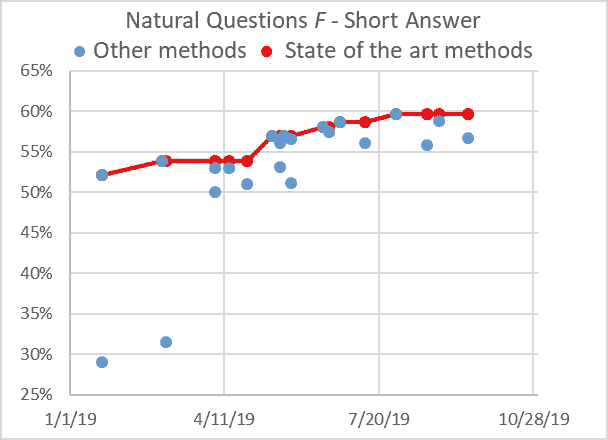

# 企业用例的问题解答

> 原文：<https://towardsdatascience.com/question-answering-for-enterprise-use-cases-70ed39b74296?source=collection_archive---------32----------------------->

在企业领域回答用户的问题仍然是一个具有挑战性的命题。企业越来越多地转向自动聊天助手来处理技术支持和客户支持交互。但是，这些工具只能成功地对它们接受过培训的问题进行故障诊断，这暴露了当今企业问答(QA)技术面临的日益严峻的挑战。

为了解决这个问题， [IBM Research AI](https://www.research.ibm.com/artificial-intelligence/ai-research-week/live/) 推出了一个名为 TechQA 的新排行榜，它使用了来自用户在 [IBM DeveloperWorks](https://en.wikipedia.org/wiki/IBM_DeveloperWorks) 上发布的真实问题。TechQA 的目标是促进对企业 QA 的研究，从相对较小的一组 QA 对中学习是更现实的情况。

TechQA 是首个解决企业 QA 用例的排行榜。IBM Research AI 预计将从企业领域创建额外的用例，以促进对这一关键能力的额外研究。

**QA 背景**

我们可以根据问题的特点和对应的答案来区分以下几类 QA 问题。相对较短的问题(少于 12 个单词)与较长的问题(从 10 到 50 个单词或更多)有很大的不同。)如今，在 IT 等企业支持环境中，更长的问题会越来越多，典型问题的中值长度为 35 个单词。

答案也可以被分割成 I)一个到大约五个单词的短(仿真陈述)连续文本跨度，ii)从大约六个单词到一个句子的更长的答案，或者 iii)甚至更长，例如一个到几个段落。在 IT 支持中，答案的中值长度约为 45 个词。

**现有 QA 排行榜**

简短问题/简短回答语料库的例子是成功的 SQuAD v1.1(大约 70 个提交)和 v2.0(大约 60 个提交)阅读理解排行榜[i，ii]，其中提供了维基百科的一段话以及一个问题，例如“哪个 NFL 队在超级碗 50 上代表了 AFC？”。在大约两年的时间里，该系统从 50 年代中期改进到 90 年代中期，代表了任务的相对快速进展。

然而，在 v1.1 版上表现最好的系统非常弱，当问题被稍微修改为在提供的文档中没有答案时就崩溃了。当用对抗性问题进行测试时(当大约 50%的问题在文章中没有答案时)，F*测量性能下降超过 20 点。*

SQuAD v2.0 是 2018 年年中推出的，带着这样的对抗性问题。F 测量值开始时大约为 70%,在大约一年的时间里迅速提高到大约 90%。然而，由于数据中的基本设计缺陷，即使是顶级的 SQuAD v2.0 系统对于现实世界的应用来说也仍然很弱。也就是说，这些问题是在“机械怪人”看了包含答案的文章后产生的。这种观察偏差造成了问题中的单词和答案的上下文之间的高度重叠。

为了解决这种观察偏差，通过收集用户对谷歌搜索引擎的问题，然后使用 turkers 找到答案，创建了一个名为 Natural Questions [iii]的新排行榜。当在自然问题排行榜上测试团队系统时， *F* 度量急剧下降到 6%(在简答题上——对于团队 1.1 版系统是 2%)，这说明了团队训练系统的脆弱性。

自然问题排行榜上的最高评分系统目前在 IBM Research AI GAAMA 系统[iv]在不到六个月的时间里(2019 年 7 月)达到了大约 60%的简短答案的 *F* 测量值，自 2019 年初开始在 *F* 测量 52%的简短答案以来。IBM Research AI 正在继续监控这些系统，看看它们需要多长时间才能在这项任务上接近人类的表现。

另一个需要考虑的方面是:证明(或找到)一个答案可能需要从不同的文档中找到几个片段来确定正确的答案。这就是所谓的多跳问答任务。HotpotQA [v]是一个排行榜，关注需要几个部分来确定答案的问题。在一年多一点的时间里，F 指标从 52%提高到 71%。然而，HotpotQA 受到观察偏差问题的困扰，该问题是在阅读包含答案的文档后产生的。

**IBM Research AI TechQA 语料库**

TechQA 语料库强调了自动化客户支持领域的两个现实问题。首先，它包含用户在技术论坛上提出的实际问题，而不是专门为竞赛或任务生成的问题。其次，它具有真实世界的规模— 600 个培训、310 个开发和 490 个评估问题/答案对—因此反映了在企业用例环境中创建标记数据集的成本。

因此，TechQA 旨在刺激领域适应方面的研究，而不是作为从头构建 QA 系统的资源。该数据集是通过在 IBM Developer 和 IBM DeveloperWorks 论坛上搜索已发表的 IBM Technote(解决特定技术问题的技术文档)中的问题及其公认答案而获得的。

除了问答对之外，TechQA 还提供了大约 80 万条公开可用的 Technotes 作为配套资源，以支持领域适应研究(例如，预训练/微调上下文相关的向量嵌入)。

对于 TechQA 来说，基于 IBM Research AI 针对自然问题的简短答案的顶级 performing⁴ GAAMA 系统，答案的 *F* 度量为 53%,略高于总是回答 No_answer 的系统的 50%。GAAMA 系统在 TechQA 训练集(600 个 QA 对)上进行了微调。)

关于 TechQA 任务和排行榜的更多细节可以在 ibm.biz/Tech_QA 的[找到。](http://ibm.biz/Tech_QA)

**参考文献**

[i] Pranav Rajpurkar、、Konstantin Lopy-rev 和 Percy Liang。小队:机器理解文本的 10 万+题。2016 年自然语言处理经验方法会议论文集，2016。

[ii]知道你所不知道的:无法回答的问题。Pranav Rajpurkar，Robin Jia 和 Percy Liang。2018 年计算语言学协会第 56 届年会论文集。

【三】自然问题:问答研究的标杆。汤姆·科维亚特科夫斯基、詹尼玛利亚·帕洛玛基、奥利维亚·雷德菲尔德、迈克尔·科林斯、安库尔·帕里克、克里斯·阿尔贝提、丹妮尔·爱泼斯坦、伊利亚·波洛苏欣、马修·凯尔西、雅各布·德夫林、肯顿·李、克里斯蒂娜·n·图塔诺瓦、Llion Jones、张明伟、戴、雅各布·乌兹科雷特、阔克·勒、斯拉夫·彼得罗夫。计算语言学协会汇刊，2019。

[iv]首席财务官:构建生产 NLP 系统的框架，Rishav Chakravarti，Cezar Pendus，Andrzej Sakrajda，Anthony Ferritto，潘麟，Michael Glass，Vittorio Castelli，J . William Murdock，Radu Florian，Salim Roukos，Avirup Sil。2019 自然语言处理经验方法会议录(EMNLP)，Demo Track，2019。

[v] HotpotQA:一个用于多样化、可解释的多跳问题回答的数据集，杨，彭琦，张赛正，Yoshua Bengio，，Ruslan Salakhutdinov，Christopher D. Manning2018 自然语言处理经验方法会议论文集，2018 年 10-11 月。

[1]“丹佛野马”是摘录的答案。

[2]请注意，最先进的红色曲线上的蓝点代表最早达到相应最先进水平的时间。

[3]这些多跳问题在创建自然问题排行榜时已被删除。

[4]截至 2019 年 10 月 28 日排行榜在[https://ai.google.com/research/NaturalQuestions](https://ai.google.com/research/NaturalQuestions)