# 问题对识别

> 原文：<https://towardsdatascience.com/questions-pairs-identification-f8abcafb5b17?source=collection_archive---------7----------------------->

## 没有愚蠢的问题…只有重复的问题！

# 背景

你有一个迫切的问题——你登录 Quora，发布你的问题，然后等待回复。有可能你问的确实是独一无二的，但通常如果你有问题，别人也会有。你有没有注意到 Quora 告诉你一个类似的问题已经被问过了，并且给了你链接让你直接找到它？Quora 如何发现你刚才问的问题与之前已经问过的其他问题相匹配？

出于对这个问题的好奇，我和我的团队——[Jui Gupta](https://medium.com/u/14b152ad8569?source=post_page-----f8abcafb5b17--------------------------------)、 [Sagar Chadha](https://medium.com/u/140754e8ee4d?source=post_page-----f8abcafb5b17--------------------------------) 、[崔婷 Zhong](https://medium.com/u/7dcece871f74?source=post_page-----f8abcafb5b17--------------------------------) 决定参加 Kaggle Quora 重复问题挑战赛。目标是使用复杂的技术来理解问题语义并突出重复(相似)的问题。

但是为什么一个公司想要强调重复的问题呢？

1.  *更便宜的数据存储* —存储更少的问题！很明显！
2.  *改善的客户体验* —更快地回答问题。
3.  *重复使用内容* —如果一个问题之前已经回答过，那么对一个类似的问题使用相同的答案是非常高效的。

# **数据**

数据集由大约 400，000 对问题组成，以 6 列的形式组织，如下所述-

**id:** 行 id

**qid 1，qid 2:** 问题对中每个问题的唯一 id

**问题 1，问题 2:** 问题的实际文本内容。

**is_duplicate:** 对于语义不同的问题，标签为 0，对于本质上只有一个答案的问题(重复问题)，标签为 1。63%的问题对是语义不相似的，37%是重复的问题对。

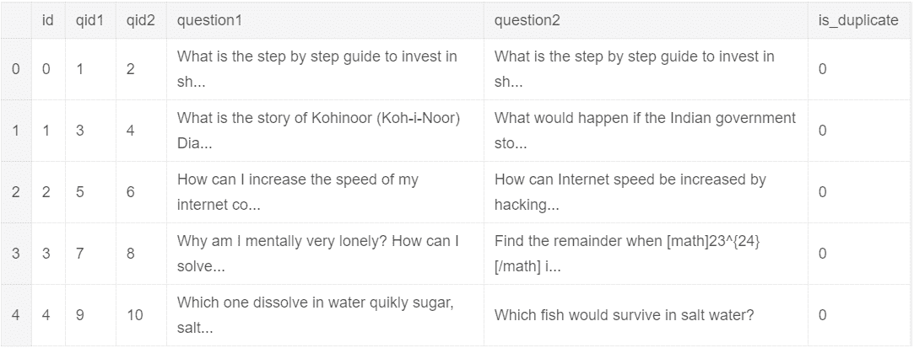

A look at the data

## **数据**探索

一项数据分析显示，问题中最常见的单词如下-

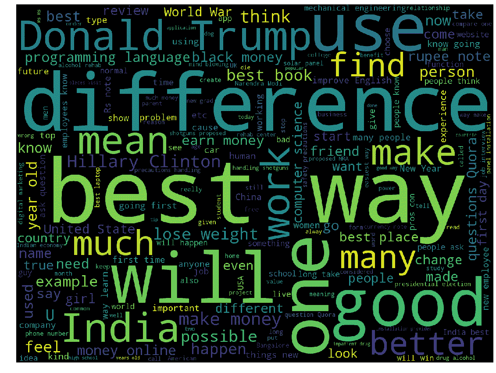

Word cloud for most common words

**标记为不重复的重复问题**

我们还发现了一些问题对，虽然重复，但在标签中被标记为 0。其中一些如下所示-

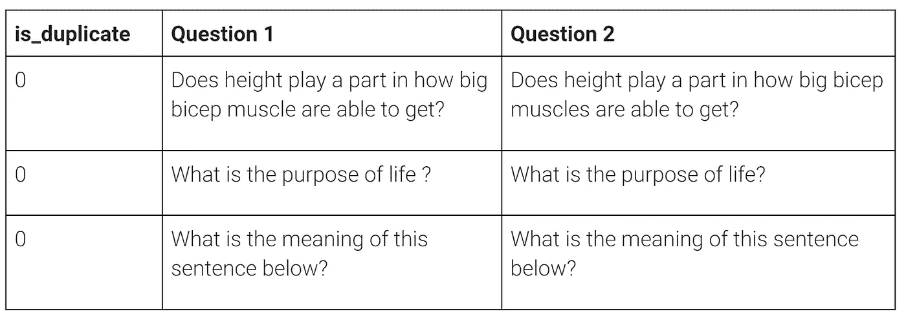

Duplicates marked as different

这些问题的标签被改为 1，以提高模型的准确性！

**建模方法**

检测一对问题之间的相似性的一个非常简单的方法是查看第一个问题中的独特单词，这些单词在第二个问题中也存在，作为两个问题中总单词的比率。然后，这个数字可以用在一个简单的模型中，例如逻辑回归，来预测重复问题和不同问题。

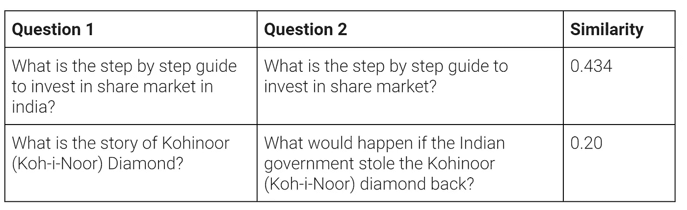

Word Similarity between questions

这种方法有局限性，因为两个几乎没有共同词汇的问题仍然有相同的意思。这可能是由于不同的句子结构、同义词的使用等。考虑句子“*成为一名数据科学家需要做什么*”和“*成为一名优秀的数据科学家需要具备哪些素质*”。虽然这些很少有共同的词(不包括停用词)，但提问者的意图是相同的。为了超越比较句子中的单词，我们需要一种方法来理解所考虑问题的语义。

## **句子嵌入**

生成句子嵌入是一个三步的过程

1.  **句子标记化** —使用我们数据中的所有问题，我们创建了一个大字典，将每个单词映射到一个唯一的整数索引。然后，这个字典用于将句子从字符串序列转换为整数序列。
2.  **零填充—** 流程的下一步是确保模型(神经网络)的输入长度一致。为了做到这一点，我们为每个问题选择了一个最大长度——在我们的分析中是 25 个——然后将句子截断或填充到这个长度。在长度少于 25 个单词的句子的开头插入 0。
3.  **嵌入矩阵—** 最后，我们使用预训练的单词嵌入将每个单词转换成向量表示。每个单词被转换成一个 300 长的向量。

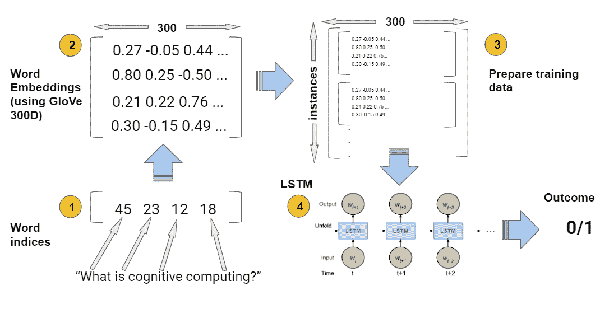

Process to get sentence embedding

上面描述的过程从我们的文本数据中为问题 1 和问题 2 创建了维度为(200000，25，300)的数据张量。这有双重目的-

1.  将文本字符串转换为可用于训练神经网络的数字
2.  给出了我们的数据的表示，它对单词的含义和单词之间的关系进行了编码。利用简单的数学，我们就可以确定两个词的意思是相似还是完全相反。

如此创建的数据张量然后被发送通过神经网络模型进行训练，这将在下面描述。

## **包的埋设方法**

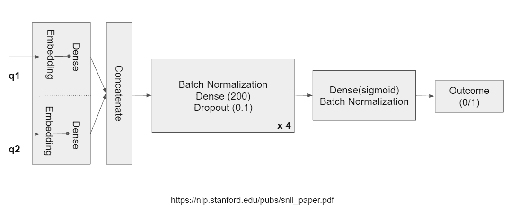

然后，使用上述方法创建的嵌入将通过上面画出的网络传递。让我们看看上面的网络发生了什么-

**时间分布密集层** —当我们想要对每个时间步长应用相同的变换时，这些用于时态数据。在我们的数据集中，每个问题有 25 个单词，对应 25 个时间步长。我们使用具有 300 个隐藏输入的密集层，因为我们的数据具有 300 维嵌入，所以我们得到该层的 90，000 + 300(偏差)= 90，300 个权重。问题 1 和问题 2 都通过相似的时间分布层。

下图清楚地表明了这种转变—

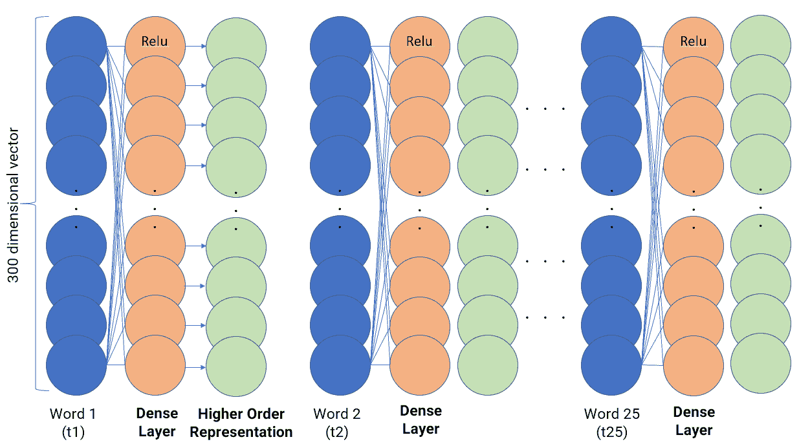

Time Distributed Dense Layers

时间分布密集层中的 300 个隐藏单元(显示为橙色)中的每一个都与每个时间步长的单词向量(显示为蓝色)相连接，并产生更高阶的表示(显示为绿色)。所有密集层单元都具有非线性的“Relu”激活。

**Lambda 层**——Keras 中的 Lambda 就像 python 中的*‘def*’关键字——它们允许我们在模型中使用自定义层。我们在时间分布密集层之后获得的较高阶表示上使用λ层，以获得问题中所有单词的平均意义。

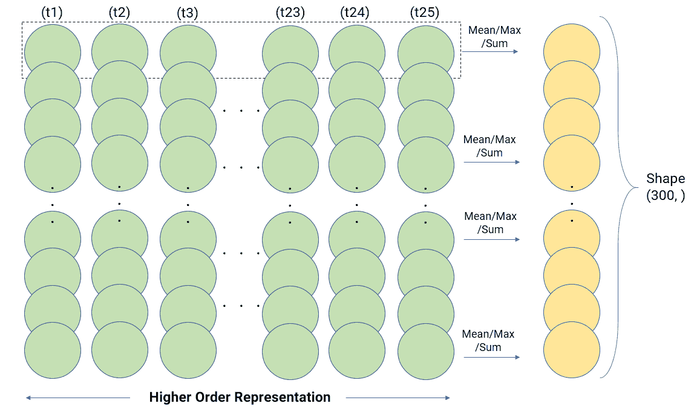

Lambda layers

计算平均值实质上是计算问题在 300 维中的聚合表示。这在这些维度上概括了整个问题的意义。Average 只是可能的聚合之一，还有其他可能的聚合，如 max、sum 等。

## **注意力接近的双 LSTM**

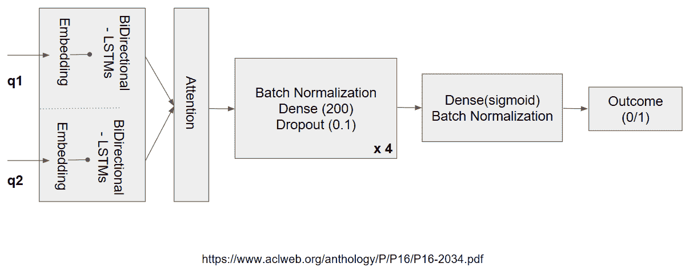

上面提到的嵌入模型架构的简单包确实达到了相当好的准确性。那为什么还要费心使用双向 LSTM 和注意力层呢？

当我们回去手动检查导致最高错误分类的问题对时，我们发现这主要是由于较长的句子。这是有意义的，因为我们没有考虑一种方法来捕获和实现单词，把它们从以前和将来的状态转换到我们现在的状态。这需要实现由类似 LSTMs 的网络提供的自适应选通机制。在研究中，我们幸运地发现了一篇关于使用双向 LSTMs 进行关系分类的论文，它被用于图像字幕、问题回答等任务中。

现在来看模型，我们所做的改变包括在单词嵌入阶段后添加一个双向 LSTM，以将更高级的特征合并到我们的嵌入向量中。在这之后，与之前我们串联问题不同，我们通过在问题对之间进行相似性来实现注意力。

**注意力层** —与之前的单词袋不同，注意力层包括问题之间的点积计算，然后是没有任何非线性的密集层。

完成建模后，我们是如何评价我们的模型的？

由于这是一个二元分类任务，我们使用**二元交叉熵(对数损失)**来计算我们的准确度。

**二元交叉熵**:

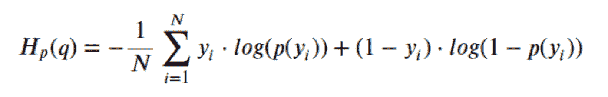

基线准确率为 63%，因为我们的数据就是这样分割的。这是我们建立的模型的模型性能。

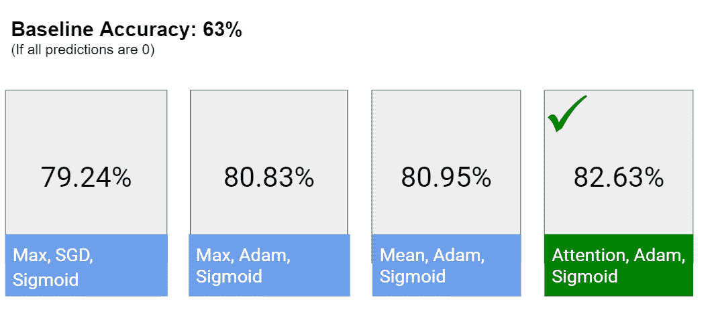

Model accuracy for our analysis

**未来工作**

*   对模型使用不同的预训练嵌入。例如 Word2Vec、fasttext
*   在嵌入连接中尝试不同的相似性度量。例如曼哈顿距离
*   提取并组合其他附加的 NLP 特征。例如常用词的数量/比例
*   利用相同概念的另一个有趣的问题是使用上下文段落的问题回答。我们可以尝试一下。

# 参考

这些工作没有一项是我们自己能够完成的。查看以下参考资料，获取我们使用的所有重要资源:

*   https://www.aclweb.org/anthology/P/P16/P16-2034.pdf
*   [https://nlp.stanford.edu/pubs/snli_paper.pdf](https://nlp.stanford.edu/pubs/snli_paper.pdf)
*   [https://www.kaggle.com/c/quora-question-pairs/data](https://www.kaggle.com/c/quora-question-pairs/data)
*   [https://github.com/bradleypallen/keras-quora-question-pairs](https://github.com/bradleypallen/keras-quora-question-pairs)
*   [https://github.com/Smerity/keras_snli](https://github.com/Smerity/keras_snli)
*   [https://towards data science . com/building-a-question-answering-system-part-1-9388 aad ff 507](/building-a-question-answering-system-part-1-9388aadff507)

请随时让我们知道您的想法和我们可以改进的方法！:)