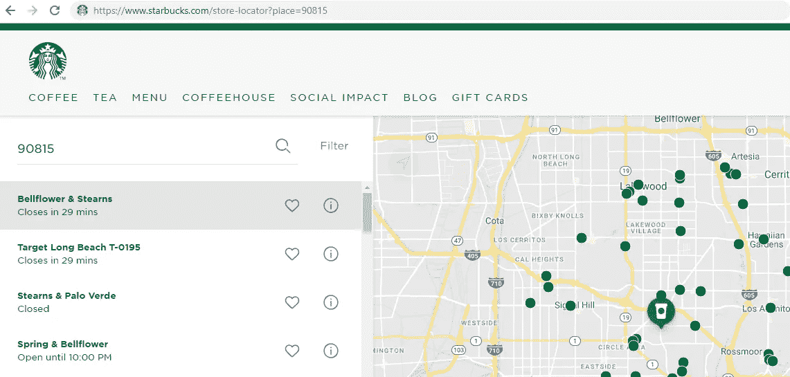
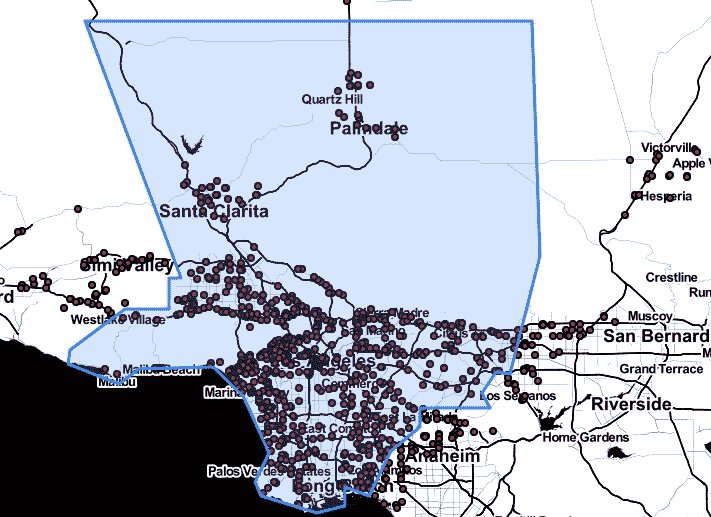
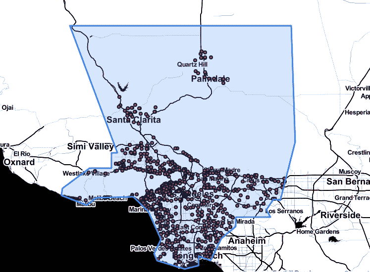

# 使用 Python 快速收集脏数据

> 原文：<https://towardsdatascience.com/quick-and-dirty-data-gathering-with-python-9d3d4b8cba13?source=collection_archive---------22----------------------->

前几天我去杂货店的时候，简直不敢相信自己的眼睛。另一家星巴克似乎一夜之间就在我家附近的街区开张了。还有…这家新的星巴克是 ***字面意思是*** 就在两个街区之间，每个街区都有他们自己的星巴克！

以新星巴克不断涌现的速度，我发现自己在想: ***“洛杉矶县会有多少家星巴克？”***

快速的谷歌搜索并没有给我想要的东西。要么结果只是在洛杉矶市(而不是整个县)，要么估计值已经过时 5 年以上。我知道我必须做什么:**自己收集数据！**

我决定从访问[星巴克商店定位器](https://www.starbucks.com/store-locator?map=39.635307,-101.337891,5z)开始，希望它能给我需要的信息。

Starbucks Store Locator

我得到了… *有点儿* …我想要的。我发现，通过在搜索栏中键入邮政编码，我得到了以该邮政编码为中心的 100 家星巴克商店的列表。

通过查看页面顶部的 URL，我发现可以使用哪个 **API 调用**(发送到星巴克网站的命令的别称)来访问以邮政编码 90815 为中心的 100 家商店的列表:

> **https://www.starbucks.com/store-locator?place=90815**

基于此，我想出了一个如何获取洛杉矶县所有星巴克门店信息的计划:

> ***1。*** *获取洛杉矶所有邮政编码的列表*
> 
> **2。** *对于每个邮政编码，调用上面的 API 并解析返回的 100 家星巴克门店*
> 
> ***3。*** *从存储的大列表中删除重复项(因为一个 API 调用和下一个 API 调用之间可能有很多重叠)*
> 
> ***4。*** *删除所有不在洛杉矶县的商店(因为有些邮政编码就在洛杉矶县的边界上，可能包括邻近县的商店)*

听起来合理吗？**我们开始吧！**

首先，我想提供这个项目需要的 Python 库列表:

# 获取洛杉矶县所有邮编的列表

这个很简单，你可以从很多不同的来源得到这个列表。我选择了直接从县里拿[。我将这些邮政编码(每行一个)加载到一个名为 *laZips.txt* 的文本文件中。](http://file.lacounty.gov/SDSInter/lac/1031552_MasterZipCodes.pdf)

# 为每个邮政编码调用 API

接下来，我们要为我们收集的每个邮政编码调用 Starbucks Store Locator API:

Scraping all Starbucks stores in LA County

您可能已经注意到了神奇的' *processResponse* '函数，它获取星巴克返回的内容，并将该文本转换成 100 家商店中每一家的信息。实际上，这只是一堆文本处理，我鼓励您查看完整的代码。

此时，变量 *allStores* 是一个商店信息列表，每个信息看起来像这样:

# 删除重复的商店

一个问题是，我们的星巴克门店主列表 *allStores* ，将包含(可能很多)重复的门店。

没什么大不了的！让我们遍历并删除已经遇到商店 id 的所有商店。

此时，变量 *laStores* 不包含重复的商店。

# 移除洛杉矶县以外的商店

我们的名单还有一个问题。邮政编码可能在洛杉矶县的郊区，因此以该邮政编码为中心的 100 家星巴克店将包括邻近县的店。我们如何解决这个问题？

一种选择是在我们的商店信息中使用' *City'* 字段，并将其与我们收集的洛杉矶县的一些城市列表进行匹配。这可能行得通，但我担心在我们的数据和我们从网上获取的城市名称列表之间会有轻微的差异。

让我们用一种更直接的方法。也就是说，我们将使用洛杉矶县的 geojson 文件(基本上是一个 json 文件，它精确地定义了一个复杂的形状，如洛杉矶县)。我会把这个文件贴在我的 GitHub 上。

在进行数据清理之前，让我们制作一张地图，以确保我们确实需要担心洛杉矶县以外的商店。

**是的** …很明显，我们在洛杉矶县(以蓝色突出显示)之外有商店。让我们摆脱他们！

让我们使用 *keepLAStores* 重新生成地图:

耶！**问题修复。**

(我很快会写一篇关于如何创建这样的地图的教程！)

咻！现在我们已经完成了所有工作，让我们将数据存储在一个 csv 中，以备将来再次使用:

那么…洛杉矶有多少家星巴克？

728。

本项目中使用的所有代码和必要文件都可以在[这里](https://github.com/ritvikmath/StarbucksStoreScraping)找到。

**快乐的数据采集！**