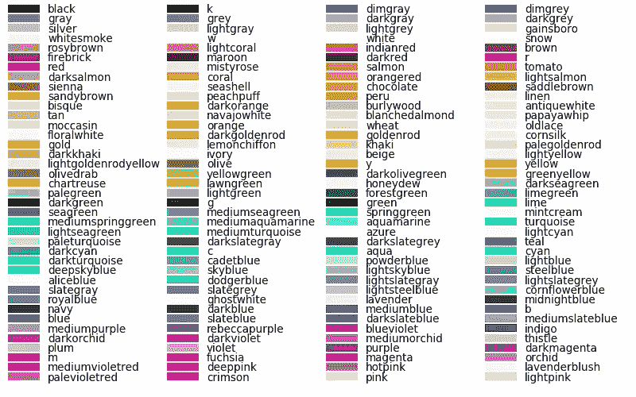
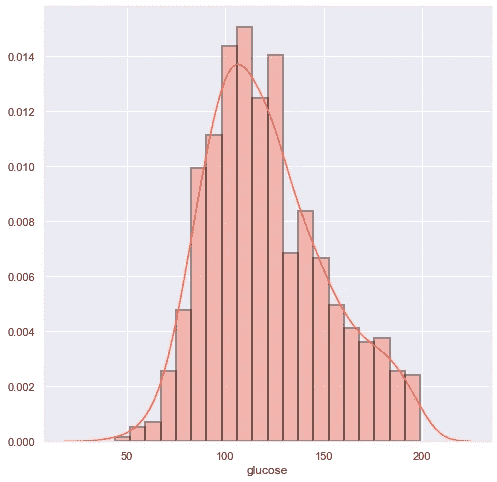
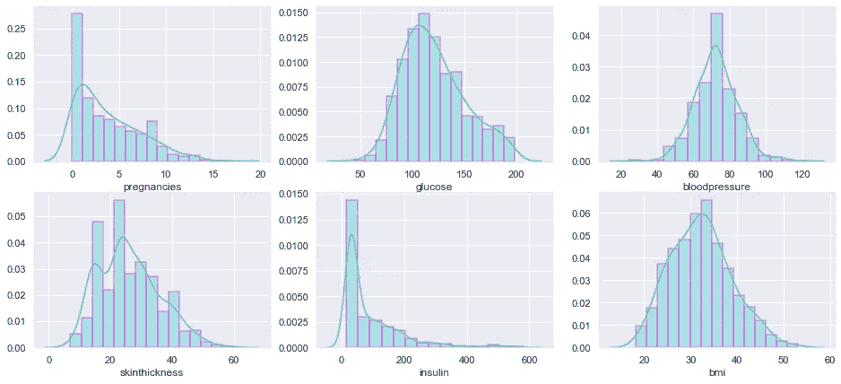
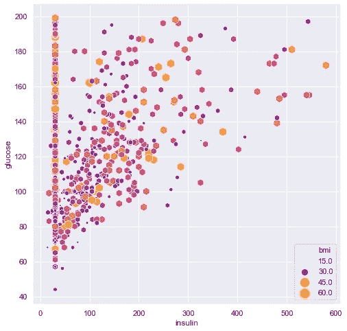
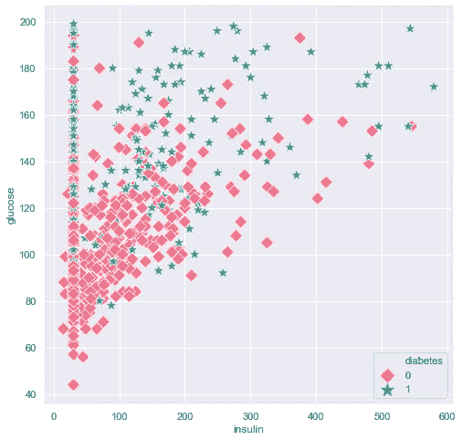

# 快速代码来美化你的直方图和散点图

> 原文：<https://towardsdatascience.com/quick-code-to-spruce-up-your-histograms-scatterplots-ca44b9e2777f?source=collection_archive---------19----------------------->

简单的图表是数据分析必不可少的可视化工具。如果你正开始学习如何用 Python 制作可视化效果，你可以对你的图形参数做一些小的调整，这将使它们更加突出。首先，导入 Pyplot 和 Seaborn 库。

选择 Matplotlib 颜色来照亮你的图表。



二。用选定的边缘颜色勾勒出直方图的轮廓。

```
import seaborn as sns
from matplotlib import pyplot as plt
%matplotlib inlineplt.rcParams["patch.force_edgecolor"] = True
plt.figure(figsize=(8,8)) #adjust the size of your graphsns.distplot(df["glucose"], bins= 20,color ='tomato',
hist_kws=dict(edgecolor="k", linewidth=2)) 
#modify colors, number of bins, and linewidth for custom looks
```



三。创建一个支线剧情网格，以便快速浏览。

```
sns.set_style('darkgrid',{'axes.edgecolor': '.9'},)
f, ax = plt.subplots(2,3,figsize = (16,7))
plt.rcParams["patch.force_edgecolor"] = True

vis1 = sns.distplot(df["pregnancies"],bins=10,color='mediumturquoise',
hist_kws=dict(edgecolor="magenta", linewidth=2.5),ax= ax[0][0])vis2 =
sns.distplot(df["glucose"],bins=10,color='mediumturquoise', hist_kws=dict(edgecolor="magenta",linewidth=2.5),ax=ax[0][1])vis3 = sns.distplot(df["bloodpressure"],bins=10,color='mediumturquoise', hist_kws=dict(edgecolor="magenta", linewidth=2.5),ax=ax[0][2])vis4 = sns.distplot(df["skinthickness"],bins=10,color='mediumturquoise', hist_kws=dict(edgecolor="magenta", linewidth=2.5), ax=ax[1][0])vis5 =
sns.distplot(df["insulin"],bins=10,color='mediumturquoise', hist_kws=dict(edgecolor="magenta", linewidth=2.5),ax=ax[1][1])vis6 =
sns.distplot(df["bmi"],bins=10,color='mediumturquoise', hist_kws=dict(edgecolor="magenta", linewidth=2.5),ax=ax[1][2])
```



四。选择[标记形状](https://matplotlib.org/3.1.1/api/markers_api.html)、尺寸和[色图](https://matplotlib.org/3.1.0/tutorials/colors/colormaps.html)以增加散点图和回归图的可读性。确定一个“色调”变量输入，以增加每个数据点的清晰度，或者以同样的方式使用“大小”。

```
plt.figure(figsize = (8,8))ax = sns.scatterplot(x = df.insulin, y = df.glucose, hue= df.bmi, size=df.bmi, sizes=(0,200), marker = ‘h’, palette=’plasma’, data=df)
```



```
plt.figure(figsize = (8,8))ax = sns.scatterplot(x = df.insulin, y = df.glucose, style=df.diabetes, hue=df.diabetes,palette= ‘husl’,
markers=[‘D’,’*’],size= df.diabetes,sizes=(200,100), data=df)
```

