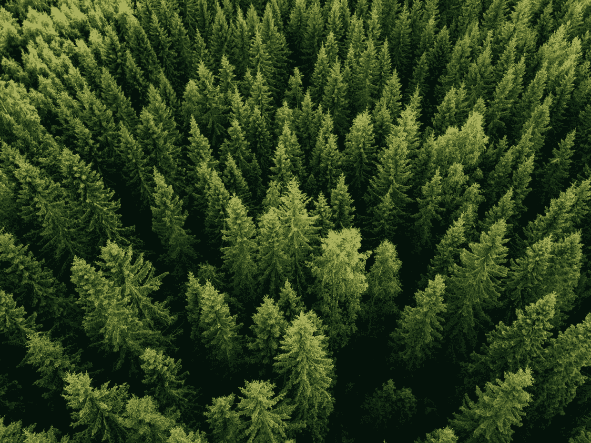
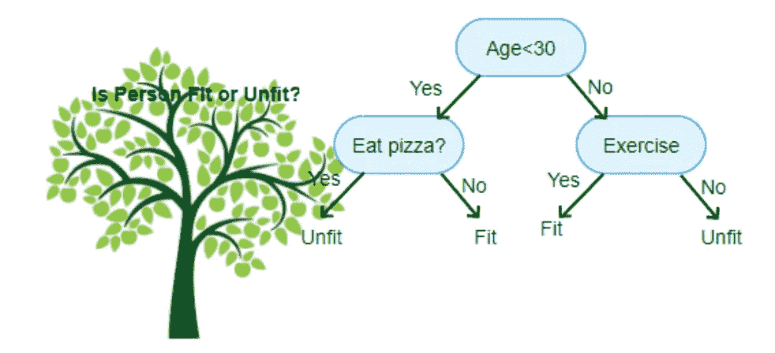
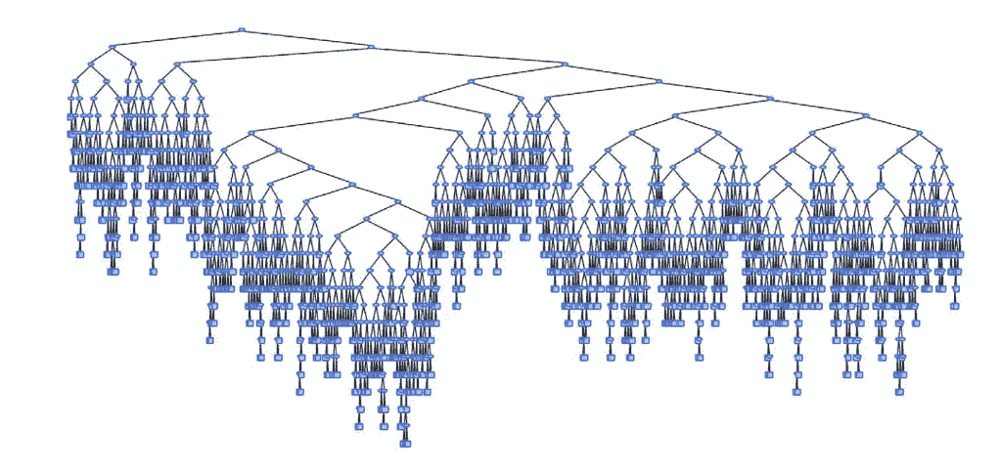
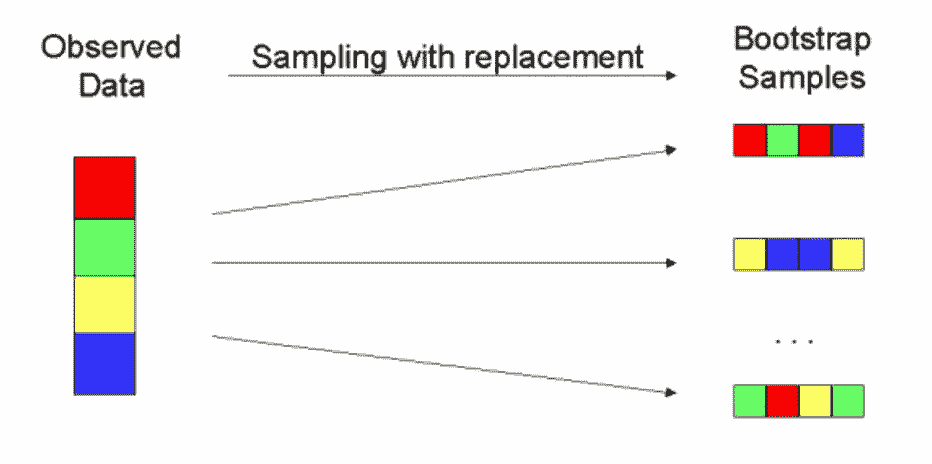
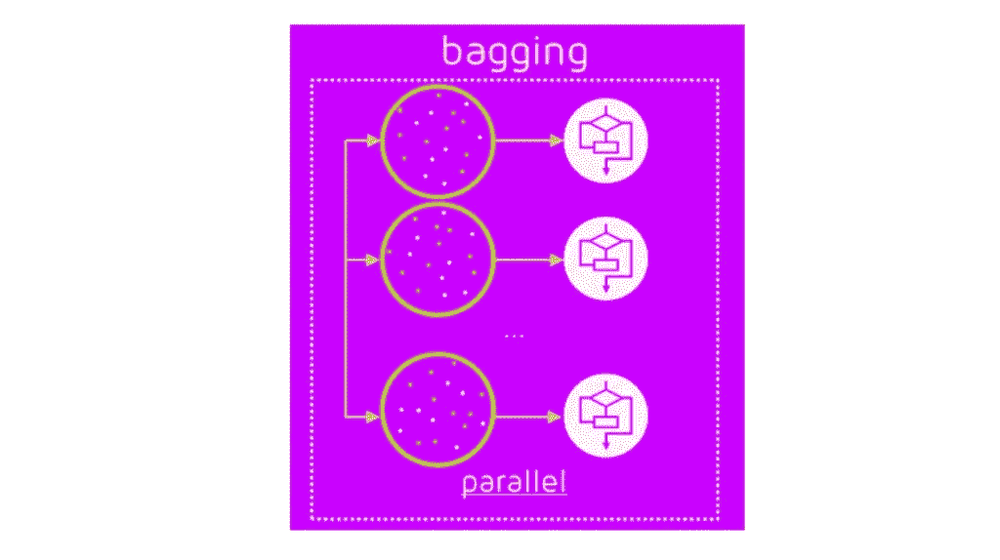
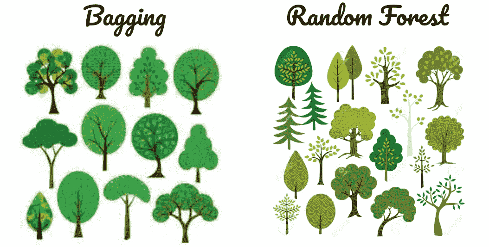

# 随机森林快速指南

> 原文：<https://towardsdatascience.com/quick-guide-to-random-forests-5d2a6b233d1f?source=collection_archive---------40----------------------->

当我刚进入数据科学领域时，我听说过这些被称为随机森林的神话模型。我迫不及待地想了解更多。如果这听起来像你，请继续读下去。

[Image source](https://news.yahoo.com/study-climate-change-can-be-reversed-by-planting-a-forest-nearly-double-the-size-of-the-us-180000751.html)

很自然，在谈论森林之前，我们应该先谈谈树——也就是决策树。决策树(有时称为 CARTs，用于分类和回归树)是相对容易理解的监督机器学习模型。

这里有一个决策树的简单例子:根据下图，你适合还是不适合？

Simple Decision Tree ([Image source](https://www.aitimejournal.com/@akshay.chavan/a-comprehensive-guide-to-decision-tree-learning))

你刚刚用决策树把自己分类为适合或不适合。我碰巧强烈反对吃披萨会让你不健康，但是嘿，这只是个例子。(在这篇文章中，我将只把这些模型作为分类器来讨论，因为这样更容易理解，但这些树模型也可以用作回归模型。)

决策树可以长出很多分支，直到每个分支都尽可能“纯粹”。(每个节点的纯度用[基尼杂质](https://en.wikipedia.org/wiki/Decision_tree_learning#Gini_impurity)量化。)如果让一棵树一直生长到每个叶节点都完全纯净，那么这些树就可以一直生长下去，直到它们看起来更像吊灯而不是树。

Overfit Decision Tree ([Image Source](https://pdfs.semanticscholar.org/17b0/7d8bb61a1462299053b66615f9eddd8f23d5.pdf))

如果决策树任其发展，你的模型将会不堪重负。有可能决策树非常适合您的训练数据，因此不会对新信息做出很好的响应。在这种情况下，这是非常典型的决策树，你的模型将有很高的误差方差。

随机森林是一种流行的模型，可以缓解决策树中的过度拟合问题。但是在深入研究随机森林之前，我需要说一些关于袋装决策树的事情，这是一个与随机森林密切相关的集合模型。

袋装决策树得名于“**B**oot strap**AG**aggregating”Bootstrapping 是替换随机抽样的实践。在数据科学中，bootstrapping 在许多不同的上下文中使用，但在这里，我们 bootstrapping 是为了生成更多的树。

Bootstrapping ([Image source](https://ww3.arb.ca.gov/research/weekendeffect/carb041300/sld012.htm))

在上图中，您可以将左边的条形(有 4 个不同颜色的方块)视为原始样本。如果我们从原始样本中抽取一个相同大小的新样本，或者用替换随机抽样，我们可能会得到右边的顶条。请注意，第一个引导示例看起来与原始示例相似，但并不完全相同。然后，我们重复这个自举过程 *n* 次，每次从原始样本中随机取样替换，产生 *n* 个自举样本*。*

Bagging ([Image source](https://medium.com/swlh/difference-between-bagging-and-boosting-f996253acd22))

自举之后，我们有了 *n* 个样本，在上图中用包含圆点的圆圈表示。从每个样本中，构建一个决策树。每个决策树生成自己的预测，然后汇总这些预测以生成总体预测。回到适合与不适合模型，如果对于给定的观察，66 棵树预测为“适合”，44 棵树预测为“不适合”，则该观察的整体预测为“适合”

([Image](https://www.vecteezy.com/free-vector/tree-clipart) [sources](https://www.123rf.com/photo_35573202_stock-vector-trees-clipart.html))

随机森林是一种特殊类型的袋装决策树。如上图所示，简单的套袋生产的树有些不同。然而，随机森林产生的树木更加多样化。自举过程与装袋过程完全相同，因此树中的额外变化一定来自过程中的其他地方。

事实上，随机森林中树的额外变化来自于每棵树是如何从它的引导样本构造的。在袋装决策树中，在构建每棵树的分支时考虑所有特征，而在随机森林中，在构建每棵树的分支时仅考虑随机的特征子集。这个过程被称为随机子空间方法，它使每棵树都不会过度拟合，从而减少了由于模型中的差异而产生的误差。

我希望这篇关于随机森林的简要描述能让您对该模型有一些基本的了解，并对您的进一步研究有所启发！