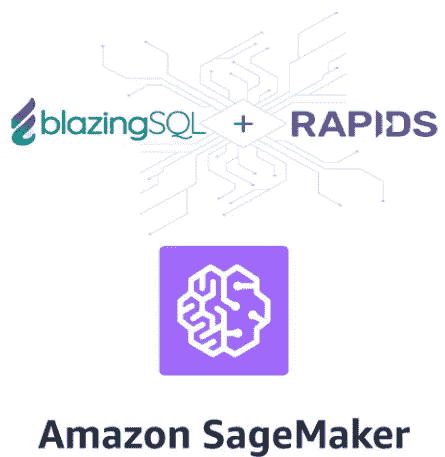

# 快速安装指南:AWS SageMaker 上的 Nvidia RAPIDS + BlazingSQL

> 原文：<https://towardsdatascience.com/quick-install-guide-nvidia-rapids-blazingsql-on-aws-sagemaker-cb4ddd809bf5?source=collection_archive---------19----------------------->



[RAPIDS](https://rapids.ai/index.html) 于 2018 年 10 月 10 日[发布](https://nvidianews.nvidia.com/news/nvidia-introduces-rapids-open-source-gpu-acceleration-platform-for-large-scale-data-analytics-and-machine-learning)，从那时起，NVIDIA 的人们夜以继日地工作，为每个版本添加了令人印象深刻的功能。当前版本( [0.9](https://medium.com/rapids-ai/rapids-0-9-a-model-built-to-scale-dafbf4c1e1cb) )支持的首选安装方法是 Conda 和 Docker ( [pip 支持在 0.7](https://medium.com/rapids-ai/rapids-0-7-release-drops-pip-packages-47fc966e9472) 中被取消)。此外，在 [Google Colab](https://rapids.ai/start.html) 中可以免费获得 RAPIDS it，并且还支持微软的 [Azure 机器学习服务](https://azure.microsoft.com/en-us/blog/azure-machine-learning-service-now-supports-nvidia-s-rapids/)。

然而，可能有像我一样的人想要/需要在 AWS SageMaker 中使用 RAPIDS(主要是因为我们的数据已经在 S3 上了)。 ***本指南旨在作为快速安装指南。它远非完美，但它可能会为您节省几个小时的试错时间。***

我还将包括 [BlazingSQL](https://blog.blazingdb.com/blazingsql-install-just-got-easier-363005c81dc5) ，一个基于 cuDF 的 SQL 引擎。作为一名数据科学家，查询数据的能力非常有用！

# 要求:

在 SageMaker 上安装 RAPIDS 有两个主要要求:

1.  显然你需要一个 GPU 实例。目前在 SageMaker 中只有两种类型的加速实例:ml.p2 (NVIDIA K80)和 ml.p3 (V100)实例。然而，由于 RAPIDS 需要 NVIDIA Pascal 架构或更新的架构，我们只能使用 ml.p3 实例。
2.  RAPIDS 需要 NVIDIA 驱动 v410.48+(在 CUDA 10 中)。[AWS 5 月更新了驱动](https://aws.amazon.com/about-aws/whats-new/2019/05/new-in-aws-deep-learning-amis-pytorch-1-1-chainer-5-4-cuda10-for-mxnet/)。因此，RAPIDS v0.7 是可以安装在 SageMaker 中的第一个版本。

# 安装程序

当前 RAPIDS 稳定版(0.9)的安装过程如下:

1.  启动或创建您的 ml.p3 SageMaker 实例。一旦实例被*服务*打开它。在本指南的剩余部分，我将使用 JupyterLab。
2.  在 JupyterLab 中: *Git - >打开终端*，打开 shell 并执行以下命令:

```
source /home/ec2-user/anaconda3/etc/profile.d/conda.sh
conda create --name rapids_blazing python=3.7
conda activate rapids_blazing 
```

我强烈建议创造一个新的环境。如果您尝试在 SageMaker conda python3 环境中安装 RAPIDS，将需要数小时来解决环境问题，并且还可能会产生奇怪的操作(例如，安装 RAPIDS 不支持的 python 2，等等。).

3.Conda 安装了 RAPIDS (0.9)和 BlazingSQL (0.4.3)以及一些其他的包(特别是需要 boto3 和 s3fs 来处理 S3 文件)以及 Sagemaker 包的一些依赖项，sage maker 包将在下一步进行 pip 安装。在 RAPIDS 版本中，dask-cudf 被合并到 cudf 分支中。*解决这个环境大概需要 8 分钟*:

```
conda install -c rapidsai -c nvidia -c numba -c conda-forge \
              -c anaconda -c rapidsai/label/xgboost \
              -c blazingsql/label/cuda10.0 -c blazingsql \
              "blazingsql-calcite" "blazingsql-orchestrator" \
              "blazingsql-ral" "blazingsql-python" \
              "rapidsai/label/xgboost::xgboost=>0.9" "cudf=0.9" \
              "cuml=0.9" "cugraph=0.9" "dask-cudf=0.9" \
              "python=3.7" "ipykernel" "boto3" \
              "PyYAML>=3.10,<4.3" "urllib3<1.25,>=1.21" \
              "idna<2.8,>=2.5" "boto" "s3fs" "dask" \
              "anaconda::cudatoolkit=10.0"
```

4.安装 Sagemaker 和 flatbuffers 包，并注册要在 JupyterLab 中使用的内核:

```
pip install flatbuffers sagemaker
ipython kernel install --user --name=rapids_blazing
```

5.等待大约一分钟，然后打开或创建一个新的笔记本，你应该能够选择新的内核:*内核- >改变内核- >康达 _ 急流 _ 炽热。*注意:请不要使用 rapids _ flashing 内核来代替 conda _ rapids _ blazing，因为如果使用该内核，BlazinSQL 将无法运行。

6.让我们首先导入 RAPIDS 和 BlazingSQL 包:

```
import cudf
import cuml
import dask
import pandas as pd
import dask_cudf
from blazingsql import BlazingContext
bc = BlazingContext()
```

我们应该得到一个“*连接建立*消息。

7.让我们做第一个测试来检查 cuDF 是否正常工作:

```
df = cudf.DataFrame()
df[‘key’] = [0, 1, 2, 3, 4]
df[‘val’] = [float(i + 10) for i in range(5)]
print(df)
```

8.测试累计:

```
df_float = cudf.DataFrame()
df_float[‘0’] = [1.0, 2.0, 5.0]
df_float[‘1’] = [4.0, 2.0, 1.0]
df_float[‘2’] = [4.0, 2.0, 1.0]
dbscan_float = cuml.DBSCAN(eps=1.0, min_samples=1)
dbscan_float.fit(df_float)
print(dbscan_float.labels_)
```

9.如果没有错误，我们已经成功导入并使用了基本的 cuDF 和 cuML 功能。下一步是读取和使用存储在 S3 的数据。例如，使用 gzip 压缩读取一些 csv 文件:

```
import boto3
import sagemaker
from sagemaker import get_execution_role
role = get_execution_role()
df= dask_cudf.read_csv(‘s3://your-bucket/your-path-to-files/files*.csv.gz’, compression=’gzip’)
df2=df.compute()
```

9.现在我们可以使用 BlazinSQL 来查询我们的数据:

```
bc.create_table(‘test’, df2)
result = bc.sql(‘SELECT count(*) FROM test’).get()
result_gdf = result.columns
print(result_gdf)
```

我将尝试在安装过程之外更新和扩展这个指南。同时，我得到了三个有趣的结果:

*   *与 pandas read_csv 相比，cuDF (v0.10) read_csv 提高了 7 倍。*
*   *与 sklearn LogisticRegression 相比，cuML LogisticRegression 提高了 32 倍。*
*   *与非 GPU xgboost(' tree _ method ':' GPU _ hist ')相比，GPU xgboost ('tree_method':'hist ')性能提高了 7 倍。*

# 结论:

展望未来，RAPIDS 版本将为 AWS 用户提供一些不错的特性。例如，cudf.read_csv 将能够直接读取 s3 文件，dask-cudf.read_parquet 在读取 s3 文件时的一个错误已被修复，并将包含在 0.10 中。我感谢 RAPIDS 团队对我报告的一些 github 问题的迅速关注和解决。

欢迎对本指南提出任何意见。*愿 GPU 加速您的分析！*！

*推特:@艾文佐*

*领英:*[【https://www.linkedin.com/in/dr-iván-venzor-64322732/】T21](https://www.linkedin.com/in/dr-iván-venzor-64322732/)