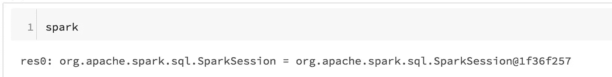
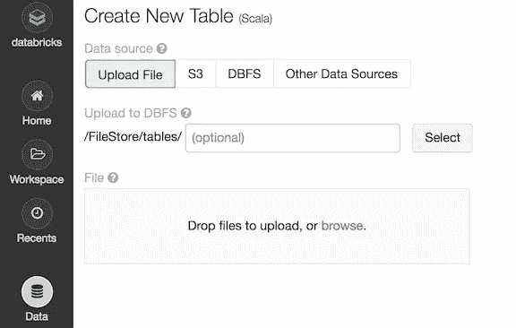
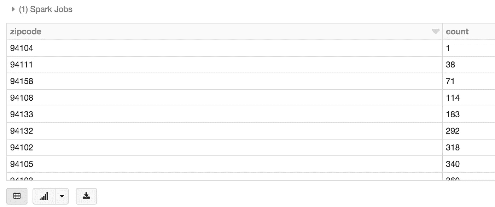
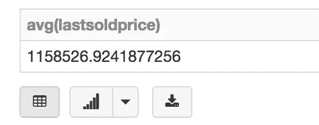
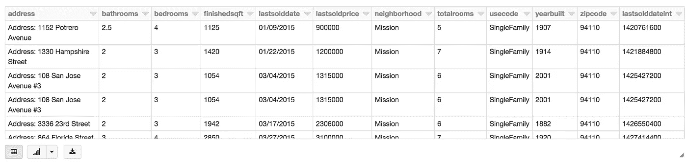
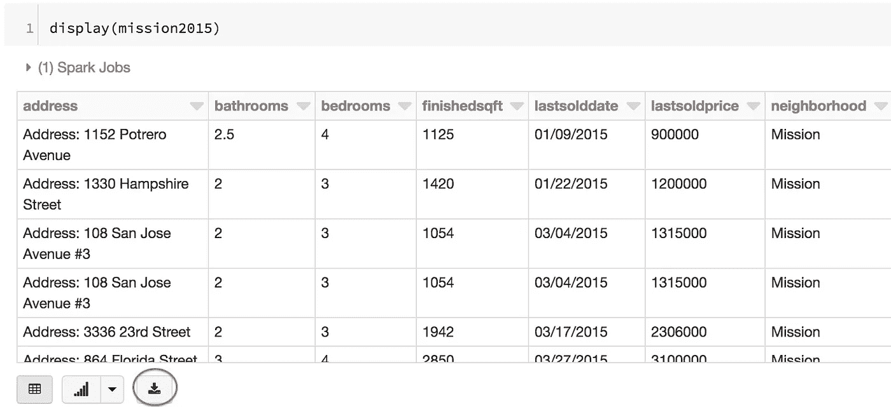

# 使用数据块激发火花的快速入门指南

> 原文：<https://towardsdatascience.com/quick-start-guide-to-spark-with-databricks-d2d24a2f995d?source=collection_archive---------32----------------------->

## 从 Spark 获得结果只需几分钟，而不是几天


Apache Spark 是处理大量数据的强大框架，可能是最强大和最高效的。任何如此强大的工具都必然是复杂的，对于初学者来说可能很难使用。

当尝试用 Scala 开始使用 Spark 时，这种情况最为明显。很容易找到一些加载文件并运行一些查询的示例代码。但是请尝试在某个地方实际运行示例代码。

你可以用 sbt 构建工具在 Scala 中完成。这是一个不错的方法，但是如果你还没有准备好用 sbt 构建和运行 Scala 应用程序，安装了 Scala 和 sbt，你的计算机，可能还有一个 IDE，并且知道如何从头开始生成 sbt 项目，这可能就不那么容易了。如果你是一名 Scala 开发人员，这可能没那么难，尽管即便如此，这仍然比它需要的要难。

此外，在当今时代，当我们想要编写一些代码并快速获得一些结果时，我们通常不想创建一个完整的 sbt 或 Maven 或 Gradle 项目，我们只想打开一个 Jupyter 笔记本，复制并粘贴几行代码，然后按 shift 键返回。

但是尝试用 Scala 和 Spark 来做这件事。

您的第一选择可能是 Amazon Web Services 的 SageMaker，如果您正在使用 Python 和 scikit-learn，这是一个很好的选择。但是如果您正在用 Spark 做完全相同的事情——使用几乎完全相同的代码，那么祝您好运。SageMaker 中有一个 Spark 选项——但是开箱即用就不行！至少上次我尝试的时候，我得到了一个神秘的错误，然后在谷歌上搜索了一下，发现 Spark SageMaker 选项需要你创建一个 Spark 集群，并将其连接到笔记本电脑上。你知道怎么做吗？你想吗？从笔记本或错误中显然看不出来。

最后，你可以在你的笔记本上安装 Jupyter 笔记本，然后安装 sparkmagic 扩展(它有多个组件),然后希望所有的作品和所有的部分都以正确的方式指向彼此。我得到了这个工作，但它花了几天的时间在多方面挠头。幸运的是，他们也有一个 Docker 选项，所以如果你的笔记本电脑上安装了 Docker，你就可以(很可能)更快地完成这项工作。只要确保将一个本地目录挂载到正在运行的 Docker 实例上，这样就不会在每次重启机器时丢失您的工作！如果您还不熟悉 Docker CLI，您可能会很难学到这一课——如果您只是试图运行一些 Spark 示例代码，您可能不想考虑这一点。

必须有一种更好的方法来对一些本地数据运行一些 Spark 命令，幸运的是有这种方法。

# **输入数据块**

Databricks 为 Spark 提供了 AWS 决定不提供的“像 SageMaker 一样简单”的选项。更好的是，社区版是免费的——具有讽刺意味的是，它运行在 AWS 上，AWS 本身会向您收取费用，让您做完全相同的事情，而您需要做更多的工作！

让我们开始吧。

首先，去[community.cloud.databricks.com](http://community.cloud.databricks.com)创建一个账户。单击“尝试数据块”并选择社区选项。

您将不得不创建一个(免费的)集群，但它只需要几次点击，如何做是非常明显的。点击左边的“集群”图标，创建一个集群，并给它一个名称，任何名称。因为这是您的第一个(目前也是唯一的)集群，所以名称是什么并不重要。您不必使用 Linux 命令行在某个文件系统中寻找它，这一切都是点击式的。

现在，点击左边的“数据砖块”图标，然后创建一个“新笔记本”选择 Scala 选项(除非您想要 Python ),然后选择您已经创建的集群。那是唯一的一个，所以选择它应该很容易。您可能需要单击左侧的“工作区”图标来打开笔记本，但仅此而已。现在，你有了一台运行 Scala 的笔记本，内置了 Spark。不，真的。唯一的痛苦是，只要你坚持使用免费选项，你将不得不每天重新创建一个集群(只需点击几下鼠标)。

为了用 Spark 做任何事情，你需要一个 SparkSession。如果您不知道这意味着什么，请不要担心——随着您对 Spark 越来越熟悉，您可以更深入地了解这一点，但目前它只是一个指向您的集群的对象，允许您运行 Spark 命令。在 Databricks 中，它只是被称为`spark`。你可以通过输入“spark”并按下 shift-enter 键来验证它在笔记本中是活动的。



如果你看到这样的东西，那么你有火花运行，你是好的。令人惊讶的是，如果你在 Databricks 之外尝试这种方法，仅仅到这里就需要做这么多的工作。

现在，让我们做一些有用的事情。让我们加载一些数据，提取一些见解，并保存到其他地方供以后使用。我将使用旧金山房价的一组数据，这些数据我已经用于[其他项目](/from-scikit-learn-to-spark-ml-f2886fb46852)。这只是一个简单的 CSV 文件，你真的可以使用任何 CSV 文件。

首先，通过点击左侧的“数据”图标，然后点击“添加数据”按钮，将文件上传到笔记本中，然后上传文件。选择并上传您的文件。请注意，您上传的文件将存储在 Databricks 系统的/FileStore/tables/[file]中。



我们现在可以读取文件了。

```
val df = spark
.read
.option("header", "true")
.option("inferSchema", "true")
.csv("/FileStore/tables/housing_data_raw.csv")
```

我在这里所做的只是告诉 SparkSession 读取一个文件，推断模式(数据的类型，例如字符串或整数)，注意 CSV 在第一行有一个头(而不是第一行的数据)，并给出文件的路径。运行该命令后，我们可以使用 Databricks 的显示功能快速查看我们的数据。


我们现在可以对 CSV 文件执行查询。不需要编写解析函数，不需要逐行循环。我们可以对 CSV 执行 SQL 查询。

首先，让我们将数据集注册为 Spark 中的临时表:

```
df.createOrReplaceTempView("mytable")
```

现在，我们可以直接对 CSV 文件运行 SQL 查询，就像它是一个数据库一样:

```
%sqlselect zipcode, count(zipcode) as count from mytable group by zipcode order by count;
```



这只是 Spark SQL 的一个示例，但这里的要点是，我们现在已经开始使用 SQL，在我们自己的沙箱中，只需几分钟就可以创建，而无需找到(或提供)关系数据库。

另一方面，如果您曾经花了几个月或几年的职业生涯来编写 SQL 查询，您(像我一样)可能会有许多糟糕的记忆，那就是根据用户输入将越来越复杂的变量串在一起。这些既难看又麻烦，而且极难支持和扩展。这就是火花的力量所在。我们可以在不编写任何实际的 SQL 查询的情况下执行与上面完全相同的查询。相反，我们可以通过在我们的数据帧上执行 Spark 查询函数，在 Scala 中编写 Spark 代码:

```
display(df.select($"zipcode").groupBy($"zipcode").count().orderBy($"count"))
```

这将显示与前面的原始 SQL 查询完全相同的结果。另外，注意`display()`函数是特定于数据帧的。当使用直接火花时，然后`.show`功能将显示结果(尽管没有所有的铃声和哨声)，例如:

```
df.select($"zipcode").groupBy($"zipcode").count().orderBy($"count").show
```

现在，让我们查询更具体的信息。假设我们想要两居室房屋的平均价格(可能是房子、公寓等。)的邮政编码是 94109。在 Spark 中，这很简单:

```
import org.apache.spark.sql.functions._display(df.select($"lastsoldprice")
.filter($"zipcode"===94109)
.filter($"bedrooms"===2)
.select(avg($"lastsoldprice")))
```



让我们稍微分解一下这个查询。

首先，我们选择数据框中的`lastsoldprice`字段。接下来，我们过滤我们的数据帧，首先，它只包含`zipcode`为 94109 的值，其次，它只包含卧室数量为 2 的值。在每种情况下，我们都使用`===`,因为我们将值与一列值进行比较，而不是与单个变量进行比较。然后查询平均值`lastsoldprice`。注意必须导入`avg`功能。这里有一些细微之处你可能需要记住(或者查找),但是代码本身是不言自明的。

结果是一个新的 DataFrame，然后我们使用`display`函数显示它。

现在，让我们看看一些更复杂的查询。首先，让我们创建一个只包含我们需要的字段的数据帧:

```
val fineTune = df.select($"address", $"bathrooms", $"bedrooms", $"finishedsqft", $"lastsolddate", $"lastsoldprice", $"neighborhood", $"totalrooms", $"usecode", $"yearbuilt", $"zipcode")
```

从现在开始，每个查询都将变得更加高效，因为我们只查询和返回我们实际需要的字段。

接下来，我们可以为数据子集创建数据框架。例如，假设我们想要一个只包含任务区内单户家庭信息的数据框架:

```
val mission = fineTune.filter($"neighborhood"==="Mission").filter($"usecode"==="SingleFamily")
```

我们可能希望找到 2015 年出售的这些房屋的平均价格。我们可以从我们的`mission`数据帧开始，并从那里进一步查询以创建新的数据帧:

```
import org.apache.spark.sql.functions._
import java.text.SimpleDateFormatval mission2015 = mission
.withColumn("lastsolddateint", unix_timestamp($"lastsolddate","MM/dd/yy"))
.filter($"lastsolddateint" > new SimpleDateFormat("MM/dd/yyyy").parse("01/01/2015").getTime() / 1000)
.filter($"lastsolddateint" < new SimpleDateFormat("MM/dd/yyyy").parse("01/01/2016").getTime() / 1000)
.orderBy($"lastsolddateint".asc)display(mission2015)
```



最后，这一切看起来都很好，但是我们实际上如何把这些数据带走呢？Spark 一般假设你要在 Spark 里做所有的事情，做完了就要在某个地方写出来。因此，我们将把最终的数据帧写入另一个 CSV 文件:

```
mission2015
   .repartition(1)
   .write
   .format("com.databricks.spark.csv")
   .option("header", "true")
   .mode("overwrite")
   .save("/FileStore/Mission2015.csv")
```

这应该都是不言自明的，除了`repartition(1)`。简单地说，我们希望将集群中的所有分区作为单个分区写出。否则，如果我们的集群是这样设置的，我们可能最终会创建多个文件(每个分区一个)。

话虽如此，Spark 仍然使用这个 write 命令创建多个文件，如果您运行以下命令，就可以看到这一点:

```
%fs ls /FileStore/Mission2015.csv
```

但是如果你仔细观察上面的结果，很明显只有一个 CSV 文件。其余的都是 Spark 用于内部管理的东西。

现在，我们怎么拿到这份文件？这就像它应该的那样简单。显示数据帧，并下载:



注意底部的下载按钮——这是使用`display`命令显示的每个数据框的底部。只需点击该按钮，您将获得您的 CSV。

如果你真的想的话，你可以在 Excel 中使用各种过滤器和查询来完成所有这些工作。但是使用 Spark，您可以创建这些转换的管道(每个邻居、卧室数量等的组合一个管道)。这将查询并生成结果(平均价格或新数据帧/CSV 文件之类的集合)，并针对万亿字节或更多数据的数据集执行此操作。只需扩展您的底层集群来支持这一数据量，无需更改代码。代码将已经设置为运行，并可以作为一个夜间我们的每小时工作自动化，如果这是你想要的。

这在 Excel 或 MySQL 中可不容易管理。