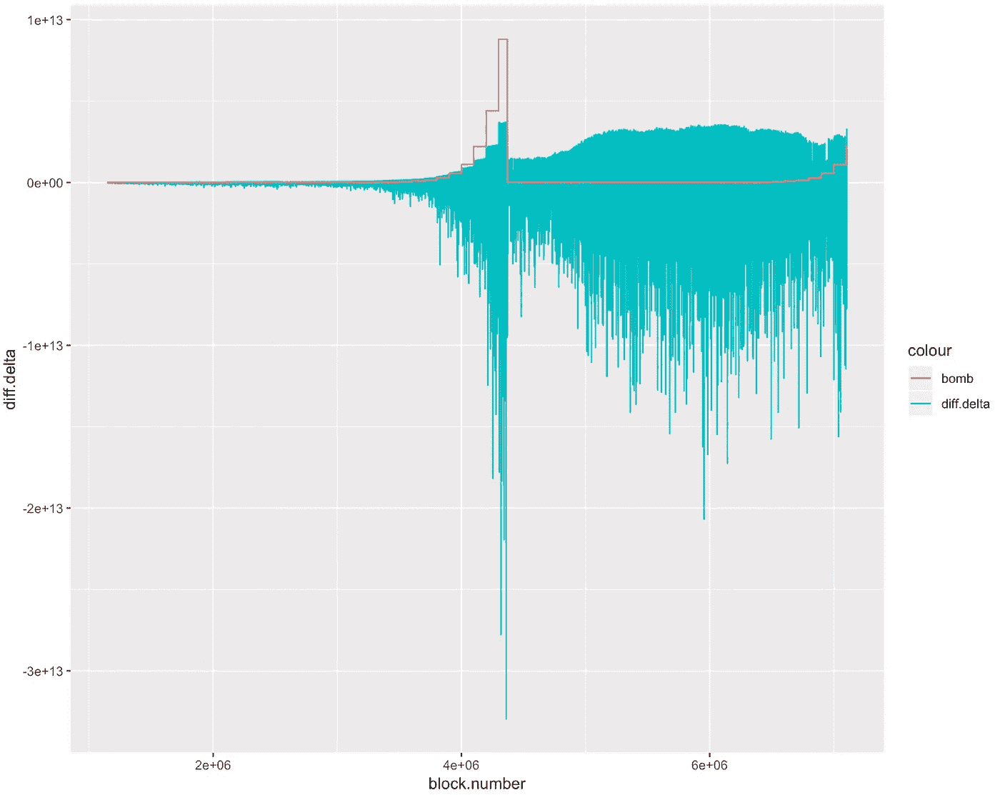
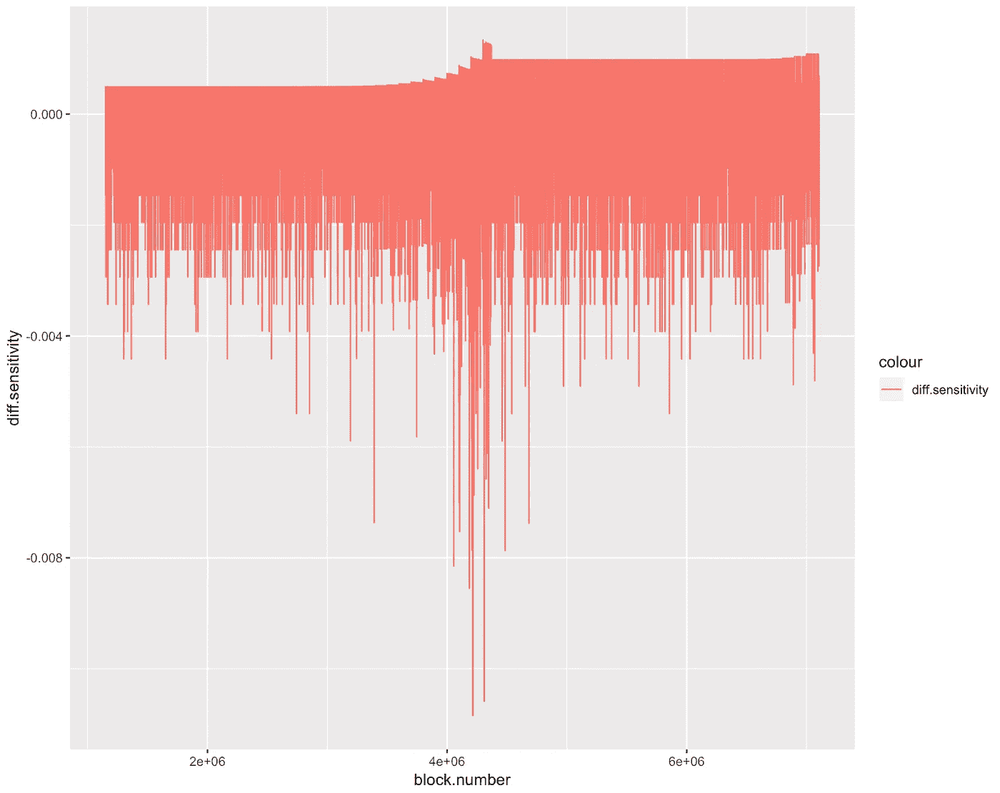
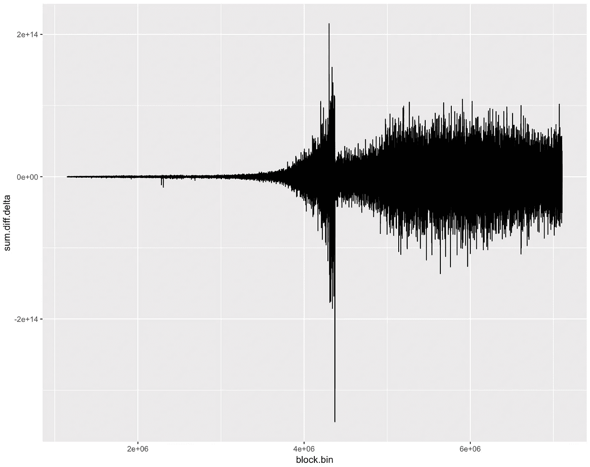
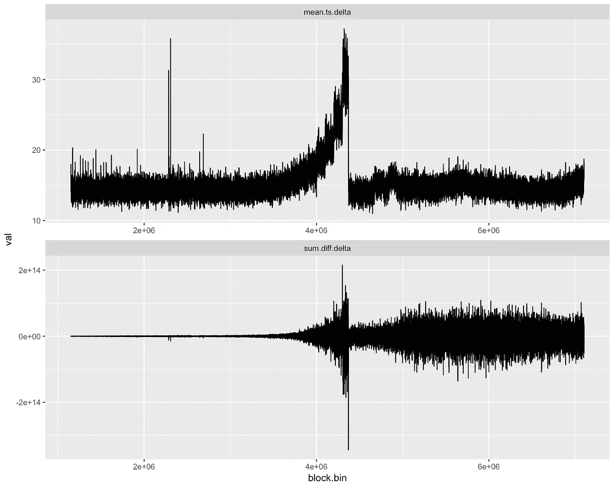
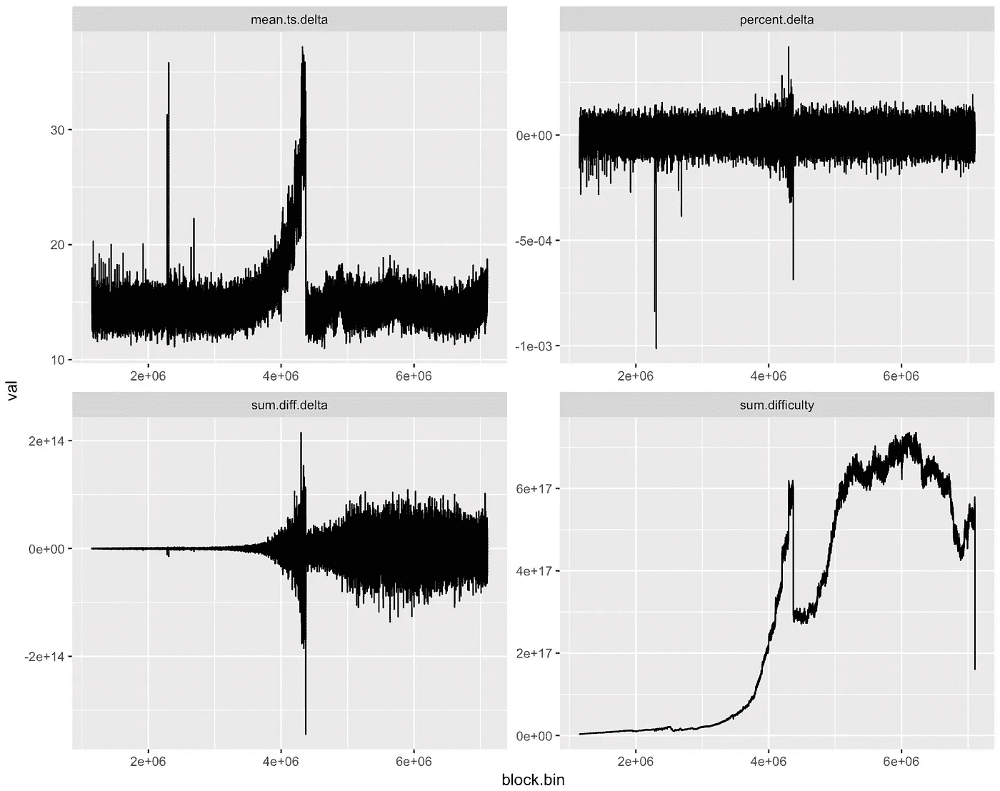
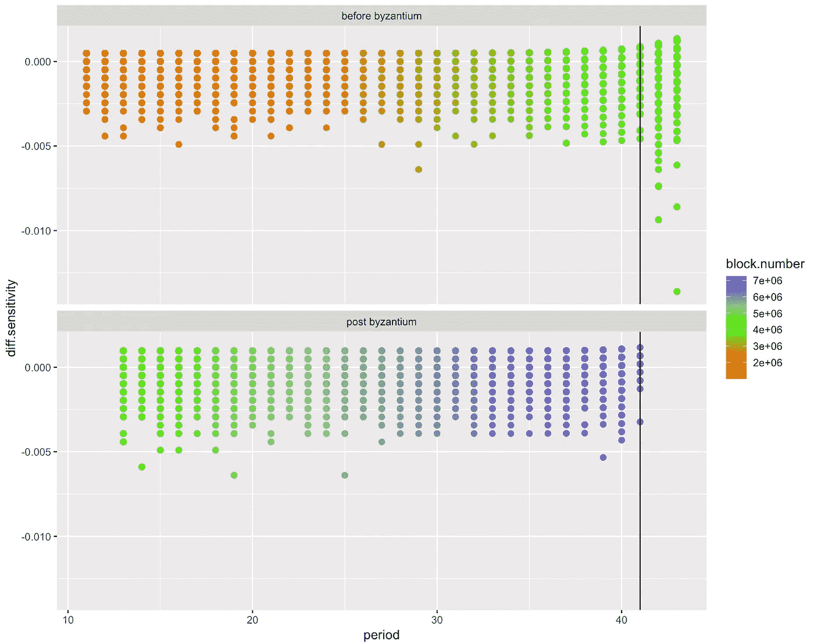
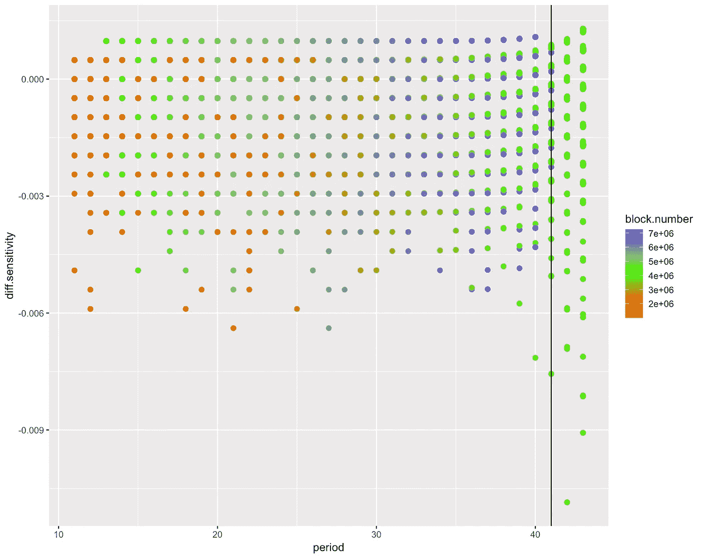

# 难度炸弹爆炸了吗

> 原文：<https://towardsdatascience.com/quickblarks-62aa90169ff0?source=collection_archive---------22----------------------->

我想与你分享(通过一系列图表)当一个人在新鲜出炉的以太坊难度数据上发布像 [Ed Mazurek](https://medium.com/u/d272dbeef59a?source=post_page-----62aa90169ff0--------------------------------) 这样的世界级数据科学家时会发生什么。

你得到了 QuickBlarks(如果你想知道的话，这是“QuickBlocks”和“R”的组合[)。如果你不知道“R”和](https://www.google.com/search?q=define+portmanteau&rlz=1C5CHFA_enUS740US740&oq=define+portman&aqs=chrome.0.0j69i57j0l4.4375j1j7&sourceid=chrome&ie=UTF-8) [R 工作室](https://www.rstudio.com/)，你应该知道。太神奇了。

在几乎没有任何解释的情况下，我将把“R”代码复制并粘贴到用于创建它的图表旁边。问艾德代码是什么意思。

逗号分隔的数据如下所示:

> 块号，时间戳，难度
> 11438269988，17171480576
> 21438270017，17163096064
> 31438270048，17154715646
> 41438270077，17146339321
> …

在编写本报告时，已生成的 7，105，056 个数据块中的每一个都有一条记录。下面是一些初步的设置代码，用于读取数据并对其进行一些清理。

```
require(tidyverse)
require(scales)
require(dplyr)
require(magrittr)homestead.block <- 1150000
byzantium.block <- 4370000
bin_size <- 200
period_size <- 100000
sample_size <- 50000difficulty <- read_csv(‘difficulty-generated-1a.csv’) %>%
 filter(block.number > homestead.block) %>%
 mutate(block.bin = floor(block.number / bin_size) * bin_size) %>%
 mutate(fake.block =
   ifelse(block.number >= byzantium.block,
      block.number — 3000000,
      block.number) + 1) %>%
 mutate(period = floor(fake.block / period_size)) %>%
 mutate(bomb = 2 ^ period) %>%
 mutate(parent.difficulty = lag(difficulty)) %>%
 mutate(parent.ts = lag(timestamp)) %>%
 mutate(diff.delta = difficulty — parent.difficulty) %>%
 mutate(ts.delta = timestamp — parent.ts) %>%
 mutate(diff.sensitivity = diff.delta / difficulty) %>%
 mutate(ts.sensitivity = ts.delta / timestamp)current.block <- difficulty$block.number %>% tail(1)
current.bomb <- max(difficulty$bomb)
```

## 代码

这是我们第一个图表的代码:

```
difficulty %>%
    sample_n(sample_size) %>%
    group_by(block.bin) %>%
    ggplot(aes(x=block.number)) +
    geom_line(aes(y=diff.delta, color=’diff.delta’)) +
    geom_line(aes(y=bomb, color=’bomb’))
```

这是第一个图表，显示了前 710 万个块中每个块的`difficulty`中的`delta`。它还用红线显示了难度炸弹。你可以看到它又爬上来了。



下一个图表，是用这段代码制作的，

```
difficulty %>%
    sample_n(sample_size) %>%
    group_by(block.bin) %>%
    ggplot(aes(x=block.number)) +
    geom_line(aes(y=diff.sensitivity, color=’diff.sensitivity’))
```

显示难度计算对当前情况的“反应”。我们用`diff.delta`除以`block.difficulty`来计算`sensitivity`。我不确定，但我认为 jaggys 来自于难度值的计算方式。它捕捉到下一个最近的 10 秒来调整，所以 10，11，12，… 19 都给出相同的调整，但 20，21，22，…给出不同的调整。



Sensitivity vs. Block Number

下一个图表，由这个“R”代码生成，

```
difficulty %>%
 group_by(block.bin) %>%
 summarize(sum.diff.delta = sum(diff.delta), na.rm=T) %>%
 ggplot(aes(x=block.bin, y=sum.diff.delta)) +
 geom_line()
```

显示`diff.delta`值的累计和。可以清楚的看到前拜占庭难度炸弹发动的战斗。上，下，上，下。事实上，难度在目标附近徘徊正是难度计算器应该做的。它保持块的时序一致。

[莱恩·雷蒂格](https://medium.com/u/9f3988a56032?source=post_page-----62aa90169ff0--------------------------------)想知道，由于当前链的散列率增加，难度炸弹的效果是否会被掩盖。我不确定(我什么都不确定)，但自拜占庭以来积木难度的更广泛传播可能表明他的直觉是正确的。难度炸弹是不是藏在大黑静电里？



在下面的图表中，我们展示了一些用更多的“R”代码制作的其他东西。在本节中，我们计算数据块时间戳平均值的差值，或者数据块时间戳差值的平均值，然后根据之前的图表(如果你想理解，你必须问 Ed)。

```
difficulty %>%
 group_by(block.bin) %>%
 summarize(sum.diff.delta = sum(diff.delta, na.rm=T), mean.ts.delta = mean(ts.delta, na.rm=T)) %>%
 gather(key = vars, value = val, -block.bin) %>%
 ggplot(aes(x=block.bin, y = val)) +
 geom_line() +
 facet_wrap(facets = ‘vars’, scales = ‘free’, ncol = 1)
```



现在我们只是展示了一大堆看起来很酷的黑色锯齿的疯狂图表(坚持住，下面有一些有趣的东西)。



上面的图表是用这种几乎难以理解的代码制作的:

```
difficulty %>%
 group_by(block.bin) %>%
 summarize(sum.difficulty = sum(difficulty), sum.diff.delta = sum(diff.delta, na.rm=T),mean.ts.delta=mean(ts.delta, na.rm=T)) %>%
 mutate(percent.delta = sum.diff.delta / sum.difficulty) %>%
 gather(key = vars, value = val, -block.bin) %>%
 ggplot(aes(x=block.bin, y = val)) +
 geom_line() +
 facet_wrap(facets = ‘vars’, scales = ‘free’, ncol = 2)
```

## 最后，一些真正有趣的事情

10 月份，在 T4 举办的状态黑客马拉松上，艾德和我受到启发，着手解决以太坊难度计算的问题。他担心，当前链条的散列率比拜占庭爆炸前高得多，会使炸弹更长时间地模糊不清，然后，一旦爆炸，会让人们措手不及。

我们想看看他的直觉是否正确。

简单说说炸弹。它以指数增长曲线爆炸，每 100，000 块翻一番。这产生了一个锯齿曲线的效果，因为链条很难抑制上升，正如我们在之前的中讨论的[。](https://medium.com/@tjayrush/ethereum-block-production-continues-to-slide-1b74a2123e3f)

在下一组图表中，我们将数据分成 100，000 个数据块的存储桶，并将这些存储桶称为`periods`。(下面黑线显示的是电流`period`。)这种波动在下面的图表中很明显，我们也将数据分成分组:前拜占庭和后拜占庭。这使我们能够将两个爆炸的炸弹排在一起进行比较。

当我们这样看数据时，我们看到了什么？首先，我们看到后拜占庭时代的炸弹开始抬头。

```
difficulty %>%
 mutate(era = ifelse(block.number <= byzantium.block, ‘before byzantium’, ‘post byzantium’)) %>%
 sample_n(sample_size) %>%
 ggplot(aes(y = diff.sensitivity, x = period, color=block.number)) +
 scale_colour_gradient2(low = “red”, mid = “green”, high = “blue”, midpoint = byzantium.block, space = “Lab”, na.value = “grey50”, guide = “colourbar”) +
 geom_point(size = point_size) + 
 facet_wrap(facets = ‘era’, nrow = 2) +
 geom_vline(xintercept = 41)
```

上面的代码给了我们这个图表:



在这里，我想，我们终于找到了一些有趣的东西。虽然，我们还没完。

接下来，我们将后拜占庭时期的数据和前拜占庭时期的数据相互叠加。

我们现在看到的是，如果我们足够仔细地观察，紫色的小点(现在的子炸弹)比绿色的小点(以前的子炸弹)更低。

莱恩是对的。这一次，难度炸弹的效果会变得模糊不清，不像以前那么明显。这可能会让它的效果不太明显，直到爆炸。那要多久？炸弹什么时候来？我们已经在第 41 期了。最后一颗炸弹([见此图](https://medium.com/@tjayrush/ethereum-block-production-continues-to-slide-1b74a2123e3f))现在开始显示减速。最后一枚炸弹现在已经开始加速了。我认为这一次也是如此，但它隐藏在更高的哈希速率后面。



## 结论

该叉了。

**Thomas Jay Rush** 拥有软件公司 QuickBlocks，其主要项目也被称为 QuickBlocks，这是一个软件库和应用程序的集合，能够对以太坊区块链进行实时、逐块的智能合同监控和分析。通过[网站](http://www.quickblocks.io)联系他。