# 利用 Streamlit 快速构建和部署仪表板

> 原文：<https://towardsdatascience.com/quickly-build-and-deploy-an-application-with-streamlit-988ca08c7e83?source=collection_archive---------1----------------------->

## 细流

## 将您的 Streamlit 应用程序部署到 Heroku，展示您的数据解决方案

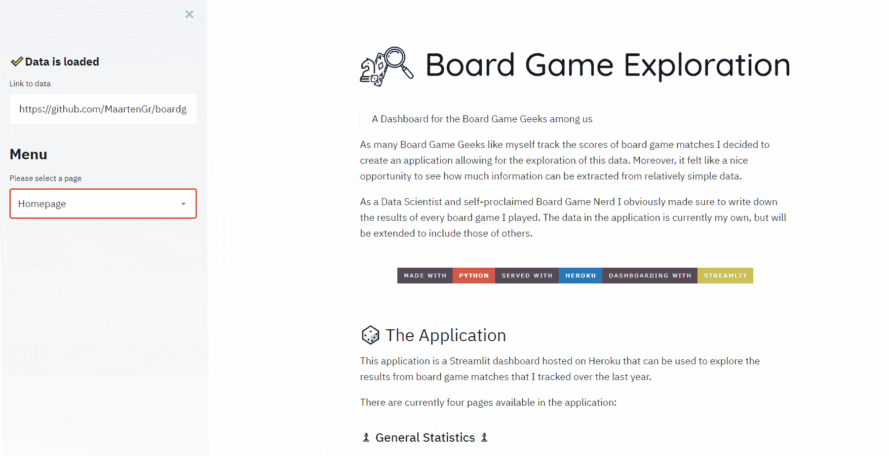

For my Board Game Exploration dashboard see [https://bgexploration.herokuapp.com/](https://bgexploration.herokuapp.com/)

随着 [Streamlit](https://github.com/streamlit/streamlit) 的推出，为你的机器学习解决方案开发一个仪表板变得非常容易。

Streamlit 是一个开源应用框架，专门为使用 Python 的 ML 工程师设计。它允许你只用几行代码就能创建一个令人惊叹的应用程序。

我想借此机会展示您可以使用 Streamlit 构建的应用程序。但主要是向您展示使用 **Heroku** 将您的应用程序投入**生产**的必要步骤。

# 1.细流

使用 Streamlit 工具(如 Dash 和 Flask)的一些优势:

*   它包含 Python 脚本；不需要 HTML 知识！
*   创建漂亮的应用程序需要更少的代码
*   不需要回调，因为小部件被视为变量
*   数据缓存简化并加速了计算流水线。

看看[这篇](/coding-ml-tools-like-you-code-ml-models-ddba3357eace)帖子，它可能会帮助你理解 Streamlit 的架构。而且，这个帖子

## 装置

使用以下命令可以轻松安装 Streamlit:

`pip install streamlit`

使用以下命令查看带有示例代码的应用程序演示:

`streamlit hello`

这样做会打开以下页面:

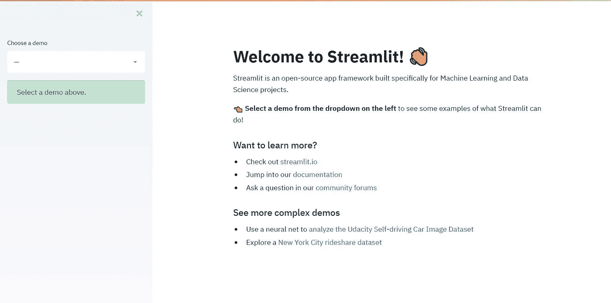

# 2.民众

上面的`streamlit hello`演示上面还有一些更复杂的在线演示供你试用。我将在下面列出一些(包括我的),这样你就会对可能性有所了解:

## Udacity 自动驾驶汽车图像浏览器

该演示展示了如何使用不到 300 行代码[将 Udacity 汽车数据集与对象检测结合起来，从而创建一个完整的 Streamlit 演示应用。](https://github.com/streamlit/demo-self-driving/blob/master/app.py)

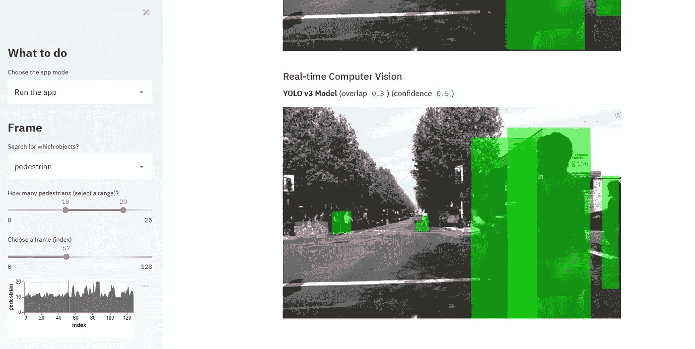

首先，安装 OpenCV 以便可以分析图像:

```
pip install --upgrade streamlit opencv-python
```

接下来，只需运行应用程序:

```
streamlit run https://raw.githubusercontent.com/streamlit/demo-self-driving/master/app.py
```

## 纽约市的优步皮卡

这是一个 Streamlit 演示程序，展示了如何交互式地可视化纽约市的优步皮卡。


安装 Streamlit 后，只需运行以下代码:

```
streamlit run https://raw.githubusercontent.com/streamlit/demo-uber-nyc-pickups/master/app.py
```

## 棋盘游戏探索

由于许多像我一样的桌游爱好者跟踪桌游比赛的分数，我决定创建一个允许探索这些数据的应用程序。您可以在这里实时查看这个应用程序[，或者您可以按照下面的步骤在本地运行它。](https://bgexploration.herokuapp.com/)

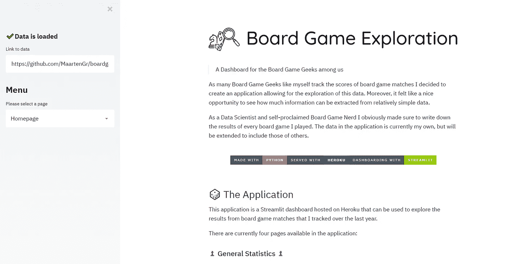

因为我使用了几个. py 文件，所以您首先需要克隆存储库:

```
git clone [https://github.com/MaartenGr/boardgame.git](https://github.com/MaartenGr/boardgame.git) BoardGame
```

然后，只需转到该文件夹并运行 Streamlit:

```
cd BoardGame
streamlit run app.py
```

**注意**:如果你愿意，你可以使用你自己的数据，只需提供你的数据的 URL。

# 3.创建应用程序

在这一节中，我将演示如何创建一个简单的应用程序，因为这篇文章的主要目的是为您的项目准备**部署**。

如果你想要更深入的例子，请查看 Streamlits [API](https://streamlit.io/docs/getting_started.html) 或查看 [this](/coding-ml-tools-like-you-code-ml-models-ddba3357eace) 或 [this](/how-to-write-web-apps-using-simple-python-for-data-scientists-a227a1a01582) 帖子，它很好地描述了它的许多特性。

但首先，让我介绍一些你可能会在自己的应用程序中使用的基本功能。

## **选择小部件**

Streamlit 的主要特性之一是使用小部件。有许多可用的小部件，包括:

*   **选择框**

```
age = streamlit.selectbox("Choose your age: ", np.arange(18, 66, 1))
```

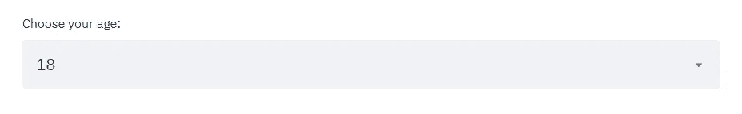

*   **滑块**

```
age = streamlit.slider("Choose your age: ", min_value=16,   
                       max_value=66, value=35, step=1)
```

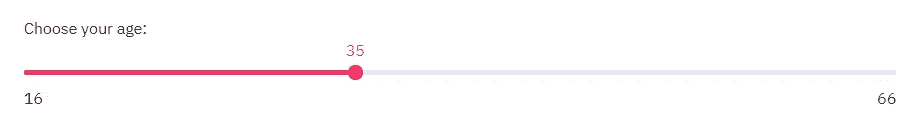

*   **多选**

```
artists = st.multiselect("Who are your favorite artists?", 
                         ["Michael Jackson", "Elvis Presley",
                         "Eminem", "Billy Joel", "Madonna"])
```

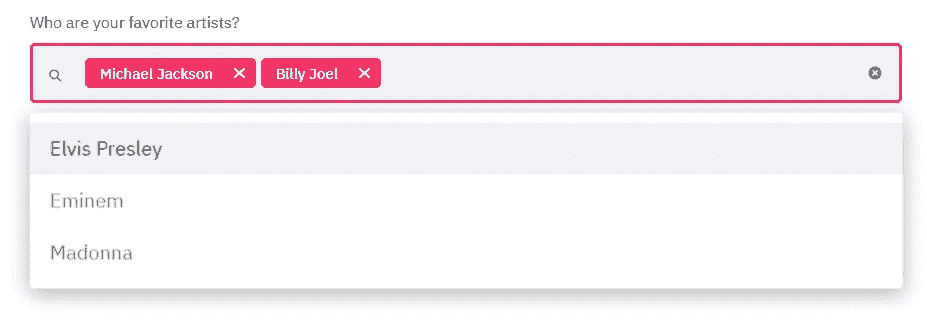

## **缓存**

许多仪表板工具的问题是，每次选择一个选项或在页面之间切换时，数据都会被重新加载。幸运的是，Streamlit 有一个惊人的选项，允许您缓存数据，并且只在以前没有运行过的情况下运行它。

上面的代码显示您可以缓存您创建的任何函数。这可能包括加载数据，但也包括预处理数据或训练一次复杂的模型。

## 形象化

Streamlit 支持许多可视化库，包括:Matplotlib、Altair、Vega-Lite、Plotly、Bokeh、Deck。GL 和 Graphviz。它甚至可以加载**音频**和**视频**！

下面是一个展示牛郎星图的快速示例:

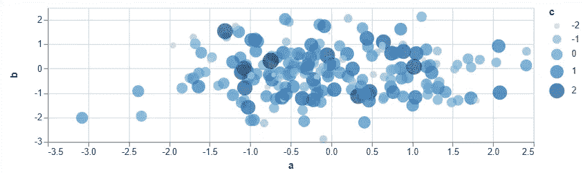

## 降价

就我个人而言，我是 markdown 的忠实粉丝，它有可能创造出好看的东西。幸运的是，我们可以只用一个函数生成 markdown:

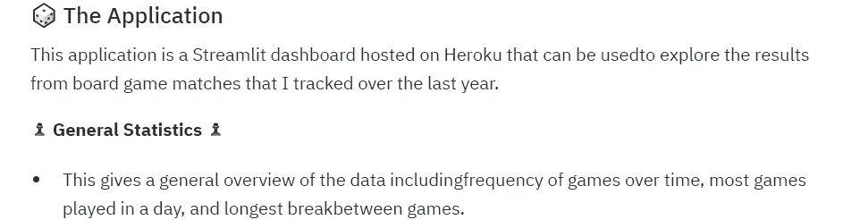

**注意**:基于 dev 分支中的[提交](https://github.com/streamlit/streamlit/commit/e349a426d4cbd60e7af369d930835c44e9746f89)，st.latex 似乎即将到来！

## 写

Write 函数是 Streamlit 命令的瑞士军刀。它根据其输入表现不同。例如，如果你放入一个 Matplotlib 图形，它会自动显示给你看。

几个例子:

*   write( **string** ):打印格式化的降价字符串。
*   write( **data_frame** ):以表格形式显示数据帧。
*   write( **dict** ):在一个交互式小部件中显示字典。
*   write( **keras** ):显示一个 keras 模型。
*   write( **plotly_fig** ):显示一个 plotly 图形。

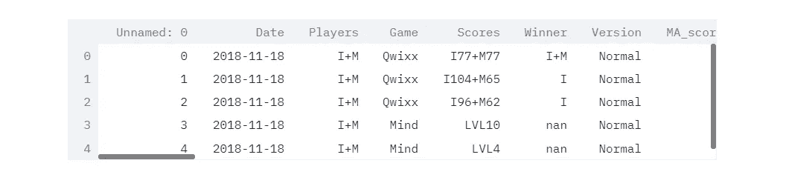

你可以在这里找到它的可能性的完整概述[。](https://streamlit.io/docs/api.html#streamlit.write)

# 4.应用程序

为了展示如何部署您的应用程序，我们首先需要创建一个基本的应用程序。这个例子将是一个简单的演示有两页。在主页上，它显示我们选择的数据，而探索页面允许您在牛郎星图中可视化变量。

下面的代码在工具条上给了你一个`Selectbox`，允许你选择一个页面。数据被缓存，因此不需要不断地重新加载。

运行代码`streamlit run app.py`将显示以下页面:

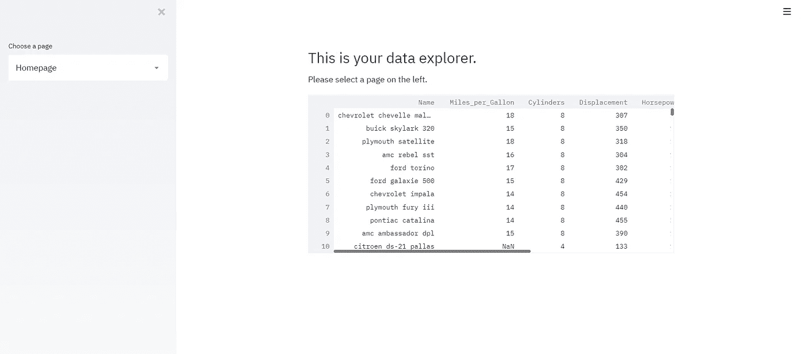

选择页面 **Exploration** 将向您显示以下可视化内容:

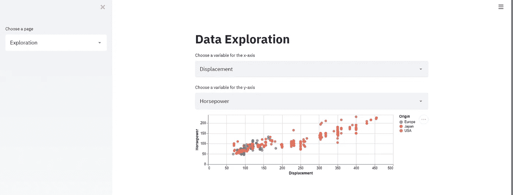

# 5.Heroku 部署

现在我们有了自己的应用程序，如果我们能把它放在网上的某个地方就好了。这样，您就可以向其他人展示您开发的应用程序。我们将通过将其部署到 Heroku 来实现这一点，Heroku 是一种平台即服务(PaaS)，可用于在云中完全运行应用程序。

首先，确保您的应用程序文件夹中有以下文件:

```
.
├── app.py
├── requirements.txt
├── setup.sh
└── Procfile
```

你可以在 **这里的 [**库中找到所有这些文件。**](https://github.com/MaartenGr/streamlit_guide)**

## 创建帐户

要部署该应用程序，您首先需要在 Heroku [这里](https://signup.heroku.com/signup/dc)创建一个帐户。别担心，托管你的应用程序是完全免费的**！**

**使用免费帐户的主要缺点是，如果超过半小时没有访问，网站就会关闭。但是，它会在您打开站点的那一刻重新启动。**

## **安装 Heroku 命令行界面**

**接下来，您需要在这里安装 Heroku 命令行界面(CLI)。您将使用它来管理您的应用程序，在本地运行它，查看它的日志，等等。**

## **登录 Heroku**

**这样做之后，打开你的`cmd.exe`和`cd`到应用文件夹。然后，用`heroku login`登录 Heroku。您将被重定向到首选浏览器的登录屏幕。**

**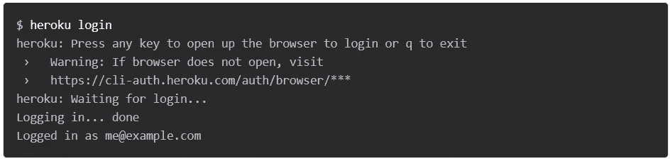**

## **部署应用程序**

**最后，当您的`cmd`在应用程序文件夹中打开时，首先运行`heroku create`来创建一个 Heroku 实例:**

**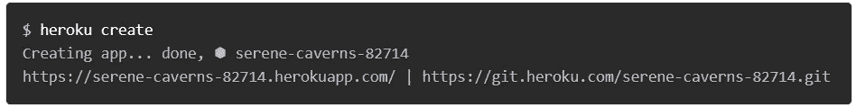**

**然后，用`git push heroku master`将所有代码推送到那个实例:**

**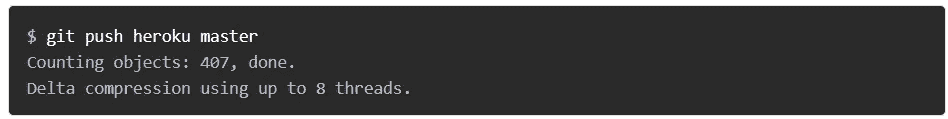**

**这将创建一个 Heroku 实例，并将应用程序文件夹中的所有代码推送到该实例。现在，应用程序应该已经部署好了。**

**运行`heroku ps:scale web=1`以确保至少有一个应用程序实例正在运行:**

****

**最后，使用`heroku open`打开您的应用程序；它将使用您首选的浏览器在应用程序名称生成的 URL 访问应用程序:**

****

**所有的**代码**都可以在这里找到:**

 **[## MaartenGr/streamlit_guide

### 此 repo 包含创建和部署您的 Streamlit 应用程序到 Heroku 的所有代码。

github.com](https://github.com/MaartenGr/streamlit_guide)** 

**如果您在部署到 Heroku 时遇到任何问题，请点击[此](https://devcenter.heroku.com/articles/getting-started-with-python)页面获取程序的详细概述。**

**如果你和我一样，对人工智能、数据科学或心理学充满热情，请随时在 [LinkedIn](https://www.linkedin.com/in/mgrootendorst/) 上添加我。**