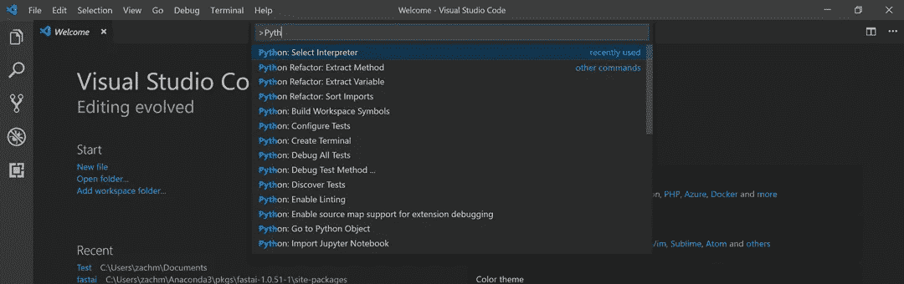
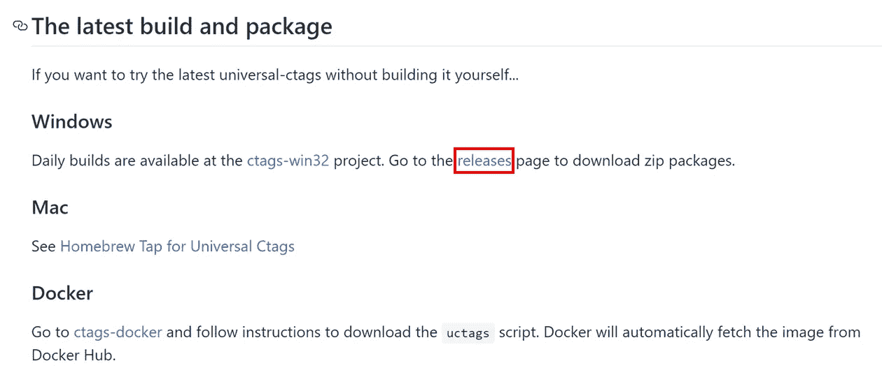
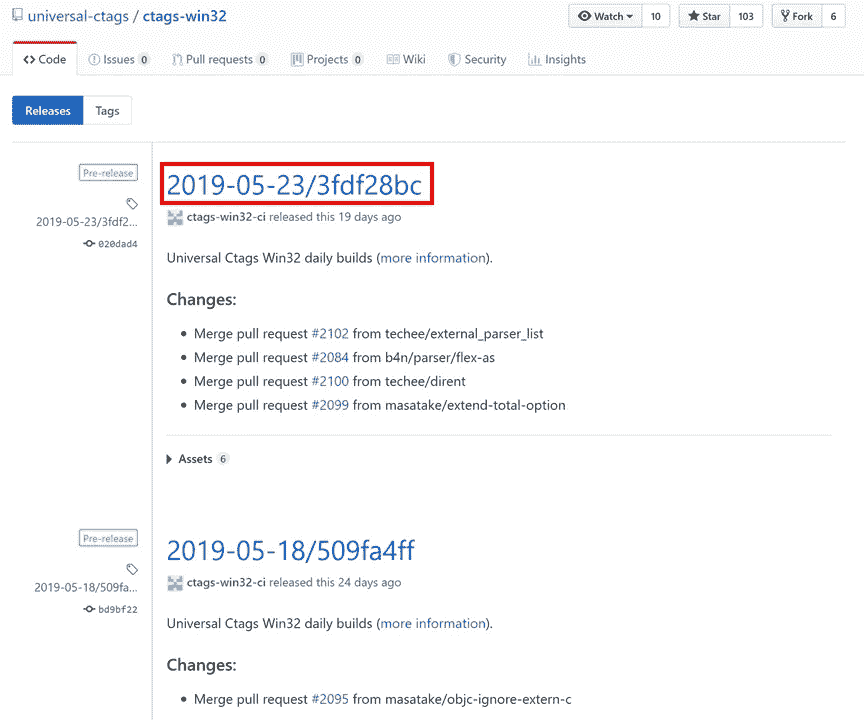
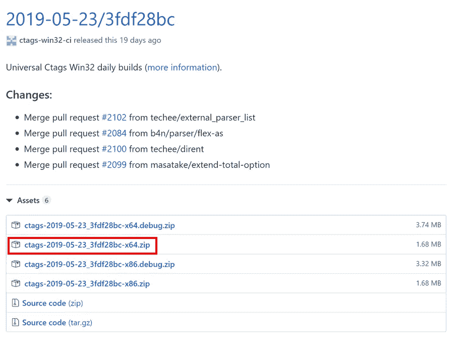
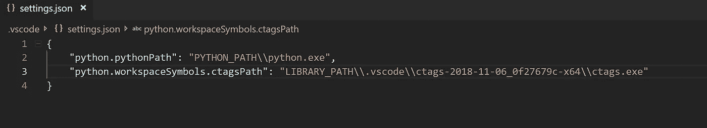
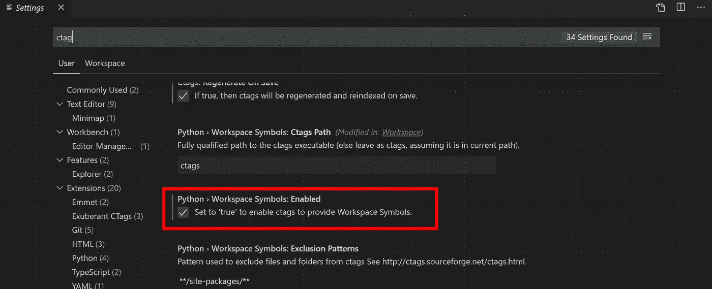

# 使用 ctags 快速导航 Python 库

> 原文：<https://towardsdatascience.com/quickly-navigating-python-libraries-with-ctags-9924a0b9a82f?source=collection_archive---------11----------------------->

## 数据科学家使用 ctags 有效导航 Python 库的教程。


作为机器学习从业者，我经常使用开源的机器学习库，比如 [fastai](https://docs.fast.ai/) 和 [scikit-learn](https://scikit-learn.org/stable/) 。在使用这些库一段时间后，您可能会想要做一些库目前不支持的事情(例如，创建一个定制的模型)，但是您可能仍然想要使用许多库函数。比如我用 fastai/PyTorch 设计训练定制的深度学习模型。fastai 为读取数据提供了一个很好的框架，所以通常情况下，我仍然希望使用许多 fastai 组件，但是要进行一定程度的定制。或者，您可能只是好奇某个函数是如何工作的，并希望检查源代码。为了有效地实现这种级别的检查，重要的是您能够轻松地跳过您选择的机器学习库的源代码。所以，你需要选择一个好的代码编辑器，并且知道如何用好它。对于不在命令行界面工作的用户，我**强烈推荐** [**Visual Studio (VS)代码**](https://code.visualstudio.com/) **。** VS 代码完全免费，有一些确实很棒的功能。VS 代码结合一个叫做 **ctags** 的编程工具将允许你有效地探索 Python 库。在这里，我给出了如何在 VS 代码中设置 ctags 的分步教程。应该注意的是，本教程是为 Windows 用户设计的，但它在很大程度上可以很好地推广到其他操作系统，只需稍加修改。

我之前在这里提供的许多技巧来自这篇[博客](https://andrew.stwrt.ca/posts/vim-ctags/)和来自 [fast.ai 课程](https://course.fast.ai/)，所以我要感谢这些作者为我做的铺垫！我也不得不承认，我肯定不是 VS 代码方面的专家，所以建议/评论将会非常感谢。好了，我们开始吧！

1.  首先，如果你还没有 Python，安装 Python。强烈推荐通过 [Anaconda](https://www.anaconda.com/distribution/) 下载 Python。
2.  二、下载安装 [Visual Studio 代码](https://code.visualstudio.com/)。同样，它是完全免费的，并且兼容 Windows、Linux 或 Mac，所以这应该很容易！
3.  接下来，打开 Visual Studio 代码。首先，您必须选择 Python 作为您的解释器。为此，键入 *Ctrl+Shift+P* 并开始键入“Python: Select Interpreter”然后选择想要加载的 Python 版本和环境。同样，我经常使用 fastai，所以我为 fastai 选择了 Python 环境。如果“Python: Select Interpreter”没有出现，这意味着您的系统上没有安装 Python。这是一个简单的解决办法，所以只要按照这里的指示[去做](https://marketplace.visualstudio.com/items?itemName=ms-python.python)。



4.现在打开包含您想要轻松浏览的 Python 库的文件夹(例如 fastai)。当你这样做的时候，VS 代码将会在那里创建一个名为*的目录。vscode* 。这个目录包含一个 JSON 文件，标签为 *settings.json.* 在 VS 代码(或任何文本编辑器)中打开 *settings.json* 文件。我们将分两步编辑这个文件。

5.对于 **Windows 用户**，接下来，您需要下载 ctags 包。Ctags 为源文件和头文件中的名称生成一个索引(或标记)文件。这就是我们如何通过创建这些标签来快速搜索我们的代码。你可以从这个 [GitHub 网站](https://github.com/universal-ctags/ctags)下载。如果您使用的是 Windows，您可以点击*发布*，选择最新版本，并选择要下载的 zip 文件。把这个 zip 文件解压到你喜欢的任何地方，但是我通常只是把它放在*中。vscode* 目录。



对于 **Linux 用户**，您将需要通过在终端键入以下代码来安装 exuberant-ctags

```
sudo apt-get install exuberant-ctags
```

6.还记得 *settings.json* 文件吗？ **Windows 用户** (Linux 用户跳到第 7 步)，您现在需要编辑它。JSON 中应该已经有一行指定了 Python 可执行文件的路径。现在你需要添加一行来指定*ctags.exe*文件的路径。创建一个新行并添加以下代码行(用 Python 库的路径或您选择放置*ctags.exe*文件的位置替换*库路径*):

```
"python.workspaceSymbols.ctagsPath": "LIBRARY_PATH\\.vscode\\ctags-2018-11-06_0f27679c-x64\\ctags.exe"
```

您的 *settings.json* 文件应该如下所示:



7.接下来，生成标签！VS 代码让这变得非常简单。对于 **Windows 用户**，你要做的就是键入 *Ctrl + t* 。这将创建一个包含所有标记的标记文件。如果这不起作用，打开终端 is VS 代码，转到输出选项卡，再次键入 *Ctrl + t* ，并查看输出内容。另外， **Windows 和 Linux 用户**，确保 Python 工作空间符号已启用，这可以在设置中选择(见下图),或者通过将以下代码行添加到您的 *settings.json* 文件中:

```
"python.workspaceSymbols.enabled": true
```



对于 **Linux 用户**，要生成标签文件，在终端中确保您在 Python 库的目录中，并在终端中键入以下内容:

```
ctags-exuberant -R -f tags
```

这将生成标记文件。我通常将这个标签文件移动到*。vscode* 目录。然后，在 *settings.json* 文件中，您需要通过添加以下附加行来指定标签文件的路径:

```
“python.workspaceSymbols.tagFilePath”: “LIBRARY_PATH/.vscode/tags”
```

8.您现在可以通过键入 *Ctrl + t* 并键入您想要搜索的类和函数的名称来导航标签。很简单！

# 我还能用 VS 代码做什么？

标签已经创建，现在可以使用了。在 VS 代码中还有许多其他有用的快捷键。下面是我无耻地从 [fast.ai 课程](https://course.fast.ai/)中偷出来的一些:

*   命令面板: *Ctrl-shift-p*
*   转到符号:*ctrl-t*
*   查找参考: *Shift-F12*
*   转到定义: *F12*
*   返回: *Alt-left*
*   前进: *Alt-right*
*   隐藏侧边栏: *Ctrl-b*
*   禅模式: *Ctrl-k，z*

我希望你觉得这是有用的，并欢迎评论/建议！