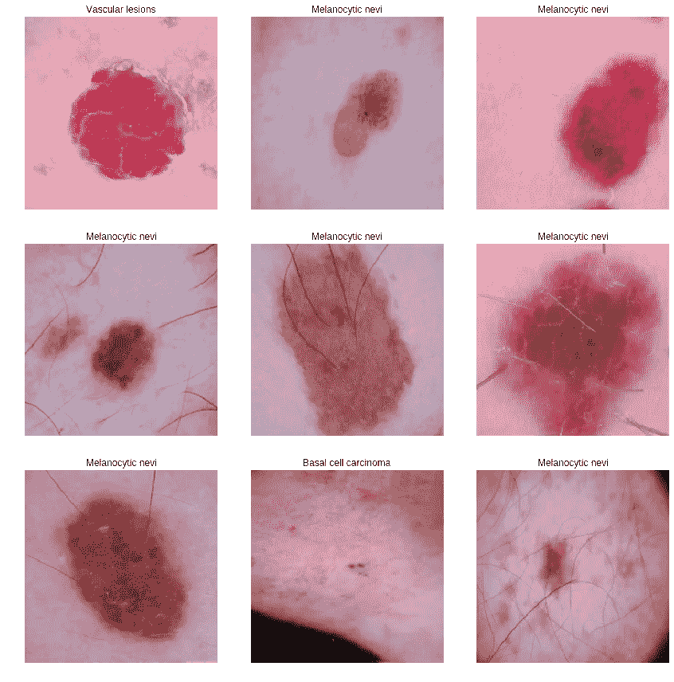
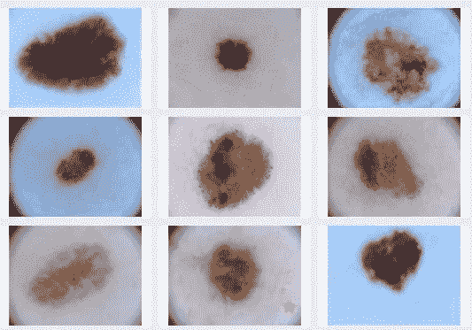
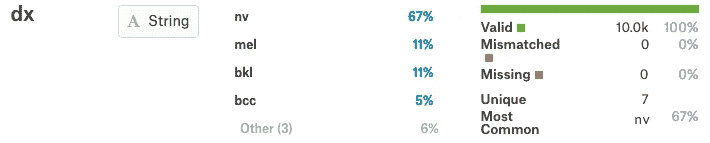
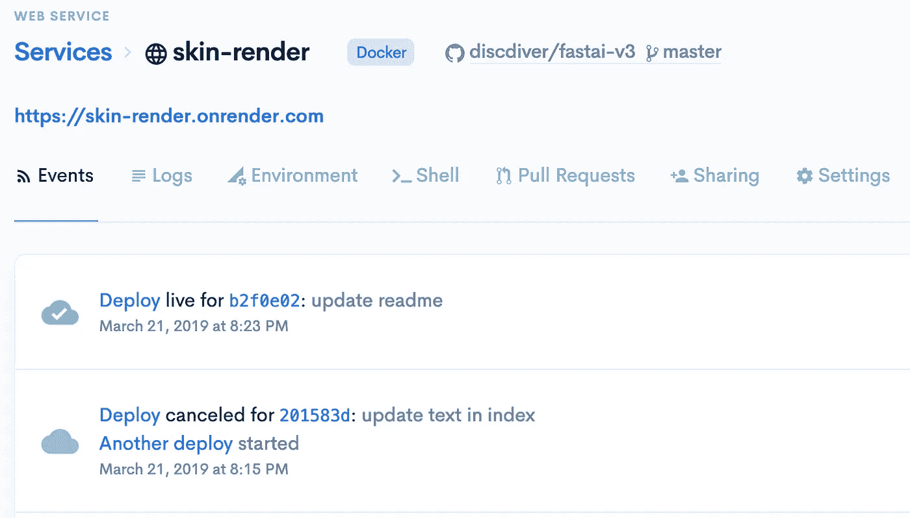
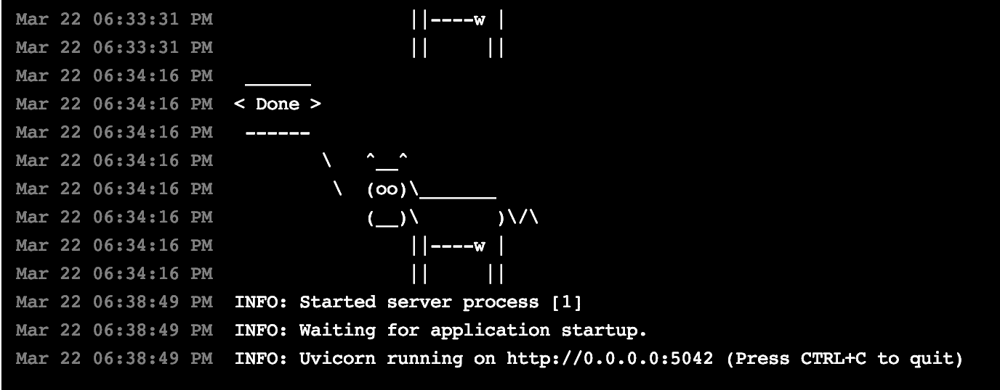
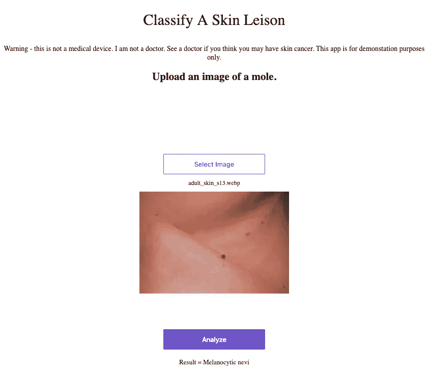
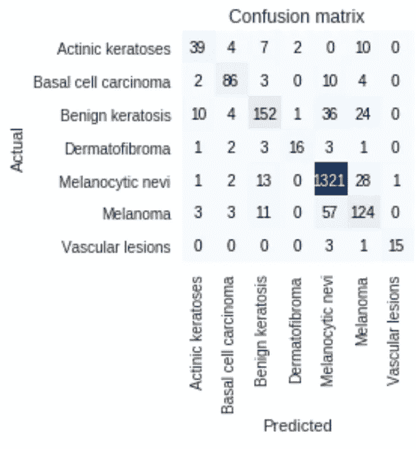

# 构建和部署深度学习图像分类应用程序

> 原文：<https://towardsdatascience.com/quickly-train-and-deploy-an-ai-computer-vision-app-d34ffa21fdd?source=collection_archive---------17----------------------->

## 基于 fastai 和 Render 的皮肤癌图像分类


Deploy

在本文中，我将向您展示如何使用计算机视觉分类模型从概念到部署。通过 fastai，你可以快速建立和训练一个最先进的深度学习模型。然后，Render 使托管和部署您的应用程序变得轻而易举。


我们将一步一步地构建和部署一个模型来对皮肤病变图像进行分类。完成后，用户将能够上传图像到网站，模型将分类他们的皮肤病变。

我打算很快在 NLP 上写一篇类似的文章— [关注我](https://medium.com/@jeffhale)确保你不会错过！😄

## **免责声明:**

**卫生/法律:**该项目仅用于演示目的。如果你认为你可能有皮肤问题，去看看健康护理专家。我不是医疗保健专业人士。

**技术上:**这个例子并不适合拥有数百万点击量的大型网站。如果你有这个问题，那是个好问题。😀这种设置可能有效。Render 在幕后使用 Docker 和 Kubernetes 来尽可能无痛苦地进行缩放。

好吧——回到行动上来！



Training set images

皮肤癌是最常见的一组癌症。已经开发了许多应用程序来对皮肤病变进行分类。通过上传一张你可疑皮肤斑点的照片，你可以看看你是否应该和皮肤科医生谈谈。

计划是这样的:

1.  找到数据。
2.  建立和训练模型。
3.  部署模型。
4.  提高模型性能。

让我们把这个计划充实一下。😉


# 步伐

1.  找到数据。我记得在某个地方看到过皮肤痣的数据集——可能是 UCI、data.world 或 Kaggle。我去找找看。
2.  建立和训练模型。我现在正在上 [fast.ai](https://www.fast.ai/) 深度学习 MOOC，所以我会用 fastai，高级 PyTorch 库来训练我的模型。Fastai 允许你应用很多最新的技巧，API 对于计算机视觉任务来说也很方便。我将使用数据扩充、迁移学习和学习速率退火。我会在一个 Jupyter 笔记本上训练，在云中有一个 GPU。
3.  部署模型。Fastai 的文档包含了一个在 [Render](https://render.com/) 上部署模型的指南[，每月 5 美元。](https://course.fast.ai/deployment_render.html)
4.  在我们有了一个已部署的模型之后，我们将返回并尝试改进模型性能。

我们开始吧！🚀

# 搜寻数据

我发现哈佛的研究人员收集了 10015 张患有多种皮肤病的图片:[https://dataverse.harvard.edu/dataset.xhtml?persistent id = doi:10.7910/DVN/dbw 86t](https://dataverse.harvard.edu/dataset.xhtml?persistentId=doi:10.7910/DVN/DBW86T)。

看起来像是在数据的几个方面有一场年度 ISIC 竞赛——信息[在这里](https://www.isic-archive.com/#!/topWithHeader/tightContentTop/challenges)。你可以在这里看到不同滤镜[的图像](https://www.isic-archive.com/#!/topWithHeader/onlyHeaderTop/gallery)。



Images from [ISIC](https://www.isic-archive.com/#!/topWithHeader/onlyHeaderTop/gallery)

我在 Kaggle 上找到了同样的数据集来分类皮肤损伤。Kaggle 的空间限制和共享 Docker 容器内存限制可能会阻止我们做我们想做的事情，所以我们可能需要转移到 Colab。关于在 Kaggle 和 Colab 之间做出选择的讨论，请参见我的文章。

皮肤病变图像压缩在两个压缩文件夹中。我没有找到一种简单的方法来合并 Kaggle 上两个压缩数据集文件夹中的文件。我下载了数据，压缩后重新上传。现在你可以在 [Kaggle 这里](https://www.kaggle.com/discdiver/mnist1000-with-one-image-folder)使用一个文件夹中的数据。😄

# 探索数据

有一个带元数据的文件: *HAM10000_metadata.csv.* 很方便。以下是内容和我的初步想法:

*病变 id* —每个病变一个。每个病灶可以有多个图像。
*image_id* —列出每个病灶的图像 id。这些也是文件名，sans *。jpg* 。
*dx* —诊断。7 种类型。我想应该是 DV。
*dx_type* —如何做出诊断。
*年龄* — 57 值缺失。可以尝试不同的策略来处理。
*性* — 3 值。
*定位*—身体上的位置。15 个值。

图像比独特的案例多。嗯。我在这里挖出了[的](https://www.ncbi.nlm.nih.gov/pmc/articles/PMC6091241/)这是因为同一张图片是以不同的放大倍数收录的。这是一点事实上的数据扩充。

## 初始问题

结果变量有多少分类标签？七:*黑色素细胞痣*、*黑色素瘤*、*良性角化病*、*基底细胞癌*、*光化性角化病*、*血管病变*、*皮肤纤维瘤*。请注意，黑色素瘤是最危险的皮肤癌。你也不想要基底细胞癌——最常见的皮肤癌。[光化性角化病](https://www.skincancer.org/skin-cancer-information/actinic-keratosis)被认为是潜在的癌前病变。

看起来没有任何图像被归类为一种以上的类型，所以我们有一个多类的问题，但不是多标签的问题。

数据不平衡吗？是的，67%是 *nv 级，*代表*黑色素细胞痣*。



我们需要小心使用不平衡类的报告指标。例如，准确性就不是一个很有洞察力的衡量标准。然而，根据 fast.ai 的[杰瑞米·霍华德](https://www.youtube.com/watch?v=Egp4Zajhzog&feature=youtu.be&t=4200)的说法，在用深度学习模型进行训练时，我们不需要担心不平衡的数据集。网络会找出这些类别。

# 准备数据

我们将导入我们常用的库，并为深度学习配置一些东西。因为 Kaggle 没有最新的 PyTorch 和 fastai 库，我们就打开互联网，用 pip 安装那些。

让我们也打开我们的 GPU。然后，我们将列出我们的硬件和软件，以确保可重复性，并确保我们拥有我们认为我们拥有的资源

当我厌倦了等待我的合并数据文件上传时，我切换到了 Colab。我意识到我可以使用 [Kaggle API](https://github.com/Kaggle/kaggle-api) 从 Kaggle 获取数据集并导入 Colab。然后我合并了图像文件，并把它们保存在一个 Google Drive 文件夹中。这有点麻烦，但现在数据在我的驱动器文件夹中，这很方便。😄这是我的 Colab 笔记本。

# 建立模型

我用的是 fastai v.1.50.0，torch v1.0.1.post2，torchvision v0.2.2.post3。

让我们首先使用数据的子集进行快速训练，以使一切正常工作。当我们只想看看我们是否在正确的道路上时，没有理由花费大量时间等待培训。我们将从 1，000 张图像的随机样本开始训练和验证集，而不是 10，015。一旦我们解决了问题，我们可以在以后使用完整的数据集。

**训练测试分割** — fastai 会将我们的数据分割成训练集和验证集。我们将留出 20%的图像进行验证。

**转移学习**——**先用 ResNet34 够好，够快，可以上手。稍后，如果我们想花更多时间训练潜在的更高精度，我们将转移到 ResNet50。**

**优化器** —我使用默认值:Adam。

**层**—CNN 的默认 fastai 层在这里解释[。这些是 PyTorch 图层块，具有 batchnorm、dropout、linear 和 Relu 函数。最后一组图层由一个 2d 池图层和一个拼合图层组成。](https://docs.fast.ai/vision.learner.html#cnn_learner)

**学习率**—我们将按照 Leslie Smith 的[1 周期策略](https://sgugger.github.io/the-1cycle-policy.html)使用学习率退火。我们将从 fastai 在第一个时期的默认学习率 3E-10 开始(这已被 fastai 学习率查找器验证为合适)。解冻后，我们将使用学习率查找器和[经验法则](https://youtu.be/BWWm4AzsdLk?t=5123)为 1 周期策略创建一个学习率范围，将之前的学习率降低 10 倍。

**损失函数** —我们有一个多分类项目，所以我们将使用分类交叉熵。

**评估**——让我们跟踪误差率、精度和灵敏度。我们还将深入研究混淆矩阵。

我训练了较小的数据子集，让一切正常工作。然后我切换到完整的数据集。经过四个时期的训练，解冻，再训练四个时期，我们有了一个误差率为 15%的基线模型。这对我们的目的来说足够好了。让我们尝试部署我们的模型。

# **展开**

下面是部署模型的五个步骤。

1.  Fork [示例 fastai GitHub repo](https://github.com/render-examples/fastai-v3) 并克隆它。
2.  在[渲染](http://render.com)上注册一个账号。
3.  按照 [fastai 渲染指南](https://course.fast.ai/deployment_render.html)设置你的项目。
4.  在代码编辑器中自定义渲染应用程序代码。
5.  将您的代码推送到 GitHub。这是我在 Render 上的应用程序的 GitHub repo 。

您的应用程序应该会在推送时自动部署。您可以在渲染面板中查看应用程序的事件和日志。



部署应用程序需要几分钟时间。您可以在仪表板中查看进度。在我短暂的经历中，Render 有很好的客户支持——他们很快通过他们的 Slack 频道回答了我的问题。



你可以在这里查看我的直播 app:[https://skin-render.onrender.com/](https://skin-render.onrender.com/)。我可能会在几个星期后把它拿下来，所以如果这个链接对你不起作用，这就是原因。😄



# 在 Jupyter 实验室本地运行您的应用程序

您也可以在本地运行您的应用程序。事实上，如果你正在使用 Jupyter Lab，你可以在笔记本上看到你的应用程序，这超级酷！

以下是在笔记本中查看应用程序的三个步骤:

1.  启动 Jupyter 实验室服务器
2.  从您的终端，在您的本地渲染应用程序文件夹中，使用`python app/server.py serve`启动服务器
3.  在笔记本单元格中输入以下代码，并运行它来创建 iframe:

```
from IPython.display import IFrame
IFrame(‘[http://localhost:5042/'](http://localhost:5042/'), width=’100%’, height=500)
```

您的应用程序应该在您的单元输出中运行。


厉害！渲染相当流畅。现在让我们看看是否可以改进我们的模型。

# **改进模型**

现在让我们对模型进行更长时间的训练，并尝试通过超参数调整来提高精度。正如我在本文的[中所描述的，我们将使用混合精度训练来加速训练。](/kaggle-vs-colab-faceoff-which-free-gpu-provider-is-tops-d4f0cd625029?source=friends_link&sk=7eb54f51566742d937b8d41adaee1bb9)

使用半精度训练和具有 8 个总时期的 64 批次大小导致 14%的错误率。那听起来不太坏。但后来我看了混淆矩阵，发现将近一半的黑色素瘤病例被归类为良性。这是个问题。😟

我致力于一些潜在的修复。最佳模型使用迁移学习，ResNet50，12 个总训练时期，批量大小 64，浮点精度 32。

错误率现已降至 10.7%，这是混淆矩阵:



我不知道我会在野外使用这个模型；黑色素瘤的错误分类还是太多了。尽管如此，让我们称这个项目为“暂时完成”,并讨论你可能追求的潜在未来方向。

# 潜在的未来方向

*   测试更多超参数组合。
*   让用户输入他们的年龄，以及一张图片。这些数据可能会提高准确性。然而，这也会增加摩擦。
*   添加测试时间增强(TTA)以获得更好的预测性能。这种增强将是棘手的，因为应用程序需要从提供的图像创建多个图像。TTA 还会让应用程序的推理速度稍微慢一些。或者，我们也可以要求用户上传病变的三张不同的图片，并用这些图片进行预测。
*   进行二元分类任务，将这些损伤分为危险或不危险。如果这是最终用户真正需要的信息，我想如果我要发布它的话，我会让应用程序给出推荐。

我们学到了什么？

# 外卖食品

这些图像状态良好，将它们转换成正确的格式并不困难。让 Kaggle 和 Colab 使用数据源需要做大量的工作。Kaggle 和 Colab 都有他们的障碍，但他们是自由的。😄

等着 Colab 的 K80 GPU 训练你的模型变老。在早期阶段开发一个小模型是没问题的，但是如果你想测试一堆超参数，那么转向付费服务可能是值得的。我发现谷歌云平台(GCP)是最容易使用的云提供商，物有所值。看我的文章比较云 GPU 提供商[这里](/maximize-your-gpu-dollars-a9133f4e546a)。如果我要进一步训练这些模型，我可能会在 GCP 上使用 V100。

训练数据集的大小很重要。该模型在用 800 个观察值而不是 8k 进行训练时，训练效果并不好。

Fastai 和 Render 是一个伟大的团队。Fastai 有利于快速创建高性能模型，Render 使部署它们变得轻而易举。👍

# 包装

在本文中，您看到了如何从 idea 到 live web 应用程序来解决细粒度的多类计算机视觉问题。我希望这篇文章对你有用。如果你有，请分享到你最喜欢的社交媒体频道，这样其他人也可以找到它。👏

我希望这个项目激发了你建立你一直在考虑的深度学习应用程序。😄

我撰写关于 Python、开发运营、数据科学和其他技术主题的文章。如果你对这些感兴趣，请跟我来，点击[查看。](https://medium.com/@jeffhale)

[](https://dataawesome.com)

愉快的训练和部署！


# 数据和资源

以下是凯文·马德最初上传的关于 [Kaggle](https://www.kaggle.com/kmader/skin-cancer-mnist-ham10000) 的图片和元数据。现在这些图片可以在我上传到 Kaggle [的一个文件夹中找到。我的 Colab 笔记本在](https://www.kaggle.com/discdiver/mnist1000-with-one-image-folder)[这里](https://colab.research.google.com/drive/1y1hZS-nmcA3SBH7tF4uttAGMwNS3z9jx)。

[这里是使用相同原始数据集的 Kaggle 内核](https://www.kaggle.com/kmader/skin-cancer-mnist-ham10000/kernels)。这里还有另外两篇讨论解决这个问题的媒体文章: [1](https://medium.com/intech-conseil-expertise/detect-mole-cancer-with-your-smartphone-using-deep-learning-8afad1efde8a) 、 [2](https://medium.com/intech-conseil-expertise/detect-mole-cancer-with-your-smartphone-using-deep-learning-8afad1efde8a) 。

## 原始数据源

Tschandl，p .，Rosendahl，c .和 Kittler，h .的 HAM10000 数据集，这是一个常见色素性皮肤病损的多源皮肤镜图像的大型集合。Sci。数据 5，180161 (2018)。doi: 10.1038/sdata.2018.161

[https://dataverse.harvard.edu/dataset.xhtml?persistent id = doi:10.7910/DVN/dbw 86t](https://dataverse.harvard.edu/dataset.xhtml?persistentId=doi:10.7910/DVN/DBW86T)