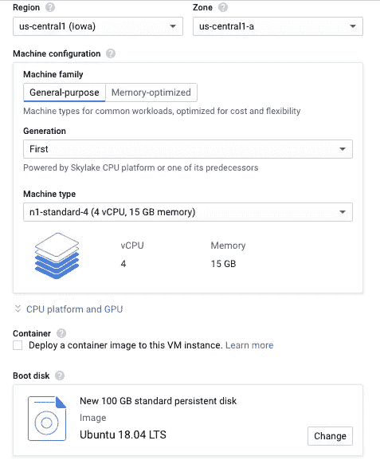

# 快速将 Kaggle 数据集转移到 Google bucket 中

> 原文：<https://towardsdatascience.com/quickly-transfer-a-kaggle-dataset-into-a-google-bucket-ac21aefceb15?source=collection_archive---------11----------------------->

15 天。我震惊地发现，将一个相对较小(20GB)的图像数据集从我的本地机器上传到谷歌云平台(GCP)的存储桶需要多长时间。


在本文中，我将介绍另一种方法，它使用 GCP 虚拟机(VM)将这个过程缩短到 2 小时。关键是在与您的 bucket 相同的区域中创建一个 VM，将文件下载到那里，然后将它转移到 bucket。

如果你没有水桶，先把它放好，并记住你决定使用哪个区域。您可以毫无问题地使用所有标准设置。

下一步是创建一个虚拟机。我选择了 4 核，这样我们就可以在图像传输过程中利用多处理选项。除此之外，这是一个非常标准的设置，保留了所有的默认值。例外情况是将启动盘扩展到 100 GB 以容纳解压缩后的数据，并使用 Ubuntu 18 LTS，这只是个人偏好。



GCP VM setup

一旦虚拟机启动，我就连接到由 [Google CLI](https://cloud.google.com/pubsub/docs/quickstart-cli) 提供的 ssh 工具(可能需要安装在本地机器上)

```
gcloud compute ssh --project [NAME OF YOUR PROJECT] --zone [ZONE NAME] [NAME OF VM]
```

在虚拟机上，我安装了 pip 和 kaggle API。

```
## Install pip
> curl [https://bootstrap.pypa.io/get-pip.py](https://bootstrap.pypa.io/get-pip.py) -o get-pip.py
> sudo apt-get install python3-distutils
> sudo python3 get-pip.py
## Install kaggle API
> pip install kaggle
```

为了从 Kaggle 下载文件，您需要在 VM 上保存一个 API 令牌。你可以进入你的 Kaggle 账户，下载一个新的令牌，然后把它放到虚拟机上。在虚拟机上，创建一个名为“的隐藏文件夹。kaggle”并把钥匙移到那里

**在你的本地机器上:**

```
> gcloud compute scp Downloads/kaggle.json kaggle-download:~
```

**在虚拟机上:**

```
> mkdir .kaggle
> mv kaggle.json .kaggle
```

至此，Kaggle API 应该可以使用了！导航到您感兴趣的竞争对手或数据集，将 API 命令复制到虚拟机中，下载就应该开始了。许多数据集是压缩的，所以您需要安装解压缩工具并提取数据。

```
> sudo apt-get install unzip
> unzip [DATASET].zip
```

接下来要做的就是在虚拟机上验证你的谷歌账户，然后传输数据！m 标志允许我们使用多线程处理，r 递归地传输数据文件夹中的所有内容。对我来说，对于大约 20GB 的数据，运行整个过程需要大约 2 小时。

```
> gcloud auth login
> gsutil -m cp -r [DATA FOLDER] gs://[BUCKET NAME]
```

完成后，记得关闭虚拟机。每当我需要下载新的东西时，我就把它删除，然后转一个新的。快乐的旅行！