# 通过使用 Celonis Snap 分析事件日志快速了解流程挖掘

> 原文：<https://towardsdatascience.com/quickly-understanding-process-mining-by-analyzing-event-logs-with-celonis-snap-b89ace2a286a?source=collection_archive---------14----------------------->

## 本文将帮助您开始使用 Process Mining 和 Celonis Snap，最终您应该能够开始深入研究您公司的流程。

*数据是新的石油。*“，”*我们公司需要变得更有效率。*“，”*我们能优化这个流程吗？*、*我们的流程太复杂了。*”—你经常听到但可能再也听不到的句子。这是可以理解的，但(大)数据超级趋势背后的技术和讨论带来了一些实际的好处。这个领域的一项新兴技术在很多方面都与上面的句子直接相关。这是流程挖掘。也许你听说过。也许你没有。《哈佛商业评论》认为“你应该探索过程挖掘”。

这将是一个半长的阅读，所以这里有一个简短的概述，你会学到什么:

*   流程挖掘
*   Celonis Snap 及其使用方法
*   哪里可以找到一些操场数据

现在，为了节省一些时间和精力，我们可以得到更好的东西，这里是 IEEE 过程挖掘任务组描述的过程挖掘的定义:

> 流程挖掘技术能够从当今信息系统中常见的事件日志中提取知识。这些技术为发现、监控和改进各种应用领域中的过程提供了新的手段。对流程采矿兴趣的增长有两个主要驱动因素。一方面，越来越多的事件被记录，从而提供了关于进程历史的详细信息。另一方面，在竞争激烈和快速变化的环境中，需要改进和支持业务流程。

好的。酷毙了。下一个？当然是在实践中理解过程挖掘！而最好的办法就是实际*挖掘*一些流程。

**什么是塞隆尼斯 Snap？**

这是流程矿业公司 Celonis 的一个新的免费工具，它提供了一个流程矿业 SaaS 平台，叫做智能商业云。许多财富 500 强公司都在使用它，而 Celonis Snap 是它的免费版本，应该可以促进中小型企业的流程挖掘。它将在本文中使用，这样您就可以用自己的数据轻松地重现这个过程！

**查找一些数据**

如果您正在阅读本文，并且您在公司负责 BI，那么您可能已经访问了一些数据，这很好，如果您只是想玩玩 Celonis Snap，那么生活会变得有点艰难。跟着读。

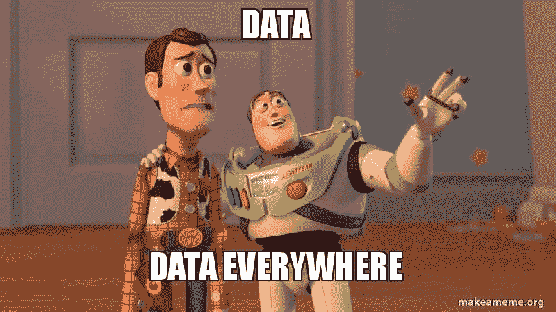

我浏览了一些[免费提供的事件日志](https://www.win.tue.nl/ieeetfpm/doku.php?id=shared:process_mining_logs)，并决定查看一家荷兰金融机构的贷款申请，这些申请被用于 [BPI Challenge 2017](https://data.4tu.nl/repository/uuid:5f3067df-f10b-45da-b98b-86ae4c7a310b) 。一种复杂流程的经典示例，可以对其进行迭代分析和改进(类似于从购买到支付的流程，这似乎是目前该领域的标准用例)。

关于数据集，您首先会注意到的是数据格式— xes(可扩展事件流):

> XES 标准为基于标记的语言定义了一种语法，其目的是为信息系统的设计者提供一种统一的、可扩展的方法，用于通过 XES 标准中定义的事件日志和事件流来捕获系统行为。描述 XES 事件日志/流结构的 XML 模式和描述这种日志/流的扩展结构的 XML 模式包含在本标准中。

这是事件日志的常用标准。*但是*我的 Celonis Snap 账号不允许导入。由于 xes 免费版的局限性，所以我不得不寻找。xlsx 或者。csv 数据。

在中查找好的事件日志。csv 格式——至少对我来说——比我想象的要困难得多。尽管如此，我还是发现了一个宝库:data.gov.uk，它在英国国家档案馆[开放政府许可下发布数据](http://www.nationalarchives.gov.uk/doc/open-government-licence/version/3/)，你可以过滤. csv。太好了。几分钟后，我意识到没有真正的过程挖掘有价值的数据——即使是各种采购过程的数据集也只是给你英镑金额和开始和结束日期。

TL；在浏览网页几个小时后，我回到了最初的来源，在这里找到了一个数据集，这是一个生产过程，包括案例、活动(如车削、磨削、质量保证等)的数据。)在. csv 中。

**使用 Celonis Snap 导入事件日志/流程数据**

0.为 Celonis Snap 创建帐户

1.  创建数据池

您需要转到“事件集合”以便将数据导入到 Celonis Snap 中。然后，您需要创建一个数据池，您的数据将被导入其中。

2.将数据上传到数据池

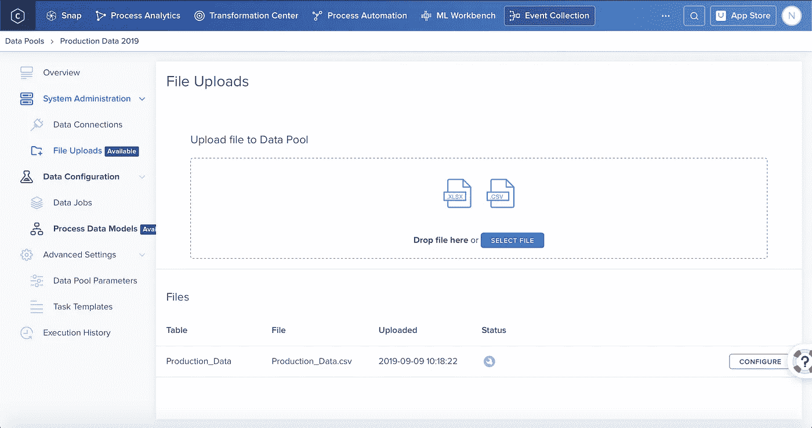

Straightforward

3.检查中列的数据类型。导入后的 csv

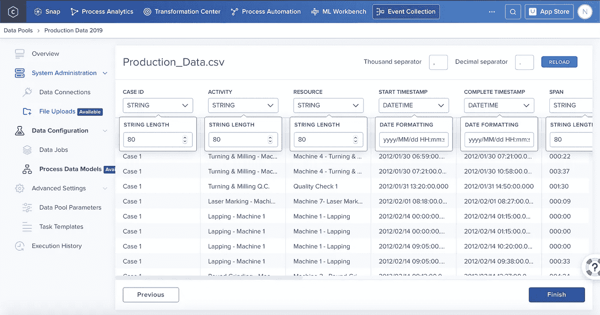

Straightforward

4.根据您的数据结构为数据池创建一个数据模型

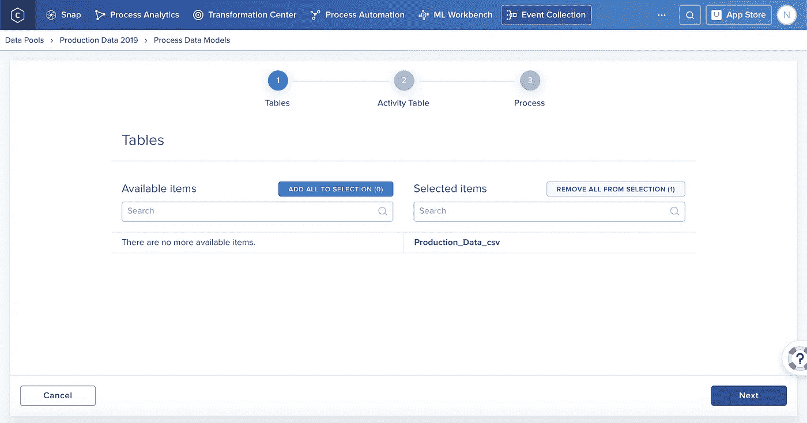

Data Models can be created from the sidebar in Event Collection like the File Upload

然后，您需要映射您的案例 ID 列等。为了让 Celonis Snap 能够以正确的格式解析您的数据。在第 3 步中，我们只需选择数据类型，如字符串、整数等。在这里，我们正在进行特定于 Celonis Snap 的活动映射。例如，案例 ID 是在已处理事件日志中使用的唯一标识符。

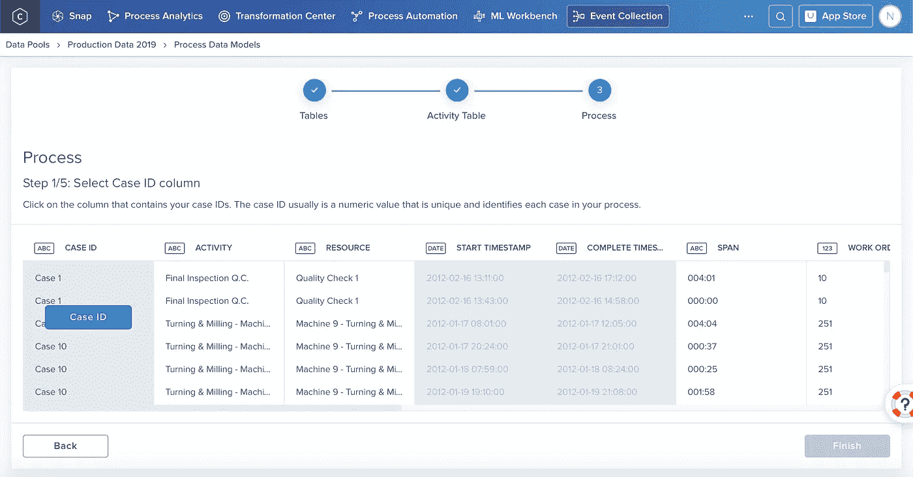

5.将数据从数据池加载到数据模型中

最后一步似乎是多余的——将数据从数据池加载到数据模型中。尽管如此，这作为一个单独的步骤是有意义的，因为你可以在以后上传具有相同结构的新文件。整洁干净。

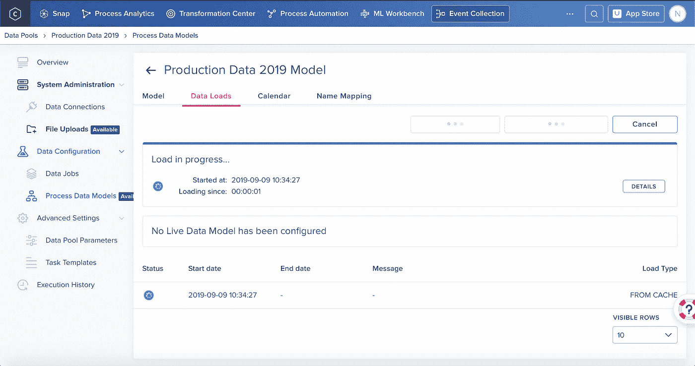

总结:

*   创建数据池
*   导入后上传数据并检查数据类型
*   创建数据模型和地图。csv 列，如案例 ID
*   将数据加载到数据模型

**使用 Celonis Snap 进行流程分析**

现在我们已经导入了数据，我们可以用我们的数据模型为生产事件日志创建一个工作区，并开始分析！将由一个或多个*分析*组成的*工作区*想象成 Excel 文件，其中有一个或多个工作表。每个*分析*可以包含一个或多个*应用*，例如流程浏览器。这是您的过程的图形视图，如果您使用谷歌 Celonis，您将立即看到，您可以放大和缩小活动(过程步骤),例如使用机器 XYZ 进行圆磨。这些应用就像预制的仪表板，但你也可以创建一个新的仪表板，并向其中添加多个应用。

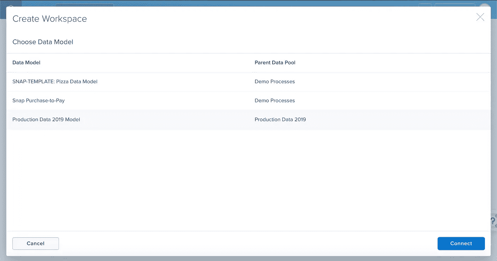

现在我们有了一个新的工作区，我们可以使用一个新的定制应用程序来创建一个分析，该应用程序包含一个 Process Explorer。进入编辑模式后，您可以通过点击顶部的“组件+”来创建新的组件添加到您的应用程序中。在侧边栏的左侧，您可以过滤您的案例。您也可以通过单击 Process Explorer 中的 connections 来完成此操作。

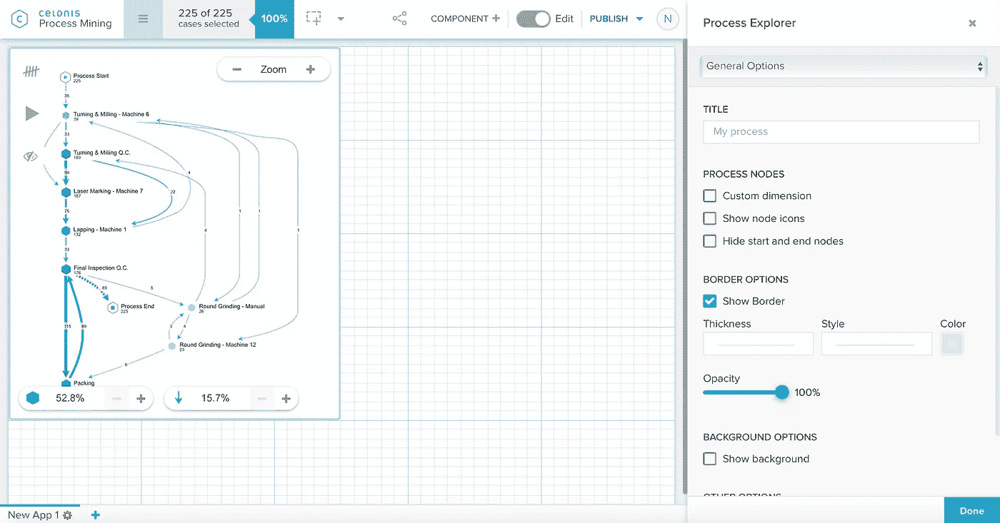

现在，如果您在 Process Explorer 中单击一个连接，您就可以筛选包含特定活动的流程

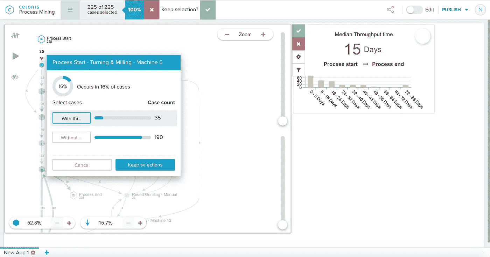

Here the “Process Start — Turning & Milling -Machine 6” activity is selected i.e. “Keep selections” will filter for all events that contain that activity.

这是设置了 35 个案例的过滤器后的图形。请注意平均吞吐时间是如何从 15 天变成 12 天的？酷毙了。这就是你开始深入流程的方式。

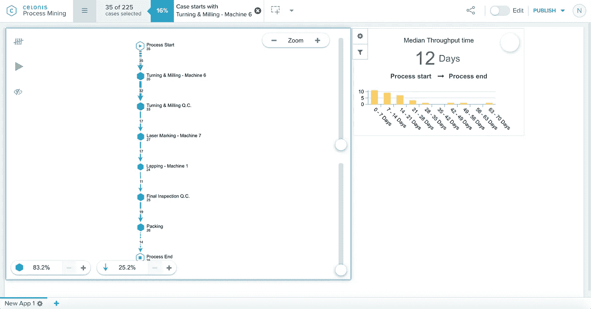

但是等等。为什么有时箭头和下一个活动不匹配？例如，从步骤 2 到步骤 3，我们从 35 个案例开始，然后我们在连接中有 32 个，在下一个步骤中有 33 个。原因是默认情况下，process explorer 隐藏了许多不太频繁的活动。基本上你有 3 个不同的缩放级别。现在，让我们通过拖动侧面的滑块来显示这 35 个已过滤案例的每个连接和案例:

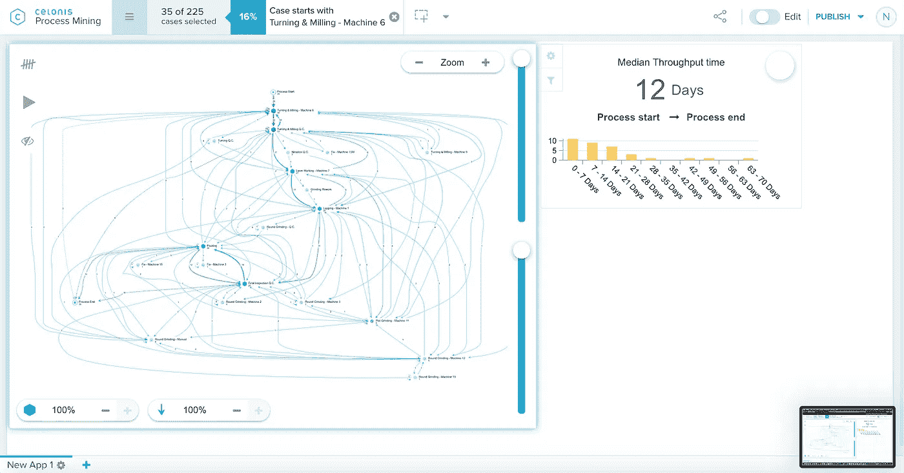

这是这 35 个案例的完整过程。有时，一个活动步骤会执行多次。有时 QA 会将一个元素送回进行研磨等。

**总结**

我希望这篇文章能让你通过点击一个最直观的(也是免费的！)市场上基于 GUI 的流程挖掘工具。人们可能会写一本关于如何使用 Process Explorer 深入流程的书，但本文只是对该主题的一个快速介绍，以缓解这一新兴 BI 技术的神秘感。

现在，*显然是*，这并不像 TensorFlow 关于识别猫和狗(或热狗/非热狗)的教程那么酷，但流程挖掘再次巩固了它在不同市场的地位——所有四大咨询公司都使用流程挖掘来帮助他们的客户优化他们在世界各地的流程。大公司和中小企业都可以受益于使用这样的工具可视化他们的流程数据/事件日志，并快速重新识别瓶颈和优化潜力，而不是雇佣最近的商学院毕业生手动筛选无尽的 SAP 日志。无论您选择 Celonis Snap 还是其他工具来开始您的流程挖掘之旅，都取决于您，但您肯定应该关注流程挖掘。不是因为《哈佛商业评论》这么说，而是因为你和你的同事们自己已经说过——“*我们的流程太复杂了。*

*免责声明:虽然我目前不是 Celonis SE 的员工，但我将在 10 月份开始担任该公司的项目经理。我决定写这篇文章，以便在我开始新的冒险之前，分享我探索他们产品的旅程和我的见解。*

来源:

[https://HBR . org/2019/04/what-process-mining-is-and-why-companies-should-do-it](https://hbr.org/2019/04/what-process-mining-is-and-why-companies-should-do-it)，2019 年 9 月 3 日

[https://www.win.tue.nl/ieeetfpm/lib/exe/fetch.php?media = shared:process _ mining _ manifesto-small . pdf](https://www.win.tue.nl/ieeetfpm/lib/exe/fetch.php?media=shared:process_mining_manifesto-small.pdf)，03.09.2019

[http://www.xes-standard.org/](http://www.xes-standard.org/)，2019 年 9 月 3 日

丹尼尔·朱林摄于 [Pexels](https://www.pexels.com/photo/aerial-view-of-beach-2292981/?utm_content=attributionCopyText&utm_medium=referral&utm_source=pexels)

[https://media . make ame me . org/created/data-data-everywhere-5b 0 d0a . jpg](https://media.makeameme.org/created/data-data-everywhere-5b0d0a.jpg)，09.09.2019