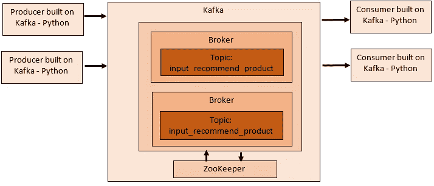

# 快速入门— Apache Kafka + Kafka-Python

> 原文：<https://towardsdatascience.com/quickstart-apache-kafka-kafka-python-e8356bec94?source=collection_archive---------34----------------------->

## 阿帕奇卡夫卡一天可以处理万亿个事件。

# 介绍

实时数据摄取是实时分析中的一个常见问题，因为在电子商务这样的平台中，给定时间内的活跃用户和每个活跃用户创建的事件数量都很多。因此，对每个事件或事件组的推荐(即，预测)预期是接近实时的。

主要关心的是，我们将如何有效地[消费、生产和处理]这些事件？

阿帕奇卡夫卡解决了上述前两个问题。它是一个分布式流平台，有助于构建实时流数据管道。

# Apache Kafka 设置

本文讨论了在 Linux 环境中设置 Apache Kafka，并揭示了如何使用 Kafka-Python 消费和产生事件。下图说明了我们期望建立的 Kafka 生态系统。



Kafka Ecosystem — Image by Author

## 启动动物园管理员

Apache Zookeeper 是一个分布式、开源的配置同步服务，为分布式应用程序提供了一个命名注册表。

在 Kafka 的上下文中，Zookeeper 帮助维护服务器状态，并将配置作为键值对存储在 ZK 数据树中，并以分布式方式在集群中使用它们。

最新版本的 Kafka 二进制发行版可以在 https://kafka.apache.org/downloads 的[买到。](https://kafka.apache.org/downloads)

**转到卡夫卡根文件夹**

```
cd /home/***/***_STREAM_PROCESSOR/kafka_2.12-2.0.0
```

**执行以下命令启动 Zookeeper**

```
bin/zookeeper-server-start.sh config/zookeeper.properties
```

**如果一切都准确无误，控制台上会显示以下输出:**

Zookeeper 默认运行在端口 2181 上

## 开始 Kafka 经纪人

Kafka 集群由一个或多个经纪人组成，制作者将事件推入 Kafka 经纪人内的 Kafka 主题。

部署 Kafka 代理有两种选择:

*   部署在本地计算机上
*   在远程机器上进行部署，为此，请确保使用值 listeners = PLAINTEXT://XXX . XXX . XXX . XXX:9092 更新 server.properties(位于 Kafka config 中)

**在新的控制台中转到 Kafka 根目录，执行以下命令:**

```
cd /home/***/***_STREAM_PROCESSOR/kafka_2.12-2.0.0bin/kafka-server-start.sh config/server.properties
```

**如果一切都准确无误，控制台上会显示以下输出:**

## 创造卡夫卡主题

卡夫卡主题的生产者推动和消费者拉动事件。

**执行以下命令，在 Kafka Broker 中创建一个主题(例如，“input_recommend_product”)**

因为我们已经建立了一个代理，所以我们只能保留主题的一个副本；因此，将复制因子设置为 1。

这里我们把题目:“输入 _ 推荐 _ 产品”分成三个分区；我们将分区设置为 3。

## 使用 Kafka-python 创建生产者和消费者

Kafka-python 是 Apache Kafka 的 python 客户端。这有助于为 Kafka Broker 创建主题和产生事件，并作为 Kafka Broker 的主题使用这些事件。

下面的代码段显示了如何创建一个生成器，并将消息推送到代理中的一个主题:

可以使用 KafkaConsumer 提取推送的消息，下面的代码段有助于使用该消息:

消费者的输出如下所示:

## 最后的想法

Apache — Kafka 是构建实时处理解决方案的重要平台。本文为您在分布式环境中设置 Apache-Kafka 提供了一个良好的开端，并为生成和消费事件提供了简单的指导。