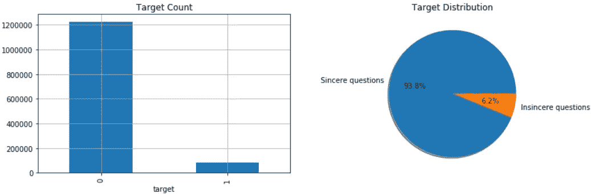

# Quora 虚假问题分类

> 原文：<https://towardsdatascience.com/quora-insincere-questions-classification-d5a655370c47?source=collection_archive---------14----------------------->

## Quora 举办的 Kaggle 竞赛案例研究。

Logo ([Source](https://cdn.vox-cdn.com/thumbor/0tiE44ataBOx8u8Iy_Q3e0fI2L0=/0x0:2182x1455/1200x800/filters:focal(917x554:1265x902)/cdn.vox-cdn.com/uploads/chorus_image/image/62619674/quora.0.jpg))

Quora 是一个让人们能够互相学习的平台。在 Quora 上，人们可以提出问题，并与贡献独特见解和高质量答案的其他人联系。一个关键的挑战是剔除不真诚的问题——那些建立在错误前提上的问题，或者那些旨在陈述而不是寻找有用答案的问题。

Quora 无诚意问题分类是 quora 主办的第二次 kaggle 竞赛，目的是开发更多可扩展的方法来检测他们平台上的有毒和误导内容。

## **问题陈述**

> 检测有毒内容以改善在线对话。

# 数据概述

数据集包含超过 1，300，000 个已标记示例的训练集和超过 300，000 个未标记示例的测试集。训练集中的每个示例都有一个唯一的 id、问题的文本以及一个“0”或“1”的标签来表示“真诚”或“不真诚”。

## **什么是不真诚的问题？**

一个不真诚的问题被定义为一个旨在陈述而不是寻找有用答案的问题。

*   有一种非神经的音调。
*   是贬低或煽动性的。
*   并不基于现实。
*   使用性内容(乱伦，兽交和恋童癖)来寻求震撼，而不是寻求真正的答案。

由于这是一场内核竞赛，外部数据源是不允许的。我们必须提交 kaggle 内核(笔记本或脚本),并按照提交要求中提到的特定格式提交所有代码和输出预测。

除了问题的文本数据，quora 还提供了 4 个不同的嵌入文件，这些文件都是在大型数据语料库上训练出来的，可以在模型中使用。给定的嵌入文件如下:

*   [**谷歌新闻—矢量**](https://code.google.com/archive/p/word2vec/)
*   [**手套**](https://nlp.stanford.edu/projects/glove/)
*   [**段落**](https://cogcomp.org/page/resource_view/106)
*   [**维基新闻**](https://fasttext.cc/docs/en/english-vectors.html)

在这些嵌入文件的每一个中，单词被表示为 300 个 dim 向量。单词的这种表示将允许捕捉单词的语义。具有相同含义的单词将具有相似的矢量表示。

# 机器学习问题

> 这是一个二元分类问题，对于一个给定的问题，我们需要预测它是否是一个不真诚的问题。

## 公制的

本次比赛的评估指标是[F1-得分](https://en.wikipedia.org/wiki/F1_score)，这是精确度和召回率的调和平均值。精确度是实际上不真诚的分类不真诚问题的百分比，而回忆是被正确分类为不真诚的实际不真诚问题的百分比。

F1-Score ([Source](https://i.stack.imgur.com/U0hjG.png))

如果我们需要在精确度和召回率之间寻求平衡，F1 分数是一个更好的指标。当存在不均匀的类别分布时，这也优于准确性。

# **探索性数据分析**

在本节中，我们将探索和可视化给定的数据集。

首先，让我们加载训练和测试数据集。

训练数据集包含列:qid、question_text 和 target(二进制值)。所有观察值都是唯一的，不含空值。

## **训练集分布图**

Data Distribution

*   数据集高度不平衡，只有 6.2%的不真诚问题。
*   由于数据不平衡，F1-Score 似乎是比准确性更正确的选择。

## **言云对于真诚和不真诚的问题**

Word cloud for sincere questions

Word cloud for insincere questions

*   正如我们所看到的，不真诚的问题包含了许多冒犯性的词语。
*   在提供的训练集中，大部分不真诚的问题都与*人*、*穆斯林*、*女*、*川普*等有关。

## **特征工程(清洗前)**

让我们构建一些基本特征，例如:

*   字数
*   大写字母的数量
*   特殊字符的数量
*   唯一单词的数量
*   数字的个数
*   字符数
*   停用词的数量

**生成特征的方框图**

Box plots for generated features

*   言不由衷的问题似乎更有文字和性格。
*   不真诚的问题也比真诚的问题有更多独特的用词。

# 基于机器学习的方法

## **数据预处理和清洗**

我遵循了用于解决基于 NLP 的任务的标准数据预处理技术，如拼写纠正、删除停用词、标点符号和其他标签，然后是词条化。

> **词条化**是使用已知的单词词典将单词替换为其词根的过程。

关于数据预处理和其他 NLP 方法的更多细节可以在这个博客中找到。

## TF-IDF

它代表词频——逆文档频率。

TF-IDF ([Source](https://diggitymarketing.com/wp-content/uploads/2018/10/equation.png))

> 词频:在文档中找到一个词的概率。
> 
> 逆文档频率:定义单词在整个语料库中的独特性。

TF-IDF 是 TF 和 IDF 值的乘积。它给予在文档中出现较多而在语料库中出现较少的单词更大的权重。

## **逻辑回归**

逻辑回归通过使用 sigmoid 函数估计概率来测量分类因变量和一个或多个自变量之间的关系。

使用逻辑回归作为一个简单的基线模型，问题的文本 TF-IDF 编码加上基本的手工制作的统计特征给出了 0.58 的 F1 值。

Confusion matrix for logistic regression

# **基于深度学习的方法**

与基于机器学习的方法不同，这里我没有删除停用词，而是允许模型学习它们，并且还在标点符号之间添加了空间，以便找到更多的单词嵌入。

单词嵌入是使用密集矢量表示来表示单词的一种形式。我已经使用给定的预训练单词嵌入文件来创建嵌入矩阵。

此外，我还使用了 spacy tokenizer 来构建单词和词条词典。这两个字典用于创建嵌入矩阵。

为了增加嵌入覆盖率，我使用了词干、词汇化、大写、小写、大写以及使用拼写检查器嵌入最近的单词的组合来获得 vocab 中所有单词的嵌入。

用 glove 和 para 嵌入文件创建了两个独立的嵌入矩阵。最后，对它们进行加权平均，赋予手套更高的权重。

这一步将创建一个大小为(vocab 中的单词数，300)的嵌入矩阵，其中每个单词被表示为一个 300 维向量。

创建嵌入矩阵后，构建三个不同模型架构的集合，以捕获数据集的不同方面，从而提高总体 F1 分数。这些模型如下:

## 模式 1:双向 RNN(LSTM/GRU)

递归神经网络(RNN)是一种神经网络，其中来自先前步骤的输出作为输入被馈送到当前步骤，从而记住关于序列的一些信息。它有局限性，比如很难记住更长的序列。

LSTM/GRU 是 RNN 的改进版本，专门使用门控机制长时间记忆信息，而 RNN 没有做到这一点。

Bidirectional RNN ([Source](https://miro.medium.com/max/1200/1*6QnPUSv_t9BY9Fv8_aLb-Q.png))

单向 RNN 只保存过去的信息，因为它看到的输入来自过去。使用双向将会以两种方式运行输入，一种是从过去到未来，另一种是从未来到过去，从而允许它在任何时间点保存来自过去和未来的上下文信息。

## 模型 2:具有注意层的双向 GRU

模型 2 由双向 GRU、注意力和池层组成。

神经网络中的注意力(非常)松散地基于在人类中发现的视觉注意力机制。人类的视觉注意力能够以“高分辨率”聚焦在图像的某个区域，而以“低分辨率”感知周围的图像。

Textual Attention example ([Source](https://lilianweng.github.io/lil-log/2018/06/24/attention-attention.html))

注意力用于机器翻译、语音识别、推理、图像字幕、摘要和对物体的视觉识别。

**注意力加权平均**

注意层使用加权机制，其中序列中的所有单词都被赋予一个权重(注意值)。这个权重定义了一个单词在序列中的重要性，从而捕获重要的单词并给予序列中的重要部分更多的关注。这些重量是可以训练的。

Bidirectional LSTM model with Attention (Source)

注意层将让网络顺序地聚焦于输入的子集，处理它，然后改变它的焦点到输入的一些其他部分。

关注层的 keras 代码更深入的解释可以在[这个](https://docs.google.com/document/d/1UFDS036YBK5-EN-fQ6exn0GRmJc1ibU2gWaokb1jcKM/edit#heading=h.voemotsi64h2)文档中找到。

## 模型 3:具有卷积层的双向 LSTM

模型 3 由双向 LSTM、卷积层和池层组成。

在 NLP 中使用 CNN 的想法是利用它们提取特征的能力。CNN 被用于嵌入给定句子的向量，希望它们能够提取有用的特征(如短语和句子中更接近的单词之间的关系)，这些特征可用于文本分类。

与传统 CNN 不同，NLP CNN 通常由 3 层或更多层 1D 卷积层和汇集层组成。这有助于减少文本的维度，并作为排序的总结，然后提供给一系列密集的层。

CNN for textual data ([Source](https://mlwhiz.com/blog/2019/03/09/deeplearning_architectures_text_classification/))

在计算机视觉任务中，CNN 中使用的过滤器滑过图像的碎片，而在 NLP 任务中，过滤器滑过句子矩阵，一次几个单词。

## 阿达姆

对于所有这三个模型，使用定制的 Adam 优化器，称为 AdamW(权重衰减),它修复 Adam 中的权重衰减正则化。

[这篇](https://arxiv.org/abs/1711.05101)论文指出，所有流行的深度学习框架(Tensorflow，Pytorch)都实现了权重衰减错误的 Adam。他们提出了以下意见:

*   *L2 的正规化*和*权重衰减*是不一样的。
*   *L2 正规化*在亚当身上并不有效。
*   *体重下降*对亚当和 SGD 同样有效。

他们提出了 AdamW，该 AdamW 解耦了权重衰减和 L2 正则化步骤。

*Comparison between Adam and AdamW (*[*Source*](https://www.fast.ai/2018/07/02/adam-weight-decay/)*)*

更多关于 AdamW 的细节可以在[这里](https://www.fast.ai/2018/07/02/adam-weight-decay/)找到。

## 培训和提交

用分层交叉验证训练三个模型，然后取它们预测的平均值作为最终集合预测。

创建具有所有折叠(验证)的“折叠外”列表，然后使用该列表来寻找集合模型的最佳阈值。

Validation score with optimal threshold

最后，使用测试预测的最优阈值，生成提交文件。

# 结论

本次 kaggle 比赛重点是利用机器学习和深度学习方法检测 Quora 平台上的有毒内容。

我从 kaggle 论坛和公共解决方案中学到了很多。发现更多的词嵌入和模型集成是提高 F1 分数的关键因素。

该解决方案的 Kaggle 私有和公共评分如下。

Kaggle Final Score

通过尝试其他预训练模型，如用于单词嵌入的 BERT，可以实现进一步的改进。

感谢您的阅读。完整的代码可以在[这里](https://github.com/ronakvijay/Quora_Insincere_Questions)找到。

# 参考

 [## 第三名

### 下载数千个项目的开放数据集+在一个平台上共享项目。探索热门话题，如政府…

www.kaggle.com](https://www.kaggle.com/wowfattie/3rd-place)  [## 总体，平均值 III(64/36)

### 下载数千个项目的开放数据集+在一个平台上共享项目。探索热门话题，如政府…

www.kaggle.com](https://www.kaggle.com/canming/ensemble-mean-iii-64-36)  [## NLP 学习系列:第 1 部分——深度学习的文本预处理方法

### 最近，我在 Kaggle 上发起了一个名为 Quora 问题不真诚挑战的 NLP 竞赛。这是一个 NLP…

mlwhiz.com](https://mlwhiz.com/blog/2019/01/17/deeplearning_nlp_preprocess/)