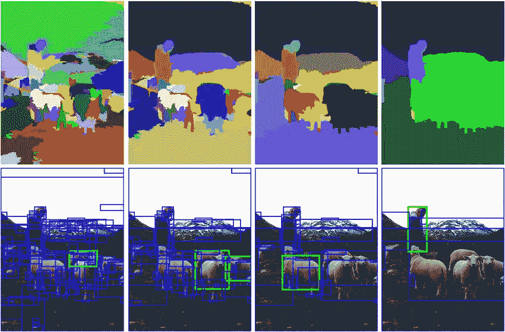
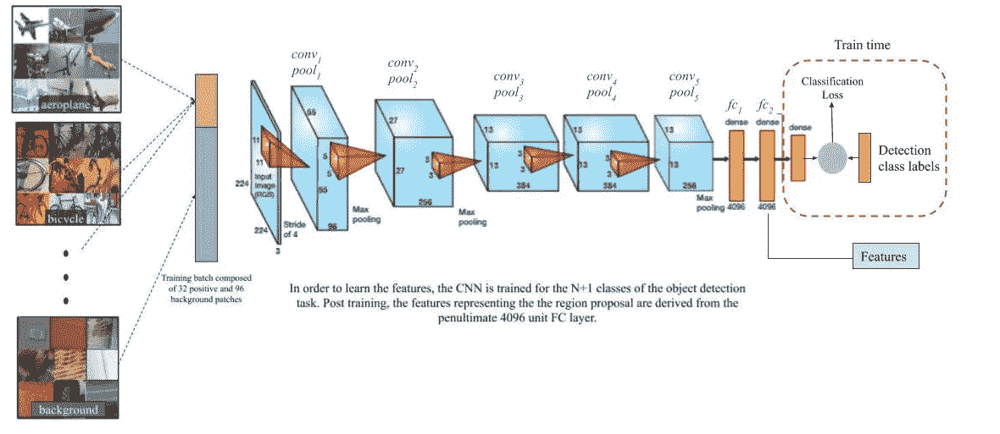
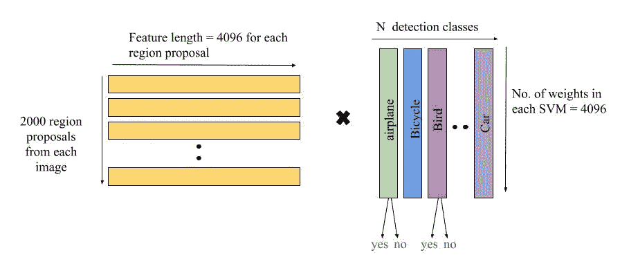
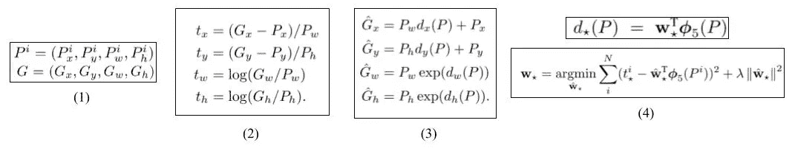

# 用于目标检测的 R-CNN

> 原文：<https://towardsdatascience.com/r-cnn-for-object-detection-a-technical-summary-9e7bfa8a557c?source=collection_archive---------3----------------------->

## 技术论文摘要

在快速发展的深度学习领域，这是一系列了解出版物的一部分，这些出版物是当今对象检测的基础。

原始论文“精确对象检测和语义分割的丰富特征层次”[1]阐述了在对象检测系统中使用 CNN 的第一个突破，称为“R-CNN”或“带 CNN 的区域”，其对象检测性能比当时其他流行的方法高得多。

# 区域提议

R-CNN 管道的第一阶段是在图像中生成“区域提议”或区域，这些区域*可能*属于特定对象。作者使用选择性搜索算法。选择性搜索算法[2]的工作原理是根据颜色、纹理、大小和形状生成可能属于一个对象的图像的子分割，并迭代地组合相似的区域以形成对象。这就产生了不同规模的“目标提议”。注意，R-CNN 管道对于区域提议算法是不可知的。作者使用选择性搜索算法**为每个单独的图像生成 2000 个类别独立区域提议**(通常由矩形区域或‘边界框’)**。**

Figure 1: How the selective search algorithm iteratively obtains “region proposals”

# 阶段 1:从区域建议中提取特征

在流水线的这一阶段结束时，作者使用卷积神经网络(CNN)从每个图像的 2000 个区域提议中的每一个生成 4096 维特征向量。训练 CNN 的细节如下。

**监督预训练:**Krizhevsky 等人[3]描述的 CNN，现在被普遍称为“AlexNet”，具有 5 个卷积层和 2 个全连接层。CNN 首先在 ILSVRC2012 *分类*数据集上进行训练，用于具有大量图像的 1000 路图像分类任务，以便卷积层可以学习基本图像特征。

**特定于域的微调:**现在，需要对网络进行微调，以学习 a)新类型图像的视觉特征-失真区域提议，以及 b)用于检测任务的较小数据集的特定目标类别。我们微调分类网络以从区域提议中识别属于检测任务的类别。

*   来自预训练的 CNN 的最终 1000 路分类层被用于 N 个对象类和检测任务的一般背景类的随机初始化的(N+1)路 softmax 分类层所取代。
*   **输入:** 从每个图像生成的 2000 个区域建议中的每一个(使用选择性搜索算法)通过简单的变形被转换成大小为 227×227 的固定输入，而不考虑大小或纵横比，以使它们能够用于微调 CNN(我们需要固定大小的输入，而不考虑馈送到 CNN 的实际尺寸)。一个额外的参数， *p* 被用于指示原始边界框的可能扩展量，以包括来自其周围区域的一些上下文。
*   **用于训练的标签:**作者将每个对象提议映射到与其具有最大 IoU 重叠的**基础事实实例，并且如果 IoU 至少为 0.5，则将其标记为 ***正*** (用于匹配的基础事实类)。其余的框被视为 ***背景*** 类(对所有类为负)。**
*   **训练管道:**作者使用 SGD 以初始训练前学习率的(1/10)训练网络。在每次迭代中，他们对所有类别中的 32 个正窗口和属于背景类别的 96 个窗口进行采样，以形成 128 个小批量，从而确保在训练期间有来自正类别的足够的代表性。

Figure 2: The CNN training pipeline taking in a batch of region proposals and giving a classification label (at train time)

***阶段 1 的最终输出:*** *在训练之后，最终分类层被移除，并且对于 2000 个区域提议中的每一个(对于每一幅图像)，从 CNN 的倒数第二层获得 4096 维特征向量。参考上图。*

# 第 2 阶段:用于物体分类的 SVM

这个阶段包括为每个类别学习一个**单独的**线性 SVM(支持向量机)分类器，该分类器检测属于特定类别的对象的存在或不存在。

*   **输入:**4096-*d*每个区域建议的特征向量。
*   **用于训练的标签:**在训练期间，与地面真实边界框具有小于 0.3 的 IoU 重叠的所有区域提议的特征被认为是该类的*否定* 。该类的*阳性*仅仅是来自地面真实边界框本身的特征。出于训练 SVM 的目的，所有其他提议(IoU 重叠大于 0.3，但不是地面真实边界框)被*忽略。*
*   **测试单幅图像的时间推断:**将特征和 SVM 权重之间的类特定点积合并为一幅图像的单个矩阵-矩阵积(如下图 3 所示)。也就是说，对于每个图像，生成一个 2000×4096 的特征矩阵(对于所有 2000 个区域提议，CNN 的 4096- *d* 特征)。SVM 权重矩阵是 4096×N，其中 N 是类的数量。

Figure 3: Final consolidated test time SVM computation

***阶段 2 的最终输出:*** *在训练了 SVM 之后，阶段 2 的最终输出是每一类的一组正面物体提议，来自 2000 个区域提议(每个图像的)的 CNN 特征。*

# 阶段 3:包围盒回归

为了提高定位性能，作者包括一个包围盒回归步骤，以学习预测包围盒位置和大小的校正。

Figure 4: The equations for bounding box regression stages explained below.

*   等式 1:该任务的目的是学习我们的预测建议 *P* 和目标建议 *G* 之间的目标**变换**。变量 *x，y，w，*和 *h* 代表建议书的中心 *(x，y)* 和宽度 *w* 和高度 *h* 的坐标。
*   等式 2:等式 2 中显示了需要学习的**地面真实变换**。前两个变换指定了 *P — x* 和 *y* 的中心的比例不变平移，后两个指定了宽度 *w* 和高度 *h* 的对数空间变换。
*   等式 3: *d* ₖ *(P)* 其中ₖ可以属于 *(x，y，h 或 w)* 为**预测变换**。ĝ表示使用原始预测框 *P* 和预测变换 *d* ₖ *(P)* 计算的校正预测框。
*   等式 4:预测的变换 *d* ₖ(P)被建模为图 2)中的 pool₅(shown 特征的线性函数—*φ₅*。
    因此，*dₖ(p)=wₖᵀφ₅(p)*其中 ***wₖ* 是可学习模型参数的向量。**注意，φ₅依赖于实际的图像特征。 ***wₖ* 通过优化等式 4 的第二行所示的正则化最小二乘目标函数来学习。**
*   其他注释:如果预测的盒子 *P* 靠近至少一个地面实况盒子，则该算法仅从该盒子中学习。每个预测框 *P* 通过选择与它具有最大重叠的基础事实框(假设它具有至少 0.6 的 IoU 重叠)被映射到它的基础事实。**为检测任务的每一类学习单独的变换。**

***阶段 3 的最终输出:*** *对于从 SVM 预测的每一类的所有正区域提议，我们具有围绕对象的精确的、校正的边界框。*

# 其他捐款

*   在其发表时，R-CNN 在 PASCAL VOC 2010 上获得了 54%的 mAP，在 ILSVRC 检测上获得了 31%的 mAP，远远高于其竞争算法。
*   这篇论文的另一个主要贡献是，有确凿的证据表明，对于类似的任务，有监督的预训练比无监督的预训练更能提高表现。
*   在对 CNN 进行了全面分析后，作者发现，在没有对检测任务进行微调的情况下，移除了完全连接层的网络能够检测到物体提议以及附加了完全连接层的网络——即使前者(pool₅)特征仅使用网络参数的 6%来计算。微调后，最大的性能提升发生在网络中，包括 FC 层。这表明，卷积层比全连接层包含更多的概化特征，全连接层包含特定任务的信息。
*   作者假设，需要单独的 SVM 进行检测，而不是使用微调的 CNN 本身进行分类，这来自几个因素的组合，包括 a)微调中使用的正例定义不强调精确定位的事实，以及 b)微调中的 softmax 分类器是在随机采样的负例上训练的，而不是在用于 SVM 训练的“硬负”子集上训练的。

这就是 R-CNN 论文的技术总结。希望你喜欢(理解)！欢迎在下面的评论中讨论或更正。

了解 R-CNN 热门接班人:[快 R-CNN](https://medium.com/@shilpa_47526/fast-r-cnn-for-object-detection-a-technical-summary-a0ff94faa022) 和[更快 R-CNN](https://medium.com/@shilpa_47526/faster-r-cnn-for-object-detection-a-technical-summary-474c5b857b46) 。

## 参考资料:

[1] Girshick，Ross 等人，“用于精确对象检测和语义分割的丰富特征层次。”2014 年 IEEE 计算机视觉与模式识别会议(2014)
【2】Uijlings，J. R. R .等人《物体识别的选择性搜索》。国际计算机视觉杂志 104.2(2013)
【3】Alex Krizhevsky，Ilya Sutskever，Geoffrey e . hint on“[使用深度卷积神经网络的 ImageNet 分类](https://www.semanticscholar.org/paper/ImageNet-Classification-with-Deep-Convolutional-Krizhevsky-Sutskever/6bca5ff6cfe3b473a1ae04c635404c3e4109fca3)”，发表于 NIPS 2012