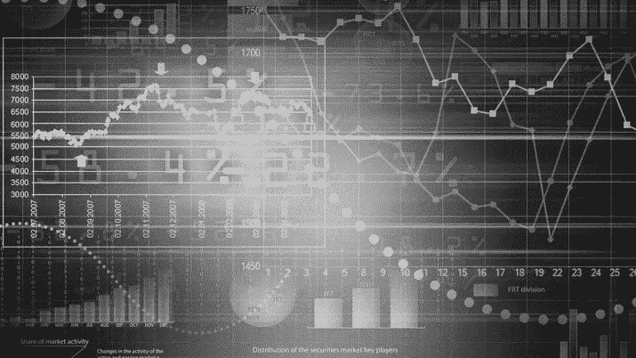
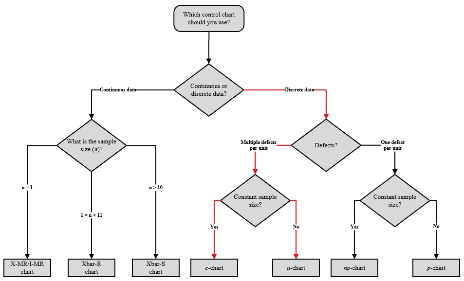
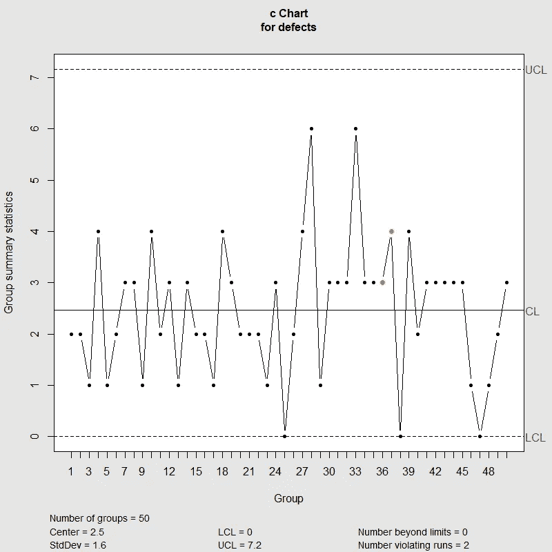

# 质量控制图:c 图和 u 图

> 原文：<https://towardsdatascience.com/r-for-industrial-engineers-c-chart-and-u-chart-2d2896fcbabf?source=collection_archive---------10----------------------->

## r 代表工业工程师

## 使用“qcc”R 包创建质量控制图

Image by Analytics Association of the Philippines on [LinkedIn](https://www.linkedin.com/company/analytics-association-of-the-philippines/)

# 质量控制图

质量控制图是工程师监控一个过程是否在统计控制下的重要工具。它们有助于可视化变化，发现并纠正出现的问题，预测预期的结果范围，并分析特殊或常见原因导致的流程变化模式。质量控制图常用于精益六适马项目和 DMAIC 项目的控制阶段，被认为是过程改进的七个基本质量工具之一。

然而，我们如何确定用于监控过程的正确的质量控制图？以下决策树可用于根据给定数据确定哪一个是要使用的正确质量控制图:

Quality Control Charts Decision Tree

在下面的例子中，我们将关注离散数据的质量控制图，这些离散数据考虑了每个单元的多个缺陷，样本大小不变时和不变时的质量控制图。

# u 形图

u 形图是一种质量控制图，用于监控不同尺寸 *n* 的样品中**每单位**的缺陷总数；它假设单元可以有一个以上的缺陷。y 轴显示每个单元的缺陷数量，而 x 轴显示样本组。让我们来看看使用 *qcc* 包生成 u 图的 *R* 代码。

u-chart R code

u-chart example using qcc R package

由 *R* 生成的 u 形图为其解释提供了重要信息，包括样本(组数)、两个控制限(UCL 和 LCL)、总体平均值(中间值)标准差(标准偏差)，最重要的是，超出控制限的点和违规运行。工程师必须特别注意这些点，以便识别和确定导致不合格单元的系统变化的原因。

# c 图表

c 图是一个质量控制图，用于监控尺寸为 *n* 的固定样本中**缺陷总数**。y 轴显示每个样品的不合格数量，而 x 轴显示样品组。让我们来看看使用 *qcc* 包生成 c-chart 的 *R* 代码。

c-chart R code

c-chart example using qcc R package

由 *R* 生成的 c 图也为其解释提供了重要信息，就像上面生成的 u 图一样。同样，工程师必须特别注意超出控制极限的点和违规运行，以便识别和确定导致不合格单元的系统变化的原因。

# 总结想法

我们已经完成了 *R* 和 *qcc* 软件包必须提供的众多工业工程应用中的一个。您可能已经注意到，只需几行代码，我们就能构建质量控制图，并获得重要信息，用于精益六适马和 DMAIC 项目的流程改进。我再一次邀请你继续发现作为一名工业工程师，你可以使用 *R* 完成的惊人的事情。

*—*

*如果你觉得这篇文章有用，欢迎在*[*GitHub*](https://github.com/rsalaza4/R-for-industrial-engineering/tree/master/Quality%20Control%20Charts)*上下载我的个人代码。你也可以直接在 rsalaza4@binghamton.edu 给我发邮件，在*[*LinkedIn*](https://www.linkedin.com/in/roberto-salazar-reyna/)*上找到我。有兴趣了解工程领域的数据分析、数据科学和机器学习应用的更多信息吗？通过访问我的媒体* [*简介*](https://robertosalazarr.medium.com/) *来探索我以前的文章。感谢阅读。*

*——罗伯特*