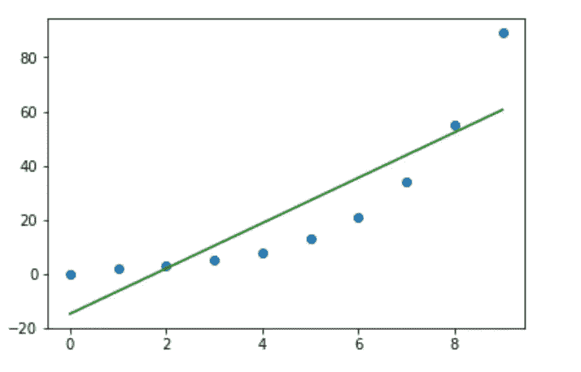
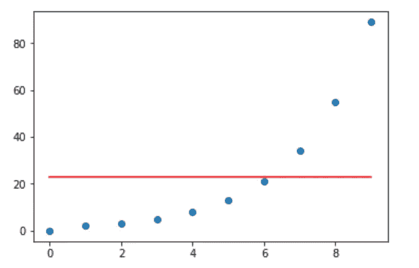
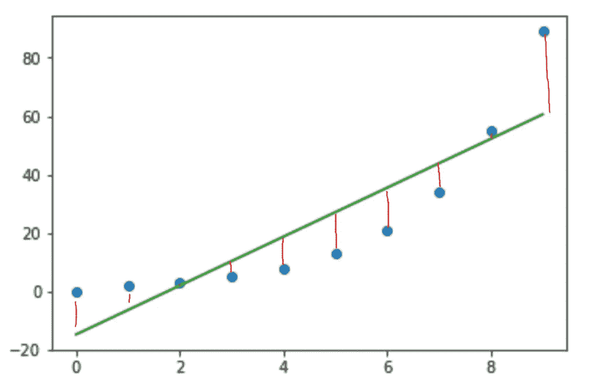
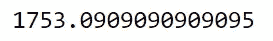
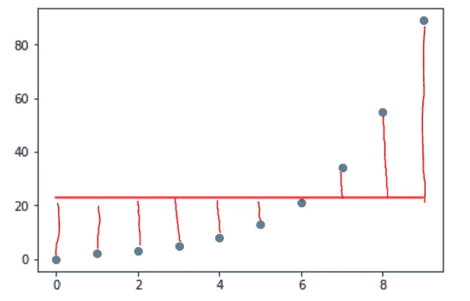
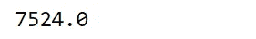
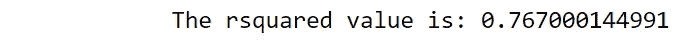

# 从头开始计算 R 平方(使用 python)

> 原文：<https://towardsdatascience.com/r-squared-recipe-5814995fa39a?source=collection_archive---------1----------------------->

## 关于 r 平方是什么的复习，以及如何计算的直观逐步指南

Source of image: [link](https://unsplash.com/photos/38pqG4k6tnY). Pine-cones have the [Fibonacci Sequence](https://www.khanacademy.org/math/math-for-fun-and-glory/vi-hart/spirals-fibonacci/v/doodling-in-math-spirals-fibonacci-and-being-a-plant-1-of-3) in them

R 的平方在概念上很难理解。我没有介绍其中涉及的数学公式，而是认为展示它是如何从零开始直观地计算的，并用简单的英语解释每一步可能会令人耳目一新。

# 什么是 R 平方？

这是一种介于 0 和 1 之间的统计方法，用于计算回归线与其拟合的数据的相似程度。如果是 1，模型 100%预测数据方差；如果它是 0，模型预测没有方差。

> r 平方=模型的解释方差/目标变量的总方差

还是没有意义？别担心。让我们深入了解这意味着什么

*   首先，解释什么是计算 r 平方的必要条件。
*   第二，通过一个简单的数据集一步一步地计算这个统计指标。

# 我们需要什么:

*   包含至少一个自变量(X)和一个因变量(Y)的数据集
*   数据拟合的线性回归。
*   数据上平均值 Y 的一条水平线(这个我一会儿再解释)。
*   Python(甚至只要一支笔一张纸就可以)。

# 第一步:有一个数据集，并形成一个线性回归

重要的是要记住，在这个例子中，我们使用的是任意数据。我们可以用任何数据集来做这个练习。x 是一个从 0 到 9 的整数数组。y 是由[斐波纳契数列](https://en.wikipedia.org/wiki/Fibonacci_number)的前 10 位数字组成的数组。绘制数据点后，我们将在顶部拟合普通最小二乘回归(OLS)线。

更多关于线性回归的信息可以在[这里](/linear-vs-polynomial-regression-walk-through-83ca4f2363a3)找到。但是 OLS 背后的主要思想是，它试图预测每个 x 的 Y 在哪里

这条线看起来相当合身。蓝点离回归线不太远。点离线越近，我们的方差越低。方差越低，我们的模型越好！

# 第二步:水平 Y.mean()线

接下来，我们将在数据上放置另一行。如果我们理论上只有 Y 数据(没有 X)，我们能够做出的最佳预测模型将是每次猜测 Y 的平均值。这是计算 r 平方的关键一步，你马上就会看到。

与之前的绿色回归线相比，这条红线离圆点更远。这意味着它有更高的方差。

# 步骤 3:实际数据点和线性模型之间的方差

如果我们测量数据的每个点和线性回归线之间的差异，平方每个差异并合计它们，我们将获得回归模型中存在的方差。

这是下面计算的。

# 步骤 4:实际数据点和 Y.mean()线之间的平方差。

如果我们测量数据的每个点与水平线之间的差异，对每个差异进行平方并对它们求和，我们将获得只存在于 Y 数据集中的总方差。记住，这是我们将使用的独立于 X 数据存在的模型。

# 步骤 5:最后一步和检查工作

让我们后退一步，想想我们到目前为止的计算结果:

1.  我们的线性模型的方差:1753
2.  目标变量的总方差:7524

我们也提醒一下自己，r 平方的定义是什么:“模型的解释方差/目标变量的总方差”。

在我们的回归模型中，方差要小得多。这是因为我们考虑了分析 X 数据与 Y 数据的关系所获得的信息。总方差，另一方面，有较少的信息开始，因此它有一个较高的方差。如果我们想量化使用线性回归减少了多少方差，我们可以取总方差和回归线方差之差。这将给出“由模型解释的”方差。**7524–1753 = 5771**

我们现在要做的就是把模型解释的方差放在总方差上求 rsquared: **5771/ 7524 = 0.767。**这个数字可以解释为:Y 的变化有 76.7%可以用 x 的变化来解释。

为了确保我们做得正确，让我们用 sk learn“R2 _ score”函数来检查我们的答案:

## 如果你喜欢我的内容，请查看其他几个项目:

[*了解二元逻辑回归*](/univariate-logistic-regression-example-in-python-acbefde8cc14)

[*随机森林是否优于 Logistic 回归？*(一比较)](/is-random-forest-better-than-logistic-regression-a-comparison-7a0f068963e4)

[*Excel 与 SQL:概念上的比较*](/excel-vs-sql-a-conceptual-comparison-dcfbee640c83)

[*用 Python 中的逻辑回归预测癌症*](/predicting-cancer-with-logistic-regression-in-python-7b203ace16bc)

[*利用数学和 Python 优化你的投资*](/portfolio-linear-optimization-breakdown-f519546ed1ff)

[*优步评论文本分析*](/uber-reviews-text-analysis-11613675046d)

[*Python 中的字云:综合示例*](/word-clouds-in-python-comprehensive-example-8aee4343c0bf)

安德鲁