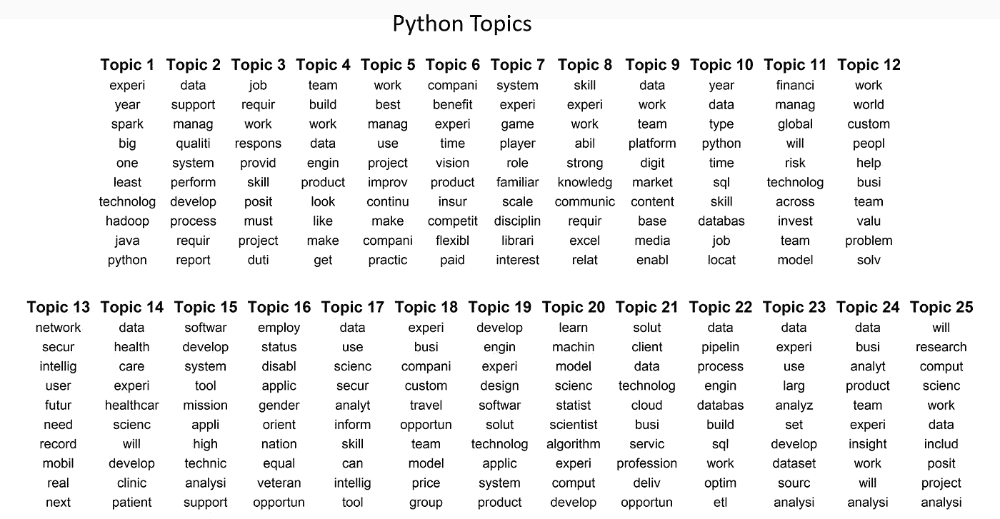

# R 与 Python:比较寻找 R 或 Python 专家的数据科学职位招聘

> 原文：<https://towardsdatascience.com/r-vs-python-comparing-data-science-job-postings-seeking-r-or-python-specialists-2c39ba36d471?source=collection_archive---------13----------------------->

## 在制作针对语言的数据科学招聘广告时，雇主在寻找什么？

网上有 100 万个帖子，标题类似于“R vs Python:数据科学之战”，让这两种语言互相竞争，试图为“一种统治所有数据科学的语言”加冕。两者都是强大的工具，各有所长(例如，高级统计库与实现生产代码)；总的来说，考虑它们如何互补比试图选择一个更有意义。

也就是说，在查看招聘信息时，并不是所有的数据科学招聘广告都在首选技能列表中包含 R 和 Python。这就产生了一个潜在的有趣的对比:当雇佣一个精通 R 语言而不是 Python 的数据科学家时，公司在寻找什么？反之亦然？为了回答这个问题，我用两种不同的搜索查询从一个流行的职位发布网站上搜集了职位描述、头衔和位置:一种包含术语 data science 和 R，但不包含 python，另一种包含术语 data science 和 python，但不包含 R。特定于 R 的职位搜索结果比特定于 python 的职位搜索返回的结果少 30%左右。毫不奇怪，包含两种语言的搜索返回的命中数远远多于特定语言的搜索。

# R 与 Python 的地理偏好

作为第一步，我查看了 R 和 python 职位搜索中最常见的 10 个城市的职位发布明细。当我收集数据时，两种语言的最大发布量都在纽约和波士顿(尽管两周后我再次抓取了发布量，硅谷接管了 python 职位，而纽约和波士顿保持不变)。在前两个城市之后，事情开始出现分歧。华盛顿特区对 R fluent 数据科学家的需求似乎更高，旧金山对 python fluent 数据科学家的需求也更高。我猜，DC 对 R 数据科学家的需求是由寻找政治数据科学家的公司推动的，这些公司中的许多人可能拥有政治学博士学位，而 R 在这一领域有着深厚的根基。

A surprising number of job postings fell on the East Coast

# 发布数据科学特定术语

了解这些职位的招聘信息有何不同的一个快速方法是简单地统计每组招聘信息中出现的数据科学工具和技术的数量。也就是说，在 R 数据科学工作中使用了哪些工具和技术？对于 python 数据科学工作，反之亦然。下面，我们可以很容易地查看这些术语在一个词云中出现了多少次。

通过对你大喊“研究”或“机器学习”，单词 clouds 开始描绘广告中的一些差异。在 R 数据科学的招聘启事中，我们可以清楚地看到最常用的词是“研究”，后面是“SQL”和“统计”等术语。对于 python 数据科学的职位发布，“机器学习”出现得最多，其次是“SQL”、“研究”和处理大数据的工具，如 AWS 和 spark。

The larger the term, the more frequently it occurred in the posting

# **职位描述的主题建模**

使用主题建模，我们可以更深入地了解工作描述中的内容。在一些文本清理之后，但在模型拟合之前，最好尝试一下有多少主题适合建模，而不是随便选择一个数字。为了获得帮助，我们可以求助于 r 中的“ldatuning”包。在为 ldatuning 提供了一个文档术语矩阵(DTM)之后，它将返回一些不同的指标来评估要继续进行的主题数量。下图显示了 R 工作描述中的信息；看起来大约 25 个主题可能是一个合理的选择。python 描述的结果几乎相同，因此 python 模型中也使用了 25 个主题。

The y axis represents a normalized metric that’s either to be minimized (top pane) or maximized (bottom pane)

下面是产生的主题，首先从 R 作业开始。这些术语按照它们在每个主题中的权重降序排列。有些话题并不十分有趣，因为它们与招聘实践和福利有关(例如，10、13、14、17、22)，甚至与纽约市有关(6)，尽管这很有意义，因为许多招聘信息都是在纽约发布的。多个主题似乎代表了健康和医疗保健行业(18，23)。其他描述科学研究，特别是生物和临床试验研究(2，7，25) -这有助于解释北卡罗来纳州达勒姆的排名，因为它是生物技术/制药研究的温床。商业世界也表现为主题 15 与商业广泛相关，主题 20 似乎与金融相关，主题 24 描述市场研究。主题 5 可以证实上面关于政治学相关工作的假设，因为它包含了与政策、政府和调查相关的术语。最后，我们来到我称之为一般数据科学的主题；例如，主题 3、8、11、16 和 18 涵盖了团队合作、广义分析、机器学习、统计和数据库等主题。

Terms are sorted in descending order with respect to their weighting on each topic

接下来，我们可以从仅 python 描述转移到主题分析结果。忽略与招聘实践和福利相关的话题，我们看到一些类似的主题正在出现。例如，主题 14 似乎代表健康研究、9 市场营销、11 金融、24 一般商业，我们有一般的数据科学主题，如 4、20 和 25，强调团队合作、机器学习和分析。

现在，关于差异，有一些很大的差异。这是提及大数据相关主题的一个线索(哈！).除了致力于处理大数据的平台(hadoop、spark)之外，主题 1 还包含术语“大”;主题 23 似乎也以某种格式表示大量数据。主题 21 描述了云计算，有两个主题致力于数据库(10，22)，多个主题与软件工程相关(15，19)。

Terms are sorted in descending order with respect to their weighting on each topic

# **我们学到了什么？**

专注于 R 的数据科学家和 python 流畅的数据科学家之间当然有很多相似之处(例如，SQL 数据必须存在于某个地方)，但也有一些关键的不同。从最高层面来看，寻找具有研发经验的数据科学家的帖子似乎是在寻找受过学术培训、具有丰富分析经验的研究人员。这种想法是有道理的，因为 R 在学术界占主导地位，也非常符合 R 职位描述中的许多研究主题。寻找 python fluent 数据科学家的帖子似乎在寻找具有更多计算机科学或工程背景的人，并且符合数据工程师或机器学习工程师的描述。

在另一个层面上，我认为我们在描述内容中看到的差异已经在 2014 年由 Michael Hoster(Stitchfix 的现任数据科学总监)在 Quora 帖子中阐明了，他解释了两种不同类型的数据科学家:

> **A 型数据科学家:**A 是做分析的。这种类型主要涉及理解数据或以相当静态的方式处理数据。A 型数据科学家非常类似于统计学家(也可能是一名统计学家)，但他们知道统计学课程中没有教授的所有数据处理的实际细节:数据清理、处理非常大的数据集的方法、可视化、特定领域的深入知识、写好数据等等。
> 
> A 型数据科学家可以编写足够好的代码来处理数据，但不一定是专家。A 型数据科学家可能是实验设计、预测、建模、统计推断或其他通常在统计系教授的事情的专家。不过，一般来说，数据科学家的工作成果并不像学术统计有时似乎暗示的那样是“p 值和置信区间”(例如，有时对于在制药行业工作的传统统计学家来说也是如此)。在谷歌，A 型数据科学家被称为统计学家、定量分析师、决策支持工程分析师或数据科学家，可能还有更多。
> 
> **B 型数据科学家:**B 是建筑用的。B 型数据科学家与 A 型共享一些统计背景，但他们也是非常强的编码员，可能是训练有素的软件工程师。B 型数据科学家主要对“在生产中”使用数据感兴趣他们建立与用户互动的模型，通常提供推荐(产品、你可能认识的人、广告、电影、搜索结果)。在谷歌，B 型数据科学家通常被称为软件工程师。B 型数据科学家可能会使用术语数据科学家来指代他们自己，因为这个领域的定义在不断变化，所以他们可能是对的。但我看到这个词在我这里提议的一般方式中使用得最多。

这两种类型之间的区别在 [Robert Chang](https://medium.com/@rchang/my-two-year-journey-as-a-data-scientist-at-twitter-f0c13298aee6) 的另一篇博文中也有很好的解释和阐述。对我来说，A 型数据科学家似乎与我们从寻找 python 数据科学家的广告中发现的 A 型数据科学家和 B 型数据科学家的帖子非常匹配。最近，AirBnB 将其数据科学部门重组为 [3 个分支](https://www.linkedin.com/pulse/one-data-science-job-doesnt-fit-all-elena-grewal/):数据科学家-分析、数据科学家-算法和数据科学家-推理。从这里的数据来看，python 帖子描述的数据科学家似乎很适合算法分支，R 帖子描述的数据科学家适合推理分支，并且可能适合分析轨道。

最后，R 和 python 是数据科学的重要工具，对它们都很了解无疑会比只知道其中一个而不知道另一个更进一步。尽管如此，正如我们所见，有些职位和公告需要一种语言而不是另一种语言，了解这些公告内容的差异可能有助于您考虑您可能希望优先选择哪种语言作为您的主要工作语言。