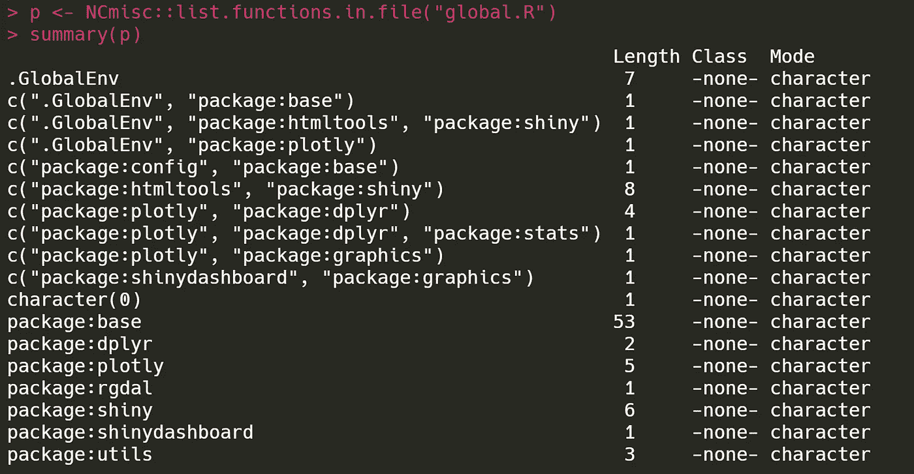
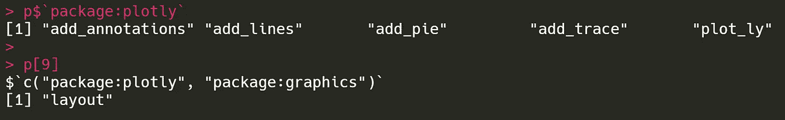
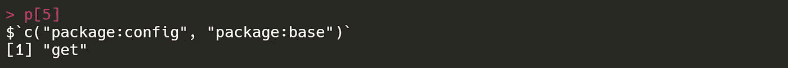
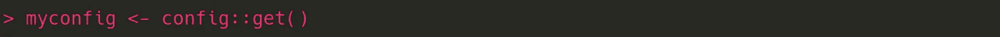

# 你确定你在用这个包吗？

> 原文：<https://towardsdatascience.com/r-you-sure-youre-using-this-package-8ce265a990b0?source=collection_archive---------15----------------------->

## 如何识别一个 R 文件实际上正在使用哪些包(和哪些函数)

在继承别人的 R 代码时，我总喜欢检查它用了哪些包和函数。不仅仅是那些它装载的库函数调用，还有那些它*实际上*使用的。为此，我最近发现了[这个有用的小工具](https://www.rdocumentation.org/packages/NCmisc/versions/1.1.6/topics/list.functions.in.file)，它将为你提供一个列表，列出所有的包以及在给定的 R 文件中引用的那些包中的所有函数。

您需要安装的包是 **NCmisc** ，我们将在其中使用的函数是名副其实的 **list.functions.in.file** 。

Example use of NCmisc::list.functions.in.file()

它的工作原理是识别给定文件中的所有函数调用，并将这些调用与内存中当前加载的函数进行比较。

这意味着*在*运行 **list.functions.in.file** 之前，你需要将所有你认为被引用的包加载到内存中，并且*只需要*那些包。最简单的方法是打开一个 RStudio 的新实例，只执行文件中的代码。(在上面的例子中,“全局。r”文件是一个闪亮应用程序的一部分，我第一次运行它，然后就停止了。)

输出是一个命名列表。每个项目都以包的名称命名，如果一个特定的函数名称为多个包所共有，则以包的名称命名。每个列表条目都是一个函数名列表。文件本身定义的任何自定义功能将出现在**下。全球环境**。

> 如果您的 R 脚本文件加载了一个包，但是这个包是**而不是**在这个输出中列出的，那么它就是多余的，您可以删除它。清理是好的。

在我们的例子中，这个文件中引用了五个来自 **plotly** 包的函数。但是还有一个——布局功能的**——在**图形**和**图形**中都有定义。**

## 查找潜在的函数名冲突

因此，这可以成为发现潜在名称空间冲突的工具。我碰巧知道我们不需要担心这种特定的冲突，但情况不会总是如此。在同一个例子中，在 **config** 包中有一个名为 **get** 的函数，它与一个完全不同的同名基本函数冲突。

即使加载了 **config** 包，我们也应该总是使用显式引用来调用它的 **get** 函数——使用双冒号符号——以避免意想不到的后果。

仅此而已。当然，如果你想让它解析多个文件，寻找特定的包/函数，输出结果到一个文本文件等等，你可以把它包装在你自己的代码里。

我希望这能对你有所帮助，即使阅读这篇文章的唯一“你”是未来的我。