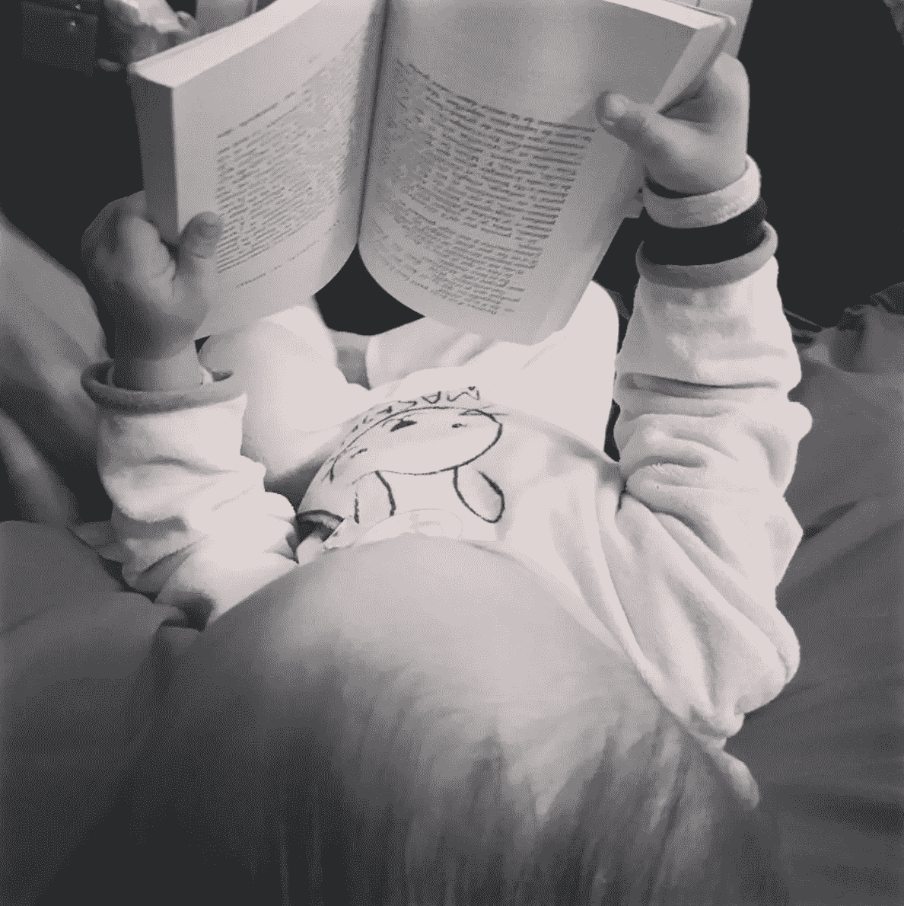

# 抚养一个孩子与训练一台机器

> 原文：<https://towardsdatascience.com/raising-a-child-vs-training-a-machine-9b33a5f4cc2a?source=collection_archive---------15----------------------->

## 妈妈对机器学习的看法

Photo by [Andy Kelly](https://unsplash.com/photos/0E_vhMVqL9g?utm_source=unsplash&utm_medium=referral&utm_content=creditCopyText) on [Unsplash](https://unsplash.com/search/photos/baby-and-robot?utm_source=unsplash&utm_medium=referral&utm_content=creditCopyText)

如果你像我一样，试图在训练机器的同时抚养一个蹒跚学步的孩子，那么说实话，你以前比较过这两件事。如果你对人工智能不感兴趣，但在你的生活中曾经观察过蹒跚学步的孩子，欢迎来到机器学习的奇妙世界，也就是养育机器。

在我们讨论细节之前，先声明一个简单的免责声明:在撰写本文的过程中，没有幼儿受到伤害。像任何父母一样，我只是花很多很多时间看着我的宝宝发现这个世界，并像任何数据科学家在他们的训练/测试结果前所做的那样，挠他的行为模式。

# “起初，它像石头一样哑”

你觉得我在撒谎吗？这句话来自[吉姆·斯特恩](https://twitter.com/jimsterne)，他给我做了一个关于机器学习的演讲(不是关于孩子的；我不是那种对孩子无礼的*。*

但是，没错，主要的想法是，机器学习包括训练机器完成特定的任务，就像你想训练你的孩子在你坐在沙发上的时候捡起脏衣服并放进洗衣机(*有罪！*)。然而，这里的主要区别是，你的孩子已经知道一件衣服是什么样子，如果你告诉他们如何洗衣服，那么可以肯定他们已经知道如何走、抓、拉和脱；这些只是他们在年轻生活中通过其他经历已经吸收的一系列行为。那么，当你的衣服被神奇地为你洗好的时候，是什么钥匙最终开启了你在沙发上偷懒的能力呢？语境。你给孩子举例子，告诉他们如何做每一步，并且*因为你爱他们*当他们做对的时候，你祝贺他们。

好吧，机器学习几乎是一样的，除了“孩子”有幼儿的能力，但有新生儿的经验。在这种情况下，你必须开始教他们在一个长香肠状的东西末端的五个婴儿香肠状的东西是手指，一只手和一只手臂，然后你如何用它们做像抓和拉的事情。你给这台机器的数据集是它开始工作所需要的一切，也是它的一切。它还不能拥有的是…

# …常识

除非你的名字是 Sangoku(或者只是你的龙珠书呆子们的悟空)，否则你应该一直相当擅长“男人或女人”游戏。利亚姆(我的儿子，也就是这个实验中的小孩)非常擅长这个。然而，我并不觉得我给了他一大堆有标签的数据。我没有，比如，和他在公园里坐下来，指着人们说“男人，男人，女人，男人，女人”，因为，公平地说，*那会令人毛骨悚然。*但是真的，也没必要。这台机器不具备孩子在初次经历时所具备的常识魔力。

但是我说的常识是什么意思呢？

> 普通的感性认识；一个人的基本智力，它允许简单的理解，没有它就不能做出好的决定或判断。
> - [维基百科](https://en.wiktionary.org/wiki/common_sense)

有时，当你的孩子决定从任何高度头朝下跳到地面时，你有理由质疑他们的常识。然而，假设它确实存在，它允许他们从所有的经历中学习，而不用被明确告知他们必须学会区分男女。

这就是我如何决定在给我所在机构的顾问同事的演讲中引入人工智能主题的:一个蹒跚学步的孩子正在学习何时说*【Mr】*【Mrs】*。蹒跚学步的孩子只需要一点观察，几个例子和一些纠正，你需要给机器数以千计的图像来开始擅长这个游戏。*

*他们中的大多数根本不在任何人工智能相关领域工作，所以这个解释被证明是超级有效的。然而，对我来说，缺乏常识可能是机器还没有准备好迎接这个世界的首要原因，但我的儿子可能会(他有一个巨大的额头，我哥哥叫他*超级大智慧……*小心)。*

# *规范和偏见*

*利亚姆会做奇怪的事情，比如拿着热狗的两头，咬中间。我的反应是告诉他“利亚姆！不是这样的！”但是后来我退缩了，思考一些最好的学习是如何通过尝试新事物来完成的。(好吧，公平地说，当他试图用鼻孔拿勺子时，我确实给他留了一些界限。)*

*这实际上是幼儿和机器的一大共同点。他们不受社会规范和偏见的影响，但这也是父母和数据科学家的不同之处。对蹒跚学步的孩子来说，你必须给他们一套价值观和社会规范，以此来建立自己。*好的偏见，*如果你愿意。作为一名数据科学家，你的角色正好相反，那就是让机器摆脱你自己的规范和偏见。偏见是不好的。非常糟糕。*

*我承认，我有八卦的一面，喜欢有偏见的故事，比如[亚马逊的招聘人工智能是性别歧视的](https://www.reuters.com/article/us-amazon-com-jobs-automation-insight/amazon-scraps-secret-ai-recruiting-tool-that-showed-bias-against-women-idUSKCN1MK08G)或者 [FaceApp 的“热门”过滤器是种族歧视的](https://techcrunch.com/2017/04/25/faceapp-apologises-for-building-a-racist-ai/)。这是一个很好的方式，然后向非数据科学领域的人解释，数据科学家的角色主要是防止偏见，并尽可能保持机器的道德性。*

# *相关性和因果关系*

**

*[xkcd](https://xkcd.com/552/) on correlation and causation*

**相关性并不意味着因果关系。*不，当然不是，尤其是如果你熟悉这件轶事的话，[尼古拉斯·凯奇不是一个淹死人的怪物](https://www.nationalgeographic.com/science/phenomena/2015/09/11/nick-cage-movies-vs-drownings-and-more-strange-but-spurious-correlations/)。尽管现在退一步来看很有趣，但我还是艰难地认识到，一个孩子也不知道这条规则。*

*不久前，我和全家人在母亲家闲荡时，我告诉我的孩子我要吃饭了，并开始挑食。就在那一刻，他突然大哭起来，对我大喊:“别吃了，妈妈！!"拍着我的手，把叉子直接放到我的盘子里。我只是坐在那里，下巴贴在地板上，试图了解我的孩子是否是一个肥胖的混蛋，为了符合标准的性别歧视的美丽规范，他不想让他的母亲吃东西。不赖，冷静点，他才 2 岁半，不受社会规范的影响。另外，他在很小的时候就被父亲成功地洗脑，让他一直说“妈妈很漂亮”*

*仅仅两天后，当我把他放到床上时，我才意识到这一切是从哪里来的。我的日常工作包括下班回来，喂宝宝，给宝宝洗澡，把宝宝放到床上，然后去吃饭。因此，每次我把他放在床上给他读故事时，我都会说“妈妈现在要吃饭了”，让他独自一人呆在房间里，他还有 10 到 12 个小时的睡眠时间。有了这种关联，他脑子里就做出了*“妈妈吃饭导致妈妈抛弃我”*的因果关系。呃……*

*在这种情况下，作为一个母亲，我的工作包括改变我的模式，让他忘记这个因果关系。作为一名数据科学家，如果你的机器得出了错误的因果关系，那么，有时我们的工作就是承认我们失败了。让我们回顾一下亚马逊将人工智能用作招聘工具的失败:他们用来衡量候选人是否适合该工作的 10 年数据集严重偏向男性，因为“大多数(简历)来自男性，这反映了男性在整个科技行业的主导地位。”*

*所以亚马逊的人工智能回来说:“嘿，伙计们，大多数申请人都是男性，所以你应该雇用男性，如果简历上写了关于女性的事情，那么我就把它扔了，因为这是一个扫兴的人。”*

*不，艾。那只会让你成为一个性别歧视的混蛋。而这正是初学走路的孩子的优势所在(还有成年人，让我们乐观一点):*学会不做混蛋永远都不晚。**

# *父母和数据科学家都是人类的工作*

**

*My son pretending to read a book*

*你找不到任何一个父母会告诉你，养育子女是直截了当和容易的(如果有人这样做，那被称为谎言)。你必须不断地问自己，你在教这个蹒跚学步的孩子什么，并适应他们不断进化的神经网络。*

*与此同时，数据科学家在某种程度上也负有同样的责任。如果你正在招募一名数据科学家或想成为一名数据科学家，并期望它只与编程有关，这就像期望父母像养狗一样抚养孩子，并希望他成为一个稳定的成年人，而在他们的整个童年期间只听到*【坐着】**【翻滚】*。根据经验，这种方法在他们 6 个月大之前都有效。一旦它们翻身，就该教它们人类的东西了。*

# *那么，最简单的是什么？*

*我就在这里留个假笑。如果你是家长，你知道。*

*最后一件事。利亚姆，如果你偶然看到这篇文章并读到这里，我爱你，我为你感到骄傲，因为这意味着你可以阅读英语。对一个法国男孩来说还不错！*

*再次感谢杰夫的仔细阅读，令人难以置信的编辑，以及向我解释在美国你不用*启发式*这个词。*