# Python 中的随机森林

> 原文：<https://towardsdatascience.com/random-forest-in-python-154d78aad254?source=collection_archive---------15----------------------->


[https://commons.wikimedia.org/wiki/File:Randomforests_ensemble.gif](https://commons.wikimedia.org/wiki/File:Randomforests_ensemble.gif)

随机森林是最流行的机器学习算法之一。像决策树一样，随机森林可以应用于回归和分类问题。有些法律要求在发放贷款或保险时使用的模型所做出的决定是可以解释的。后者被称为模型可解释性，这也是我们看到随机森林模型在工业中被大量使用的原因之一。

# 算法

随机森林算法通过聚合不同深度的多个决策树做出的预测来工作。林中的每个决策树都在称为引导数据集的数据集子集上进行训练。

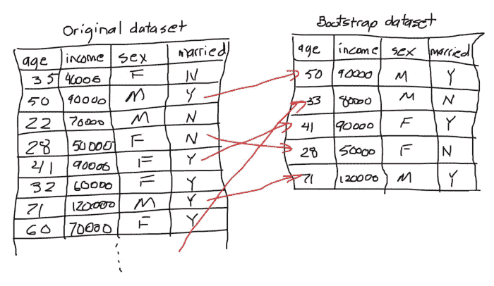

在构建森林中的每个决策树期间被遗漏的样本部分被称为出袋(OOB)数据集。我们将在后面看到，该模型将通过在森林中运行 OOB 数据集中的每个样本来自动评估其自身的性能。

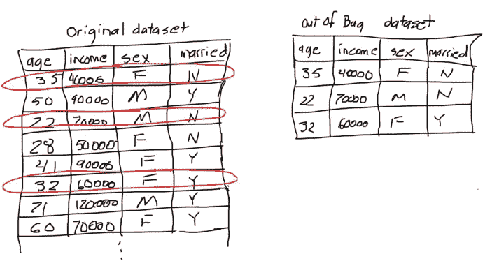

回想一下，在决定分割决策树的标准时，我们如何使用基尼指数或熵来测量每个特征产生的杂质。然而，在随机森林中，我们随机选择预定数量特征作为候选者。后者将导致包含相同特征(即与目标标签高度相关的特征)的树之间的更大差异。

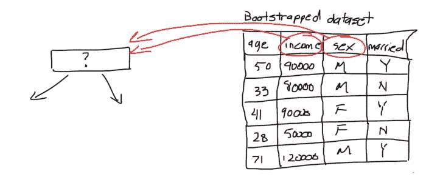

当随机森林用于分类并呈现新样本时，通过取森林中每个单独决策树所做预测的**多数**来进行最终预测。在这种情况下，它被用于回归，并提供了一个新的样本，最终的预测是通过对森林中每个单独的决策树所做的预测取**平均值**来进行的。

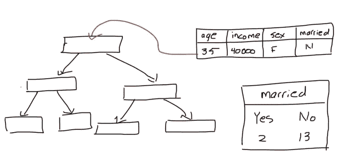

# Python 代码

首先，我们导入以下库。

```
from sklearn.ensemble import RandomForestClassifier
from sklearn.datasets import load_iris
from sklearn.model_selection import train_test_split
from sklearn.metrics import confusion_matrix
import pandas as pd
import numpy as np
from sklearn.tree import export_graphviz
from sklearn.externals.six import StringIO 
from IPython.display import Image 
from pydot import graph_from_dot_data
```

在接下来的部分，我们将尝试对不同种类的鸢尾进行分类。幸运的是，`scikit-learn`库提供了一个包装器函数，用于将数据集导入我们的程序。

```
iris = load_iris()
X = pd.DataFrame(iris.data, columns=iris.feature_names)
y = pd.Categorical.from_codes(iris.target, iris.target_names)
```

`RandomForestClassifier`不能直接处理分类数据。因此，我们将每个物种编码为一个数字。

```
y = pd.get_dummies(y)
```

我们留出一部分数据用于测试。

```
X_train, X_test, y_train, y_test = train_test_split(X, y, random_state=1)
```

接下来，我们创建一个`RandomForestClassifier`类的实例。

```
rf = RandomForestClassifier(criterion='entropy', oob_score=True, random_state=1)
```

为了增加趣味，这次我们将使用熵作为决策标准。这个过程与前一篇文章中使用的类似，除了我们使用下面的等式。

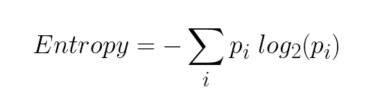

节点本身的杂质等于左子节点中样本的分数加上右子节点中样本的分数。

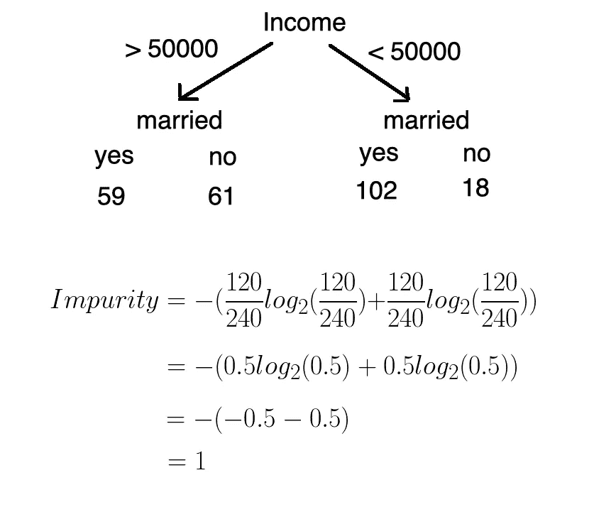

为了计算左叶的杂质，我们将已婚和未婚以及收入低于 5 万英镑的人口比例代入等式。

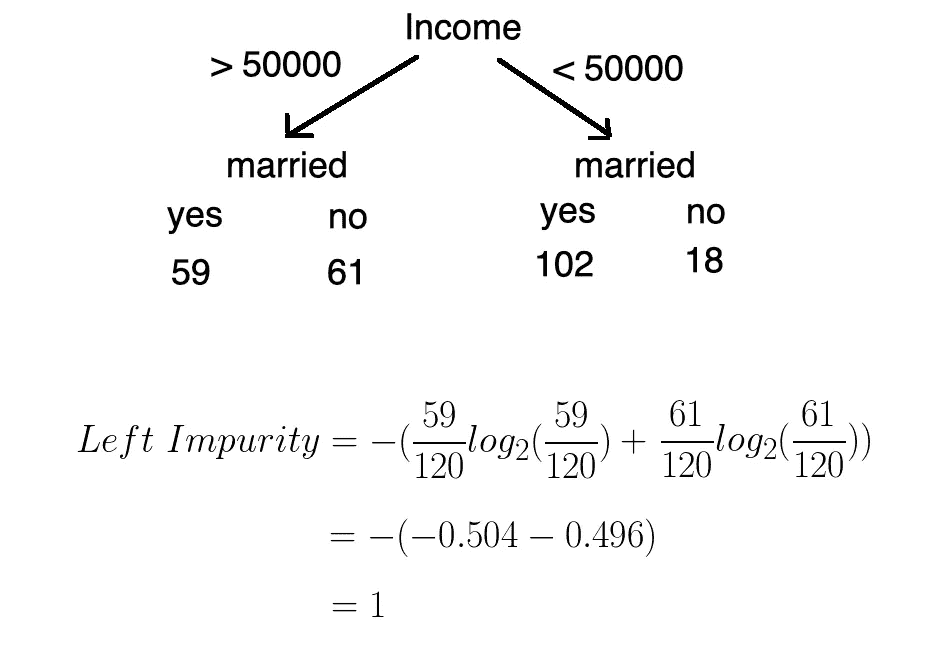

对于右叶的杂质，我们遵循同样的过程。

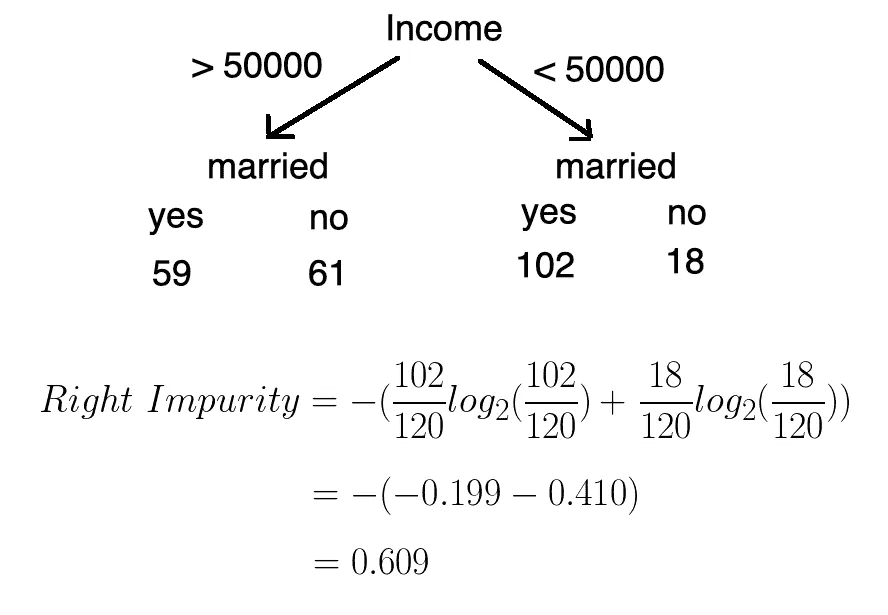

信息增益(有熵)写如下。

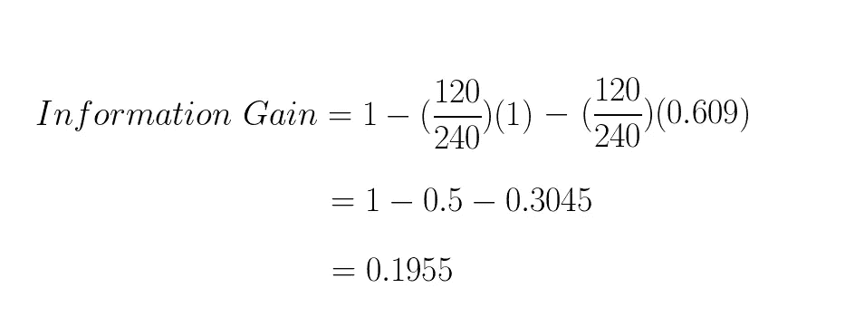

然后对收入和性别重复这一过程。我们选择具有最大信息增益的分割。

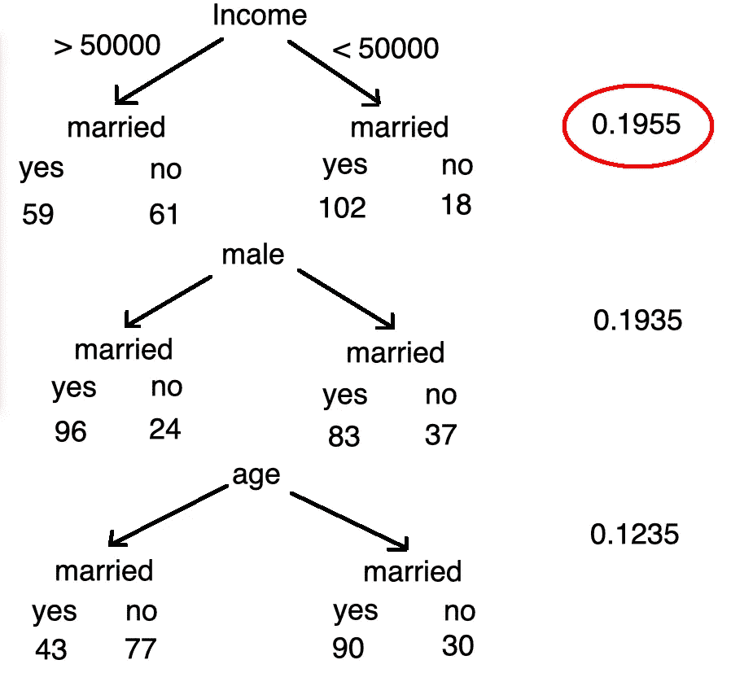

接下来，我们训练我们的模型。

```
rf.fit(X_train, y_train)
```

属性包含一个由组成森林的对象组成的数组。就像之前一样，我们可以运行下面的代码块来可视化一个给定的决策树。

```
dt = rf.estimators_[0]dot_data = StringIO()export_graphviz(dt, out_file=dot_data, feature_names=iris.feature_names)(graph, ) = graph_from_dot_data(dot_data.getvalue())Image(graph.create_png())
```

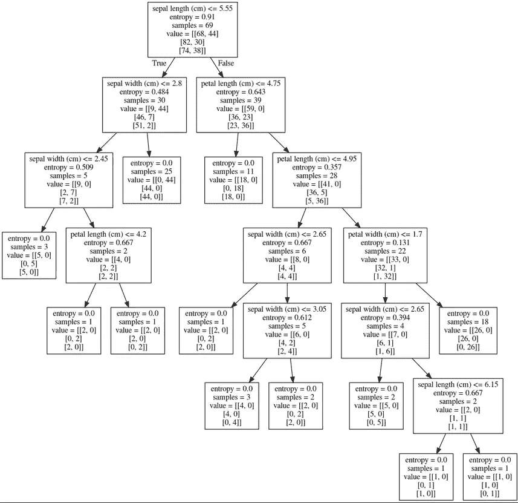

我们可以通过查看开箱得分来评估我们的随机森林模型的准确性。

```
rf.oob_score_
```

我们还可以检查我们的模型在测试集上的表现。考虑到这是一个分类问题，我们使用了混淆矩阵。

```
y_pred = rf.predict(X_test)species = np.array(y_test).argmax(axis=1)
predictions = np.array(y_pred).argmax(axis=1)confusion_matrix(species, predictions)
```

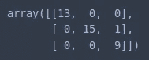