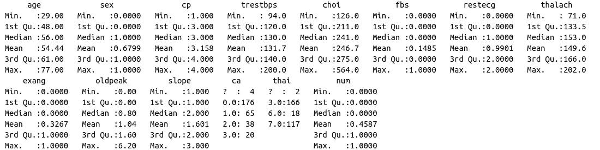
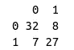

# R 中的随机森林

> 原文：<https://towardsdatascience.com/random-forest-in-r-f66adf80ec9?source=collection_archive---------0----------------------->


[https://www.pexels.com/photo/man-writing-on-table-3380743/](https://www.pexels.com/photo/man-writing-on-table-3380743/)

有些法律要求在发放贷款或保险时使用的模型所做出的决定是可以解释的。后者被称为模型可解释性，这也是为什么我们看到随机森林模型比神经网络等其他模型更受欢迎的原因之一。

# 算法

随机森林算法通过聚合不同深度的多个决策树做出的预测来工作。林中的每个决策树都在称为引导数据集的数据集子集上进行训练。


在构建森林中的每个决策树期间被遗漏的样本部分被称为出袋(OOB)数据集。我们将在后面看到，该模型将通过在森林中运行 OOB 数据集中的每个样本来自动评估其自身的性能。


回想一下，在决定分割决策树的标准时，我们如何使用基尼指数或熵来测量每个特征产生的杂质。然而，在随机森林中，我们随机选择预定数量特征作为候选者。后者将导致包含相同特征(即与目标标签高度相关的特征)的树之间的更大差异。


当随机森林用于分类并呈现新样本时，通过采用森林中每个单独决策树所做预测的**多数**来进行最终预测。在这种情况下，它被用于回归，并提供了一个新的样本，通过对森林中每个单独的决策树所做的预测取**平均值来进行最终预测。**


# r 代码

在接下来的教程中，我们将使用`caTools`包将我们的数据分成训练集和测试集，以及由`randomForest`包提供的随机森林分类器。

```
library(randomForest)require(caTools)
```

我们将使用 UCI 机器学习知识库中的一个可用数据集。如果你想继续下去，数据可以在[这里](https://archive.ics.uci.edu/ml/datasets/Heart+Disease)找到。

我们的目标是预测一个人是否患有心脏病

```
data <- read.csv(
  "processed.cleveland.data",
  header=FALSE
)
```

csv 文件包含 303 行和 14 列。

```
dim(data)
```


根据文档，列和特性的映射如下。

1.  年龄:以年为单位的年龄
2.  性别:性别(1 =男性；0 =女性)
3.  cp:胸痛型(1 =典型心绞痛；2 =不典型心绞痛；3 =非心绞痛性疼痛；4 =无症状)
4.  trestbps:静息血压(入院时以毫米汞柱为单位)
5.  choi:血清胆固醇，单位为毫克/分升
6.  fbs:空腹血糖> 120 mg/dl (1 =真；= 0 假)
7.  restecg:静息心电图结果(1 =正常；2 =有 ST-T 波异常；2 =显示可能或明确的左心室肥大)
8.  thalach:达到最大心率
9.  exang:运动诱发的心绞痛(1 =是；0 =否)
10.  oldpeak:相对于静息运动诱发的 ST 段压低
11.  斜率:运动 ST 段峰值的斜率(1 =上坡；2 =平；3 =下降)
12.  ca:荧光镜染色的主要血管数(0-3)
13.  泰语:(3 =正常；6 =修复缺陷；7 =可逆转的缺陷)
14.  num:心脏病诊断。它是一个从 0(不存在)到 4 的整数。

鉴于 csv 文件不包含标题，我们必须手动指定列名。

```
names(data) <- c("age", "sex", "cp", "trestbps", "choi", "fbs", "restecg", "thalach", "exang", "oldpeak", "slope", "ca", "thai", "num")
```

很多时候，当我们处理大型数据集时，我们希望对数据有所了解。与将所有内容都加载到 RAM 中相反，我们可以使用`head`函数来查看前几行。

```
head(data)
```


为了简化问题，我们将只尝试区分有无心脏病(值 1，2，3，4)和无心脏病(值 0)。因此，我们用 1 替换所有大于 1 的标签。

```
data$num[data$num > 1] <- 1
```

r 提供了一个名为`summary`的有用函数，用于查看与我们的数据相关的指标。如果我们仔细观察，我们会注意到它提供了应该是分类变量的平均值。

```
summary(data)
```



这意味着列类型有问题。我们可以通过运行以下命令来查看每一列的类型。

```
sapply(data, class)
```


在 R 中，分类变量(取有限数量值的变量)是一个因子。正如我们所见，`sex`被错误地当作一个数字，而实际上，如果是男性，它只能是 1；如果是女性，它只能是 0。我们可以使用`transform`方法来改变每个特性的内置类型。

```
data <- transform(
  data,
  age=as.integer(age),
  sex=as.factor(sex),
  cp=as.factor(cp),
  trestbps=as.integer(trestbps),
  choi=as.integer(choi),
  fbs=as.factor(fbs),
  restecg=as.factor(restecg),
  thalach=as.integer(thalach),
  exang=as.factor(exang),
  oldpeak=as.numeric(oldpeak),
  slope=as.factor(slope),
  ca=as.factor(ca),
  thai=as.factor(thai),
  num=as.factor(num)
)sapply(data, class)
```


如果我们再次打印数据摘要，我们会得到以下结果。

```
summary(data)
```


现在，分类变量被表示为每个相应类的计数。某些样本的`ca`和`thai`为`?`表示缺失值。r 期望缺失值被写成`NA`。在替换它们之后，我们可以使用`colSums`函数来查看每一列的缺失值计数。

```
data[ data == "?"] <- NAcolSums(is.na(data))
```


根据上面的注释，`thai`和`ca`都是因子。

*   泰语:(3 =正常；6 =修复缺陷；7 =可逆转的缺陷)
*   ca:荧光镜染色的主要血管数(0-3)

我并不自称是领域专家，所以我们只是将`thai`的缺失值替换为正常值。接下来，我们将删除缺少`ca`的行。

```
data$thai[which(is.na(data$thai))] <- as.factor("3.0")
data <- data[!(data$ca %in% c(NA)),]colSums(is.na(data))
```


如果我们再次运行 summary，我们会看到它仍然将`?`视为一个潜在的类。

```
summary(data)
```


为了解决这个问题，我们将列转换为因子。

```
data$ca <- factor(data$ca)
data$thai <- factor(data$thai)summary(data)
```


我们将留出一部分数据用于测试。

```
sample = sample.split(data$num, SplitRatio = .75)train = subset(data, sample == TRUE)
test  = subset(data, sample == FALSE)dim(train)
dim(test)
```


接下来，我们初始化`randomForest`类的一个实例。与`scikit-learn`不同，我们不需要显式地调用`fit`方法来训练我们的模型。

```
rf <- randomForest(
  num ~ .,
  data=train
)
```

默认情况下，森林中决策树的数量为 500，用作每次分割的潜在候选要素的数量为 3。该模型将自动尝试对出袋数据集中的每个样本进行分类，并显示带有结果的混淆矩阵。


现在，我们使用我们的模型来预测测试组中的人是否患有心脏病。

```
pred = predict(rf, newdata=test[-14])
```

由于这是一个分类问题，我们使用混淆矩阵来评估我们的模型的性能。回想一下，对角线上的值对应于真阳性和真阴性(正确的预测)，而其他值对应于假阳性和假阴性。

```
cm = table(test[,14], pred)
```

