# 完全初学者的随机森林

> 原文：<https://towardsdatascience.com/random-forests-for-complete-beginners-2014d9ed91c0?source=collection_archive---------10----------------------->

## 随机森林和决策树的权威指南。

在我看来，大多数机器学习教程对初学者不够友好。

上个月，我为完全初学者 写了一篇[神经网络简介**。这篇文章将采用同样的策略，也就是说**假设没有机器学习的先验知识**。我们将学习什么是随机森林，以及它们是如何从头开始工作的。**](https://victorzhou.com/blog/intro-to-neural-networks/)

准备好了吗？让我们开始吧。

# 1.决策树🌲

随机森林🌲🌲🌲实际上只是一堆决策树🌲捆绑在一起(哦💡这就是为什么它被称为*森林*。在进入森林之前，我们需要谈论树木。

请看下面的数据集:

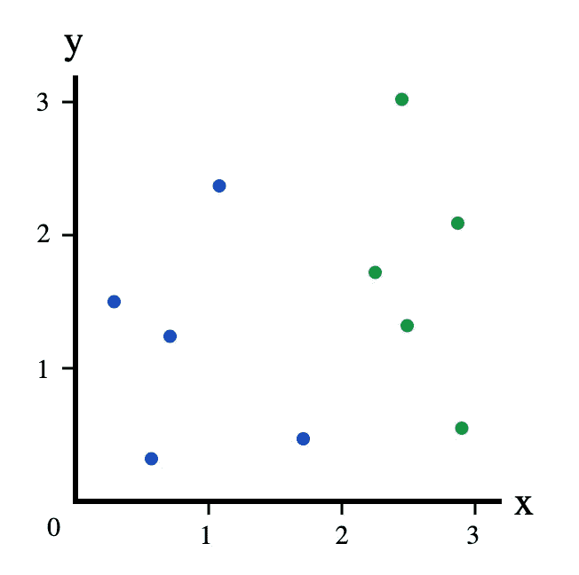

The Dataset

如果我告诉你有一个坐标为 1 的新点，你认为它会是什么颜色？

蓝色，对吗？

你刚刚在脑子里评估了一个决策树:

这是一个简单的决策树，有一个**决策节点**，由**测试** *x* < 2。如果测试通过(*x*2)，我们选择左边的**分支**并选择蓝色。如果测试失败( *x* ≥2)，我们选择右边的**分支**并选择绿色。

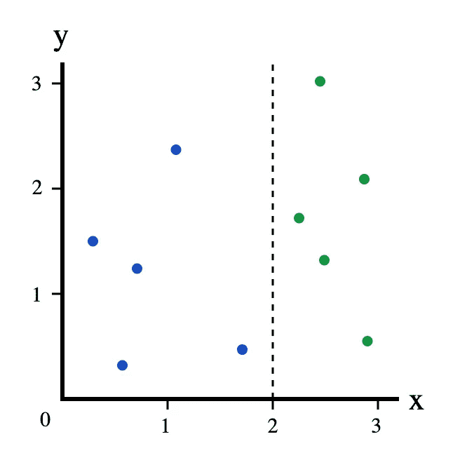

The Dataset, split at x=2

决策树经常被用来回答这类问题:给定一个**标签为**的数据集，我们应该如何**对**新样本进行分类？

> **标记**:我们的数据集被标记，因为每个点都有一个类别(颜色):蓝色或绿色。
> 
> **分类**:分类一个新的数据点就是给它分配一个类别(颜色)。

这里的数据集现在有 3 个类，而不是 2 个:

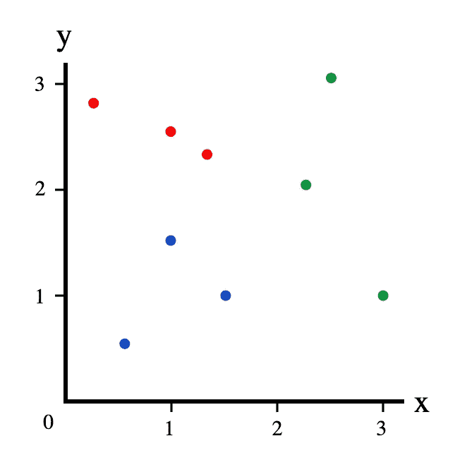

The Dataset v2

我们的旧决策树不再那么管用了。给定新的点( *x* ， *y* )，

*   如果 *x* ≥2，我们仍然可以理直气壮地将其归类为绿色。
*   如果 *x* < 2，我们不能马上将其归类为蓝色——它也可能是红色。

我们需要添加另一个**决策节点**到我们的决策树中:

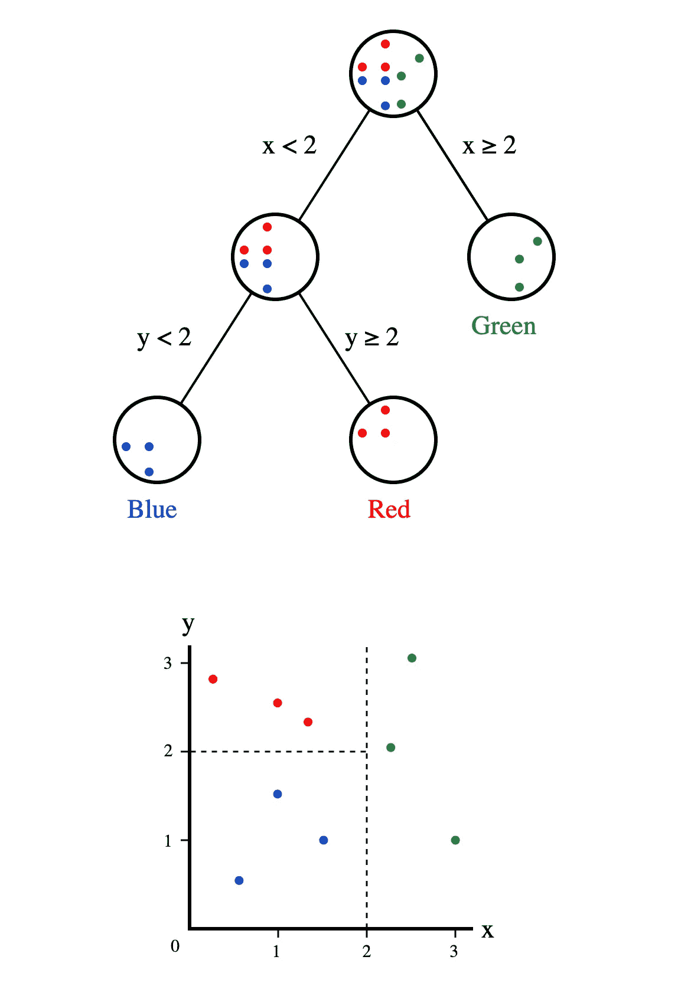

很简单，对吧？这是决策树背后的基本思想。

# 2.训练决策树

让我们开始训练决策树吧！我们将再次使用 3 类数据集:

The Dataset v2

# 2.1 训练决策树:根节点

我们的第一个任务是确定我们的树中的根决策节点。它将测试哪个特性( *x* 或 *y* )，测试阈值是多少？例如，我们之前树中的根节点使用了 *x* 特性，测试阈值为 2:

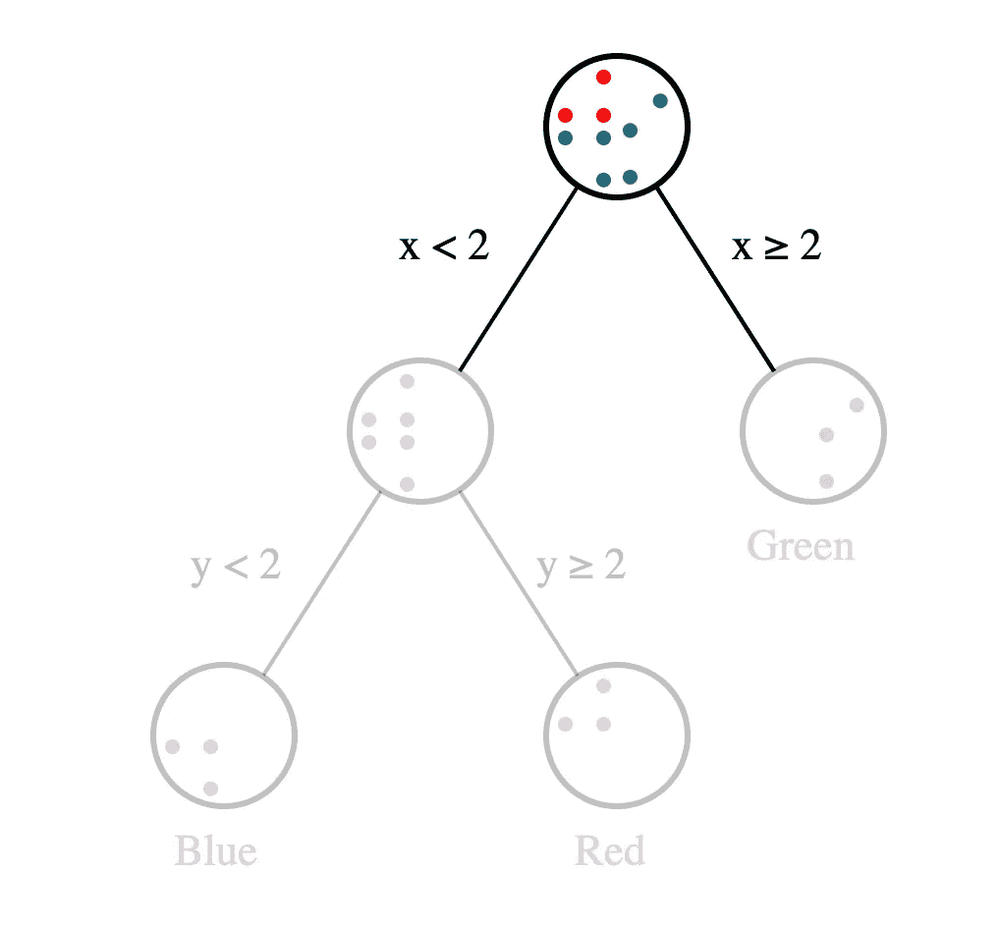

直觉上，我们想要一个做出“好”分割的决策节点，其中“好”可以粗略地定义为尽可能多地分离不同类的**。上面的根节点做了一个“好”的分割:*所有的*果岭在右边，*没有*果岭在左边。**

因此，我们现在的目标是选择一个根节点，给我们一个可能的“最佳”分割。但是我们如何量化拆分有多好呢？很复杂。我写了一整篇博文，讲述了一种使用基尼系数的方法。 **←我建议在你继续之前现在就阅读它**——我们将在这篇文章的后面使用这些概念。

欢迎回来！

> 希望你只是看了[我的基尼不纯帖](https://victorzhou.com/blog/gini-impurity/)。如果你没有，这里有一个很短的 TL；DR:我们可以用基尼系数来计算任何分割的基尼系数。**更好的分割有更高的基尼系数。**

回到确定我们根决策节点的问题。既然我们已经有了评估拆分的方法，我们要做的就是找到可能的最佳拆分！为了简单起见，我们将**尝试每一个可能的分割**并使用最好的分割(基尼系数最高的分割)。**这不是找到最佳分割**的最快方法，但却是最容易理解的。

尝试每一次分裂意味着尝试

*   每个特征( *x* 或 *y* )。
*   所有“唯一”阈值。我们只需要尝试产生不同分裂的阈值。

例如，如果我们想使用 *x* 坐标，我们可以选择以下阈值:

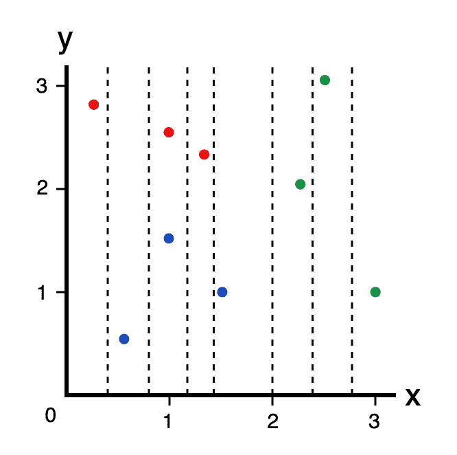

x Thresholds

让我们对 *x* =0.4 的分割进行基尼系数计算。

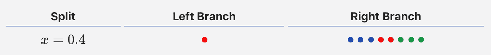

首先，我们计算整个数据集的基尼系数:

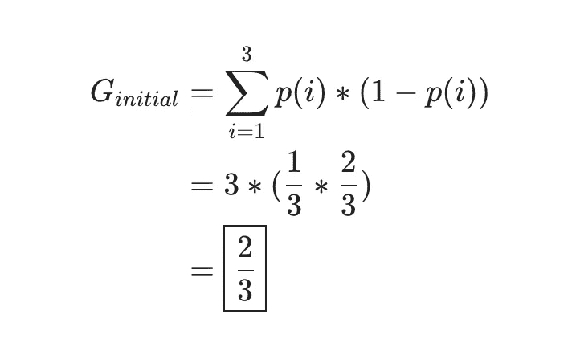

然后，我们计算两个分支的基尼系数:

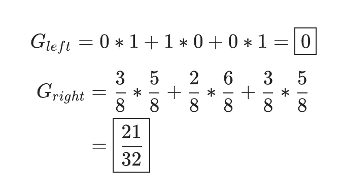

最后，我们通过从原始杂质中减去加权分支杂质来计算基尼系数:

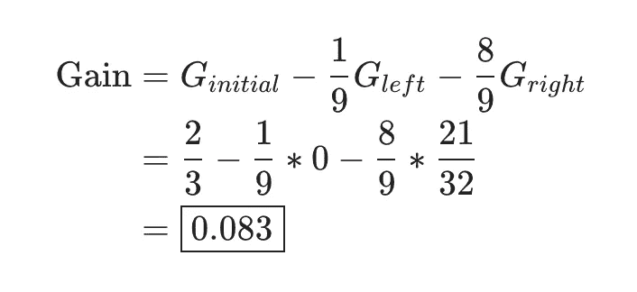

> 对刚刚发生的事感到困惑？我告诉过你你应该读一下[我的基尼不洁贴](https://victorzhou.com/blog/gini-impurity/)。它可以解释所有这些基尼系数。

我们可以用同样的方法计算每一种可能分割的基尼系数:

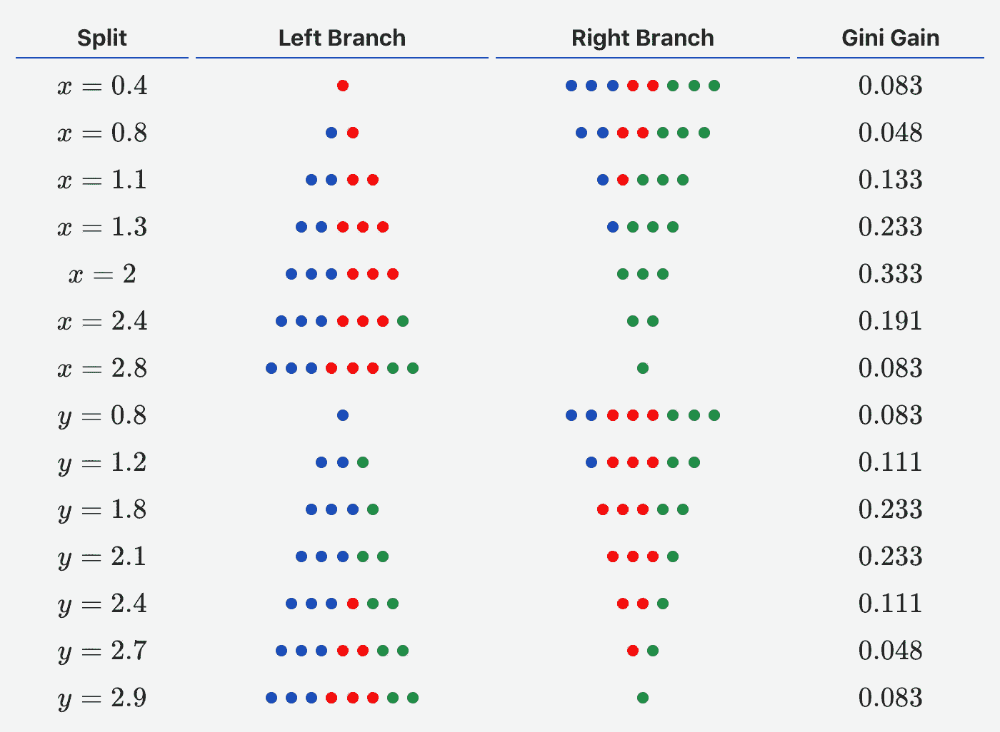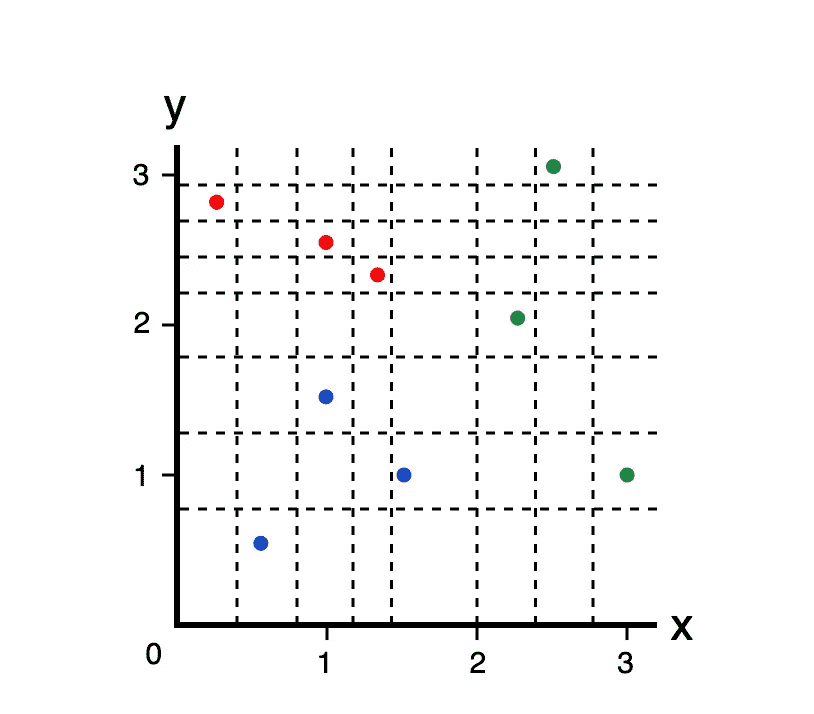

All Thresholds

在尝试了 *x* 和 *y* 的所有阈值后，我们发现 *x* =2 的分割具有最高的 Gini 增益，因此我们将使我们的根决策节点使用阈值为 2 的 *x* 特性。这是我们目前掌握的情况:

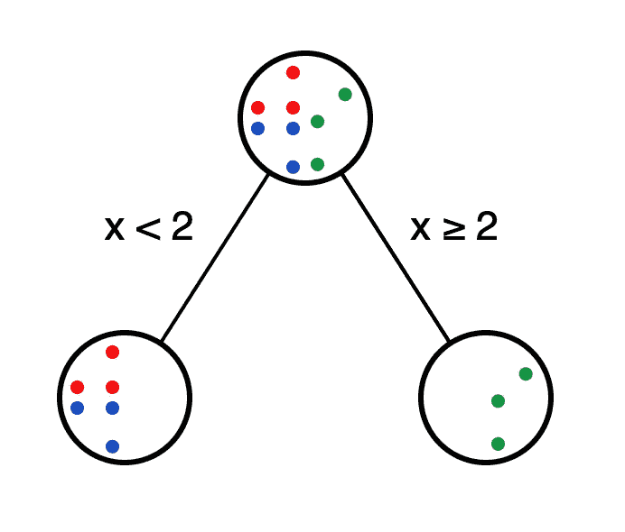

不断进步！

# 2.2:训练决策树:第二个节点

是时候做出我们的第二个决定了。我们(任意)去左支吧。**我们现在只使用将采取左分支**的数据点(即满足 *x* < 2 的数据点)，特别是 3 个蓝色和 3 个红色。

为了建立我们的第二个决策节点，**我们只是做同样的事情！**我们对现有的 6 个数据点尝试了每一种可能的分割，并意识到 *y* =2 是最佳分割。我们把它变成一个决策节点，现在有了这个:

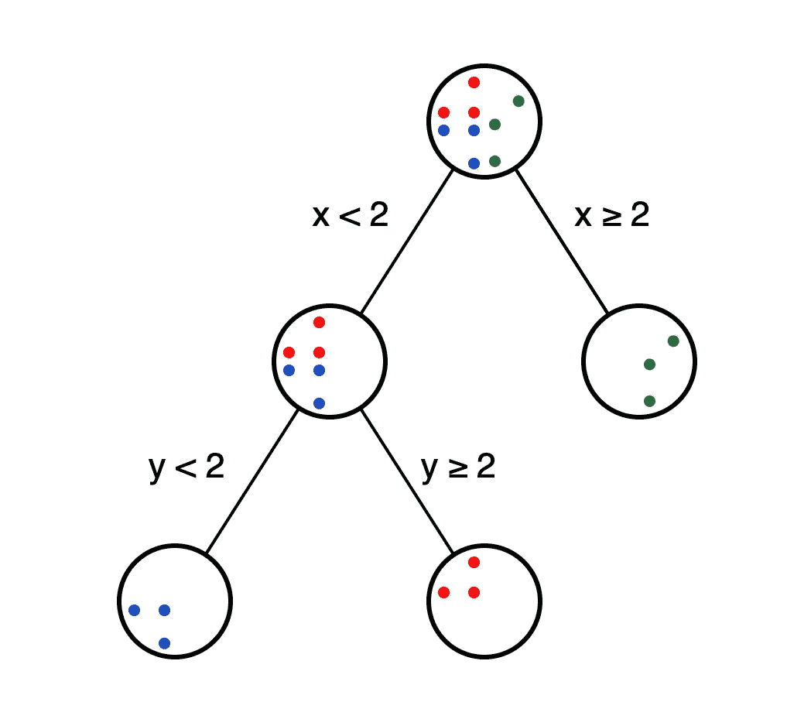

我们的决策树差不多完成了…

# 2.3 训练决策树:何时停止？

让我们继续下去，试着做第三个决策节点。这次我们将使用根节点的右分支。该分支中唯一的数据点是 3 个果岭。

同样，我们尝试了所有可能的分裂，但他们都

*   都一样好。
*   基尼系数为 0(基尼系数已经是 0，不能再低了)。

在这里添加一个决策节点是没有意义的，因为这样做不会改进我们的决策树。因此，我们将使这个节点成为一个**叶节点**，并给它贴上绿色标签。这意味着**我们将到达该节点的任何数据点归类为绿色**。

如果我们继续剩下的两个节点，同样的事情会发生:我们将左下方的节点作为蓝叶节点，将右下方的节点作为红叶节点。这给我们带来了最后的结果:

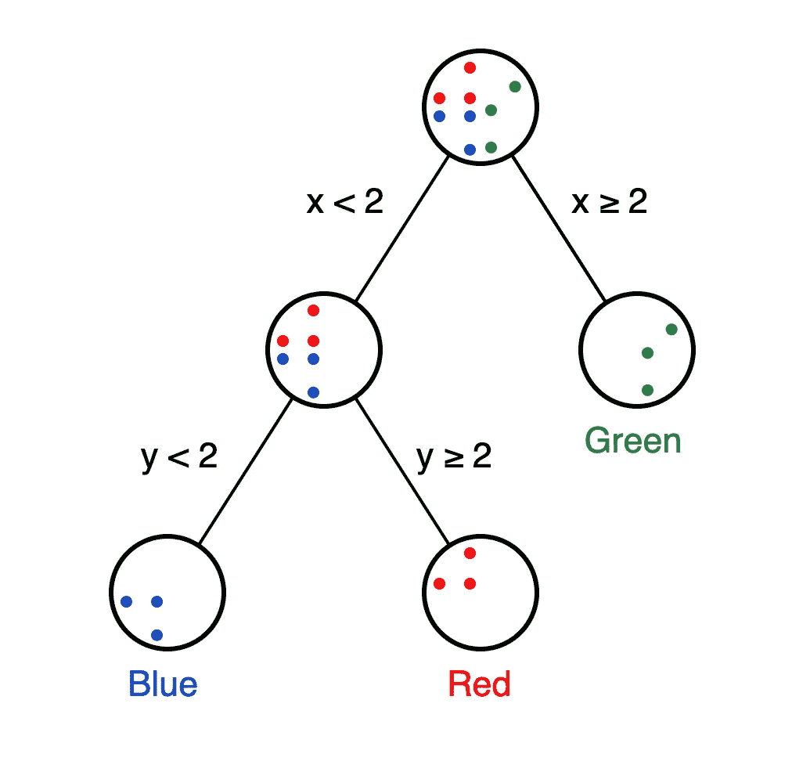

一旦我们的决策树中所有可能的分支都以叶节点结束，我们就完成了。我们已经训练了一个决策树！

# 3.随机森林🌲🌳🌲🌳🌲

我们终于准备好讨论随机森林了。记得我之前说的吗？

> 随机森林实际上只是捆绑在一起的一堆决策树。

这是真的，但有点简单化了。

# 3.1 装袋

考虑以下算法，在给定一个具有 *n* 个点的数据集的情况下，训练一组决策树:

1.  样本，**与替换的**， *n* 来自数据集中的训练样本。
2.  在 n 个样本上训练一个决策树。
3.  重复 *t* 次，换一些 *t* 。

为了使用带有 t *t* 树的模型进行预测，我们聚集来自各个决策树的预测，并且

*   如果我们的树产生了类别标签(比如颜色)，就以多数票为准。
*   如果我们的树产生数值(例如预测温度、价格等)，则取平均值**。**

**这种技术叫做**装袋**，或[b 装袋**聚集**再聚集](https://en.wikipedia.org/wiki/Bootstrap_aggregating)。我们进行的替换抽样被称为 [bootstrap](https://en.wikipedia.org/wiki/Bootstrapping_(statistics)) 样本。**

**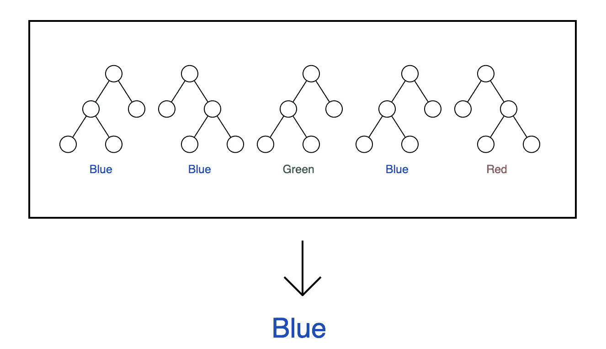**

**袋装决策树非常接近随机森林——它们只是缺少了一样东西…**

# **3.2 装袋→随机森林**

**袋装决策树只有一个参数: *t* ，树的个数。**

**随机森林还有第二个参数，控制寻找最佳分割点时尝试多少功能。本教程的简单数据集只有两个特征( *x* 和 *y* )，但大多数数据集都有更多的特征(数百或数千)。**

**假设我们有一个包含 p 个特征的数据集。每次我们做一个新的决策节点时，我们不再尝试所有的功能，而是只尝试功能的一个子集。我们这样做主要是为了注入随机性，使单棵树更加独特，而**减少了树**之间的相关性，从而提高了森林的整体性能。这种技术有时被称为**特征打包**。**

# **4.现在怎么办？**

**这是一个初学者对随机森林的介绍！快速回顾一下我们的工作:**

*   **介绍了**决策树**，随机森林的积木。**
*   **学习了如何通过迭代进行可能的最佳分割来训练决策树。**
*   **定义了基尼系数，这是一个用来量化收入差距有多“好”的指标。**
*   **看到了**一个随机森林=一堆决策树。****
*   **了解**打包**如何结合多棵树的预测。**
*   **了解到**特征装袋**是装袋决策树和随机森林的区别。**

**你可以在这里做一些事情:**

*   **在真实数据集上试验 scikit-learn 的 [DecisionTreeClassifier](https://scikit-learn.org/stable/modules/generated/sklearn.tree.DecisionTreeClassifier.html) 和 [RandomForestClassifier](https://scikit-learn.org/stable/modules/generated/sklearn.ensemble.RandomForestClassifier.html) 类。**
*   **尝试从头开始编写一个简单的决策树或随机森林实现。我很乐意给予指导或代码审查！只需[发微博给我](https://twitter.com/victorczhou)或者[发邮件给我](mailto:vzhou842@gmail.com)。**
*   **阅读关于[梯度增强决策树](https://en.wikipedia.org/wiki/Gradient_boosting#Gradient_tree_boosting)的内容，并使用 [XGBoost](https://xgboost.readthedocs.io/en/latest/) ，这是一个强大的梯度增强库。**
*   **阅读关于随机森林的扩展[ext tree](https://en.wikipedia.org/wiki/Random_forest#ExtraTrees)，或者玩玩 scikit-learn 的[ext tree classifier](https://scikit-learn.org/stable/modules/generated/sklearn.ensemble.ExtraTreesClassifier.html)类。**

**本教程到此结束。我喜欢[写关于机器学习的](https://victorzhou.com/tag/machine-learning)(但也有其他话题)，所以如果你想获得新帖子的通知，请 [**订阅**](https://victorzhou.com/subscribe/?src=intro-to-random-forests-medium) **。****

**感谢阅读！**

***原载于【victorzhou.com】**。*****