# 随机矩阵理论:预测药物结合的最佳分类器？

> 原文：<https://towardsdatascience.com/random-matrix-theory-the-best-classifier-for-prediction-of-drug-binding-f82613fb48ed?source=collection_archive---------12----------------------->

## 预测潜在候选药物的结合亲和力只是目前被人工智能破坏的药物发现渠道的一个组成部分。随机矩阵理论提供了一种 AUC 非常高的分类算法，优于现有的其他方法。

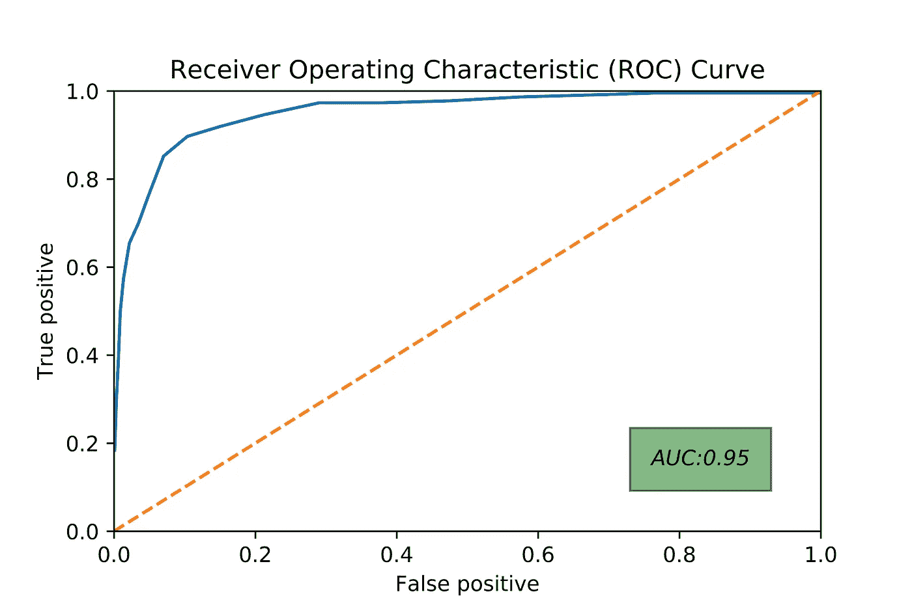

ROC Curve for the RMT Algorithm; note the high AUC!

以下两种算法反复显示了一致的结果(AUC 约为 0.7-0.8):

*   **随机森林**(【https://www.youtube.com/watch?v=J4Wdy0Wc_xQ】T2&VL = en)
*   **朴素贝叶斯**([https://machine learning mastery . com/Naive-Bayes-for-machine-learning/](https://machinelearningmastery.com/naive-bayes-for-machine-learning/))

然而，一个相对较新的受随机矩阵理论启发的算法在几年前由天才的阿尔法·李在 PNAS 的论文中报道。**它获得了好得多的~0.9 的 AUC！**

## 这篇中型博客文章旨在解释该算法，并为其实现提供一个高级 Python 包。

*跳到 3。如果你已经知道如何生成分子的位向量矩阵。*

# 1.获取数据并清理数据(如果您知道如何做，请跳过本节)

我们需要 2 个数据集，即:

*   一组**将**绑定到特定目标的药物(在我们的案例中为 [ADR](https://en.wikipedia.org/wiki/Beta-1_adrenergic_receptor) B1)(这组成了**培训**和**验证**组)
*   一组**不会将**结合到特定目标的药物(这构成了**诱饵**组)

为了获得这些数据集，我们前往 [ChEMBL](https://www.ebi.ac.uk/chembl/) 数据库，下载 ADR1B 受体的所有配体。或者，数据集在我的 GitHub 上。对于**诱饵**组，我们将使用来自另一个任意受体的配体(尽管该受体与 ADRB1 不具有同源性)。我们将从 5HT1A 受体中选择配体，因为它与 ADRB1 几乎没有同源性。或者，我们可以使用来自 ChEMBL 的随机配体的选择，这是在 [PNAS 论文](https://www.pnas.org/content/pnas/113/48/13564.full.pdf)中所做的。

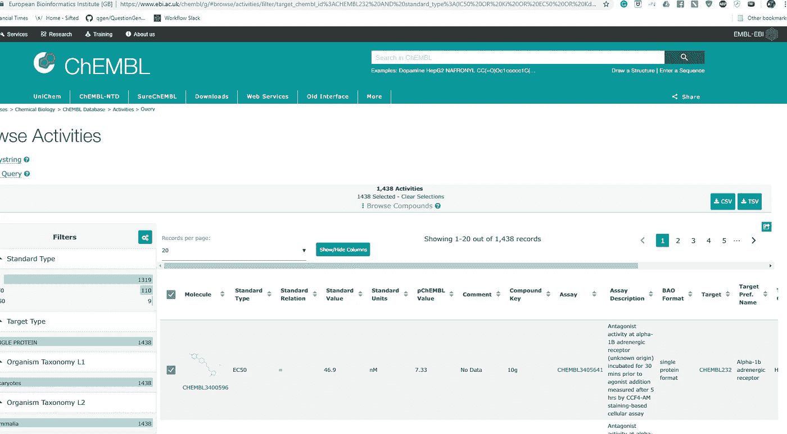

After selecting all ligands for ADR1B, click on the right to download the CSV file

一旦我们获得了用于训练和验证集以及诱饵集的 CSV 文件，我们就将它加载到 Python 中并清理它。下面是实现这一点的代码——您可以随意复制它，因为细节相对来说没什么意思。需要注意的最重要的一点是**对于 train_validation 集合，我们只选择结合亲和力小于 1000nM** 的分子，即这些分子是结合物。对于诱饵组，结合亲和力(对 5HT1A)是不相关的，因为我们假设对 ADR1B 的结合亲和力非常差(合理的假设)。

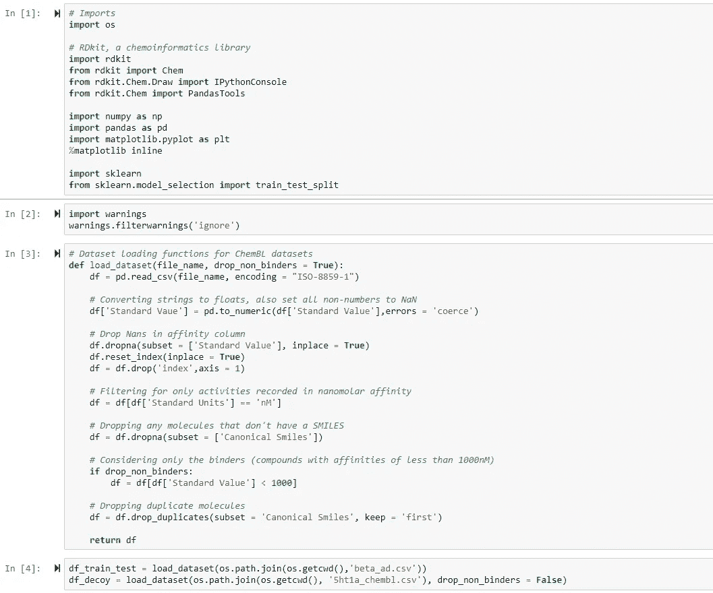

Imports and function to load the dataset

让我们来看看数据集:

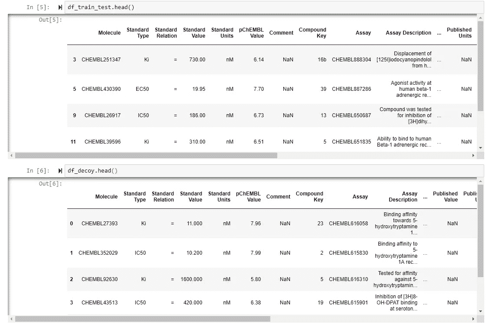

The datasets — take note of the standard value/binding affinity column

如果你向右滚动，有一列包含分子的微笑串。

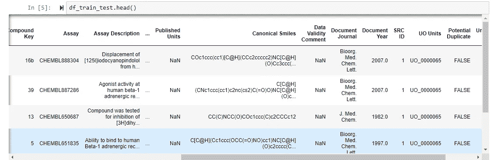

SMILES column located in the middle of the dataframe

我们最后选择相关的列。我们实际上不需要 affinity 列，因为我们已经知道整个 train_test 集合只包含绑定器，而 decoy 集合只包含非绑定器。我们只是为了完成而包含了关联变量(此外，我们可以使用 sklearn 的 train_test_split 函数来方便地将 train_test 集合划分为训练和测试/验证集合)。

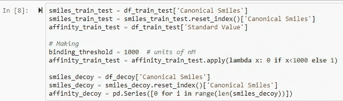

Selecting

我们将使用 SMILES 列生成每个分子的**分子指纹**。

# 2.生成分子指纹(如果需要，跳过这一部分)

Morgan/Extended-Connectivity fingerprinting is one of the most popular types of fingerprinting

我们本质上想把**分子结构**转换成**数学对象**，对其进行机器学习。我们可以使用化学信息学库 **RDKit** 来完成这项工作，将 SMILES 字符串转换为分子结构，再转换为长度为 2048 的 **Morgan 位向量**。我们可以认为每一个条目对应于一个特定化学亚结构的存在或不存在。

> 这本身就是一个大话题，所以如果你想了解更多，请参考我的另一篇关于 [*指纹*](https://medium.com/@lakshaithani/a-practical-introduction-to-the-use-of-molecular-fingerprints-in-drug-discovery-7f15021be2b1) 的博文。

将分子转换成指纹的代码在这里——你可以随意复制它，因为它与这篇文章的核心并不特别相关。

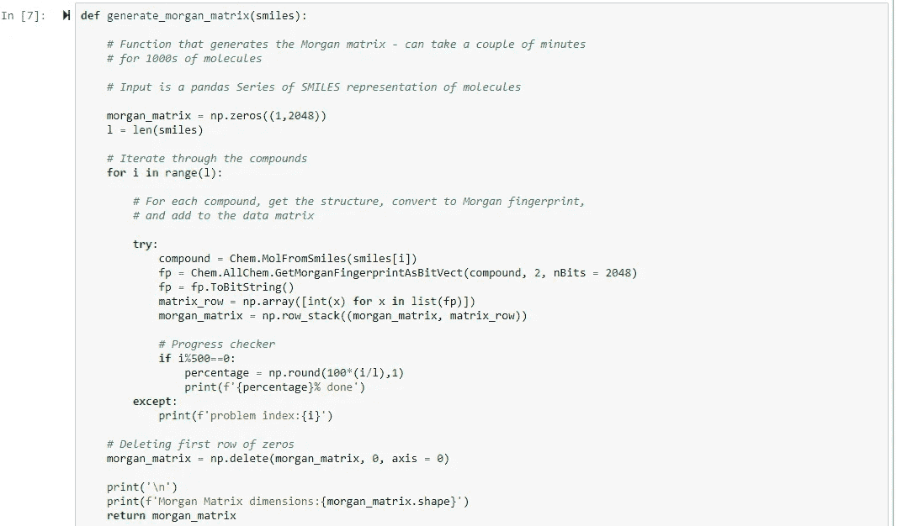

Code to generate the Morgan matrix

Generating the N x p Morgan matrix; N is the number of molecules in the dataset and p is the number of bit features

最后，我们将我们的 train_test 集合分成一个 **train** 绑定集合和**测试/验证**绑定集合。

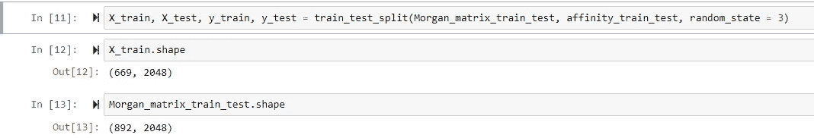

Feel free to use the same random_state if you want to reproduce the results, or use a different one if you’re feeling adventurous

# 3.RMT 算法

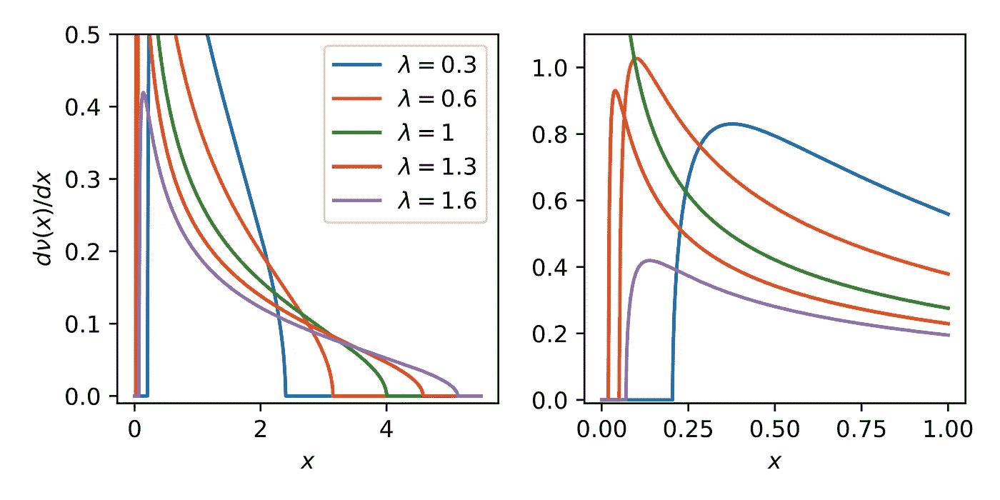

The ***Marchenko-Pastur (MP)* distribution** of eigenvalues of a random correlation matrix; note the cutoff of eigenvalues after a certain point

## 3.1 简要提醒我们的数据格式

这与你的标准机器学习问题略有不同，所以请注意这一点。我们有:

1.  **列车**组——该组仅由**粘合剂**组成(不包含非粘合剂)
2.  **测试/验证**集—这也包含**公正绑定**
3.  **诱饵**集合——它只包含**被认为是非结合剂的分子**

## 3.2 在训练集中寻找特征之间的相关性

我们希望了解训练集中最重要的特征或特征组合是什么。我们可以通过**主成分分析**来做到这一点。

## 对数据进行缩放

在此之前，我们需要记住**将训练集的所有列缩放为 0 均值和单位标准偏差**。一个额外的要求是**保留列平均值和标准偏差**，因为我们也将使用这些来衡量测试/验证和诱饵集。Sklearn 的 StandardScaler 函数会做到这一点。*然后，我们使用列均值和 stds 来缩放训练矩阵，缩放测试和诱饵配体。*这也很容易做到。最后，我们删除所有矩阵中对应于训练矩阵中标准偏差为 0 的列的列。这段代码可以做到这一点:

Scaling the data, deleting relevant columns

## 3.2.2 形成相关矩阵并将其对角化

所有需要的是形成相关矩阵，然后对角化它。对应于最大特征值的特征向量将占训练集中最大的方差。

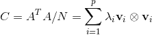

PCA: Eigendecomposition of the correlation matrix

然后我们注意到来自**随机矩阵理论**的一个关键结果——马尔琴科-帕斯图分布。它指出，对于随机矩阵(条目来自均值和单位方差均为 0 的高斯分布)，其相关矩阵具有以下特征值分布:

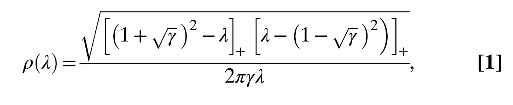

Marchenko-Pastur distribution

**Gamma = p/N** 描述数据集的采样程度。回想一下，训练矩阵的维数为 N×p。正下标表示我们只考虑正括号。这意味着大于 MP 阈值(如下所示)的特征值在随机相关矩阵中不太可能出现。

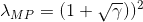

The MP threshold

> 因此，通过创建由相关矩阵的特征向量组成的向量空间，其对应的特征值大于 MP 阈值，我们找到了有助于与特定受体结合的化学特征空间。

# 4.将未知配体分类为结合物或非结合物

我们现在有了受体的结合向量空间。我们可以用这个向量空间来分类未知的配体。方法简单。

## 4.1 标定未知配体

*这里需要注意的重要一点是，我们使用训练集的列均值和 stds。*这是必需的——直觉上，未知数据应使用用于缩放训练数据的相同参数进行缩放。这在之前的代码中已经完成了——sk learn 的 StandardScaler 使这变得很容易。

## 4.2 将缩放的未知配体投影到化学特征空间上，并比较配体与其投影的距离

这很容易做到。见下文。

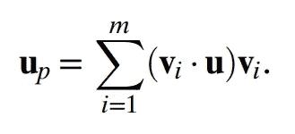

Projection of ligand onto chemical feature space

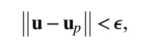

Measure the euclidean distance of molecule and projection

我们可以用代码实现一个简单的函数:

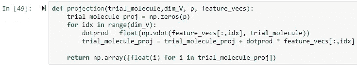

Projecting any molecule onto the chemical feature space

这里，dim_V 是向量空间 V 的维数，由 MP 阈值控制。p 是我们指纹的特征数量，feature_vecs 是一个矩阵，其中列是相关矩阵的特征向量。都相当标准。

最重要的问题是:*我们如何选择ε？*这是任意的，事实上，epsilon 可用于调整假阳性/真阳性比率，并生成 ROC 曲线。

> 作为ε的默认值,我们将选择它，使得 95%的训练矩阵被分类为绑定(因此在训练集中需要 5%的错误率)。

RMT 算法到此结束，下面是它在 Python 中的简短代码实现。

# 5.RMT 算法的 Python 实现

我们将做一个 sklearn 分类器类型的 OOP 实现。

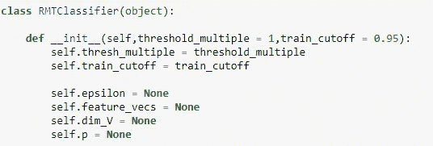

Initiatlising

threshold_multiple 参数用于通过改变 MP 阈值来扩展或收缩我们的向量空间。然而，我不建议更改这个值，因为 MP 阈值是最佳值。

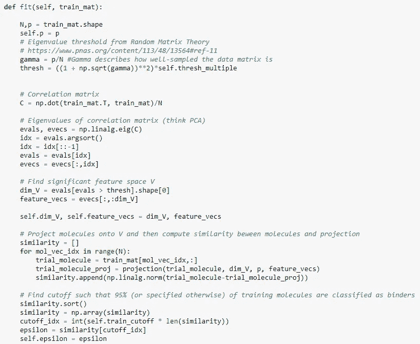

Fitting

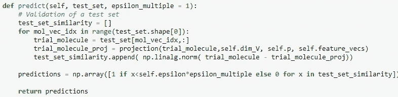

Prediction

就是这样。我们完了。我们现在可以使用我们的算法对数据集进行预测，数据集已经被方便地清理并转换成正确的格式。

# 6.做一个预测

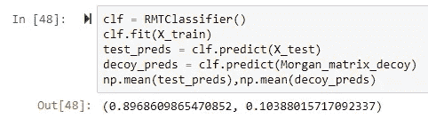

Not bad indeed!

请注意，predict 函数返回一个由 1 和 0 组成的数组，指示绑定或非绑定的预测。因为我们知道测试/验证集只包含绑定器，所以我们可以取 test_preds 的平均值来获得真阳性率。

类似地，由于诱饵组由非结合物组成，decoy_preds 的平均值给出了假阳性率。

# 7.绘制 ROC 曲线

ROC 曲线绘制了假阳性率对真阳性率的曲线。更好的分类器具有非常高的曲线下面积(AUC)。模型中需要一些参数来调整 fp/tp 速率，在我们的例子中，就是参数 epsilon。

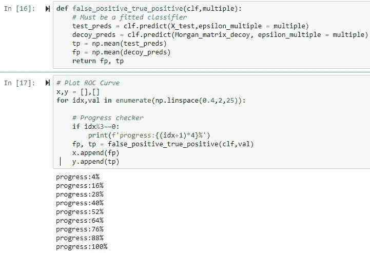

Code for generating data points for the ROC curve

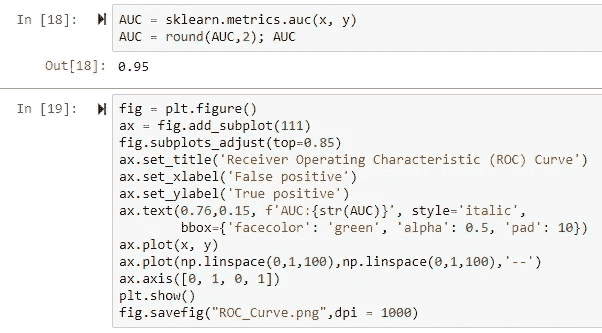

AUC, and code to plot and save the graph

这是最后一个单元格的输出，这是介绍性的图像。

ROC Curve

# 8.下次改进(RMD 算法)

一个显而易见的想法可能是，我们正在检查未知配体与受体的正相关，但**我们没有检查未知配体的负相关**。例如，某个亚结构或部分可能完全破坏配体与结合口袋的结合。

我们可以使用上述算法的一个微小的变体来自然地解决这个问题。我们重复 RMT 过程，但是是在一组已知不与目标结合的分子上。直觉是这组分子具有阻碍结合的化学特征，当试图预测未知分子时，我们可以针对这些特征进行选择。

> 这将是下一篇博客文章的重点，实际上几个月前阿尔法·李和他的同事在 PNAS 的一篇论文中也有描述。
> 
> 这种算法名为随机矩阵判别式，优于 RMT 和所有其他常用方法，如下所示。

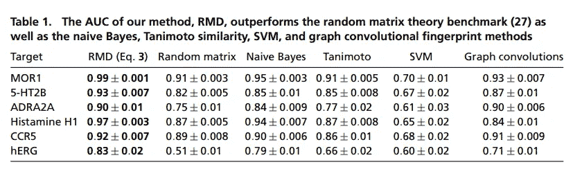

Not bad at all, to say the least

# 9.后续步骤

如果你喜欢阅读这篇文章，和/或想了解下一个算法，请跟随我。

请随时通过 LinkedIn 与我联系，并告诉我您是否会在研究/工作中使用这些代码。

在那之前，祝你愉快。

*拉克什*